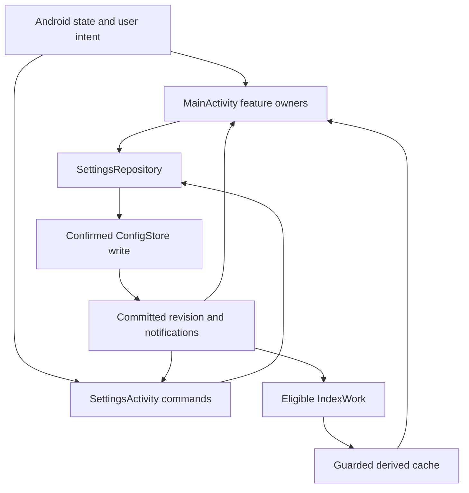

# Grove system ownership, invariants and information flow

## Scope and authority

This is the single entry point for understanding how Grove v1.0.0 works: process and host lifetimes, subsystem and method ownership, authoritative data, information flow, commit points, invariants, fail-first/fail-fast checks, scoped fallbacks, cancellation and recovery. The source baseline is `f9455918d0bcd7f5f038bb3cd87fa64c4a93be48`, published October 6, 2026. All source links are pinned to that release, even when documentation later changes.

[GROVE-STATUS.md](GROVE-STATUS.md) remains the source of truth for intended behavior and the canonical release capability/evidence matrix. This document describes ownership and enforcement mechanisms visible in that source; it does not replace the contract or claim full Android/OEM conformance. [FAILURE-POLICY.md](FAILURE-POLICY.md) defines the outcome rules. [TESTING.md](TESTING.md) and [FAILURE-VERIFICATION.md](FAILURE-VERIFICATION.md) retain pending device/fault-injection work. [BUILD-STATUS.md](BUILD-STATUS.md) records build and release evidence; [PRIVACY.md](PRIVACY.md) describes actual data handling. [SYSTEM-CATALOG.md](SYSTEM-CATALOG.md) retains earlier source audits and migration provenance.

The subsystem tables explain meaningful operation boundaries. The declaration index at the end includes every Kotlin source file and Rust module under the production source roots, with named function/method links. Anonymous lambdas, generated data-class methods, property accessors and constructors are not represented as named functions. Source locations distinguish overloaded functions and local callbacks; the index is not an exhaustive runtime call graph. An invariant below states the condition the named implementation is designed to enforce, not proof that every Android failure scenario has been exercised.

## Reading order

- [Lifetimes and host ownership](#process-host-and-worker-ownership)
- [Authoritative data and commit boundaries](#sources-of-truth-and-data-ownership)
- [Operations, fail-first and fail-fast methods](#operational-ownership-and-failure-boundaries)
- [Invariants and enforcement](#invariants-and-the-methods-that-enforce-them)
- [End-to-end information flow](#important-end-to-end-flows)
- [Failure and recovery rules](#fail-first-fail-fast-and-recovery-rules)
- [Verification limits](#verification-and-known-limits)
- [Maintenance process](#maintenance-process)
- [Complete declaration index](#declaration-ownership-index)

## Process, host and worker ownership

| Lifetime | Owner | State and responsibility | Consumers / termination |
| --- | --- | --- | --- |
| Android platform | Package/Contacts/Wallpaper/Widget APIs, grants, document providers, external intent handlers | Installed apps, permission grants, provider records, applied wallpaper, external activity results | Grove checks current platform truth; remembered settings or caches cannot override it |
| Application process | [GroveApp](https://github.com/davidcit646/Grove/blob/f9455918d0bcd7f5f038bb3cd87fa64c4a93be48/app/src/main/java/tech/granet/grove/GroveApp.kt), [SettingsRepository](https://github.com/davidcit646/Grove/blob/f9455918d0bcd7f5f038bb3cd87fa64c4a93be48/app/src/main/java/tech/granet/grove/SettingsRepository.kt), [ConfigStore](https://github.com/davidcit646/Grove/blob/f9455918d0bcd7f5f038bb3cd87fa64c4a93be48/app/src/main/java/tech/granet/grove/ConfigStore.kt), [ContactChanges](https://github.com/davidcit646/Grove/blob/f9455918d0bcd7f5f038bb3cd87fa64c4a93be48/app/src/main/java/tech/granet/grove/ContactChanges.kt) | One lazily created committed Config repository; process contact observation; settings notifications; crash-handler installation in Application.onCreate | Main and Settings hosts share committed state; application death ends in-memory holders |
| HOME Activity | [MainActivity](https://github.com/davidcit646/Grove/blob/f9455918d0bcd7f5f038bb3cd87fa64c4a93be48/app/src/main/java/tech/granet/grove/MainActivity.kt), [StartupController](https://github.com/davidcit646/Grove/blob/f9455918d0bcd7f5f038bb3cd87fa64c4a93be48/app/src/main/java/tech/granet/grove/StartupController.kt), [HomeController](https://github.com/davidcit646/Grove/blob/f9455918d0bcd7f5f038bb3cd87fa64c4a93be48/app/src/main/java/tech/granet/grove/HomeController.kt), [CatalogController](https://github.com/davidcit646/Grove/blob/f9455918d0bcd7f5f038bb3cd87fa64c4a93be48/app/src/main/java/tech/granet/grove/CatalogController.kt), [DrawerController](https://github.com/davidcit646/Grove/blob/f9455918d0bcd7f5f038bb3cd87fa64c4a93be48/app/src/main/java/tech/granet/grove/DrawerController.kt), [SearchController](https://github.com/davidcit646/Grove/blob/f9455918d0bcd7f5f038bb3cd87fa64c4a93be48/app/src/main/java/tech/granet/grove/SearchController.kt), [ConfigController](https://github.com/davidcit646/Grove/blob/f9455918d0bcd7f5f038bb3cd87fa64c4a93be48/app/src/main/java/tech/granet/grove/ConfigController.kt), [SetupController](https://github.com/davidcit646/Grove/blob/f9455918d0bcd7f5f038bb3cd87fa64c4a93be48/app/src/main/java/tech/granet/grove/SetupController.kt), [ActionController](https://github.com/davidcit646/Grove/blob/f9455918d0bcd7f5f038bb3cd87fa64c4a93be48/app/src/main/java/tech/granet/grove/ActionController.kt), [PresentationController](https://github.com/davidcit646/Grove/blob/f9455918d0bcd7f5f038bb3cd87fa64c4a93be48/app/src/main/java/tech/granet/grove/PresentationController.kt), [WallpaperPresentationController](https://github.com/davidcit646/Grove/blob/f9455918d0bcd7f5f038bb3cd87fa64c4a93be48/app/src/main/java/tech/granet/grove/WallpaperPresentationController.kt), [SearchTutorialController](https://github.com/davidcit646/Grove/blob/f9455918d0bcd7f5f038bb3cd87fa64c4a93be48/app/src/main/java/tech/granet/grove/SearchTutorialController.kt) | Android lifecycle/result registrations, views/navigation, Activity-scoped feature state and query/catalog/presentation generations | Main teardown stops owned listeners/workers/controllers; Android owns future recreation |
| Settings Activity | [SettingsActivity](https://github.com/davidcit646/Grove/blob/f9455918d0bcd7f5f038bb3cd87fa64c4a93be48/app/src/main/java/tech/granet/grove/SettingsActivity.kt), [SettingsPages](https://github.com/davidcit646/Grove/blob/f9455918d0bcd7f5f038bb3cd87fa64c4a93be48/app/src/main/java/tech/granet/grove/SettingsPages.kt), [SettingsGridPage](https://github.com/davidcit646/Grove/blob/f9455918d0bcd7f5f038bb3cd87fa64c4a93be48/app/src/main/java/tech/granet/grove/SettingsGridPage.kt), [SettingsDocumentPages](https://github.com/davidcit646/Grove/blob/f9455918d0bcd7f5f038bb3cd87fa64c4a93be48/app/src/main/java/tech/granet/grove/SettingsDocumentPages.kt), [SettingsScrollState](https://github.com/davidcit646/Grove/blob/f9455918d0bcd7f5f038bb3cd87fa64c4a93be48/app/src/main/java/tech/granet/grove/SettingsScrollState.kt) | Categorized rendering, navigation/scroll, document/permission result registrations, platform delegation | Reads shared committed repository; does not create a second active settings store |
| Retained Settings ViewModel | [SettingsSession](https://github.com/davidcit646/Grove/blob/f9455918d0bcd7f5f038bb3cd87fa64c4a93be48/app/src/main/java/tech/granet/grove/SettingsSession.kt), [SettingsCommands](https://github.com/davidcit646/Grove/blob/f9455918d0bcd7f5f038bb3cd87fa64c4a93be48/app/src/main/java/tech/granet/grove/SettingsCommands.kt) | Worker document jobs and provisional drafts/candidates; revision-checked explicit Apply | Rotation can retain work; onCleared invalidates generations and shuts down its worker; process recreation requires re-review |
| Background index scheduling | [IndexWork](https://github.com/davidcit646/Grove/blob/f9455918d0bcd7f5f038bb3cd87fa64c4a93be48/app/src/main/java/tech/granet/grove/IndexWork.kt), [IndexRefreshRequests](https://github.com/davidcit646/Grove/blob/f9455918d0bcd7f5f038bb3cd87fa64c4a93be48/app/src/main/java/tech/granet/grove/IndexRefreshRequests.kt), [IndexRecoveryPolicy](https://github.com/davidcit646/Grove/blob/f9455918d0bcd7f5f038bb3cd87fa64c4a93be48/app/src/main/java/tech/granet/grove/IndexRecoveryPolicy.kt) | Per-source work reservation, token/work-ID metadata, coalescing, deferred follow-up, bounded recovery/repair | WorkManager executes work independently of a visible Activity; scheduler acceptance is not completed indexing |
| WorkManager worker | [IndexWorker.doWork](https://github.com/davidcit646/Grove/blob/f9455918d0bcd7f5f038bb3cd87fa64c4a93be48/app/src/main/java/tech/granet/grove/IndexWork.kt#L174) and [IndexWorker.onStopped](https://github.com/davidcit646/Grove/blob/f9455918d0bcd7f5f038bb3cd87fa64c4a93be48/app/src/main/java/tech/granet/grove/IndexWork.kt#L170) | One source scan and guarded atomic metadata commit; bounded retry | Current token, source choices, permission and stop state determine eligibility; cancellation stops protected publication |
| Native library | [CoreBridge](https://github.com/davidcit646/Grove/blob/f9455918d0bcd7f5f038bb3cd87fa64c4a93be48/app/src/main/java/tech/granet/grove/CoreBridge.kt), Rust bridge/search/MIME/config/wallpaper modules | Bounded computational acceleration through JNI | Does not own Android permission, active Config, provider access or UI; Kotlin validates results/fallbacks |

The repository diagram shows settings publication and derived index consumption, not every startup or Android callback.

MainActivity's own single-thread executors, live-query executors in SearchController, document workers in SettingsSession, presentation metadata worker and persistent WorkManager scans have different lifetimes. Activity destruction cannot be used as proof that all process/background work stopped; token, permission and preference checks remain necessary.

## Sources of truth and data ownership

| Data | Authority | Derived/local state | Information flow and commit boundary |
| --- | --- | --- | --- |
| Active configuration | SettingsRepository committed snapshot/revision | ConfigStore JSON in private SharedPreferences `grove`; host reconciliation snapshots | Commands or explicit Apply → validate full candidate → confirmed save/activate → revision increment → publish → host/feature effects |
| Provisional configuration | SettingsSession candidate + captured base/revision | Editor/grid/email drafts and Android saved-instance state | Provider/editor → bounded worker read/parse → review → explicit Apply; a draft never becomes active by rendering |
| Installed apps | Android LauncherApps / package APIs | AppCatalog snapshot, prepared labels, AppIconStore disposable imagery, saved pin/folder choices | Package/resume/startup → catalog worker → generation-gated UI publication; icon failure does not invalidate app launchability |
| Contact/file search and indexing choices | Persisted Grove Config, separately per source | Current host source state | Current choice plus current Android grant → live query/cache use/work eligibility; grant alone cannot enable a disabled source |
| Contacts | Android Contacts Provider | Names/IDs/lookup keys and coverage in disposable private cache; action details read on demand | ContactChanges → invalidation/query refresh/work request → bounded scan → guarded cache/UI publication → fresh action details |
| Shared files | Accessible Android shared storage | Names/paths/MIME/category and scan coverage in disposable private cache | Bounded traversal → guarded cache/query result → canonical path and permission recheck → one-file read URI intent |
| Index validity and refresh activity | Verified cache metadata plus current WorkManager/token outcome | IndexMetadata/IndexState and source-specific UI states | Atomic cache read/write → metadata notifications → source preparation/Settings; cache readiness and background activity stay separate |
| Applied Home wallpaper | Android WallpaperManager/window | Android wallpaper ID/color metadata; remembered Grove library selection | Built-in/custom source → preview → explicit Home/Lock/Both apply → local promotion/preference commit; external changes do not rewrite library preference |
| Custom wallpaper bytes | Validated app-private committed slot | Temporary/pending/backup slots | Document → bounded staging → Android apply → promote committed copy; failed promotion or Config write is an explicit split-state outcome |
| Theme/grid/gesture preference | Committed Config | UI projection and provisional setup answers | SettingsCommands/SetupMergePolicy → repository commit → owning host applies presentation/layout effects |
| Widgets | Android provider/bind result plus WidgetRegistry's confirmed ID metadata | Pending allocated ID and local widget IDs | Allocate → bind consent → optional configuration → confirmed registry save; cancel/removal must release owned IDs |
| Tutorial completion/replay | Confirmed separate private marker writes | Session suppression, provisional page/practice state | Explicit entry/replay → presentation → successful completion marker; incomplete/canceled/failed completion is not saved success |
| Error identity/severity | GroveErrorRegistry entries in GroveErrors | Safe report body and bounded pending report files | Owning feature selects registry entry → scoped UI/recovery → optional reviewed draft/copy; composer launch is not delivery |
| Android settings capability | Current trusted/allowed system intent handler | Capability snapshot and static destination catalogue | Discover → typed Ready/Unavailable/Failed → recheck handler at tap → external launch or scoped fallback |
| Release identity | Exact tag/commit plus verified artifact signatures/digests | CI outputs/provenance/checksums | Source checks → signed build → certificate/ABI/alignment/checksum gates → publish; documentation commits do not replace the released binary |

Search/index caches do not contain file contents. Contact action numbers/channels are read from the provider when needed, not persisted by the index. Index files are independently bounded to 12 MiB; custom images and configuration documents have their own bounds. For retention/deletion and backup policy, use PRIVACY.md and the pinned storage methods, rather than assuming every local store has the same lifetime.

## Operational ownership and failure boundaries

Each row names the methods that own the important operation. A UI caller renders the outcome and routes recovery; it must not invent a successful result for a failed provider or write.

| Operation and entry points | Source → owner → consumer | Fail first: before effects | Fail fast: stop/supersede at failure | Scoped fallback / commit point |
| --- | --- | --- | --- | --- |
| [StartupController.beginHome](https://github.com/davidcit646/Grove/blob/f9455918d0bcd7f5f038bb3cd87fa64c4a93be48/app/src/main/java/tech/granet/grove/StartupController.kt#L51), [StartupController.ensureLauncherCallback](https://github.com/davidcit646/Grove/blob/f9455918d0bcd7f5f038bb3cd87fa64c4a93be48/app/src/main/java/tech/granet/grove/StartupController.kt#L82), [StartupController.showCoreRecovery](https://github.com/davidcit646/Grove/blob/f9455918d0bcd7f5f038bb3cd87fa64c4a93be48/app/src/main/java/tech/granet/grove/StartupController.kt#L101) | Saved config / Android launcher → startup → usable Home or recovery | Load/validate Config; obtain/register launcher service; restore optional widget metadata separately | Return from normal startup on required failure; recovery invalidates catalog generation and pending search | Retry or Android Home/settings escape; optional widget metadata failure leaves other Home work available |
| [CatalogController.loadApps](https://github.com/davidcit646/Grove/blob/f9455918d0bcd7f5f038bb3cd87fa64c4a93be48/app/src/main/java/tech/granet/grove/CatalogController.kt#L23), [CatalogController.publishIcons](https://github.com/davidcit646/Grove/blob/f9455918d0bcd7f5f038bb3cd87fa64c4a93be48/app/src/main/java/tech/granet/grove/CatalogController.kt#L86) | LauncherApps → AppCatalog / catalog worker → Home/drawer/search | Capture generation, current host and package/icon-size context | Reject superseded/destroyed catalog/icon output; enumeration failure enters core recovery | Icons degrade to placeholders; publish current app data separately from icon completion |
| [SettingsRepository.update](https://github.com/davidcit646/Grove/blob/f9455918d0bcd7f5f038bb3cd87fa64c4a93be48/app/src/main/java/tech/granet/grove/SettingsRepository.kt#L20), [SettingsCommands.replace](https://github.com/davidcit646/Grove/blob/f9455918d0bcd7f5f038bb3cd87fa64c4a93be48/app/src/main/java/tech/granet/grove/SettingsCommands.kt#L43), [ConfigController.commitConfig](https://github.com/davidcit646/Grove/blob/f9455918d0bcd7f5f038bb3cd87fa64c4a93be48/app/src/main/java/tech/granet/grove/ConfigController.kt#L41) | Typed user intent → shared repository → both hosts and feature owners | Read latest snapshot; compare expected revision where supplied; validate complete candidate | Invalid/Conflict/Unavailable returns without advancing committed state; do not present save success | Confirmed persistence precedes publication; a subsequent feature-effect failure is saved preference with unavailable refresh |
| [SettingsSession.readDocument](https://github.com/davidcit646/Grove/blob/f9455918d0bcd7f5f038bb3cd87fa64c4a93be48/app/src/main/java/tech/granet/grove/SettingsSession.kt#L28), [SettingsSession.validateDraft](https://github.com/davidcit646/Grove/blob/f9455918d0bcd7f5f038bb3cd87fa64c4a93be48/app/src/main/java/tech/granet/grove/SettingsSession.kt#L44), [SettingsSession.apply](https://github.com/davidcit646/Grove/blob/f9455918d0bcd7f5f038bb3cd87fa64c4a93be48/app/src/main/java/tech/granet/grove/SettingsSession.kt#L67), [ConfigDocuments.read](https://github.com/davidcit646/Grove/blob/f9455918d0bcd7f5f038bb3cd87fa64c4a93be48/app/src/main/java/tech/granet/grove/ConfigDocuments.kt#L14) | Android document/editor → worker → reviewed candidate → repository | 64 KiB input bound, UTF-8/JSON/schema checks; captured base/revision; explicit Apply | Generation invalidation suppresses queued/late result; stale candidate demands new review | Keep prior active Config and recoverable draft; no automatic import activation |
| [SearchController.renderSearch](https://github.com/davidcit646/Grove/blob/f9455918d0bcd7f5f038bb3cd87fa64c4a93be48/app/src/main/java/tech/granet/grove/SearchController.kt#L232), [SearchController.queryLiveContacts](https://github.com/davidcit646/Grove/blob/f9455918d0bcd7f5f038bb3cd87fa64c4a93be48/app/src/main/java/tech/granet/grove/SearchController.kt#L289), [SearchController.queryLiveFiles](https://github.com/davidcit646/Grove/blob/f9455918d0bcd7f5f038bb3cd87fa64c4a93be48/app/src/main/java/tech/granet/grove/SearchController.kt#L315), [SearchController.displaySearch](https://github.com/davidcit646/Grove/blob/f9455918d0bcd7f5f038bb3cd87fa64c4a93be48/app/src/main/java/tech/granet/grove/SearchController.kt#L342) | Current query + permitted source snapshots → query workers → SearchScreen | Provider flags, current source preference/grant, query generation and lifecycle; bounded live query | Supersession/access loss/exit rejects old output; provider failure stays distinct from Ready(0) | Permitted live fallback when cache/index unavailable; unrelated providers remain usable |
| [SearchSources.reconcile](https://github.com/davidcit646/Grove/blob/f9455918d0bcd7f5f038bb3cd87fa64c4a93be48/app/src/main/java/tech/granet/grove/SearchSources.kt#L74), [SearchSources.loadContacts](https://github.com/davidcit646/Grove/blob/f9455918d0bcd7f5f038bb3cd87fa64c4a93be48/app/src/main/java/tech/granet/grove/SearchSources.kt#L89), [SearchSources.loadFiles](https://github.com/davidcit646/Grove/blob/f9455918d0bcd7f5f038bb3cd87fa64c4a93be48/app/src/main/java/tech/granet/grove/SearchSources.kt#L124), [SearchSources.clearContacts](https://github.com/davidcit646/Grove/blob/f9455918d0bcd7f5f038bb3cd87fa64c4a93be48/app/src/main/java/tech/granet/grove/SearchSources.kt#L158), [SearchSources.clearFiles](https://github.com/davidcit646/Grove/blob/f9455918d0bcd7f5f038bb3cd87fa64c4a93be48/app/src/main/java/tech/granet/grove/SearchSources.kt#L170) | Config/current grants + cache metadata → prepared source snapshots → SearchController | Current access and source eligibility before cache read/use/publication | Clear/generation-invalidate revoked or disabled sources; reject old cache publication | Partial/loading/denied/failed remain truthful; one source does not authorize another |
| [ContactChanges.reconcile](https://github.com/davidcit646/Grove/blob/f9455918d0bcd7f5f038bb3cd87fa64c4a93be48/app/src/main/java/tech/granet/grove/ContactChanges.kt#L34), [ContactIndex.load](https://github.com/davidcit646/Grove/blob/f9455918d0bcd7f5f038bb3cd87fa64c4a93be48/app/src/main/java/tech/granet/grove/ContactIndex.kt#L49), [ContactActions.show](https://github.com/davidcit646/Grove/blob/f9455918d0bcd7f5f038bb3cd87fa64c4a93be48/app/src/main/java/tech/granet/grove/ContactActions.kt#L38) | Contacts Provider → bounded scan/details → contact rows/action menu | Enabled contact search and READ_CONTACTS; cancellation/budget; fresh action details | Cancel provider query where supported; reject changed/deleted details and access loss before external launch | Partial versus valid empty is explicit; ask to reopen changed contact menu; Home/app search remain available |
| [FileIndex.scan](https://github.com/davidcit646/Grove/blob/f9455918d0bcd7f5f038bb3cd87fa64c4a93be48/app/src/main/java/tech/granet/grove/FileIndex.kt#L19), [FileActions.shareUri](https://github.com/davidcit646/Grove/blob/f9455918d0bcd7f5f038bb3cd87fa64c4a93be48/app/src/main/java/tech/granet/grove/FileActions.kt#L18), [FileActions.open](https://github.com/davidcit646/Grove/blob/f9455918d0bcd7f5f038bb3cd87fa64c4a93be48/app/src/main/java/tech/granet/grove/FileActions.kt#L27) | Permitted shared root → bounded traversal → row → one-file external app | Root scope, cancellation/deadline/counts; canonical path/existence/no symlink plus current access at action | Stop traversal on bounds/cancel; refuse invalid root/action; never expose canceled results as success | Child failures yield partial coverage; MIME fallback may retry external open; read-only per-intent URI grant |
| [IndexWork.enqueue](https://github.com/davidcit646/Grove/blob/f9455918d0bcd7f5f038bb3cd87fa64c4a93be48/app/src/main/java/tech/granet/grove/IndexWork.kt#L73), [IndexWork.begin](https://github.com/davidcit646/Grove/blob/f9455918d0bcd7f5f038bb3cd87fa64c4a93be48/app/src/main/java/tech/granet/grove/IndexWork.kt#L55), [IndexWork.allowed](https://github.com/davidcit646/Grove/blob/f9455918d0bcd7f5f038bb3cd87fa64c4a93be48/app/src/main/java/tech/granet/grove/IndexWork.kt#L52), [IndexWork.cancel](https://github.com/davidcit646/Grove/blob/f9455918d0bcd7f5f038bb3cd87fa64c4a93be48/app/src/main/java/tech/granet/grove/IndexWork.kt#L136), [IndexWork.finished](https://github.com/davidcit646/Grove/blob/f9455918d0bcd7f5f038bb3cd87fa64c4a93be48/app/src/main/java/tech/granet/grove/IndexWork.kt#L61) | Source event/manual refresh → token/work reservation → worker → cache consumers | Enabled search AND indexing AND current permission; reservation/token; battery/storage constraints | Invalidate token before stopping work/clearing cache; superseded worker cannot publish; terminal failure is not permanent active work | Coalesced refresh, at most one deferred successor, bounded retries/repair; enqueue acceptance is separate from completion |
| [IndexCache.writeFiles](https://github.com/davidcit646/Grove/blob/f9455918d0bcd7f5f038bb3cd87fa64c4a93be48/app/src/main/java/tech/granet/grove/IndexCache.kt#L56), [IndexCache.writeContacts](https://github.com/davidcit646/Grove/blob/f9455918d0bcd7f5f038bb3cd87fa64c4a93be48/app/src/main/java/tech/granet/grove/IndexCache.kt#L63), [IndexCache.clear](https://github.com/davidcit646/Grove/blob/f9455918d0bcd7f5f038bb3cd87fa64c4a93be48/app/src/main/java/tech/granet/grove/IndexCache.kt#L50), [IndexCache.inspect](https://github.com/davidcit646/Grove/blob/f9455918d0bcd7f5f038bb3cd87fa64c4a93be48/app/src/main/java/tech/granet/grove/IndexCache.kt#L24) | Bounded scan → atomic private cache → verified metadata / source preparation | Size/schema/count/coverage; allowed callback at write/commit boundary | Failed replacement does not publish a new verified cache; missing/corrupt state stays unavailable | Rebuild only when eligible; permitted live search remains available; metadata never proves Android permission |
| [WallpaperController.importCustom](https://github.com/davidcit646/Grove/blob/f9455918d0bcd7f5f038bb3cd87fa64c4a93be48/app/src/main/java/tech/granet/grove/WallpaperController.kt#L65), [WallpaperPresentationController.applySelection](https://github.com/davidcit646/Grove/blob/f9455918d0bcd7f5f038bb3cd87fa64c4a93be48/app/src/main/java/tech/granet/grove/WallpaperPresentationController.kt#L46), [WallpaperPresentationController.commitHomeSelection](https://github.com/davidcit646/Grove/blob/f9455918d0bcd7f5f038bb3cd87fa64c4a93be48/app/src/main/java/tech/granet/grove/WallpaperPresentationController.kt#L40) | Local registry/document → worker preview → Android apply → local promotion/Config | Readable supported bounded image; explicit destination and live host; stage without replacing committed custom copy | Failed preview/platform apply leaves prior choice; local promotion/config failure reports split state | Retry correct local stage; lock-only leaves Home choice unchanged; selectors are optional to core Home |
| [PresentationController.start](https://github.com/davidcit646/Grove/blob/f9455918d0bcd7f5f038bb3cd87fa64c4a93be48/app/src/main/java/tech/granet/grove/PresentationController.kt#L26), [PresentationController.refresh](https://github.com/davidcit646/Grove/blob/f9455918d0bcd7f5f038bb3cd87fa64c4a93be48/app/src/main/java/tech/granet/grove/PresentationController.kt#L45), [PresentationController.shutdown](https://github.com/davidcit646/Grove/blob/f9455918d0bcd7f5f038bb3cd87fa64c4a93be48/app/src/main/java/tech/granet/grove/PresentationController.kt#L68) | Android Home wallpaper metadata / committed theme → presentation worker → colors/window | Host lifetime and generation; Android is applied-wallpaper authority | Reject late metadata; shutdown invalidates worker/listeners; missing listener uses resume refresh | Safe theme button colors; Android displays actual static/live wallpaper without a remembered-image overlay |
| [WidgetFlow.pick](https://github.com/davidcit646/Grove/blob/f9455918d0bcd7f5f038bb3cd87fa64c4a93be48/app/src/main/java/tech/granet/grove/WidgetFlow.kt#L26), [WidgetFlow.configure](https://github.com/davidcit646/Grove/blob/f9455918d0bcd7f5f038bb3cd87fa64c4a93be48/app/src/main/java/tech/granet/grove/WidgetFlow.kt#L75), [WidgetRegistry.allocate](https://github.com/davidcit646/Grove/blob/f9455918d0bcd7f5f038bb3cd87fa64c4a93be48/app/src/main/java/tech/granet/grove/WidgetRegistry.kt#L28), [WidgetRegistry.finish](https://github.com/davidcit646/Grove/blob/f9455918d0bcd7f5f038bb3cd87fa64c4a93be48/app/src/main/java/tech/granet/grove/WidgetRegistry.kt#L39), [WidgetRegistry.cancel](https://github.com/davidcit646/Grove/blob/f9455918d0bcd7f5f038bb3cd87fa64c4a93be48/app/src/main/java/tech/granet/grove/WidgetRegistry.kt#L57) | Android provider list → ID allocation/bind/configure → registry → Home widget view | One pending ID, tutorial acknowledgment save, real provider/bind/configuration outcome | Cancel interrupted/failed external flow; reject success after failed registry persistence | Retry or remove pending widget; render/provider failure is a local placeholder, not core Home failure |
| [FolderActions.move](https://github.com/davidcit646/Grove/blob/f9455918d0bcd7f5f038bb3cd87fa64c4a93be48/app/src/main/java/tech/granet/grove/FolderActions.kt#L69), [FolderActions.promptCreate](https://github.com/davidcit646/Grove/blob/f9455918d0bcd7f5f038bb3cd87fa64c4a93be48/app/src/main/java/tech/granet/grove/FolderActions.kt#L74), [FolderActions.promptRename](https://github.com/davidcit646/Grove/blob/f9455918d0bcd7f5f038bb3cd87fa64c4a93be48/app/src/main/java/tech/granet/grove/FolderActions.kt#L94), [DrawerController.refreshDrawer](https://github.com/davidcit646/Grove/blob/f9455918d0bcd7f5f038bb3cd87fa64c4a93be48/app/src/main/java/tech/granet/grove/DrawerController.kt#L151) | Current installed apps and selection → folder/config mutation → drawer/pins | Valid selection/name/destination and current Config | Failed commit does not confirm edit or clear selection as success; canceled uninstall stops remaining batch | Unchanged saved layout remains active; Android owns actual uninstall confirmation |
| [SetupController.startFirstRunSetup](https://github.com/davidcit646/Grove/blob/f9455918d0bcd7f5f038bb3cd87fa64c4a93be48/app/src/main/java/tech/granet/grove/SetupController.kt#L32), [SetupMergePolicy.merge](https://github.com/davidcit646/Grove/blob/f9455918d0bcd7f5f038bb3cd87fa64c4a93be48/app/src/main/java/tech/granet/grove/SetupMergePolicy.kt#L5) | Saved base + provisional setup lanes + current Config → Finish → repository/markers | Fresh-install detection; current Android access; compare concurrently changed lanes | Conflicting same-lane change or failed save retains setup/review; cancel does not activate draft | Preserve unrelated current choices; #89 indexing defaults are explicit, Settings owns separate index controls |
| [SearchTutorialController.interceptEntry](https://github.com/davidcit646/Grove/blob/f9455918d0bcd7f5f038bb3cd87fa64c4a93be48/app/src/main/java/tech/granet/grove/SearchTutorialController.kt#L35), [SearchTutorialController.forward](https://github.com/davidcit646/Grove/blob/f9455918d0bcd7f5f038bb3cd87fa64c4a93be48/app/src/main/java/tech/granet/grove/SearchTutorialController.kt#L90), [SearchTutorialController.fail](https://github.com/davidcit646/Grove/blob/f9455918d0bcd7f5f038bb3cd87fa64c4a93be48/app/src/main/java/tech/granet/grove/SearchTutorialController.kt#L69) | Actual Search entry / replay marker → session/page presentation → Search | Capture request and completion gate; static samples cannot read protected data or change settings | Settle Home motion first; suppress failed request in session/recreation; incomplete exit does not mark complete | Registry-backed Degrade Continue/Report; usable Search is the named safe fallback |
| [SettingsMatcher.matching](https://github.com/davidcit646/Grove/blob/f9455918d0bcd7f5f038bb3cd87fa64c4a93be48/app/src/main/java/tech/granet/grove/SettingsCatalogue.kt#L110), [AndroidSettingsRouter.snapshot](https://github.com/davidcit646/Grove/blob/f9455918d0bcd7f5f038bb3cd87fa64c4a93be48/app/src/main/java/tech/granet/grove/AndroidSettingsRouter.kt#L29), [AndroidSettingsRouter.open](https://github.com/davidcit646/Grove/blob/f9455918d0bcd7f5f038bb3cd87fa64c4a93be48/app/src/main/java/tech/granet/grove/AndroidSettingsRouter.kt#L43) | Static Grove entries + Android handler capability → ranked rows → navigation | Provider preference, valid route/anchor, trusted enabled/exported/permitted system handler | Typed capability failure cannot masquerade as empty success; recheck handler at launch | Labeled generic Android settings fallback or scoped launch error; no settings mutation from discovery |
| [SearchCalculator.calculate](https://github.com/davidcit646/Grove/blob/f9455918d0bcd7f5f038bb3cd87fa64c4a93be48/app/src/main/java/tech/granet/grove/SearchCalculator.kt#L14), [CalculatorActions.open](https://github.com/davidcit646/Grove/blob/f9455918d0bcd7f5f038bb3cd87fa64c4a93be48/app/src/main/java/tech/granet/grove/CalculatorActions.kt#L12) | Bounded arithmetic query → local parser/result → optional Android calculator | Recognized syntax ending in equals; token/depth/size bounds; current query generation | Malformed arithmetic, zero division or limits reject calculation; old query result cannot publish | Exact/explicit approximate local answer remains useful if external calculator is unavailable |
| [CoreBridge.searchOrder](https://github.com/davidcit646/Grove/blob/f9455918d0bcd7f5f038bb3cd87fa64c4a93be48/app/src/main/java/tech/granet/grove/CoreBridge.kt#L28), [CoreBridge.configProblem](https://github.com/davidcit646/Grove/blob/f9455918d0bcd7f5f038bb3cd87fa64c4a93be48/app/src/main/java/tech/granet/grove/CoreBridge.kt#L89), [NativeResults.search](https://github.com/davidcit646/Grove/blob/f9455918d0bcd7f5f038bb3cd87fa64c4a93be48/app/src/main/java/tech/granet/grove/NativeResults.kt#L5) | Kotlin prepared/bounded payload → JNI Rust algorithm → validated Kotlin result | Native availability; output shape/range and configuration preflight checks | Reject malformed native payload; native failure cannot become a trusted app/provider result | Equivalent Kotlin fallback where defined; Android effects and final Config authority stay Kotlin |
| [CrashReporter.install](https://github.com/davidcit646/Grove/blob/f9455918d0bcd7f5f038bb3cd87fa64c4a93be48/app/src/main/java/tech/granet/grove/CrashReporter.kt#L57), [CrashReporter.sendReports](https://github.com/davidcit646/Grove/blob/f9455918d0bcd7f5f038bb3cd87fa64c4a93be48/app/src/main/java/tech/granet/grove/CrashReporter.kt#L151), [CrashReporter.safeDiagnostic](https://github.com/davidcit646/Grove/blob/f9455918d0bcd7f5f038bb3cd87fa64c4a93be48/app/src/main/java/tech/granet/grove/CrashReporter.kt#L237), [GroveErrorPresenter.show](https://github.com/davidcit646/Grove/blob/f9455918d0bcd7f5f038bb3cd87fa64c4a93be48/app/src/main/java/tech/granet/grove/GroveErrors.kt#L112) | Owning error registry entry → scoped UI → retained safe report → reviewed external draft/copy | Stable code/severity and safe action route; bounded filtered diagnostic; mail capability | Reporter failures do not recursively become a new crash-report loop; no false send/copy/delete success | At most ten retained reports; user-directed email/copy and explicit delete; chooser launch never means delivered |
| [HomeTouchRouter.dispatch](https://github.com/davidcit646/Grove/blob/f9455918d0bcd7f5f038bb3cd87fa64c4a93be48/app/src/main/java/tech/granet/grove/HomeTouchRouter.kt#L47), [HomeTouchRouter.cancel](https://github.com/davidcit646/Grove/blob/f9455918d0bcd7f5f038bb3cd87fa64c4a93be48/app/src/main/java/tech/granet/grove/HomeTouchRouter.kt#L41), [GestureSession.move](https://github.com/davidcit646/Grove/blob/f9455918d0bcd7f5f038bb3cd87fa64c4a93be48/app/src/main/java/tech/granet/grove/GestureSession.kt#L61), [GestureSession.release](https://github.com/davidcit646/Grove/blob/f9455918d0bcd7f5f038bb3cd87fa64c4a93be48/app/src/main/java/tech/granet/grove/GestureSession.kt#L87) | Android MotionEvent + current gesture preferences → gesture state machine → Home/drawer navigation | Current gesture switches; child/widget/scroll ownership; slop/direction/multitouch eligibility | Cancel child/session/long-press on interruption; settle owned motion on cancel/exit; disabled gesture never completes navigation | Normal child/widget/scroll handling continues when no launcher gesture owns the touch |
| [GridPolicy.columns](https://github.com/davidcit646/Grove/blob/f9455918d0bcd7f5f038bb3cd87fa64c4a93be48/app/src/main/java/tech/granet/grove/GridPolicy.kt#L9), [GridPolicy.page](https://github.com/davidcit646/Grove/blob/f9455918d0bcd7f5f038bb3cd87fa64c4a93be48/app/src/main/java/tech/granet/grove/GridPolicy.kt#L11), [GridPolicy.items](https://github.com/davidcit646/Grove/blob/f9455918d0bcd7f5f038bb3cd87fa64c4a93be48/app/src/main/java/tech/granet/grove/GridPolicy.kt#L12) | Validated optional grid + item snapshot → page partition → Home/drawer tiles | Integral dimensions 1–10 in Config validation; current count and page | Clamp invalidated page after shrinking/filtering; layout does not mutate the catalogue | Automatic grid remains available; dense layouts scroll/page rather than discard unreachable items |
| [UninstallBatch.start](https://github.com/davidcit646/Grove/blob/f9455918d0bcd7f5f038bb3cd87fa64c4a93be48/app/src/main/java/tech/granet/grove/UninstallBatch.kt#L8), [UninstallBatch.accepted](https://github.com/davidcit646/Grove/blob/f9455918d0bcd7f5f038bb3cd87fa64c4a93be48/app/src/main/java/tech/granet/grove/UninstallBatch.kt#L14), [UninstallBatch.cancel](https://github.com/davidcit646/Grove/blob/f9455918d0bcd7f5f038bb3cd87fa64c4a93be48/app/src/main/java/tech/granet/grove/UninstallBatch.kt#L20) | Selected package queue → Activity Android uninstall confirmation → next package | Explicit selection and resolvable current package action | Declined/failed confirmation cancels remaining queue rather than implicitly accepting | Android owns removal; catalogue refresh consumes the actual outcome |

Build/release enforcement is outside the Android feature owners: Gradle and Rust build scripts own compile/package inputs; `scripts/verify-release.sh` owns certificate, artifact, ABI, alignment and digest checks; `.github/workflows/android.yml` owns the stable main publication path. The separate `publish-verified.yml` workflow accepts alpha tags; it is not the workflow that published stable v1.0.0. Missing signing inputs or a failed required verification stops publication. Signed-device install/update is a separate pending check.

## Invariants and the methods that enforce them

| ID | Invariant | Enforcement owner / boundary |
| --- | --- | --- |
| CFG-1 | Only confirmed persistent settings can become the active committed snapshot. | [SettingsRepository.update](https://github.com/davidcit646/Grove/blob/f9455918d0bcd7f5f038bb3cd87fa64c4a93be48/app/src/main/java/tech/granet/grove/SettingsRepository.kt#L20) |
| CFG-2 | A reviewed candidate cannot replace a different revision, including intervening changes back to the same content. | [SettingsSession.apply](https://github.com/davidcit646/Grove/blob/f9455918d0bcd7f5f038bb3cd87fa64c4a93be48/app/src/main/java/tech/granet/grove/SettingsSession.kt#L67), [SettingsRepository.update](https://github.com/davidcit646/Grove/blob/f9455918d0bcd7f5f038bb3cd87fa64c4a93be48/app/src/main/java/tech/granet/grove/SettingsRepository.kt#L20) |
| CFG-3 | Invalid saved custom configuration remains recoverable rather than being erased as a fresh install. | [ConfigStore.load](https://github.com/davidcit646/Grove/blob/f9455918d0bcd7f5f038bb3cd87fa64c4a93be48/app/src/main/java/tech/granet/grove/ConfigStore.kt#L36), [ConfigStore.activate](https://github.com/davidcit646/Grove/blob/f9455918d0bcd7f5f038bb3cd87fa64c4a93be48/app/src/main/java/tech/granet/grove/ConfigStore.kt#L63) |
| SRC-1 | A cache or remembered grant never grants permission to search, index or act. | [SearchSources.reconcile](https://github.com/davidcit646/Grove/blob/f9455918d0bcd7f5f038bb3cd87fa64c4a93be48/app/src/main/java/tech/granet/grove/SearchSources.kt#L74), [IndexWork.allowed](https://github.com/davidcit646/Grove/blob/f9455918d0bcd7f5f038bb3cd87fa64c4a93be48/app/src/main/java/tech/granet/grove/IndexWork.kt#L52), [FileActions.shareUri](https://github.com/davidcit646/Grove/blob/f9455918d0bcd7f5f038bb3cd87fa64c4a93be48/app/src/main/java/tech/granet/grove/FileActions.kt#L18), [ContactActions.show](https://github.com/davidcit646/Grove/blob/f9455918d0bcd7f5f038bb3cd87fa64c4a93be48/app/src/main/java/tech/granet/grove/ContactActions.kt#L38) |
| SRC-2 | Search off returns no protected results and stops index work/cache use; indexing off retains permitted live search. | [SearchController.applySearchSettings](https://github.com/davidcit646/Grove/blob/f9455918d0bcd7f5f038bb3cd87fa64c4a93be48/app/src/main/java/tech/granet/grove/SearchController.kt#L181), [IndexWork.cancel](https://github.com/davidcit646/Grove/blob/f9455918d0bcd7f5f038bb3cd87fa64c4a93be48/app/src/main/java/tech/granet/grove/IndexWork.kt#L136) |
| PUB-1 | Superseded, revoked, destroyed-host or inactive-query output cannot become the current search frame. | [SearchPublicationGate.allowed](https://github.com/davidcit646/Grove/blob/f9455918d0bcd7f5f038bb3cd87fa64c4a93be48/app/src/main/java/tech/granet/grove/SearchController.kt#L24), [SearchController.cancelPending](https://github.com/davidcit646/Grove/blob/f9455918d0bcd7f5f038bb3cd87fa64c4a93be48/app/src/main/java/tech/granet/grove/SearchController.kt#L109), [SearchController.displaySearch](https://github.com/davidcit646/Grove/blob/f9455918d0bcd7f5f038bb3cd87fa64c4a93be48/app/src/main/java/tech/granet/grove/SearchController.kt#L342) |
| IDX-1 | A worker must still own its source reservation and current access at scan/commit time. | [IndexWork.allowed](https://github.com/davidcit646/Grove/blob/f9455918d0bcd7f5f038bb3cd87fa64c4a93be48/app/src/main/java/tech/granet/grove/IndexWork.kt#L52), [IndexWork.begin](https://github.com/davidcit646/Grove/blob/f9455918d0bcd7f5f038bb3cd87fa64c4a93be48/app/src/main/java/tech/granet/grove/IndexWork.kt#L55), [IndexCache.writeFiles](https://github.com/davidcit646/Grove/blob/f9455918d0bcd7f5f038bb3cd87fa64c4a93be48/app/src/main/java/tech/granet/grove/IndexCache.kt#L56), [IndexCache.writeContacts](https://github.com/davidcit646/Grove/blob/f9455918d0bcd7f5f038bb3cd87fa64c4a93be48/app/src/main/java/tech/granet/grove/IndexCache.kt#L63) |
| IDX-2 | Cache availability/coverage and background refresh activity are different facts. | [IndexCache.inspect](https://github.com/davidcit646/Grove/blob/f9455918d0bcd7f5f038bb3cd87fa64c4a93be48/app/src/main/java/tech/granet/grove/IndexCache.kt#L24), [SettingsCommands.indexStatus](https://github.com/davidcit646/Grove/blob/f9455918d0bcd7f5f038bb3cd87fa64c4a93be48/app/src/main/java/tech/granet/grove/SettingsCommands.kt#L86), [SettingsCommands.indexActivity](https://github.com/davidcit646/Grove/blob/f9455918d0bcd7f5f038bb3cd87fa64c4a93be48/app/src/main/java/tech/granet/grove/SettingsCommands.kt#L103) |
| IDX-3 | Partial/bounded discovery is not complete coverage or a fabricated empty success. | [ContactIndex.load](https://github.com/davidcit646/Grove/blob/f9455918d0bcd7f5f038bb3cd87fa64c4a93be48/app/src/main/java/tech/granet/grove/ContactIndex.kt#L49), [FileIndex.scan](https://github.com/davidcit646/Grove/blob/f9455918d0bcd7f5f038bb3cd87fa64c4a93be48/app/src/main/java/tech/granet/grove/FileIndex.kt#L19) |
| WAL-1 | Android owns applied wallpaper; Grove owns selector/theme choices. | [PresentationController.refresh](https://github.com/davidcit646/Grove/blob/f9455918d0bcd7f5f038bb3cd87fa64c4a93be48/app/src/main/java/tech/granet/grove/PresentationController.kt#L45), [WallpaperPresentationController.applySelection](https://github.com/davidcit646/Grove/blob/f9455918d0bcd7f5f038bb3cd87fa64c4a93be48/app/src/main/java/tech/granet/grove/WallpaperPresentationController.kt#L46) |
| WAL-2 | Pending custom bytes do not replace committed custom bytes before Android apply; post-apply local failure is split state. | [WallpaperController.importCustom](https://github.com/davidcit646/Grove/blob/f9455918d0bcd7f5f038bb3cd87fa64c4a93be48/app/src/main/java/tech/granet/grove/WallpaperController.kt#L65), [WallpaperPresentationController.applySelection](https://github.com/davidcit646/Grove/blob/f9455918d0bcd7f5f038bb3cd87fa64c4a93be48/app/src/main/java/tech/granet/grove/WallpaperPresentationController.kt#L46) |
| WID-1 | Widget setup owns exactly its allocated/pending IDs and cannot claim a failed metadata save succeeded. | [WidgetRegistry.allocate](https://github.com/davidcit646/Grove/blob/f9455918d0bcd7f5f038bb3cd87fa64c4a93be48/app/src/main/java/tech/granet/grove/WidgetRegistry.kt#L28), [WidgetRegistry.finish](https://github.com/davidcit646/Grove/blob/f9455918d0bcd7f5f038bb3cd87fa64c4a93be48/app/src/main/java/tech/granet/grove/WidgetRegistry.kt#L39), [WidgetRegistry.cancel](https://github.com/davidcit646/Grove/blob/f9455918d0bcd7f5f038bb3cd87fa64c4a93be48/app/src/main/java/tech/granet/grove/WidgetRegistry.kt#L57) |
| SET-1 | A Settings UI never independently owns active Config or performs an implicit document apply. | [SettingsRepository.update](https://github.com/davidcit646/Grove/blob/f9455918d0bcd7f5f038bb3cd87fa64c4a93be48/app/src/main/java/tech/granet/grove/SettingsRepository.kt#L20), [SettingsSession.apply](https://github.com/davidcit646/Grove/blob/f9455918d0bcd7f5f038bb3cd87fa64c4a93be48/app/src/main/java/tech/granet/grove/SettingsSession.kt#L67) |
| TUT-1 | Static tutorial examples do not grant access/read providers/mutate Config; completion requires explicit successful Finish. | [SearchTutorialController.forward](https://github.com/davidcit646/Grove/blob/f9455918d0bcd7f5f038bb3cd87fa64c4a93be48/app/src/main/java/tech/granet/grove/SearchTutorialController.kt#L90), [SetupMergePolicy.merge](https://github.com/davidcit646/Grove/blob/f9455918d0bcd7f5f038bb3cd87fa64c4a93be48/app/src/main/java/tech/granet/grove/SetupMergePolicy.kt#L5) |
| ACT-1 | Protected actions recheck access and authoritative target state at action time. | [FileActions.shareUri](https://github.com/davidcit646/Grove/blob/f9455918d0bcd7f5f038bb3cd87fa64c4a93be48/app/src/main/java/tech/granet/grove/FileActions.kt#L18), [ContactActions.show](https://github.com/davidcit646/Grove/blob/f9455918d0bcd7f5f038bb3cd87fa64c4a93be48/app/src/main/java/tech/granet/grove/ContactActions.kt#L38), [AndroidSettingsRouter.open](https://github.com/davidcit646/Grove/blob/f9455918d0bcd7f5f038bb3cd87fa64c4a93be48/app/src/main/java/tech/granet/grove/AndroidSettingsRouter.kt#L43) |
| NAT-1 | Native computation never supersedes Kotlin validation or Android authority. | [CoreBridge.configProblem](https://github.com/davidcit646/Grove/blob/f9455918d0bcd7f5f038bb3cd87fa64c4a93be48/app/src/main/java/tech/granet/grove/CoreBridge.kt#L89), [NativeResults.search](https://github.com/davidcit646/Grove/blob/f9455918d0bcd7f5f038bb3cd87fa64c4a93be48/app/src/main/java/tech/granet/grove/NativeResults.kt#L5), [ConfigStore.Companion.parse](https://github.com/davidcit646/Grove/blob/f9455918d0bcd7f5f038bb3cd87fa64c4a93be48/app/src/main/java/tech/granet/grove/ConfigStore.kt#L8) |
| REP-1 | Reporting is optional and user-directed; preparing an external draft is not confirmed delivery. | [CrashReporter.sendReports](https://github.com/davidcit646/Grove/blob/f9455918d0bcd7f5f038bb3cd87fa64c4a93be48/app/src/main/java/tech/granet/grove/CrashReporter.kt#L151), [CrashReporter.safeDiagnostic](https://github.com/davidcit646/Grove/blob/f9455918d0bcd7f5f038bb3cd87fa64c4a93be48/app/src/main/java/tech/granet/grove/CrashReporter.kt#L237) |

## Important end-to-end flows

| Trigger | Ordered information flow | Where authority changes / what can fail |
| --- | --- | --- |
| Cold Home launch | Android → GroveApp crash protection → MainActivity shell → StartupController config/service checks → Home → catalogue/icons and optional access/index reconciliation | Required Config/service/catalog failure routes to recovery; optional sources do not gate first usable Home |
| User toggles a preference | Settings UI → SettingsCommands transform of latest snapshot → SettingsRepository validation/persistence → committed notification → ConfigController/source/presentation reconciliation | Save failure keeps old state; post-save scheduling/render degradation does not retroactively make the save fail |
| User imports settings | Android document result → SettingsSession worker → bounded ConfigDocuments/ConfigStore validation → candidate with captured base → review → explicit Apply → revision-checked activation | Cancel/generation conflict/invalid content keeps previous settings; process-death drafts require review |
| Search with indexing off | Query → current flags/grants → SearchController bounded live worker → Contacts Provider/shared traversal → generation/access gate → SearchScreen | Provider empty is different from failure; bounds are Partial; disabled/revoked/superseded rows cannot publish |
| Contact changes while indexing | Provider observer → ContactChanges debounce/invalidate → query refresh and eligible work request → coalesced IndexWork reservation → worker scan → guarded atomic cache commit → metadata/source notifications | Changes during scan can leave cache stale and queue one follow-up; a stale cache never gains authority over provider/access |
| User applies custom wallpaper | Android selected URI → bounded staging/preview → explicit destination → Android apply → custom-copy promotion → Grove Home preference commit | Platform failure preserves prior application; local/config failure after apply requires truthful split-state recovery; lock-only does not commit Home choice |
| User adds widget | Widget tutorial/provider selection → allocate ID → Android bind consent → optional provider configuration → confirmed registry save → Home render | Decline/exception/interruption retains recoverable pending state or cleanup; failed save cannot claim installed widget success |
| User opens contact/file result | Current row → current choice/grant → fresh contact identity/details or canonical file scope → Android intent | Changed/deleted/revoked target blocks launch; remembered result alone does not authorize access |
| Search tutorial opens | Actual entry/replay request → session gate → settle existing Home motion → static guide → final forward action → confirmed marker → usable Search | Incomplete dismissal restores Home; failed guide/completion offers safe Search and request-scoped suppression |
| Error/report | Feature failure → registry code/severity → scoped Retry/Continue/Recovery → optional safe pending report → reviewed mail draft or copy | No automatic send; unavailable mail/copy/storage remains a scoped failure; retained report is not deleted merely by opening composer |

## Fail first, fail fast and recovery rules

**Fail first** means a prerequisite is checked before protected reads, external effects, replacement writes or dependent work. In Grove it appears as revision/config validation before persistence, grant/source checks before query/cache/action, worker-token checks before indexing, staged validation before wallpaper apply, and handler/provider checks before launching an external action.

**Fail fast** means stop that operation as soon as its prerequisite fails or its request is superseded. It does not mean crash the launcher. Typical mechanisms are an early return with a typed outcome, generation increment/guard, worker-token invalidation, CancellationSignal, current-host checks, failed activation without publication, and immediate cancellation of the remaining uninstall/setup operation.

**Fail closed** suppresses the affected unauthorized/invalid action or result. **Fail open** permits a named safe fallback such as placeholder icons, permitted live search, safe theme colors or usable Search after a tutorial failure. A denied Contacts grant can never be bypassed as a fallback. Required Home startup failures use a recovery surface with Retry and Android settings escape; optional provider/picker/mail problems stay local.

Ready, Degraded/Partial, Unavailable/Failed and Canceled are not interchangeable. A successful empty provider response is Ready(0); a truncated scan is Partial; a superseded query must not manufacture an empty current result. Grove's Recover/Degrade/Stop registry controls user-facing error routing; the affected operation owns its outcome, and its caller owns presentation. Some boundaries use typed results, some Boolean feedback and some scoped messages; this document does not claim a universal error-return type throughout the code.

Retry must re-read current authority, not blindly replay an obsolete snapshot. Background work coalesces requests, has bounded repair/retry, and differentiates accepted scheduling from completed work. Never mark a cache current solely because a work request exists. Never log or report private contact/file/config/signing data merely to make a failure easier to explain; the privacy policy and safe-report implementation remain separate from the target logging policy.

## Verification and known limits

Source inspection and release CI establish the methods and builds described here. They do not independently prove every Activity/Android provider/OEM/clipboard/widget/mail/device-transfer interaction. Closed tickets #6/#34/#35 retain unrun evidence; limited user acceptance covers only the actually tested workflows. #89's onboarding exception is recorded in Grove Status. Existing pending checks remain in TESTING.md, including low storage, denied/revoked grants during work, provider cancellation compliance, failed persistence, process death, custom wallpaper split states, 16 KB native load/update, accessibility and actual severity dialogs/report handoff.

This index covers named source declarations, not dynamically generated WorkManager internals or third-party Android/Material implementations. Resource XML, packaged wallpaper assets, NOTICE, manifests, Gradle configuration and release scripts are inputs/boundaries rather than Kotlin callable owners. Inspect their pinned sources when changing those interfaces. Historical audits remain useful provenance but cannot establish current ownership if a class has been deleted or responsibility moved.

## Maintenance process

For a change, identify the owner and incoming authority here before implementation; preserve the owning lane and its explicit consumer interface. Record changed prerequisites, commit points, generations/tokens, failure propagation and safe recovery. Implement source first, then verify appropriate contracts/build checks, then update the documents against an exact commit. Update Grove Status's capability/evidence matrix rather than creating another competing status table. Update privacy before changing persistent metadata/report behavior. Update this map and declaration index when files or methods move. Record actual device outcomes with build SHA/device/API/steps; unrun scenarios remain pending. Do not close an implementation ticket by promoting a target requirement or source-only test into Android proof.

## Declaration ownership index

Coverage at the pinned release: **96 Kotlin files, 6 Rust modules and 643 named callable declarations**.

Each entry identifies the production source file, declared owner types and named callables at their exact declaration lines. A file may contain several objects/classes or local named callbacks; the linked declaration establishes the lexical owner and signature. Overloaded names appear more than once because they have different source locations. Data-only files are included even when they have no named methods. Rust unit-test-only functions in lib.rs are excluded from the runtime callable list.

### ActionController.kt

Source: [ActionController.kt](https://github.com/davidcit646/Grove/blob/f9455918d0bcd7f5f038bb3cd87fa64c4a93be48/app/src/main/java/tech/granet/grove/ActionController.kt). Declared owners: `ActionController`.

| Enclosing type / module | Callable declaration | Source |
| --- | --- | --- |
| `ActionController` | `sharedFileUri` | [line 28](https://github.com/davidcit646/Grove/blob/f9455918d0bcd7f5f038bb3cd87fa64c4a93be48/app/src/main/java/tech/granet/grove/ActionController.kt#L28) |
| `ActionController` | `contactMenu` | [line 31](https://github.com/davidcit646/Grove/blob/f9455918d0bcd7f5f038bb3cd87fa64c4a93be48/app/src/main/java/tech/granet/grove/ActionController.kt#L31) |
| `ActionController` | `openFile` | [line 34](https://github.com/davidcit646/Grove/blob/f9455918d0bcd7f5f038bb3cd87fa64c4a93be48/app/src/main/java/tech/granet/grove/ActionController.kt#L34) |
| `ActionController` | `openPlayStore` | [line 37](https://github.com/davidcit646/Grove/blob/f9455918d0bcd7f5f038bb3cd87fa64c4a93be48/app/src/main/java/tech/granet/grove/ActionController.kt#L37) |
| `ActionController` | `appMenu` | [line 41](https://github.com/davidcit646/Grove/blob/f9455918d0bcd7f5f038bb3cd87fa64c4a93be48/app/src/main/java/tech/granet/grove/ActionController.kt#L41) |
| `ActionController` | `searchItemMenu` | [line 61](https://github.com/davidcit646/Grove/blob/f9455918d0bcd7f5f038bb3cd87fa64c4a93be48/app/src/main/java/tech/granet/grove/ActionController.kt#L61) |
| `ActionController` | `webResultMenu` | [line 88](https://github.com/davidcit646/Grove/blob/f9455918d0bcd7f5f038bb3cd87fa64c4a93be48/app/src/main/java/tech/granet/grove/ActionController.kt#L88) |
| `ActionController` | `playStoreMenu` | [line 91](https://github.com/davidcit646/Grove/blob/f9455918d0bcd7f5f038bb3cd87fa64c4a93be48/app/src/main/java/tech/granet/grove/ActionController.kt#L91) |
| `ActionController` | `showActionMenu` | [line 94](https://github.com/davidcit646/Grove/blob/f9455918d0bcd7f5f038bb3cd87fa64c4a93be48/app/src/main/java/tech/granet/grove/ActionController.kt#L94) |
| `ActionController` | `openWeb` | [line 100](https://github.com/davidcit646/Grove/blob/f9455918d0bcd7f5f038bb3cd87fa64c4a93be48/app/src/main/java/tech/granet/grove/ActionController.kt#L100) |
| `ActionController` | `uninstallSelected` | [line 103](https://github.com/davidcit646/Grove/blob/f9455918d0bcd7f5f038bb3cd87fa64c4a93be48/app/src/main/java/tech/granet/grove/ActionController.kt#L103) |
| `ActionController` | `launchNextUninstall` | [line 114](https://github.com/davidcit646/Grove/blob/f9455918d0bcd7f5f038bb3cd87fa64c4a93be48/app/src/main/java/tech/granet/grove/ActionController.kt#L114) |

### AndroidSettingsRouter.kt

Source: [AndroidSettingsRouter.kt](https://github.com/davidcit646/Grove/blob/f9455918d0bcd7f5f038bb3cd87fa64c4a93be48/app/src/main/java/tech/granet/grove/AndroidSettingsRouter.kt). Declared owners: `AndroidSettingsRouter`.

| Enclosing type / module | Callable declaration | Source |
| --- | --- | --- |
| `AndroidSettingsRouter` | `settingsPackages` | [line 12](https://github.com/davidcit646/Grove/blob/f9455918d0bcd7f5f038bb3cd87fa64c4a93be48/app/src/main/java/tech/granet/grove/AndroidSettingsRouter.kt#L12) |
| `AndroidSettingsRouter` | `resolve` | [line 17](https://github.com/davidcit646/Grove/blob/f9455918d0bcd7f5f038bb3cd87fa64c4a93be48/app/src/main/java/tech/granet/grove/AndroidSettingsRouter.kt#L17) |
| `AndroidSettingsRouter` | `handler` | [line 24](https://github.com/davidcit646/Grove/blob/f9455918d0bcd7f5f038bb3cd87fa64c4a93be48/app/src/main/java/tech/granet/grove/AndroidSettingsRouter.kt#L24) |
| `AndroidSettingsRouter` | `snapshot` | [line 29](https://github.com/davidcit646/Grove/blob/f9455918d0bcd7f5f038bb3cd87fa64c4a93be48/app/src/main/java/tech/granet/grove/AndroidSettingsRouter.kt#L29) |
| `AndroidSettingsRouter` | `logFailure` | [line 40](https://github.com/davidcit646/Grove/blob/f9455918d0bcd7f5f038bb3cd87fa64c4a93be48/app/src/main/java/tech/granet/grove/AndroidSettingsRouter.kt#L40) |
| `AndroidSettingsRouter` | `open` | [line 43](https://github.com/davidcit646/Grove/blob/f9455918d0bcd7f5f038bb3cd87fa64c4a93be48/app/src/main/java/tech/granet/grove/AndroidSettingsRouter.kt#L43) |

### AppCatalog.kt

Source: [AppCatalog.kt](https://github.com/davidcit646/Grove/blob/f9455918d0bcd7f5f038bb3cd87fa64c4a93be48/app/src/main/java/tech/granet/grove/AppCatalog.kt). Declared owners: `App`, `CatalogState`, `Loading`, `Ready`, `Degraded`, `Failed`, `CatalogPipeline`, `AppCatalog`.

| Enclosing type / module | Callable declaration | Source |
| --- | --- | --- |
| `CatalogPipeline` | `run` | [line 35](https://github.com/davidcit646/Grove/blob/f9455918d0bcd7f5f038bb3cd87fa64c4a93be48/app/src/main/java/tech/granet/grove/AppCatalog.kt#L35) |
| `AppCatalog` | `load` | [line 87](https://github.com/davidcit646/Grove/blob/f9455918d0bcd7f5f038bb3cd87fa64c4a93be48/app/src/main/java/tech/granet/grove/AppCatalog.kt#L87) |

### AppIconStore.kt

Source: [AppIconStore.kt](https://github.com/davidcit646/Grove/blob/f9455918d0bcd7f5f038bb3cd87fa64c4a93be48/app/src/main/java/tech/granet/grove/AppIconStore.kt). Declared owners: `SizedCache`, `AppIconStore`.

| Enclosing type / module | Callable declaration | Source |
| --- | --- | --- |
| `SizedCache` | `useSize` | [line 11](https://github.com/davidcit646/Grove/blob/f9455918d0bcd7f5f038bb3cd87fa64c4a93be48/app/src/main/java/tech/granet/grove/AppIconStore.kt#L11) |
| `SizedCache` | `get` | [line 18](https://github.com/davidcit646/Grove/blob/f9455918d0bcd7f5f038bb3cd87fa64c4a93be48/app/src/main/java/tech/granet/grove/AppIconStore.kt#L18) |
| `SizedCache` | `snapshot` | [line 19](https://github.com/davidcit646/Grove/blob/f9455918d0bcd7f5f038bb3cd87fa64c4a93be48/app/src/main/java/tech/granet/grove/AppIconStore.kt#L19) |
| `SizedCache` | `replace` | [line 20](https://github.com/davidcit646/Grove/blob/f9455918d0bcd7f5f038bb3cd87fa64c4a93be48/app/src/main/java/tech/granet/grove/AppIconStore.kt#L20) |
| `SizedCache` | `putAll` | [line 21](https://github.com/davidcit646/Grove/blob/f9455918d0bcd7f5f038bb3cd87fa64c4a93be48/app/src/main/java/tech/granet/grove/AppIconStore.kt#L21) |
| `SizedCache` | `clear` | [line 22](https://github.com/davidcit646/Grove/blob/f9455918d0bcd7f5f038bb3cd87fa64c4a93be48/app/src/main/java/tech/granet/grove/AppIconStore.kt#L22) |
| `AppIconStore` | `useSize` | [line 33](https://github.com/davidcit646/Grove/blob/f9455918d0bcd7f5f038bb3cd87fa64c4a93be48/app/src/main/java/tech/granet/grove/AppIconStore.kt#L33) |
| `AppIconStore` | `get` | [line 35](https://github.com/davidcit646/Grove/blob/f9455918d0bcd7f5f038bb3cd87fa64c4a93be48/app/src/main/java/tech/granet/grove/AppIconStore.kt#L35) |
| `AppIconStore` | `snapshotExcluding` | [line 37](https://github.com/davidcit646/Grove/blob/f9455918d0bcd7f5f038bb3cd87fa64c4a93be48/app/src/main/java/tech/granet/grove/AppIconStore.kt#L37) |
| `AppIconStore` | `replace` | [line 45](https://github.com/davidcit646/Grove/blob/f9455918d0bcd7f5f038bb3cd87fa64c4a93be48/app/src/main/java/tech/granet/grove/AppIconStore.kt#L45) |
| `AppIconStore` | `putAll` | [line 47](https://github.com/davidcit646/Grove/blob/f9455918d0bcd7f5f038bb3cd87fa64c4a93be48/app/src/main/java/tech/granet/grove/AppIconStore.kt#L47) |
| `AppIconStore` | `clear` | [line 49](https://github.com/davidcit646/Grove/blob/f9455918d0bcd7f5f038bb3cd87fa64c4a93be48/app/src/main/java/tech/granet/grove/AppIconStore.kt#L49) |

### CalculatorActions.kt

Source: [CalculatorActions.kt](https://github.com/davidcit646/Grove/blob/f9455918d0bcd7f5f038bb3cd87fa64c4a93be48/app/src/main/java/tech/granet/grove/CalculatorActions.kt). Declared owners: `CalculatorActions`.

| Enclosing type / module | Callable declaration | Source |
| --- | --- | --- |
| `CalculatorActions` | `open` | [line 12](https://github.com/davidcit646/Grove/blob/f9455918d0bcd7f5f038bb3cd87fa64c4a93be48/app/src/main/java/tech/granet/grove/CalculatorActions.kt#L12) |

### CatalogController.kt

Source: [CatalogController.kt](https://github.com/davidcit646/Grove/blob/f9455918d0bcd7f5f038bb3cd87fa64c4a93be48/app/src/main/java/tech/granet/grove/CatalogController.kt). Declared owners: `CatalogController`.

| Enclosing type / module | Callable declaration | Source |
| --- | --- | --- |
| `CatalogController` | `loadApps` | [line 23](https://github.com/davidcit646/Grove/blob/f9455918d0bcd7f5f038bb3cd87fa64c4a93be48/app/src/main/java/tech/granet/grove/CatalogController.kt#L23) |
| `CatalogController` | `publishIcons` | [line 86](https://github.com/davidcit646/Grove/blob/f9455918d0bcd7f5f038bb3cd87fa64c4a93be48/app/src/main/java/tech/granet/grove/CatalogController.kt#L86) |
| `CatalogController` | `update` | [line 92](https://github.com/davidcit646/Grove/blob/f9455918d0bcd7f5f038bb3cd87fa64c4a93be48/app/src/main/java/tech/granet/grove/CatalogController.kt#L92) |

### Config.kt

Source: [Config.kt](https://github.com/davidcit646/Grove/blob/f9455918d0bcd7f5f038bb3cd87fa64c4a93be48/app/src/main/java/tech/granet/grove/Config.kt). Declared owners: `GestureSettings`, `HomeScreenSettings`, `AppFolder`, `SearchSettings`, `IndexAccessPolicy`, `SetupDefaults`, `Config`.

| Enclosing type / module | Callable declaration | Source |
| --- | --- | --- |
| `IndexAccessPolicy` | `contacts` | [line 43](https://github.com/davidcit646/Grove/blob/f9455918d0bcd7f5f038bb3cd87fa64c4a93be48/app/src/main/java/tech/granet/grove/Config.kt#L43) |
| `IndexAccessPolicy` | `files` | [line 45](https://github.com/davidcit646/Grove/blob/f9455918d0bcd7f5f038bb3cd87fa64c4a93be48/app/src/main/java/tech/granet/grove/Config.kt#L45) |
| `SetupDefaults` | `configuration` | [line 51](https://github.com/davidcit646/Grove/blob/f9455918d0bcd7f5f038bb3cd87fa64c4a93be48/app/src/main/java/tech/granet/grove/Config.kt#L51) |
| `Config` | `json` | [line 69](https://github.com/davidcit646/Grove/blob/f9455918d0bcd7f5f038bb3cd87fa64c4a93be48/app/src/main/java/tech/granet/grove/Config.kt#L69) |
| `Config.Companion` | `parse` | [line 106](https://github.com/davidcit646/Grove/blob/f9455918d0bcd7f5f038bb3cd87fa64c4a93be48/app/src/main/java/tech/granet/grove/Config.kt#L106) |
| `Config.Companion` | `section` | [line 128](https://github.com/davidcit646/Grove/blob/f9455918d0bcd7f5f038bb3cd87fa64c4a93be48/app/src/main/java/tech/granet/grove/Config.kt#L128) |
| `Config.Companion` | `flag` | [line 133](https://github.com/davidcit646/Grove/blob/f9455918d0bcd7f5f038bb3cd87fa64c4a93be48/app/src/main/java/tech/granet/grove/Config.kt#L133) |
| `Config.Companion` | `grid` | [line 194](https://github.com/davidcit646/Grove/blob/f9455918d0bcd7f5f038bb3cd87fa64c4a93be48/app/src/main/java/tech/granet/grove/Config.kt#L194) |
| `Config.Companion` | `dimension` | [line 198](https://github.com/davidcit646/Grove/blob/f9455918d0bcd7f5f038bb3cd87fa64c4a93be48/app/src/main/java/tech/granet/grove/Config.kt#L198) |

### ConfigController.kt

Source: [ConfigController.kt](https://github.com/davidcit646/Grove/blob/f9455918d0bcd7f5f038bb3cd87fa64c4a93be48/app/src/main/java/tech/granet/grove/ConfigController.kt). Declared owners: `ConfigController`, `ConfigDocumentGate`.

| Enclosing type / module | Callable declaration | Source |
| --- | --- | --- |
| `ConfigController` | `load` | [line 24](https://github.com/davidcit646/Grove/blob/f9455918d0bcd7f5f038bb3cd87fa64c4a93be48/app/src/main/java/tech/granet/grove/ConfigController.kt#L24) |
| `ConfigController` | `resume` | [line 26](https://github.com/davidcit646/Grove/blob/f9455918d0bcd7f5f038bb3cd87fa64c4a93be48/app/src/main/java/tech/granet/grove/ConfigController.kt#L26) |
| `ConfigController` | `commitConfig` | [line 41](https://github.com/davidcit646/Grove/blob/f9455918d0bcd7f5f038bb3cd87fa64c4a93be48/app/src/main/java/tech/granet/grove/ConfigController.kt#L41) |
| `ConfigController` | `activateConfig` | [line 42](https://github.com/davidcit646/Grove/blob/f9455918d0bcd7f5f038bb3cd87fa64c4a93be48/app/src/main/java/tech/granet/grove/ConfigController.kt#L42) |
| `ConfigController` | `commit` | [line 43](https://github.com/davidcit646/Grove/blob/f9455918d0bcd7f5f038bb3cd87fa64c4a93be48/app/src/main/java/tech/granet/grove/ConfigController.kt#L43) |
| `ConfigController` | `editConfig` | [line 64](https://github.com/davidcit646/Grove/blob/f9455918d0bcd7f5f038bb3cd87fa64c4a93be48/app/src/main/java/tech/granet/grove/ConfigController.kt#L64) |
| `ConfigController` | `showConfigRecoveryDialog` | [line 68](https://github.com/davidcit646/Grove/blob/f9455918d0bcd7f5f038bb3cd87fa64c4a93be48/app/src/main/java/tech/granet/grove/ConfigController.kt#L68) |
| `ConfigController` | `exportDocument` | [line 71](https://github.com/davidcit646/Grove/blob/f9455918d0bcd7f5f038bb3cd87fa64c4a93be48/app/src/main/java/tech/granet/grove/ConfigController.kt#L71) |
| `ConfigController` | `importDocument` | [line 75](https://github.com/davidcit646/Grove/blob/f9455918d0bcd7f5f038bb3cd87fa64c4a93be48/app/src/main/java/tech/granet/grove/ConfigController.kt#L75) |
| `ConfigController` | `shutdown` | [line 79](https://github.com/davidcit646/Grove/blob/f9455918d0bcd7f5f038bb3cd87fa64c4a93be48/app/src/main/java/tech/granet/grove/ConfigController.kt#L79) |
| `ConfigDocumentGate` | `canActivate` | [line 83](https://github.com/davidcit646/Grove/blob/f9455918d0bcd7f5f038bb3cd87fa64c4a93be48/app/src/main/java/tech/granet/grove/ConfigController.kt#L83) |

### ConfigDocuments.kt

Source: [ConfigDocuments.kt](https://github.com/davidcit646/Grove/blob/f9455918d0bcd7f5f038bb3cd87fa64c4a93be48/app/src/main/java/tech/granet/grove/ConfigDocuments.kt). Declared owners: `ConfigDocuments`.

| Enclosing type / module | Callable declaration | Source |
| --- | --- | --- |
| `ConfigDocuments` | `read` | [line 14](https://github.com/davidcit646/Grove/blob/f9455918d0bcd7f5f038bb3cd87fa64c4a93be48/app/src/main/java/tech/granet/grove/ConfigDocuments.kt#L14) |
| `ConfigDocuments` | `write` | [line 37](https://github.com/davidcit646/Grove/blob/f9455918d0bcd7f5f038bb3cd87fa64c4a93be48/app/src/main/java/tech/granet/grove/ConfigDocuments.kt#L37) |

### ConfigStore.kt

Source: [ConfigStore.kt](https://github.com/davidcit646/Grove/blob/f9455918d0bcd7f5f038bb3cd87fa64c4a93be48/app/src/main/java/tech/granet/grove/ConfigStore.kt). Declared owners: `ConfigStore`.

| Enclosing type / module | Callable declaration | Source |
| --- | --- | --- |
| `ConfigStore.Companion` | `parse` | [line 8](https://github.com/davidcit646/Grove/blob/f9455918d0bcd7f5f038bb3cd87fa64c4a93be48/app/src/main/java/tech/granet/grove/ConfigStore.kt#L8) |
| `ConfigStore` | `load` | [line 36](https://github.com/davidcit646/Grove/blob/f9455918d0bcd7f5f038bb3cd87fa64c4a93be48/app/src/main/java/tech/granet/grove/ConfigStore.kt#L36) |
| `ConfigStore` | `save` | [line 56](https://github.com/davidcit646/Grove/blob/f9455918d0bcd7f5f038bb3cd87fa64c4a93be48/app/src/main/java/tech/granet/grove/ConfigStore.kt#L56) |
| `ConfigStore` | `activate` | [line 63](https://github.com/davidcit646/Grove/blob/f9455918d0bcd7f5f038bb3cd87fa64c4a93be48/app/src/main/java/tech/granet/grove/ConfigStore.kt#L63) |

### ConfigTransaction.kt

Source: [ConfigTransaction.kt](https://github.com/davidcit646/Grove/blob/f9455918d0bcd7f5f038bb3cd87fa64c4a93be48/app/src/main/java/tech/granet/grove/ConfigTransaction.kt). Declared owners: `ConfigTransaction`.

| Enclosing type / module | Callable declaration | Source |
| --- | --- | --- |
| `ConfigTransaction` | `commit` | [line 5](https://github.com/davidcit646/Grove/blob/f9455918d0bcd7f5f038bb3cd87fa64c4a93be48/app/src/main/java/tech/granet/grove/ConfigTransaction.kt#L5) |

### ConfigWorkflow.kt

Source: [ConfigWorkflow.kt](https://github.com/davidcit646/Grove/blob/f9455918d0bcd7f5f038bb3cd87fa64c4a93be48/app/src/main/java/tech/granet/grove/ConfigWorkflow.kt). Declared owners: `ConfigWorkflow`.

| Enclosing type / module | Callable declaration | Source |
| --- | --- | --- |
| `ConfigWorkflow` | `import` | [line 14](https://github.com/davidcit646/Grove/blob/f9455918d0bcd7f5f038bb3cd87fa64c4a93be48/app/src/main/java/tech/granet/grove/ConfigWorkflow.kt#L14) |
| `ConfigWorkflow` | `export` | [line 19](https://github.com/davidcit646/Grove/blob/f9455918d0bcd7f5f038bb3cd87fa64c4a93be48/app/src/main/java/tech/granet/grove/ConfigWorkflow.kt#L19) |
| `ConfigWorkflow` | `replaceWithDefaults` | [line 23](https://github.com/davidcit646/Grove/blob/f9455918d0bcd7f5f038bb3cd87fa64c4a93be48/app/src/main/java/tech/granet/grove/ConfigWorkflow.kt#L23) |
| `ConfigWorkflow` | `replaceBroken` | [line 25](https://github.com/davidcit646/Grove/blob/f9455918d0bcd7f5f038bb3cd87fa64c4a93be48/app/src/main/java/tech/granet/grove/ConfigWorkflow.kt#L25) |

### ContactActions.kt

Source: [ContactActions.kt](https://github.com/davidcit646/Grove/blob/f9455918d0bcd7f5f038bb3cd87fa64c4a93be48/app/src/main/java/tech/granet/grove/ContactActions.kt). Declared owners: `ContactActions`.

| Enclosing type / module | Callable declaration | Source |
| --- | --- | --- |
| `ContactActions` | `menu` | [line 22](https://github.com/davidcit646/Grove/blob/f9455918d0bcd7f5f038bb3cd87fa64c4a93be48/app/src/main/java/tech/granet/grove/ContactActions.kt#L22) |
| `ContactActions` | `launch` | [line 30](https://github.com/davidcit646/Grove/blob/f9455918d0bcd7f5f038bb3cd87fa64c4a93be48/app/src/main/java/tech/granet/grove/ContactActions.kt#L30) |
| `ContactActions` | `show` | [line 38](https://github.com/davidcit646/Grove/blob/f9455918d0bcd7f5f038bb3cd87fa64c4a93be48/app/src/main/java/tech/granet/grove/ContactActions.kt#L38) |
| `ContactActions` | `launchCurrent` | [line 46](https://github.com/davidcit646/Grove/blob/f9455918d0bcd7f5f038bb3cd87fa64c4a93be48/app/src/main/java/tech/granet/grove/ContactActions.kt#L46) |
| `ContactActions` | `action` | [line 57](https://github.com/davidcit646/Grove/blob/f9455918d0bcd7f5f038bb3cd87fa64c4a93be48/app/src/main/java/tech/granet/grove/ContactActions.kt#L57) |
| `ContactActions` | `callRow` | [line 66](https://github.com/davidcit646/Grove/blob/f9455918d0bcd7f5f038bb3cd87fa64c4a93be48/app/src/main/java/tech/granet/grove/ContactActions.kt#L66) |
| `ContactActions` | `textRow` | [line 73](https://github.com/davidcit646/Grove/blob/f9455918d0bcd7f5f038bb3cd87fa64c4a93be48/app/src/main/java/tech/granet/grove/ContactActions.kt#L73) |

### ContactChanges.kt

Source: [ContactChanges.kt](https://github.com/davidcit646/Grove/blob/f9455918d0bcd7f5f038bb3cd87fa64c4a93be48/app/src/main/java/tech/granet/grove/ContactChanges.kt). Declared owners: `ContactChanges`.

| Enclosing type / module | Callable declaration | Source |
| --- | --- | --- |
| `ContactChanges` | `settings` | [line 17](https://github.com/davidcit646/Grove/blob/f9455918d0bcd7f5f038bb3cd87fa64c4a93be48/app/src/main/java/tech/granet/grove/ContactChanges.kt#L17) |
| `ContactChanges` | `eligible` | [line 18](https://github.com/davidcit646/Grove/blob/f9455918d0bcd7f5f038bb3cd87fa64c4a93be48/app/src/main/java/tech/granet/grove/ContactChanges.kt#L18) |
| `ContactChanges.<anonymous@28>` | `onChange` | [line 29](https://github.com/davidcit646/Grove/blob/f9455918d0bcd7f5f038bb3cd87fa64c4a93be48/app/src/main/java/tech/granet/grove/ContactChanges.kt#L29) |
| `ContactChanges` | `reconcile` | [line 34](https://github.com/davidcit646/Grove/blob/f9455918d0bcd7f5f038bb3cd87fa64c4a93be48/app/src/main/java/tech/granet/grove/ContactChanges.kt#L34) |

### ContactIndex.kt

Source: [ContactIndex.kt](https://github.com/davidcit646/Grove/blob/f9455918d0bcd7f5f038bb3cd87fa64c4a93be48/app/src/main/java/tech/granet/grove/ContactIndex.kt). Declared owners: `ContactIndex`, `Contact`, `Number`, `Channel`, `Details`, `WhatsAppTarget`, `ScanResult`, `ContactCoverage`.

| Enclosing type / module | Callable declaration | Source |
| --- | --- | --- |
| `ContactIndex` | `normalizeNumber` | [line 24](https://github.com/davidcit646/Grove/blob/f9455918d0bcd7f5f038bb3cd87fa64c4a93be48/app/src/main/java/tech/granet/grove/ContactIndex.kt#L24) |
| `ContactIndex` | `collapseChannels` | [line 29](https://github.com/davidcit646/Grove/blob/f9455918d0bcd7f5f038bb3cd87fa64c4a93be48/app/src/main/java/tech/granet/grove/ContactIndex.kt#L29) |
| `ContactIndex` | `whatsAppTargets` | [line 37](https://github.com/davidcit646/Grove/blob/f9455918d0bcd7f5f038bb3cd87fa64c4a93be48/app/src/main/java/tech/granet/grove/ContactIndex.kt#L37) |
| `ContactIndex` | `load` | [line 49](https://github.com/davidcit646/Grove/blob/f9455918d0bcd7f5f038bb3cd87fa64c4a93be48/app/src/main/java/tech/granet/grove/ContactIndex.kt#L49) |
| `ContactIndex` | `details` | [line 82](https://github.com/davidcit646/Grove/blob/f9455918d0bcd7f5f038bb3cd87fa64c4a93be48/app/src/main/java/tech/granet/grove/ContactIndex.kt#L82) |
| `ContactCoverage` | `isPartial` | [line 118](https://github.com/davidcit646/Grove/blob/f9455918d0bcd7f5f038bb3cd87fa64c4a93be48/app/src/main/java/tech/granet/grove/ContactIndex.kt#L118) |

### ContactScanBudget.kt

Source: [ContactScanBudget.kt](https://github.com/davidcit646/Grove/blob/f9455918d0bcd7f5f038bb3cd87fa64c4a93be48/app/src/main/java/tech/granet/grove/ContactScanBudget.kt). Declared owners: `ContactScanBudget`.

| Enclosing type / module | Callable declaration | Source |
| --- | --- | --- |
| `ContactScanBudget` | `expired` | [line 8](https://github.com/davidcit646/Grove/blob/f9455918d0bcd7f5f038bb3cd87fa64c4a93be48/app/src/main/java/tech/granet/grove/ContactScanBudget.kt#L8) |
| `ContactScanBudget` | `exhausted` | [line 9](https://github.com/davidcit646/Grove/blob/f9455918d0bcd7f5f038bb3cd87fa64c4a93be48/app/src/main/java/tech/granet/grove/ContactScanBudget.kt#L9) |
| `ContactScanBudget` | `visited` | [line 10](https://github.com/davidcit646/Grove/blob/f9455918d0bcd7f5f038bb3cd87fa64c4a93be48/app/src/main/java/tech/granet/grove/ContactScanBudget.kt#L10) |

### CoreBridge.kt

Source: [CoreBridge.kt](https://github.com/davidcit646/Grove/blob/f9455918d0bcd7f5f038bb3cd87fa64c4a93be48/app/src/main/java/tech/granet/grove/CoreBridge.kt). Declared owners: `CoreBridge`.

| Enclosing type / module | Callable declaration | Source |
| --- | --- | --- |
| `CoreBridge` | `native` | [line 19](https://github.com/davidcit646/Grove/blob/f9455918d0bcd7f5f038bb3cd87fa64c4a93be48/app/src/main/java/tech/granet/grove/CoreBridge.kt#L19) |
| `CoreBridge` | `searchNative` | [line 22](https://github.com/davidcit646/Grove/blob/f9455918d0bcd7f5f038bb3cd87fa64c4a93be48/app/src/main/java/tech/granet/grove/CoreBridge.kt#L22) |
| `CoreBridge` | `classifyNative` | [line 23](https://github.com/davidcit646/Grove/blob/f9455918d0bcd7f5f038bb3cd87fa64c4a93be48/app/src/main/java/tech/granet/grove/CoreBridge.kt#L23) |
| `CoreBridge` | `renderWallpaperNative` | [line 24](https://github.com/davidcit646/Grove/blob/f9455918d0bcd7f5f038bb3cd87fa64c4a93be48/app/src/main/java/tech/granet/grove/CoreBridge.kt#L24) |
| `CoreBridge` | `configErrorNative` | [line 25](https://github.com/davidcit646/Grove/blob/f9455918d0bcd7f5f038bb3cd87fa64c4a93be48/app/src/main/java/tech/granet/grove/CoreBridge.kt#L25) |
| `CoreBridge` | `searchOrder` | [line 28](https://github.com/davidcit646/Grove/blob/f9455918d0bcd7f5f038bb3cd87fa64c4a93be48/app/src/main/java/tech/granet/grove/CoreBridge.kt#L28) |
| `CoreBridge` | `searchOrder` | [line 31](https://github.com/davidcit646/Grove/blob/f9455918d0bcd7f5f038bb3cd87fa64c4a93be48/app/src/main/java/tech/granet/grove/CoreBridge.kt#L31) |
| `CoreBridge` | `fallbackOrder` | [line 39](https://github.com/davidcit646/Grove/blob/f9455918d0bcd7f5f038bb3cd87fa64c4a93be48/app/src/main/java/tech/granet/grove/CoreBridge.kt#L39) |
| `CoreBridge` | `classifyTable` | [line 62](https://github.com/davidcit646/Grove/blob/f9455918d0bcd7f5f038bb3cd87fa64c4a93be48/app/src/main/java/tech/granet/grove/CoreBridge.kt#L62) |
| `CoreBridge` | `extensionOverride` | [line 71](https://github.com/davidcit646/Grove/blob/f9455918d0bcd7f5f038bb3cd87fa64c4a93be48/app/src/main/java/tech/granet/grove/CoreBridge.kt#L71) |
| `CoreBridge` | `renderWallpaper` | [line 81](https://github.com/davidcit646/Grove/blob/f9455918d0bcd7f5f038bb3cd87fa64c4a93be48/app/src/main/java/tech/granet/grove/CoreBridge.kt#L81) |
| `CoreBridge` | `configProblem` | [line 89](https://github.com/davidcit646/Grove/blob/f9455918d0bcd7f5f038bb3cd87fa64c4a93be48/app/src/main/java/tech/granet/grove/CoreBridge.kt#L89) |

### CrashReporter.kt

Source: [CrashReporter.kt](https://github.com/davidcit646/Grove/blob/f9455918d0bcd7f5f038bb3cd87fa64c4a93be48/app/src/main/java/tech/granet/grove/CrashReporter.kt). Declared owners: `ReportPromptPolicy`, `ReportHandoffPolicy`, `CrashReporter`.

| Enclosing type / module | Callable declaration | Source |
| --- | --- | --- |
| `ReportPromptPolicy` | `shouldPrompt` | [line 36](https://github.com/davidcit646/Grove/blob/f9455918d0bcd7f5f038bb3cd87fa64c4a93be48/app/src/main/java/tech/granet/grove/CrashReporter.kt#L36) |
| `ReportHandoffPolicy` | `hasMailHandler` | [line 42](https://github.com/davidcit646/Grove/blob/f9455918d0bcd7f5f038bb3cd87fa64c4a93be48/app/src/main/java/tech/granet/grove/CrashReporter.kt#L42) |
| `CrashReporter` | `install` | [line 57](https://github.com/davidcit646/Grove/blob/f9455918d0bcd7f5f038bb3cd87fa64c4a93be48/app/src/main/java/tech/granet/grove/CrashReporter.kt#L57) |
| `CrashReporter` | `isEnabled` | [line 70](https://github.com/davidcit646/Grove/blob/f9455918d0bcd7f5f038bb3cd87fa64c4a93be48/app/src/main/java/tech/granet/grove/CrashReporter.kt#L70) |
| `CrashReporter` | `setEnabled` | [line 73](https://github.com/davidcit646/Grove/blob/f9455918d0bcd7f5f038bb3cd87fa64c4a93be48/app/src/main/java/tech/granet/grove/CrashReporter.kt#L73) |
| `CrashReporter` | `developerEmail` | [line 76](https://github.com/davidcit646/Grove/blob/f9455918d0bcd7f5f038bb3cd87fa64c4a93be48/app/src/main/java/tech/granet/grove/CrashReporter.kt#L76) |
| `CrashReporter` | `setDeveloperEmail` | [line 79](https://github.com/davidcit646/Grove/blob/f9455918d0bcd7f5f038bb3cd87fa64c4a93be48/app/src/main/java/tech/granet/grove/CrashReporter.kt#L79) |
| `CrashReporter` | `reportNonFatal` | [line 83](https://github.com/davidcit646/Grove/blob/f9455918d0bcd7f5f038bb3cd87fa64c4a93be48/app/src/main/java/tech/granet/grove/CrashReporter.kt#L83) |
| `CrashReporter` | `reportNonFatal` | [line 92](https://github.com/davidcit646/Grove/blob/f9455918d0bcd7f5f038bb3cd87fa64c4a93be48/app/src/main/java/tech/granet/grove/CrashReporter.kt#L92) |
| `CrashReporter` | `reportUserRequested` | [line 100](https://github.com/davidcit646/Grove/blob/f9455918d0bcd7f5f038bb3cd87fa64c4a93be48/app/src/main/java/tech/granet/grove/CrashReporter.kt#L100) |
| `CrashReporter` | `promptIfPending` | [line 108](https://github.com/davidcit646/Grove/blob/f9455918d0bcd7f5f038bb3cd87fa64c4a93be48/app/src/main/java/tech/granet/grove/CrashReporter.kt#L108) |
| `CrashReporter` | `reviewPending` | [line 113](https://github.com/davidcit646/Grove/blob/f9455918d0bcd7f5f038bb3cd87fa64c4a93be48/app/src/main/java/tech/granet/grove/CrashReporter.kt#L113) |
| `CrashReporter` | `prompt` | [line 117](https://github.com/davidcit646/Grove/blob/f9455918d0bcd7f5f038bb3cd87fa64c4a93be48/app/src/main/java/tech/granet/grove/CrashReporter.kt#L117) |
| `CrashReporter` | `pendingCount` | [line 138](https://github.com/davidcit646/Grove/blob/f9455918d0bcd7f5f038bb3cd87fa64c4a93be48/app/src/main/java/tech/granet/grove/CrashReporter.kt#L138) |
| `CrashReporter` | `deleteAll` | [line 144](https://github.com/davidcit646/Grove/blob/f9455918d0bcd7f5f038bb3cd87fa64c4a93be48/app/src/main/java/tech/granet/grove/CrashReporter.kt#L144) |
| `CrashReporter` | `sendReports` | [line 151](https://github.com/davidcit646/Grove/blob/f9455918d0bcd7f5f038bb3cd87fa64c4a93be48/app/src/main/java/tech/granet/grove/CrashReporter.kt#L151) |
| `CrashReporter` | `showCopyFallback` | [line 183](https://github.com/davidcit646/Grove/blob/f9455918d0bcd7f5f038bb3cd87fa64c4a93be48/app/src/main/java/tech/granet/grove/CrashReporter.kt#L183) |
| `CrashReporter` | `pendingReports` | [line 199](https://github.com/davidcit646/Grove/blob/f9455918d0bcd7f5f038bb3cd87fa64c4a93be48/app/src/main/java/tech/granet/grove/CrashReporter.kt#L199) |
| `CrashReporter` | `writeReport` | [line 203](https://github.com/davidcit646/Grove/blob/f9455918d0bcd7f5f038bb3cd87fa64c4a93be48/app/src/main/java/tech/granet/grove/CrashReporter.kt#L203) |
| `CrashReporter` | `buildBody` | [line 212](https://github.com/davidcit646/Grove/blob/f9455918d0bcd7f5f038bb3cd87fa64c4a93be48/app/src/main/java/tech/granet/grove/CrashReporter.kt#L212) |
| `CrashReporter` | `safeDiagnostic` | [line 237](https://github.com/davidcit646/Grove/blob/f9455918d0bcd7f5f038bb3cd87fa64c4a93be48/app/src/main/java/tech/granet/grove/CrashReporter.kt#L237) |
| `CrashReporter` | `reportsDir` | [line 248](https://github.com/davidcit646/Grove/blob/f9455918d0bcd7f5f038bb3cd87fa64c4a93be48/app/src/main/java/tech/granet/grove/CrashReporter.kt#L248) |
| `CrashReporter` | `prefs` | [line 250](https://github.com/davidcit646/Grove/blob/f9455918d0bcd7f5f038bb3cd87fa64c4a93be48/app/src/main/java/tech/granet/grove/CrashReporter.kt#L250) |

### DrawerController.kt

Source: [DrawerController.kt](https://github.com/davidcit646/Grove/blob/f9455918d0bcd7f5f038bb3cd87fa64c4a93be48/app/src/main/java/tech/granet/grove/DrawerController.kt). Declared owners: `DrawerController`.

| Enclosing type / module | Callable declaration | Source |
| --- | --- | --- |
| `DrawerController` | `tileHeight` | [line 26](https://github.com/davidcit646/Grove/blob/f9455918d0bcd7f5f038bb3cd87fa64c4a93be48/app/src/main/java/tech/granet/grove/DrawerController.kt#L26) |
| `DrawerController` | `clearAppSelection` | [line 36](https://github.com/davidcit646/Grove/blob/f9455918d0bcd7f5f038bb3cd87fa64c4a93be48/app/src/main/java/tech/granet/grove/DrawerController.kt#L36) |
| `DrawerController` | `showDrawer` | [line 42](https://github.com/davidcit646/Grove/blob/f9455918d0bcd7f5f038bb3cd87fa64c4a93be48/app/src/main/java/tech/granet/grove/DrawerController.kt#L42) |
| `DrawerController.<anonymous@94>` | `beforeTextChanged` | [line 95](https://github.com/davidcit646/Grove/blob/f9455918d0bcd7f5f038bb3cd87fa64c4a93be48/app/src/main/java/tech/granet/grove/DrawerController.kt#L95) |
| `DrawerController.<anonymous@94>` | `onTextChanged` | [line 96](https://github.com/davidcit646/Grove/blob/f9455918d0bcd7f5f038bb3cd87fa64c4a93be48/app/src/main/java/tech/granet/grove/DrawerController.kt#L96) |
| `DrawerController.<anonymous@94>` | `afterTextChanged` | [line 97](https://github.com/davidcit646/Grove/blob/f9455918d0bcd7f5f038bb3cd87fa64c4a93be48/app/src/main/java/tech/granet/grove/DrawerController.kt#L97) |
| `DrawerController` | `renderApps` | [line 106](https://github.com/davidcit646/Grove/blob/f9455918d0bcd7f5f038bb3cd87fa64c4a93be48/app/src/main/java/tech/granet/grove/DrawerController.kt#L106) |
| `DrawerController` | `launchDrawerApp` | [line 138](https://github.com/davidcit646/Grove/blob/f9455918d0bcd7f5f038bb3cd87fa64c4a93be48/app/src/main/java/tech/granet/grove/DrawerController.kt#L138) |
| `DrawerController` | `createTile` | [line 145](https://github.com/davidcit646/Grove/blob/f9455918d0bcd7f5f038bb3cd87fa64c4a93be48/app/src/main/java/tech/granet/grove/DrawerController.kt#L145) |
| `DrawerController` | `bindTile` | [line 148](https://github.com/davidcit646/Grove/blob/f9455918d0bcd7f5f038bb3cd87fa64c4a93be48/app/src/main/java/tech/granet/grove/DrawerController.kt#L148) |
| `DrawerController` | `refreshDrawer` | [line 151](https://github.com/davidcit646/Grove/blob/f9455918d0bcd7f5f038bb3cd87fa64c4a93be48/app/src/main/java/tech/granet/grove/DrawerController.kt#L151) |
| `DrawerController` | `bindDrawerApp` | [line 156](https://github.com/davidcit646/Grove/blob/f9455918d0bcd7f5f038bb3cd87fa64c4a93be48/app/src/main/java/tech/granet/grove/DrawerController.kt#L156) |
| `DrawerController` | `bindDrawerFolder` | [line 189](https://github.com/davidcit646/Grove/blob/f9455918d0bcd7f5f038bb3cd87fa64c4a93be48/app/src/main/java/tech/granet/grove/DrawerController.kt#L189) |
| `DrawerController` | `drawerOptions` | [line 216](https://github.com/davidcit646/Grove/blob/f9455918d0bcd7f5f038bb3cd87fa64c4a93be48/app/src/main/java/tech/granet/grove/DrawerController.kt#L216) |

### DrawerDragController.kt

Source: [DrawerDragController.kt](https://github.com/davidcit646/Grove/blob/f9455918d0bcd7f5f038bb3cd87fa64c4a93be48/app/src/main/java/tech/granet/grove/DrawerDragController.kt). Declared owners: `DrawerDragController`, `Drag`.

| Enclosing type / module | Callable declaration | Source |
| --- | --- | --- |
| `DrawerDragController` | `attach` | [line 12](https://github.com/davidcit646/Grove/blob/f9455918d0bcd7f5f038bb3cd87fa64c4a93be48/app/src/main/java/tech/granet/grove/DrawerDragController.kt#L12) |
| `DrawerDragController` | `release` | [line 18](https://github.com/davidcit646/Grove/blob/f9455918d0bcd7f5f038bb3cd87fa64c4a93be48/app/src/main/java/tech/granet/grove/DrawerDragController.kt#L18) |

### DrawerState.kt

Source: [DrawerState.kt](https://github.com/davidcit646/Grove/blob/f9455918d0bcd7f5f038bb3cd87fa64c4a93be48/app/src/main/java/tech/granet/grove/DrawerState.kt). Declared owners: `DrawerState`.

| Enclosing type / module | Callable declaration | Source |
| --- | --- | --- |
| `DrawerState` | `isSelected` | [line 9](https://github.com/davidcit646/Grove/blob/f9455918d0bcd7f5f038bb3cd87fa64c4a93be48/app/src/main/java/tech/granet/grove/DrawerState.kt#L9) |
| `DrawerState` | `clear` | [line 11](https://github.com/davidcit646/Grove/blob/f9455918d0bcd7f5f038bb3cd87fa64c4a93be48/app/src/main/java/tech/granet/grove/DrawerState.kt#L11) |
| `DrawerState` | `clearKeys` | [line 12](https://github.com/davidcit646/Grove/blob/f9455918d0bcd7f5f038bb3cd87fa64c4a93be48/app/src/main/java/tech/granet/grove/DrawerState.kt#L12) |
| `DrawerState` | `toggleMode` | [line 13](https://github.com/davidcit646/Grove/blob/f9455918d0bcd7f5f038bb3cd87fa64c4a93be48/app/src/main/java/tech/granet/grove/DrawerState.kt#L13) |
| `DrawerState` | `toggle` | [line 17](https://github.com/davidcit646/Grove/blob/f9455918d0bcd7f5f038bb3cd87fa64c4a93be48/app/src/main/java/tech/granet/grove/DrawerState.kt#L17) |
| `DrawerState` | `select` | [line 20](https://github.com/davidcit646/Grove/blob/f9455918d0bcd7f5f038bb3cd87fa64c4a93be48/app/src/main/java/tech/granet/grove/DrawerState.kt#L20) |
| `DrawerState.Companion` | `createFolder` | [line 23](https://github.com/davidcit646/Grove/blob/f9455918d0bcd7f5f038bb3cd87fa64c4a93be48/app/src/main/java/tech/granet/grove/DrawerState.kt#L23) |
| `DrawerState.Companion` | `renameFolder` | [line 32](https://github.com/davidcit646/Grove/blob/f9455918d0bcd7f5f038bb3cd87fa64c4a93be48/app/src/main/java/tech/granet/grove/DrawerState.kt#L32) |
| `DrawerState.Companion` | `deleteFolder` | [line 41](https://github.com/davidcit646/Grove/blob/f9455918d0bcd7f5f038bb3cd87fa64c4a93be48/app/src/main/java/tech/granet/grove/DrawerState.kt#L41) |
| `DrawerState.Companion` | `moveToFolder` | [line 46](https://github.com/davidcit646/Grove/blob/f9455918d0bcd7f5f038bb3cd87fa64c4a93be48/app/src/main/java/tech/granet/grove/DrawerState.kt#L46) |
| `DrawerState.Companion` | `removeFromFolders` | [line 54](https://github.com/davidcit646/Grove/blob/f9455918d0bcd7f5f038bb3cd87fa64c4a93be48/app/src/main/java/tech/granet/grove/DrawerState.kt#L54) |
| `DrawerState.Companion` | `pin` | [line 59](https://github.com/davidcit646/Grove/blob/f9455918d0bcd7f5f038bb3cd87fa64c4a93be48/app/src/main/java/tech/granet/grove/DrawerState.kt#L59) |
| `DrawerState.Companion` | `movePin` | [line 62](https://github.com/davidcit646/Grove/blob/f9455918d0bcd7f5f038bb3cd87fa64c4a93be48/app/src/main/java/tech/granet/grove/DrawerState.kt#L62) |

### DrawerTiles.kt

Source: [DrawerTiles.kt](https://github.com/davidcit646/Grove/blob/f9455918d0bcd7f5f038bb3cd87fa64c4a93be48/app/src/main/java/tech/granet/grove/DrawerTiles.kt). Declared owners: `DrawerTiles`, `Item`, `Application`, `Folder`, `Tile`, `Adapter`.

| Enclosing type / module | Callable declaration | Source |
| --- | --- | --- |
| `DrawerTiles` | `minimumCellHeight` | [line 31](https://github.com/davidcit646/Grove/blob/f9455918d0bcd7f5f038bb3cd87fa64c4a93be48/app/src/main/java/tech/granet/grove/DrawerTiles.kt#L31) |
| `DrawerTiles` | `create` | [line 33](https://github.com/davidcit646/Grove/blob/f9455918d0bcd7f5f038bb3cd87fa64c4a93be48/app/src/main/java/tech/granet/grove/DrawerTiles.kt#L33) |
| `DrawerTiles` | `bind` | [line 61](https://github.com/davidcit646/Grove/blob/f9455918d0bcd7f5f038bb3cd87fa64c4a93be48/app/src/main/java/tech/granet/grove/DrawerTiles.kt#L61) |
| `DrawerTiles.Adapter` | `submit` | [line 77](https://github.com/davidcit646/Grove/blob/f9455918d0bcd7f5f038bb3cd87fa64c4a93be48/app/src/main/java/tech/granet/grove/DrawerTiles.kt#L77) |
| `DrawerTiles.Adapter` | `getCount` | [line 78](https://github.com/davidcit646/Grove/blob/f9455918d0bcd7f5f038bb3cd87fa64c4a93be48/app/src/main/java/tech/granet/grove/DrawerTiles.kt#L78) |
| `DrawerTiles.Adapter` | `getItem` | [line 79](https://github.com/davidcit646/Grove/blob/f9455918d0bcd7f5f038bb3cd87fa64c4a93be48/app/src/main/java/tech/granet/grove/DrawerTiles.kt#L79) |
| `DrawerTiles.Adapter` | `getItemId` | [line 80](https://github.com/davidcit646/Grove/blob/f9455918d0bcd7f5f038bb3cd87fa64c4a93be48/app/src/main/java/tech/granet/grove/DrawerTiles.kt#L80) |
| `DrawerTiles.Adapter` | `getView` | [line 81](https://github.com/davidcit646/Grove/blob/f9455918d0bcd7f5f038bb3cd87fa64c4a93be48/app/src/main/java/tech/granet/grove/DrawerTiles.kt#L81) |

### FileActions.kt

Source: [FileActions.kt](https://github.com/davidcit646/Grove/blob/f9455918d0bcd7f5f038bb3cd87fa64c4a93be48/app/src/main/java/tech/granet/grove/FileActions.kt). Declared owners: `FileActions`.

| Enclosing type / module | Callable declaration | Source |
| --- | --- | --- |
| `FileActions` | `shareUri` | [line 18](https://github.com/davidcit646/Grove/blob/f9455918d0bcd7f5f038bb3cd87fa64c4a93be48/app/src/main/java/tech/granet/grove/FileActions.kt#L18) |
| `FileActions` | `open` | [line 27](https://github.com/davidcit646/Grove/blob/f9455918d0bcd7f5f038bb3cd87fa64c4a93be48/app/src/main/java/tech/granet/grove/FileActions.kt#L27) |
| `FileActions` | `openAs` | [line 30](https://github.com/davidcit646/Grove/blob/f9455918d0bcd7f5f038bb3cd87fa64c4a93be48/app/src/main/java/tech/granet/grove/FileActions.kt#L30) |

### FileIndex.kt

Source: [FileIndex.kt](https://github.com/davidcit646/Grove/blob/f9455918d0bcd7f5f038bb3cd87fa64c4a93be48/app/src/main/java/tech/granet/grove/FileIndex.kt). Declared owners: `IndexedFile`, `FileIndex`, `ScanResult`, `Raw`.

| Enclosing type / module | Callable declaration | Source |
| --- | --- | --- |
| `FileIndex` | `scan` | [line 19](https://github.com/davidcit646/Grove/blob/f9455918d0bcd7f5f038bb3cd87fa64c4a93be48/app/src/main/java/tech/granet/grove/FileIndex.kt#L19) |
| `FileIndex` | `categoryOf` | [line 77](https://github.com/davidcit646/Grove/blob/f9455918d0bcd7f5f038bb3cd87fa64c4a93be48/app/src/main/java/tech/granet/grove/FileIndex.kt#L77) |

### FirstRunComponents.kt

Source: [FirstRunComponents.kt](https://github.com/davidcit646/Grove/blob/f9455918d0bcd7f5f038bb3cd87fa64c4a93be48/app/src/main/java/tech/granet/grove/FirstRunComponents.kt). Declared owners: `FirstRunComponents`.

| Enclosing type / module | Callable declaration | Source |
| --- | --- | --- |
| `FirstRunComponents` | `color` | [line 19](https://github.com/davidcit646/Grove/blob/f9455918d0bcd7f5f038bb3cd87fa64c4a93be48/app/src/main/java/tech/granet/grove/FirstRunComponents.kt#L19) |
| `FirstRunComponents` | `text` | [line 27](https://github.com/davidcit646/Grove/blob/f9455918d0bcd7f5f038bb3cd87fa64c4a93be48/app/src/main/java/tech/granet/grove/FirstRunComponents.kt#L27) |
| `FirstRunComponents` | `icon` | [line 34](https://github.com/davidcit646/Grove/blob/f9455918d0bcd7f5f038bb3cd87fa64c4a93be48/app/src/main/java/tech/granet/grove/FirstRunComponents.kt#L34) |
| `FirstRunComponents` | `card` | [line 40](https://github.com/davidcit646/Grove/blob/f9455918d0bcd7f5f038bb3cd87fa64c4a93be48/app/src/main/java/tech/granet/grove/FirstRunComponents.kt#L40) |
| `FirstRunComponents` | `heading` | [line 54](https://github.com/davidcit646/Grove/blob/f9455918d0bcd7f5f038bb3cd87fa64c4a93be48/app/src/main/java/tech/granet/grove/FirstRunComponents.kt#L54) |
| `FirstRunComponents` | `choice` | [line 62](https://github.com/davidcit646/Grove/blob/f9455918d0bcd7f5f038bb3cd87fa64c4a93be48/app/src/main/java/tech/granet/grove/FirstRunComponents.kt#L62) |
| `FirstRunComponents` | `action` | [line 83](https://github.com/davidcit646/Grove/blob/f9455918d0bcd7f5f038bb3cd87fa64c4a93be48/app/src/main/java/tech/granet/grove/FirstRunComponents.kt#L83) |

### FirstRunMotion.kt

Source: [FirstRunMotion.kt](https://github.com/davidcit646/Grove/blob/f9455918d0bcd7f5f038bb3cd87fa64c4a93be48/app/src/main/java/tech/granet/grove/FirstRunMotion.kt). Declared owners: `FirstRunMotion`, `FirstRunMotionPolicy`.

| Enclosing type / module | Callable declaration | Source |
| --- | --- | --- |
| `FirstRunMotion` | `finish` | [line 18](https://github.com/davidcit646/Grove/blob/f9455918d0bcd7f5f038bb3cd87fa64c4a93be48/app/src/main/java/tech/granet/grove/FirstRunMotion.kt#L18) |
| `FirstRunMotion` | `fade` | [line 28](https://github.com/davidcit646/Grove/blob/f9455918d0bcd7f5f038bb3cd87fa64c4a93be48/app/src/main/java/tech/granet/grove/FirstRunMotion.kt#L28) |
| `FirstRunMotion` | `slide` | [line 37](https://github.com/davidcit646/Grove/blob/f9455918d0bcd7f5f038bb3cd87fa64c4a93be48/app/src/main/java/tech/granet/grove/FirstRunMotion.kt#L37) |
| `FirstRunMotion` | `run` | [line 56](https://github.com/davidcit646/Grove/blob/f9455918d0bcd7f5f038bb3cd87fa64c4a93be48/app/src/main/java/tech/granet/grove/FirstRunMotion.kt#L56) |
| `FirstRunMotion.<anonymous@62>` | `onAnimationEnd` | [line 63](https://github.com/davidcit646/Grove/blob/f9455918d0bcd7f5f038bb3cd87fa64c4a93be48/app/src/main/java/tech/granet/grove/FirstRunMotion.kt#L63) |
| `FirstRunMotionPolicy` | `offset` | [line 71](https://github.com/davidcit646/Grove/blob/f9455918d0bcd7f5f038bb3cd87fa64c4a93be48/app/src/main/java/tech/granet/grove/FirstRunMotion.kt#L71) |

### FirstRunPages.kt

Source: [FirstRunPages.kt](https://github.com/davidcit646/Grove/blob/f9455918d0bcd7f5f038bb3cd87fa64c4a93be48/app/src/main/java/tech/granet/grove/FirstRunPages.kt). Declared owners: `FirstRunPages`.

| Enclosing type / module | Callable declaration | Source |
| --- | --- | --- |
| `FirstRunPages` | `pausePractice` | [line 32](https://github.com/davidcit646/Grove/blob/f9455918d0bcd7f5f038bb3cd87fa64c4a93be48/app/src/main/java/tech/granet/grove/FirstRunPages.kt#L32) |
| `FirstRunPages` | `resumePractice` | [line 33](https://github.com/davidcit646/Grove/blob/f9455918d0bcd7f5f038bb3cd87fa64c4a93be48/app/src/main/java/tech/granet/grove/FirstRunPages.kt#L33) |
| `FirstRunPages` | `destroyPractice` | [line 34](https://github.com/davidcit646/Grove/blob/f9455918d0bcd7f5f038bb3cd87fa64c4a93be48/app/src/main/java/tech/granet/grove/FirstRunPages.kt#L34) |
| `FirstRunPages` | `render` | [line 36](https://github.com/davidcit646/Grove/blob/f9455918d0bcd7f5f038bb3cd87fa64c4a93be48/app/src/main/java/tech/granet/grove/FirstRunPages.kt#L36) |
| `FirstRunPages` | `update` | [line 59](https://github.com/davidcit646/Grove/blob/f9455918d0bcd7f5f038bb3cd87fa64c4a93be48/app/src/main/java/tech/granet/grove/FirstRunPages.kt#L59) |
| `FirstRunPages` | `updateCounter` | [line 146](https://github.com/davidcit646/Grove/blob/f9455918d0bcd7f5f038bb3cd87fa64c4a93be48/app/src/main/java/tech/granet/grove/FirstRunPages.kt#L146) |
| `FirstRunPages` | `updateList` | [line 163](https://github.com/davidcit646/Grove/blob/f9455918d0bcd7f5f038bb3cd87fa64c4a93be48/app/src/main/java/tech/granet/grove/FirstRunPages.kt#L163) |
| `FirstRunPages.<anonymous@194>` | `beforeTextChanged` | [line 195](https://github.com/davidcit646/Grove/blob/f9455918d0bcd7f5f038bb3cd87fa64c4a93be48/app/src/main/java/tech/granet/grove/FirstRunPages.kt#L195) |
| `FirstRunPages.<anonymous@194>` | `onTextChanged` | [line 196](https://github.com/davidcit646/Grove/blob/f9455918d0bcd7f5f038bb3cd87fa64c4a93be48/app/src/main/java/tech/granet/grove/FirstRunPages.kt#L196) |
| `FirstRunPages.<anonymous@194>` | `afterTextChanged` | [line 197](https://github.com/davidcit646/Grove/blob/f9455918d0bcd7f5f038bb3cd87fa64c4a93be48/app/src/main/java/tech/granet/grove/FirstRunPages.kt#L197) |
| `FirstRunPages` | `permissionPage` | [line 209](https://github.com/davidcit646/Grove/blob/f9455918d0bcd7f5f038bb3cd87fa64c4a93be48/app/src/main/java/tech/granet/grove/FirstRunPages.kt#L209) |

### FirstRunSetup.kt

Source: [FirstRunSetup.kt](https://github.com/davidcit646/Grove/blob/f9455918d0bcd7f5f038bb3cd87fa64c4a93be48/app/src/main/java/tech/granet/grove/FirstRunSetup.kt). Declared owners: `FirstRunSetup`.

| Enclosing type / module | Callable declaration | Source |
| --- | --- | --- |
| `FirstRunSetup` | `saveState` | [line 74](https://github.com/davidcit646/Grove/blob/f9455918d0bcd7f5f038bb3cd87fa64c4a93be48/app/src/main/java/tech/granet/grove/FirstRunSetup.kt#L74) |
| `FirstRunSetup` | `show` | [line 81](https://github.com/davidcit646/Grove/blob/f9455918d0bcd7f5f038bb3cd87fa64c4a93be48/app/src/main/java/tech/granet/grove/FirstRunSetup.kt#L81) |
| `FirstRunSetup.<anonymous@88>` | `onInterceptTouchEvent` | [line 89](https://github.com/davidcit646/Grove/blob/f9455918d0bcd7f5f038bb3cd87fa64c4a93be48/app/src/main/java/tech/granet/grove/FirstRunSetup.kt#L89) |
| `FirstRunSetup` | `refreshPermissions` | [line 160](https://github.com/davidcit646/Grove/blob/f9455918d0bcd7f5f038bb3cd87fa64c4a93be48/app/src/main/java/tech/granet/grove/FirstRunSetup.kt#L160) |
| `FirstRunSetup` | `settleMotion` | [line 165](https://github.com/davidcit646/Grove/blob/f9455918d0bcd7f5f038bb3cd87fa64c4a93be48/app/src/main/java/tech/granet/grove/FirstRunSetup.kt#L165) |
| `FirstRunSetup` | `back` | [line 166](https://github.com/davidcit646/Grove/blob/f9455918d0bcd7f5f038bb3cd87fa64c4a93be48/app/src/main/java/tech/granet/grove/FirstRunSetup.kt#L166) |
| `FirstRunSetup` | `refreshPage` | [line 170](https://github.com/davidcit646/Grove/blob/f9455918d0bcd7f5f038bb3cd87fa64c4a93be48/app/src/main/java/tech/granet/grove/FirstRunSetup.kt#L170) |
| `FirstRunSetup` | `displayPage` | [line 171](https://github.com/davidcit646/Grove/blob/f9455918d0bcd7f5f038bb3cd87fa64c4a93be48/app/src/main/java/tech/granet/grove/FirstRunSetup.kt#L171) |
| `FirstRunSetup` | `updateNavigation` | [line 188](https://github.com/davidcit646/Grove/blob/f9455918d0bcd7f5f038bb3cd87fa64c4a93be48/app/src/main/java/tech/granet/grove/FirstRunSetup.kt#L188) |
| `FirstRunSetup` | `close` | [line 196](https://github.com/davidcit646/Grove/blob/f9455918d0bcd7f5f038bb3cd87fa64c4a93be48/app/src/main/java/tech/granet/grove/FirstRunSetup.kt#L196) |
| `FirstRunSetup` | `destroy` | [line 208](https://github.com/davidcit646/Grove/blob/f9455918d0bcd7f5f038bb3cd87fa64c4a93be48/app/src/main/java/tech/granet/grove/FirstRunSetup.kt#L208) |

### FirstRunState.kt

Source: [FirstRunState.kt](https://github.com/davidcit646/Grove/blob/f9455918d0bcd7f5f038bb3cd87fa64c4a93be48/app/src/main/java/tech/granet/grove/FirstRunState.kt). Declared owners: `FirstRunState`.

| Enclosing type / module | Callable declaration | Source |
| --- | --- | --- |
| `FirstRunState` | `pages` | [line 15](https://github.com/davidcit646/Grove/blob/f9455918d0bcd7f5f038bb3cd87fa64c4a93be48/app/src/main/java/tech/granet/grove/FirstRunState.kt#L15) |
| `FirstRunState` | `back` | [line 18](https://github.com/davidcit646/Grove/blob/f9455918d0bcd7f5f038bb3cd87fa64c4a93be48/app/src/main/java/tech/granet/grove/FirstRunState.kt#L18) |
| `FirstRunState` | `next` | [line 27](https://github.com/davidcit646/Grove/blob/f9455918d0bcd7f5f038bb3cd87fa64c4a93be48/app/src/main/java/tech/granet/grove/FirstRunState.kt#L27) |
| `FirstRunState` | `snapshot` | [line 38](https://github.com/davidcit646/Grove/blob/f9455918d0bcd7f5f038bb3cd87fa64c4a93be48/app/src/main/java/tech/granet/grove/FirstRunState.kt#L38) |
| `FirstRunState` | `restore` | [line 41](https://github.com/davidcit646/Grove/blob/f9455918d0bcd7f5f038bb3cd87fa64c4a93be48/app/src/main/java/tech/granet/grove/FirstRunState.kt#L41) |
| `FirstRunState` | `togglePin` | [line 48](https://github.com/davidcit646/Grove/blob/f9455918d0bcd7f5f038bb3cd87fa64c4a93be48/app/src/main/java/tech/granet/grove/FirstRunState.kt#L48) |

### FolderActions.kt

Source: [FolderActions.kt](https://github.com/davidcit646/Grove/blob/f9455918d0bcd7f5f038bb3cd87fa64c4a93be48/app/src/main/java/tech/granet/grove/FolderActions.kt). Declared owners: `FolderActions`.

| Enclosing type / module | Callable declaration | Source |
| --- | --- | --- |
| `FolderActions` | `options` | [line 27](https://github.com/davidcit646/Grove/blob/f9455918d0bcd7f5f038bb3cd87fa64c4a93be48/app/src/main/java/tech/granet/grove/FolderActions.kt#L27) |
| `FolderActions` | `open` | [line 39](https://github.com/davidcit646/Grove/blob/f9455918d0bcd7f5f038bb3cd87fa64c4a93be48/app/src/main/java/tech/granet/grove/FolderActions.kt#L39) |
| `FolderActions.<anonymous@44>` | `getCount` | [line 45](https://github.com/davidcit646/Grove/blob/f9455918d0bcd7f5f038bb3cd87fa64c4a93be48/app/src/main/java/tech/granet/grove/FolderActions.kt#L45) |
| `FolderActions.<anonymous@44>` | `getItem` | [line 46](https://github.com/davidcit646/Grove/blob/f9455918d0bcd7f5f038bb3cd87fa64c4a93be48/app/src/main/java/tech/granet/grove/FolderActions.kt#L46) |
| `FolderActions.<anonymous@44>` | `getItemId` | [line 47](https://github.com/davidcit646/Grove/blob/f9455918d0bcd7f5f038bb3cd87fa64c4a93be48/app/src/main/java/tech/granet/grove/FolderActions.kt#L47) |
| `FolderActions.<anonymous@44>` | `getView` | [line 48](https://github.com/davidcit646/Grove/blob/f9455918d0bcd7f5f038bb3cd87fa64c4a93be48/app/src/main/java/tech/granet/grove/FolderActions.kt#L48) |
| `FolderActions` | `move` | [line 69](https://github.com/davidcit646/Grove/blob/f9455918d0bcd7f5f038bb3cd87fa64c4a93be48/app/src/main/java/tech/granet/grove/FolderActions.kt#L69) |
| `FolderActions` | `promptCreate` | [line 74](https://github.com/davidcit646/Grove/blob/f9455918d0bcd7f5f038bb3cd87fa64c4a93be48/app/src/main/java/tech/granet/grove/FolderActions.kt#L74) |
| `FolderActions` | `promptRename` | [line 94](https://github.com/davidcit646/Grove/blob/f9455918d0bcd7f5f038bb3cd87fa64c4a93be48/app/src/main/java/tech/granet/grove/FolderActions.kt#L94) |
| `FolderActions` | `choose` | [line 107](https://github.com/davidcit646/Grove/blob/f9455918d0bcd7f5f038bb3cd87fa64c4a93be48/app/src/main/java/tech/granet/grove/FolderActions.kt#L107) |

### GestureSession.kt

Source: [GestureSession.kt](https://github.com/davidcit646/Grove/blob/f9455918d0bcd7f5f038bb3cd87fa64c4a93be48/app/src/main/java/tech/granet/grove/GestureSession.kt). Declared owners: `GestureSession`, `Move`, `Release`.

| Enclosing type / module | Callable declaration | Source |
| --- | --- | --- |
| `GestureSession` | `begin` | [line 33](https://github.com/davidcit646/Grove/blob/f9455918d0bcd7f5f038bb3cd87fa64c4a93be48/app/src/main/java/tech/granet/grove/GestureSession.kt#L33) |
| `GestureSession` | `verticalDelta` | [line 46](https://github.com/davidcit646/Grove/blob/f9455918d0bcd7f5f038bb3cd87fa64c4a93be48/app/src/main/java/tech/granet/grove/GestureSession.kt#L46) |
| `GestureSession` | `longPress` | [line 48](https://github.com/davidcit646/Grove/blob/f9455918d0bcd7f5f038bb3cd87fa64c4a93be48/app/src/main/java/tech/granet/grove/GestureSession.kt#L48) |
| `GestureSession` | `cancel` | [line 55](https://github.com/davidcit646/Grove/blob/f9455918d0bcd7f5f038bb3cd87fa64c4a93be48/app/src/main/java/tech/granet/grove/GestureSession.kt#L55) |
| `GestureSession` | `move` | [line 61](https://github.com/davidcit646/Grove/blob/f9455918d0bcd7f5f038bb3cd87fa64c4a93be48/app/src/main/java/tech/granet/grove/GestureSession.kt#L61) |
| `GestureSession` | `release` | [line 87](https://github.com/davidcit646/Grove/blob/f9455918d0bcd7f5f038bb3cd87fa64c4a93be48/app/src/main/java/tech/granet/grove/GestureSession.kt#L87) |

### Gestures.kt

Source: [Gestures.kt](https://github.com/davidcit646/Grove/blob/f9455918d0bcd7f5f038bb3cd87fa64c4a93be48/app/src/main/java/tech/granet/grove/Gestures.kt). Declared owners: `HomeGesture`, `Gestures`.

| Enclosing type / module | Callable declaration | Source |
| --- | --- | --- |
| `Gestures` | `resolve` | [line 9](https://github.com/davidcit646/Grove/blob/f9455918d0bcd7f5f038bb3cd87fa64c4a93be48/app/src/main/java/tech/granet/grove/Gestures.kt#L9) |
| `Gestures` | `drawerClose` | [line 28](https://github.com/davidcit646/Grove/blob/f9455918d0bcd7f5f038bb3cd87fa64c4a93be48/app/src/main/java/tech/granet/grove/Gestures.kt#L28) |

### GridPolicy.kt

Source: [GridPolicy.kt](https://github.com/davidcit646/Grove/blob/f9455918d0bcd7f5f038bb3cd87fa64c4a93be48/app/src/main/java/tech/granet/grove/GridPolicy.kt). Declared owners: `IconGrid`, `GridPolicy`.

| Enclosing type / module | Callable declaration | Source |
| --- | --- | --- |
| `GridPolicy` | `columns` | [line 9](https://github.com/davidcit646/Grove/blob/f9455918d0bcd7f5f038bb3cd87fa64c4a93be48/app/src/main/java/tech/granet/grove/GridPolicy.kt#L9) |
| `GridPolicy` | `pageCount` | [line 10](https://github.com/davidcit646/Grove/blob/f9455918d0bcd7f5f038bb3cd87fa64c4a93be48/app/src/main/java/tech/granet/grove/GridPolicy.kt#L10) |
| `GridPolicy` | `page` | [line 11](https://github.com/davidcit646/Grove/blob/f9455918d0bcd7f5f038bb3cd87fa64c4a93be48/app/src/main/java/tech/granet/grove/GridPolicy.kt#L11) |
| `GridPolicy` | `items` | [line 12](https://github.com/davidcit646/Grove/blob/f9455918d0bcd7f5f038bb3cd87fa64c4a93be48/app/src/main/java/tech/granet/grove/GridPolicy.kt#L12) |

### GroveApp.kt

Source: [GroveApp.kt](https://github.com/davidcit646/Grove/blob/f9455918d0bcd7f5f038bb3cd87fa64c4a93be48/app/src/main/java/tech/granet/grove/GroveApp.kt). Declared owners: `GroveApp`.

| Enclosing type / module | Callable declaration | Source |
| --- | --- | --- |
| `GroveApp` | `onCreate` | [line 11](https://github.com/davidcit646/Grove/blob/f9455918d0bcd7f5f038bb3cd87fa64c4a93be48/app/src/main/java/tech/granet/grove/GroveApp.kt#L11) |

### GroveErrors.kt

Source: [GroveErrors.kt](https://github.com/davidcit646/Grove/blob/f9455918d0bcd7f5f038bb3cd87fa64c4a93be48/app/src/main/java/tech/granet/grove/GroveErrors.kt). Declared owners: `GroveErrorOwner`, `ErrorSeverity`, `GroveError`, `GroveErrorRegistry`, `GroveErrorRoute`, `GroveErrorRouting`, `GroveErrorPresenter`.

| Enclosing type / module | Callable declaration | Source |
| --- | --- | --- |
| `GroveError` | `codeLine` | [line 30](https://github.com/davidcit646/Grove/blob/f9455918d0bcd7f5f038bb3cd87fa64c4a93be48/app/src/main/java/tech/granet/grove/GroveErrors.kt#L30) |
| `GroveErrorRegistry` | `byCode` | [line 92](https://github.com/davidcit646/Grove/blob/f9455918d0bcd7f5f038bb3cd87fa64c4a93be48/app/src/main/java/tech/granet/grove/GroveErrors.kt#L92) |
| `GroveErrorRouting` | `route` | [line 98](https://github.com/davidcit646/Grove/blob/f9455918d0bcd7f5f038bb3cd87fa64c4a93be48/app/src/main/java/tech/granet/grove/GroveErrors.kt#L98) |
| `GroveErrorPresenter` | `show` | [line 112](https://github.com/davidcit646/Grove/blob/f9455918d0bcd7f5f038bb3cd87fa64c4a93be48/app/src/main/java/tech/granet/grove/GroveErrors.kt#L112) |

### HomeController.kt

Source: [HomeController.kt](https://github.com/davidcit646/Grove/blob/f9455918d0bcd7f5f038bb3cd87fa64c4a93be48/app/src/main/java/tech/granet/grove/HomeController.kt). Declared owners: `HomeController`.

| Enclosing type / module | Callable declaration | Source |
| --- | --- | --- |
| `HomeController` | `bodyInitialized` | [line 21](https://github.com/davidcit646/Grove/blob/f9455918d0bcd7f5f038bb3cd87fa64c4a93be48/app/src/main/java/tech/granet/grove/HomeController.kt#L21) |
| `HomeController` | `button` | [line 23](https://github.com/davidcit646/Grove/blob/f9455918d0bcd7f5f038bb3cd87fa64c4a93be48/app/src/main/java/tech/granet/grove/HomeController.kt#L23) |
| `HomeController` | `base` | [line 47](https://github.com/davidcit646/Grove/blob/f9455918d0bcd7f5f038bb3cd87fa64c4a93be48/app/src/main/java/tech/granet/grove/HomeController.kt#L47) |
| `HomeController` | `openSearch` | [line 60](https://github.com/davidcit646/Grove/blob/f9455918d0bcd7f5f038bb3cd87fa64c4a93be48/app/src/main/java/tech/granet/grove/HomeController.kt#L60) |
| `HomeController` | `openAppDrawer` | [line 63](https://github.com/davidcit646/Grove/blob/f9455918d0bcd7f5f038bb3cd87fa64c4a93be48/app/src/main/java/tech/granet/grove/HomeController.kt#L63) |
| `HomeController` | `openClock` | [line 66](https://github.com/davidcit646/Grove/blob/f9455918d0bcd7f5f038bb3cd87fa64c4a93be48/app/src/main/java/tech/granet/grove/HomeController.kt#L66) |
| `HomeController` | `openCalendar` | [line 73](https://github.com/davidcit646/Grove/blob/f9455918d0bcd7f5f038bb3cd87fa64c4a93be48/app/src/main/java/tech/granet/grove/HomeController.kt#L73) |
| `HomeController` | `enterContent` | [line 81](https://github.com/davidcit646/Grove/blob/f9455918d0bcd7f5f038bb3cd87fa64c4a93be48/app/src/main/java/tech/granet/grove/HomeController.kt#L81) |
| `HomeController` | `showHome` | [line 89](https://github.com/davidcit646/Grove/blob/f9455918d0bcd7f5f038bb3cd87fa64c4a93be48/app/src/main/java/tech/granet/grove/HomeController.kt#L89) |
| `HomeController` | `rememberHomeScroll` | [line 107](https://github.com/davidcit646/Grove/blob/f9455918d0bcd7f5f038bb3cd87fa64c4a93be48/app/src/main/java/tech/granet/grove/HomeController.kt#L107) |
| `HomeController` | `renderPinnedApps` | [line 114](https://github.com/davidcit646/Grove/blob/f9455918d0bcd7f5f038bb3cd87fa64c4a93be48/app/src/main/java/tech/granet/grove/HomeController.kt#L114) |
| `HomeController` | `addGrid` | [line 127](https://github.com/davidcit646/Grove/blob/f9455918d0bcd7f5f038bb3cd87fa64c4a93be48/app/src/main/java/tech/granet/grove/HomeController.kt#L127) |
| `HomeController` | `move` | [line 155](https://github.com/davidcit646/Grove/blob/f9455918d0bcd7f5f038bb3cd87fa64c4a93be48/app/src/main/java/tech/granet/grove/HomeController.kt#L155) |
| `HomeController` | `resetSwipeFeedback` | [line 168](https://github.com/davidcit646/Grove/blob/f9455918d0bcd7f5f038bb3cd87fa64c4a93be48/app/src/main/java/tech/granet/grove/HomeController.kt#L168) |
| `HomeController` | `settleSwipeFeedback` | [line 176](https://github.com/davidcit646/Grove/blob/f9455918d0bcd7f5f038bb3cd87fa64c4a93be48/app/src/main/java/tech/granet/grove/HomeController.kt#L176) |
| `HomeController` | `animateHomeGesture` | [line 183](https://github.com/davidcit646/Grove/blob/f9455918d0bcd7f5f038bb3cd87fa64c4a93be48/app/src/main/java/tech/granet/grove/HomeController.kt#L183) |
| `HomeController` | `animateDrawerClosed` | [line 193](https://github.com/davidcit646/Grove/blob/f9455918d0bcd7f5f038bb3cd87fa64c4a93be48/app/src/main/java/tech/granet/grove/HomeController.kt#L193) |

### HomeScreen.kt

Source: [HomeScreen.kt](https://github.com/davidcit646/Grove/blob/f9455918d0bcd7f5f038bb3cd87fa64c4a93be48/app/src/main/java/tech/granet/grove/HomeScreen.kt). Declared owners: `HomeScreen`.

| Enclosing type / module | Callable declaration | Source |
| --- | --- | --- |
| `HomeScreen` | `render` | [line 14](https://github.com/davidcit646/Grove/blob/f9455918d0bcd7f5f038bb3cd87fa64c4a93be48/app/src/main/java/tech/granet/grove/HomeScreen.kt#L14) |

### HomeTouchRouter.kt

Source: [HomeTouchRouter.kt](https://github.com/davidcit646/Grove/blob/f9455918d0bcd7f5f038bb3cd87fa64c4a93be48/app/src/main/java/tech/granet/grove/HomeTouchRouter.kt). Declared owners: `HomeTouchRouter`.

| Enclosing type / module | Callable declaration | Source |
| --- | --- | --- |
| `HomeTouchRouter` | `cancel` | [line 41](https://github.com/davidcit646/Grove/blob/f9455918d0bcd7f5f038bb3cd87fa64c4a93be48/app/src/main/java/tech/granet/grove/HomeTouchRouter.kt#L41) |
| `HomeTouchRouter` | `dispatch` | [line 47](https://github.com/davidcit646/Grove/blob/f9455918d0bcd7f5f038bb3cd87fa64c4a93be48/app/src/main/java/tech/granet/grove/HomeTouchRouter.kt#L47) |
| `HomeTouchRouter` | `cancelChildTouch` | [line 102](https://github.com/davidcit646/Grove/blob/f9455918d0bcd7f5f038bb3cd87fa64c4a93be48/app/src/main/java/tech/granet/grove/HomeTouchRouter.kt#L102) |
| `HomeTouchRouter` | `settle` | [line 109](https://github.com/davidcit646/Grove/blob/f9455918d0bcd7f5f038bb3cd87fa64c4a93be48/app/src/main/java/tech/granet/grove/HomeTouchRouter.kt#L109) |
| `HomeTouchRouter` | `pointInside` | [line 114](https://github.com/davidcit646/Grove/blob/f9455918d0bcd7f5f038bb3cd87fa64c4a93be48/app/src/main/java/tech/granet/grove/HomeTouchRouter.kt#L114) |
| `HomeTouchRouter` | `scrollAt` | [line 121](https://github.com/davidcit646/Grove/blob/f9455918d0bcd7f5f038bb3cd87fa64c4a93be48/app/src/main/java/tech/granet/grove/HomeTouchRouter.kt#L121) |
| `HomeTouchRouter` | `insideWidget` | [line 131](https://github.com/davidcit646/Grove/blob/f9455918d0bcd7f5f038bb3cd87fa64c4a93be48/app/src/main/java/tech/granet/grove/HomeTouchRouter.kt#L131) |
| `HomeTouchRouter` | `insideInteractive` | [line 140](https://github.com/davidcit646/Grove/blob/f9455918d0bcd7f5f038bb3cd87fa64c4a93be48/app/src/main/java/tech/granet/grove/HomeTouchRouter.kt#L140) |

### IndexCache.kt

Source: [IndexCache.kt](https://github.com/davidcit646/Grove/blob/f9455918d0bcd7f5f038bb3cd87fa64c4a93be48/app/src/main/java/tech/granet/grove/IndexCache.kt). Declared owners: `IndexCache`, `Snapshot`.

| Enclosing type / module | Callable declaration | Source |
| --- | --- | --- |
| `IndexCache` | `metadata` | [line 17](https://github.com/davidcit646/Grove/blob/f9455918d0bcd7f5f038bb3cd87fa64c4a93be48/app/src/main/java/tech/granet/grove/IndexCache.kt#L17) |
| `IndexCache` | `record` | [line 20](https://github.com/davidcit646/Grove/blob/f9455918d0bcd7f5f038bb3cd87fa64c4a93be48/app/src/main/java/tech/granet/grove/IndexCache.kt#L20) |
| `IndexCache` | `inspect` | [line 24](https://github.com/davidcit646/Grove/blob/f9455918d0bcd7f5f038bb3cd87fa64c4a93be48/app/src/main/java/tech/granet/grove/IndexCache.kt#L24) |
| `IndexCache` | `verified` | [line 30](https://github.com/davidcit646/Grove/blob/f9455918d0bcd7f5f038bb3cd87fa64c4a93be48/app/src/main/java/tech/granet/grove/IndexCache.kt#L30) |
| `IndexCache` | `invalidate` | [line 39](https://github.com/davidcit646/Grove/blob/f9455918d0bcd7f5f038bb3cd87fa64c4a93be48/app/src/main/java/tech/granet/grove/IndexCache.kt#L39) |
| `IndexCache` | `invalidated` | [line 40](https://github.com/davidcit646/Grove/blob/f9455918d0bcd7f5f038bb3cd87fa64c4a93be48/app/src/main/java/tech/granet/grove/IndexCache.kt#L40) |
| `IndexCache` | `generation` | [line 41](https://github.com/davidcit646/Grove/blob/f9455918d0bcd7f5f038bb3cd87fa64c4a93be48/app/src/main/java/tech/granet/grove/IndexCache.kt#L41) |
| `IndexCache` | `published` | [line 42](https://github.com/davidcit646/Grove/blob/f9455918d0bcd7f5f038bb3cd87fa64c4a93be48/app/src/main/java/tech/granet/grove/IndexCache.kt#L42) |
| `IndexCache` | `target` | [line 48](https://github.com/davidcit646/Grove/blob/f9455918d0bcd7f5f038bb3cd87fa64c4a93be48/app/src/main/java/tech/granet/grove/IndexCache.kt#L48) |
| `IndexCache` | `clear` | [line 50](https://github.com/davidcit646/Grove/blob/f9455918d0bcd7f5f038bb3cd87fa64c4a93be48/app/src/main/java/tech/granet/grove/IndexCache.kt#L50) |
| `IndexCache` | `writeFiles` | [line 56](https://github.com/davidcit646/Grove/blob/f9455918d0bcd7f5f038bb3cd87fa64c4a93be48/app/src/main/java/tech/granet/grove/IndexCache.kt#L56) |
| `IndexCache` | `writeContacts` | [line 63](https://github.com/davidcit646/Grove/blob/f9455918d0bcd7f5f038bb3cd87fa64c4a93be48/app/src/main/java/tech/granet/grove/IndexCache.kt#L63) |
| `IndexCache` | `write` | [line 70](https://github.com/davidcit646/Grove/blob/f9455918d0bcd7f5f038bb3cd87fa64c4a93be48/app/src/main/java/tech/granet/grove/IndexCache.kt#L70) |
| `IndexCache` | `read` | [line 94](https://github.com/davidcit646/Grove/blob/f9455918d0bcd7f5f038bb3cd87fa64c4a93be48/app/src/main/java/tech/granet/grove/IndexCache.kt#L94) |
| `IndexCache` | `files` | [line 103](https://github.com/davidcit646/Grove/blob/f9455918d0bcd7f5f038bb3cd87fa64c4a93be48/app/src/main/java/tech/granet/grove/IndexCache.kt#L103) |
| `IndexCache` | `contacts` | [line 112](https://github.com/davidcit646/Grove/blob/f9455918d0bcd7f5f038bb3cd87fa64c4a93be48/app/src/main/java/tech/granet/grove/IndexCache.kt#L112) |

### IndexMetadata.kt

Source: [IndexMetadata.kt](https://github.com/davidcit646/Grove/blob/f9455918d0bcd7f5f038bb3cd87fa64c4a93be48/app/src/main/java/tech/granet/grove/IndexMetadata.kt). Declared owners: `IndexValidity`, `IndexMetadata`.

| Enclosing type / module | Callable declaration | Source |
| --- | --- | --- |
| `IndexMetadata` | `fresh` | [line 10](https://github.com/davidcit646/Grove/blob/f9455918d0bcd7f5f038bb3cd87fa64c4a93be48/app/src/main/java/tech/granet/grove/IndexMetadata.kt#L10) |

### IndexRecoveryPolicy.kt

Source: [IndexRecoveryPolicy.kt](https://github.com/davidcit646/Grove/blob/f9455918d0bcd7f5f038bb3cd87fa64c4a93be48/app/src/main/java/tech/granet/grove/IndexRecoveryPolicy.kt). Declared owners: `IndexRecoveryPolicy`.

| Enclosing type / module | Callable declaration | Source |
| --- | --- | --- |
| `IndexRecoveryPolicy` | `release` | [line 4](https://github.com/davidcit646/Grove/blob/f9455918d0bcd7f5f038bb3cd87fa64c4a93be48/app/src/main/java/tech/granet/grove/IndexRecoveryPolicy.kt#L4) |
| `IndexRecoveryPolicy` | `repairAllowed` | [line 6](https://github.com/davidcit646/Grove/blob/f9455918d0bcd7f5f038bb3cd87fa64c4a93be48/app/src/main/java/tech/granet/grove/IndexRecoveryPolicy.kt#L6) |

### IndexRefreshRequests.kt

Source: [IndexRefreshRequests.kt](https://github.com/davidcit646/Grove/blob/f9455918d0bcd7f5f038bb3cd87fa64c4a93be48/app/src/main/java/tech/granet/grove/IndexRefreshRequests.kt). Declared owners: `IndexRefreshCause`, `IndexRefreshRequests`.

| Enclosing type / module | Callable declaration | Source |
| --- | --- | --- |
| `IndexRefreshRequests` | `delayMillis` | [line 6](https://github.com/davidcit646/Grove/blob/f9455918d0bcd7f5f038bb3cd87fa64c4a93be48/app/src/main/java/tech/granet/grove/IndexRefreshRequests.kt#L6) |
| `IndexRefreshRequests` | `request` | [line 10](https://github.com/davidcit646/Grove/blob/f9455918d0bcd7f5f038bb3cd87fa64c4a93be48/app/src/main/java/tech/granet/grove/IndexRefreshRequests.kt#L10) |

### IndexState.kt

Source: [IndexState.kt](https://github.com/davidcit646/Grove/blob/f9455918d0bcd7f5f038bb3cd87fa64c4a93be48/app/src/main/java/tech/granet/grove/IndexState.kt). Declared owners: `IndexState`.

| Enclosing type / module | Callable declaration | Source |
| --- | --- | --- |
| `IndexState.Companion` | `resolve` | [line 15](https://github.com/davidcit646/Grove/blob/f9455918d0bcd7f5f038bb3cd87fa64c4a93be48/app/src/main/java/tech/granet/grove/IndexState.kt#L15) |

### IndexWork.kt

Source: [IndexWork.kt](https://github.com/davidcit646/Grove/blob/f9455918d0bcd7f5f038bb3cd87fa64c4a93be48/app/src/main/java/tech/granet/grove/IndexWork.kt). Declared owners: `IndexWork`, `IndexWorker`.

| Enclosing type / module | Callable declaration | Source |
| --- | --- | --- |
| `IndexWork` | `failure` | [line 22](https://github.com/davidcit646/Grove/blob/f9455918d0bcd7f5f038bb3cd87fa64c4a93be48/app/src/main/java/tech/granet/grove/IndexWork.kt#L22) |
| `IndexWork` | `recover` | [line 26](https://github.com/davidcit646/Grove/blob/f9455918d0bcd7f5f038bb3cd87fa64c4a93be48/app/src/main/java/tech/granet/grove/IndexWork.kt#L26) |
| `IndexWork` | `prefs` | [line 37](https://github.com/davidcit646/Grove/blob/f9455918d0bcd7f5f038bb3cd87fa64c4a93be48/app/src/main/java/tech/granet/grove/IndexWork.kt#L37) |
| `IndexWork` | `name` | [line 38](https://github.com/davidcit646/Grove/blob/f9455918d0bcd7f5f038bb3cd87fa64c4a93be48/app/src/main/java/tech/granet/grove/IndexWork.kt#L38) |
| `IndexWork` | `token` | [line 39](https://github.com/davidcit646/Grove/blob/f9455918d0bcd7f5f038bb3cd87fa64c4a93be48/app/src/main/java/tech/granet/grove/IndexWork.kt#L39) |
| `IndexWork` | `started` | [line 40](https://github.com/davidcit646/Grove/blob/f9455918d0bcd7f5f038bb3cd87fa64c4a93be48/app/src/main/java/tech/granet/grove/IndexWork.kt#L40) |
| `IndexWork` | `lastStarted` | [line 41](https://github.com/davidcit646/Grove/blob/f9455918d0bcd7f5f038bb3cd87fa64c4a93be48/app/src/main/java/tech/granet/grove/IndexWork.kt#L41) |
| `IndexWork` | `pending` | [line 42](https://github.com/davidcit646/Grove/blob/f9455918d0bcd7f5f038bb3cd87fa64c4a93be48/app/src/main/java/tech/granet/grove/IndexWork.kt#L42) |
| `IndexWork` | `repair` | [line 43](https://github.com/davidcit646/Grove/blob/f9455918d0bcd7f5f038bb3cd87fa64c4a93be48/app/src/main/java/tech/granet/grove/IndexWork.kt#L43) |
| `IndexWork` | `workId` | [line 44](https://github.com/davidcit646/Grove/blob/f9455918d0bcd7f5f038bb3cd87fa64c4a93be48/app/src/main/java/tech/granet/grove/IndexWork.kt#L44) |
| `IndexWork` | `currentWorkId` | [line 45](https://github.com/davidcit646/Grove/blob/f9455918d0bcd7f5f038bb3cd87fa64c4a93be48/app/src/main/java/tech/granet/grove/IndexWork.kt#L45) |
| `IndexWork` | `enabled` | [line 46](https://github.com/davidcit646/Grove/blob/f9455918d0bcd7f5f038bb3cd87fa64c4a93be48/app/src/main/java/tech/granet/grove/IndexWork.kt#L46) |
| `IndexWork` | `allowed` | [line 52](https://github.com/davidcit646/Grove/blob/f9455918d0bcd7f5f038bb3cd87fa64c4a93be48/app/src/main/java/tech/granet/grove/IndexWork.kt#L52) |
| `IndexWork` | `begin` | [line 55](https://github.com/davidcit646/Grove/blob/f9455918d0bcd7f5f038bb3cd87fa64c4a93be48/app/src/main/java/tech/granet/grove/IndexWork.kt#L55) |
| `IndexWork` | `finished` | [line 61](https://github.com/davidcit646/Grove/blob/f9455918d0bcd7f5f038bb3cd87fa64c4a93be48/app/src/main/java/tech/granet/grove/IndexWork.kt#L61) |
| `IndexWork` | `enqueue` | [line 73](https://github.com/davidcit646/Grove/blob/f9455918d0bcd7f5f038bb3cd87fa64c4a93be48/app/src/main/java/tech/granet/grove/IndexWork.kt#L73) |
| `IndexWork` | `enqueueRecovered` | [line 88](https://github.com/davidcit646/Grove/blob/f9455918d0bcd7f5f038bb3cd87fa64c4a93be48/app/src/main/java/tech/granet/grove/IndexWork.kt#L88) |
| `IndexWork` | `schedule` | [line 104](https://github.com/davidcit646/Grove/blob/f9455918d0bcd7f5f038bb3cd87fa64c4a93be48/app/src/main/java/tech/granet/grove/IndexWork.kt#L104) |
| `IndexWork` | `cancel` | [line 136](https://github.com/davidcit646/Grove/blob/f9455918d0bcd7f5f038bb3cd87fa64c4a93be48/app/src/main/java/tech/granet/grove/IndexWork.kt#L136) |
| `IndexWork` | `reconcile` | [line 151](https://github.com/davidcit646/Grove/blob/f9455918d0bcd7f5f038bb3cd87fa64c4a93be48/app/src/main/java/tech/granet/grove/IndexWork.kt#L151) |
| `IndexWorker` | `onStopped` | [line 170](https://github.com/davidcit646/Grove/blob/f9455918d0bcd7f5f038bb3cd87fa64c4a93be48/app/src/main/java/tech/granet/grove/IndexWork.kt#L170) |
| `IndexWorker` | `doWork` | [line 174](https://github.com/davidcit646/Grove/blob/f9455918d0bcd7f5f038bb3cd87fa64c4a93be48/app/src/main/java/tech/granet/grove/IndexWork.kt#L174) |

### LauncherPackageEvents.kt

Source: [LauncherPackageEvents.kt](https://github.com/davidcit646/Grove/blob/f9455918d0bcd7f5f038bb3cd87fa64c4a93be48/app/src/main/java/tech/granet/grove/LauncherPackageEvents.kt). Declared owners: `LauncherPackageEvents`.

| Enclosing type / module | Callable declaration | Source |
| --- | --- | --- |
| `LauncherPackageEvents` | `changed` | [line 5](https://github.com/davidcit646/Grove/blob/f9455918d0bcd7f5f038bb3cd87fa64c4a93be48/app/src/main/java/tech/granet/grove/LauncherPackageEvents.kt#L5) |

### MainActivity.kt

Source: [MainActivity.kt](https://github.com/davidcit646/Grove/blob/f9455918d0bcd7f5f038bb3cd87fa64c4a93be48/app/src/main/java/tech/granet/grove/MainActivity.kt). Declared owners: `MainActivity`.

| Enclosing type / module | Callable declaration | Source |
| --- | --- | --- |
| `MainActivity.<anonymous@90>` | `onPackageAdded` | [line 91](https://github.com/davidcit646/Grove/blob/f9455918d0bcd7f5f038bb3cd87fa64c4a93be48/app/src/main/java/tech/granet/grove/MainActivity.kt#L91) |
| `MainActivity.<anonymous@90>` | `onPackageRemoved` | [line 92](https://github.com/davidcit646/Grove/blob/f9455918d0bcd7f5f038bb3cd87fa64c4a93be48/app/src/main/java/tech/granet/grove/MainActivity.kt#L92) |
| `MainActivity.<anonymous@90>` | `onPackageChanged` | [line 93](https://github.com/davidcit646/Grove/blob/f9455918d0bcd7f5f038bb3cd87fa64c4a93be48/app/src/main/java/tech/granet/grove/MainActivity.kt#L93) |
| `MainActivity.<anonymous@90>` | `onPackagesAvailable` | [line 94](https://github.com/davidcit646/Grove/blob/f9455918d0bcd7f5f038bb3cd87fa64c4a93be48/app/src/main/java/tech/granet/grove/MainActivity.kt#L94) |
| `MainActivity.<anonymous@90>` | `onPackagesUnavailable` | [line 95](https://github.com/davidcit646/Grove/blob/f9455918d0bcd7f5f038bb3cd87fa64c4a93be48/app/src/main/java/tech/granet/grove/MainActivity.kt#L95) |
| `MainActivity` | `onCreate` | [line 98](https://github.com/davidcit646/Grove/blob/f9455918d0bcd7f5f038bb3cd87fa64c4a93be48/app/src/main/java/tech/granet/grove/MainActivity.kt#L98) |
| `MainActivity.<anonymous@143>` | `handleOnBackPressed` | [line 144](https://github.com/davidcit646/Grove/blob/f9455918d0bcd7f5f038bb3cd87fa64c4a93be48/app/src/main/java/tech/granet/grove/MainActivity.kt#L144) |
| `MainActivity` | `onStart` | [line 173](https://github.com/davidcit646/Grove/blob/f9455918d0bcd7f5f038bb3cd87fa64c4a93be48/app/src/main/java/tech/granet/grove/MainActivity.kt#L173) |
| `MainActivity` | `onResume` | [line 178](https://github.com/davidcit646/Grove/blob/f9455918d0bcd7f5f038bb3cd87fa64c4a93be48/app/src/main/java/tech/granet/grove/MainActivity.kt#L178) |
| `MainActivity` | `onStop` | [line 192](https://github.com/davidcit646/Grove/blob/f9455918d0bcd7f5f038bb3cd87fa64c4a93be48/app/src/main/java/tech/granet/grove/MainActivity.kt#L192) |
| `MainActivity` | `onDestroy` | [line 201](https://github.com/davidcit646/Grove/blob/f9455918d0bcd7f5f038bb3cd87fa64c4a93be48/app/src/main/java/tech/granet/grove/MainActivity.kt#L201) |
| `MainActivity` | `onSaveInstanceState` | [line 220](https://github.com/davidcit646/Grove/blob/f9455918d0bcd7f5f038bb3cd87fa64c4a93be48/app/src/main/java/tech/granet/grove/MainActivity.kt#L220) |
| `MainActivity` | `onNewIntent` | [line 228](https://github.com/davidcit646/Grove/blob/f9455918d0bcd7f5f038bb3cd87fa64c4a93be48/app/src/main/java/tech/granet/grove/MainActivity.kt#L228) |
| `MainActivity` | `dispatchTouchEvent` | [line 243](https://github.com/davidcit646/Grove/blob/f9455918d0bcd7f5f038bb3cd87fa64c4a93be48/app/src/main/java/tech/granet/grove/MainActivity.kt#L243) |

### NativeFailureReporter.kt

Source: [NativeFailureReporter.kt](https://github.com/davidcit646/Grove/blob/f9455918d0bcd7f5f038bb3cd87fa64c4a93be48/app/src/main/java/tech/granet/grove/NativeFailureReporter.kt). Declared owners: `NativeFailureReporter`.

| Enclosing type / module | Callable declaration | Source |
| --- | --- | --- |
| `NativeFailureReporter` | `failed` | [line 7](https://github.com/davidcit646/Grove/blob/f9455918d0bcd7f5f038bb3cd87fa64c4a93be48/app/src/main/java/tech/granet/grove/NativeFailureReporter.kt#L7) |

### NativeResults.kt

Source: [NativeResults.kt](https://github.com/davidcit646/Grove/blob/f9455918d0bcd7f5f038bb3cd87fa64c4a93be48/app/src/main/java/tech/granet/grove/NativeResults.kt). Declared owners: `NativeResults`.

| Enclosing type / module | Callable declaration | Source |
| --- | --- | --- |
| `NativeResults` | `search` | [line 5](https://github.com/davidcit646/Grove/blob/f9455918d0bcd7f5f038bb3cd87fa64c4a93be48/app/src/main/java/tech/granet/grove/NativeResults.kt#L5) |
| `NativeResults` | `mime` | [line 11](https://github.com/davidcit646/Grove/blob/f9455918d0bcd7f5f038bb3cd87fa64c4a93be48/app/src/main/java/tech/granet/grove/NativeResults.kt#L11) |
| `NativeResults` | `wallpaper` | [line 26](https://github.com/davidcit646/Grove/blob/f9455918d0bcd7f5f038bb3cd87fa64c4a93be48/app/src/main/java/tech/granet/grove/NativeResults.kt#L26) |

### PinDragController.kt

Source: [PinDragController.kt](https://github.com/davidcit646/Grove/blob/f9455918d0bcd7f5f038bb3cd87fa64c4a93be48/app/src/main/java/tech/granet/grove/PinDragController.kt). Declared owners: `PinDragController`, `Drag`.

| Enclosing type / module | Callable declaration | Source |
| --- | --- | --- |
| `PinDragController` | `scrollNearEdge` | [line 26](https://github.com/davidcit646/Grove/blob/f9455918d0bcd7f5f038bb3cd87fa64c4a93be48/app/src/main/java/tech/granet/grove/PinDragController.kt#L26) |
| `PinDragController` | `releaseHold` | [line 35](https://github.com/davidcit646/Grove/blob/f9455918d0bcd7f5f038bb3cd87fa64c4a93be48/app/src/main/java/tech/granet/grove/PinDragController.kt#L35) |
| `PinDragController` | `finishDrag` | [line 43](https://github.com/davidcit646/Grove/blob/f9455918d0bcd7f5f038bb3cd87fa64c4a93be48/app/src/main/java/tech/granet/grove/PinDragController.kt#L43) |
| `PinDragController` | `attach` | [line 49](https://github.com/davidcit646/Grove/blob/f9455918d0bcd7f5f038bb3cd87fa64c4a93be48/app/src/main/java/tech/granet/grove/PinDragController.kt#L49) |

### PinnedApps.kt

Source: [PinnedApps.kt](https://github.com/davidcit646/Grove/blob/f9455918d0bcd7f5f038bb3cd87fa64c4a93be48/app/src/main/java/tech/granet/grove/PinnedApps.kt). Declared owners: `PinnedApps`.

| Enclosing type / module | Callable declaration | Source |
| --- | --- | --- |
| `PinnedApps` | `moveTo` | [line 5](https://github.com/davidcit646/Grove/blob/f9455918d0bcd7f5f038bb3cd87fa64c4a93be48/app/src/main/java/tech/granet/grove/PinnedApps.kt#L5) |
| `PinnedApps` | `shift` | [line 15](https://github.com/davidcit646/Grove/blob/f9455918d0bcd7f5f038bb3cd87fa64c4a93be48/app/src/main/java/tech/granet/grove/PinnedApps.kt#L15) |

### PresentationController.kt

Source: [PresentationController.kt](https://github.com/davidcit646/Grove/blob/f9455918d0bcd7f5f038bb3cd87fa64c4a93be48/app/src/main/java/tech/granet/grove/PresentationController.kt). Declared owners: `PresentationController`.

| Enclosing type / module | Callable declaration | Source |
| --- | --- | --- |
| `PresentationController` | `start` | [line 26](https://github.com/davidcit646/Grove/blob/f9455918d0bcd7f5f038bb3cd87fa64c4a93be48/app/src/main/java/tech/granet/grove/PresentationController.kt#L26) |
| `PresentationController` | `applyTheme` | [line 36](https://github.com/davidcit646/Grove/blob/f9455918d0bcd7f5f038bb3cd87fa64c4a93be48/app/src/main/java/tech/granet/grove/PresentationController.kt#L36) |
| `PresentationController` | `refresh` | [line 45](https://github.com/davidcit646/Grove/blob/f9455918d0bcd7f5f038bb3cd87fa64c4a93be48/app/src/main/java/tech/granet/grove/PresentationController.kt#L45) |
| `PresentationController` | `shutdown` | [line 68](https://github.com/davidcit646/Grove/blob/f9455918d0bcd7f5f038bb3cd87fa64c4a93be48/app/src/main/java/tech/granet/grove/PresentationController.kt#L68) |

### Search.kt

Source: [Search.kt](https://github.com/davidcit646/Grove/blob/f9455918d0bcd7f5f038bb3cd87fa64c4a93be48/app/src/main/java/tech/granet/grove/Search.kt). Declared owners: `Search`, `Query`.

| Enclosing type / module | Callable declaration | Source |
| --- | --- | --- |
| `Search` | `normalize` | [line 11](https://github.com/davidcit646/Grove/blob/f9455918d0bcd7f5f038bb3cd87fa64c4a93be48/app/src/main/java/tech/granet/grove/Search.kt#L11) |
| `Search` | `prepare` | [line 13](https://github.com/davidcit646/Grove/blob/f9455918d0bcd7f5f038bb3cd87fa64c4a93be48/app/src/main/java/tech/granet/grove/Search.kt#L13) |
| `Search` | `score` | [line 17](https://github.com/davidcit646/Grove/blob/f9455918d0bcd7f5f038bb3cd87fa64c4a93be48/app/src/main/java/tech/granet/grove/Search.kt#L17) |
| `Search` | `scoreNormalized` | [line 18](https://github.com/davidcit646/Grove/blob/f9455918d0bcd7f5f038bb3cd87fa64c4a93be48/app/src/main/java/tech/granet/grove/Search.kt#L18) |
| `Search` | `editDistanceAtMost` | [line 27](https://github.com/davidcit646/Grove/blob/f9455918d0bcd7f5f038bb3cd87fa64c4a93be48/app/src/main/java/tech/granet/grove/Search.kt#L27) |

### SearchActions.kt

Source: [SearchActions.kt](https://github.com/davidcit646/Grove/blob/f9455918d0bcd7f5f038bb3cd87fa64c4a93be48/app/src/main/java/tech/granet/grove/SearchActions.kt). Declared owners: `SearchActions`.

| Enclosing type / module | Callable declaration | Source |
| --- | --- | --- |
| `SearchActions` | `openWeb` | [line 15](https://github.com/davidcit646/Grove/blob/f9455918d0bcd7f5f038bb3cd87fa64c4a93be48/app/src/main/java/tech/granet/grove/SearchActions.kt#L15) |
| `SearchActions` | `openPlayStore` | [line 23](https://github.com/davidcit646/Grove/blob/f9455918d0bcd7f5f038bb3cd87fa64c4a93be48/app/src/main/java/tech/granet/grove/SearchActions.kt#L23) |
| `SearchActions` | `webResultMenu` | [line 32](https://github.com/davidcit646/Grove/blob/f9455918d0bcd7f5f038bb3cd87fa64c4a93be48/app/src/main/java/tech/granet/grove/SearchActions.kt#L32) |
| `SearchActions` | `playStoreMenu` | [line 53](https://github.com/davidcit646/Grove/blob/f9455918d0bcd7f5f038bb3cd87fa64c4a93be48/app/src/main/java/tech/granet/grove/SearchActions.kt#L53) |

### SearchCalculator.kt

Source: [SearchCalculator.kt](https://github.com/davidcit646/Grove/blob/f9455918d0bcd7f5f038bb3cd87fa64c4a93be48/app/src/main/java/tech/granet/grove/SearchCalculator.kt). Declared owners: `SearchCalculator`, `Result`, `NotCalculation`, `Answer`, `Invalid`, `Reason`, `InvalidExpression`, `Parser`.

| Enclosing type / module | Callable declaration | Source |
| --- | --- | --- |
| `SearchCalculator` | `calculate` | [line 14](https://github.com/davidcit646/Grove/blob/f9455918d0bcd7f5f038bb3cd87fa64c4a93be48/app/src/main/java/tech/granet/grove/SearchCalculator.kt#L14) |
| `SearchCalculator.Parser` | `parse` | [line 33](https://github.com/davidcit646/Grove/blob/f9455918d0bcd7f5f038bb3cd87fa64c4a93be48/app/src/main/java/tech/granet/grove/SearchCalculator.kt#L33) |
| `SearchCalculator.Parser` | `expression` | [line 39](https://github.com/davidcit646/Grove/blob/f9455918d0bcd7f5f038bb3cd87fa64c4a93be48/app/src/main/java/tech/granet/grove/SearchCalculator.kt#L39) |
| `SearchCalculator.Parser` | `term` | [line 50](https://github.com/davidcit646/Grove/blob/f9455918d0bcd7f5f038bb3cd87fa64c4a93be48/app/src/main/java/tech/granet/grove/SearchCalculator.kt#L50) |
| `SearchCalculator.Parser` | `factor` | [line 67](https://github.com/davidcit646/Grove/blob/f9455918d0bcd7f5f038bb3cd87fa64c4a93be48/app/src/main/java/tech/granet/grove/SearchCalculator.kt#L67) |
| `SearchCalculator.Parser` | `number` | [line 84](https://github.com/davidcit646/Grove/blob/f9455918d0bcd7f5f038bb3cd87fa64c4a93be48/app/src/main/java/tech/granet/grove/SearchCalculator.kt#L84) |
| `SearchCalculator.Parser` | `bounded` | [line 96](https://github.com/davidcit646/Grove/blob/f9455918d0bcd7f5f038bb3cd87fa64c4a93be48/app/src/main/java/tech/granet/grove/SearchCalculator.kt#L96) |
| `SearchCalculator.Parser` | `operator` | [line 100](https://github.com/davidcit646/Grove/blob/f9455918d0bcd7f5f038bb3cd87fa64c4a93be48/app/src/main/java/tech/granet/grove/SearchCalculator.kt#L100) |
| `SearchCalculator.Parser` | `peek` | [line 101](https://github.com/davidcit646/Grove/blob/f9455918d0bcd7f5f038bb3cd87fa64c4a93be48/app/src/main/java/tech/granet/grove/SearchCalculator.kt#L101) |
| `SearchCalculator.Parser` | `whitespace` | [line 102](https://github.com/davidcit646/Grove/blob/f9455918d0bcd7f5f038bb3cd87fa64c4a93be48/app/src/main/java/tech/granet/grove/SearchCalculator.kt#L102) |
| `SearchCalculator.Parser` | `fail` | [line 103](https://github.com/davidcit646/Grove/blob/f9455918d0bcd7f5f038bb3cd87fa64c4a93be48/app/src/main/java/tech/granet/grove/SearchCalculator.kt#L103) |

### SearchController.kt

Source: [SearchController.kt](https://github.com/davidcit646/Grove/blob/f9455918d0bcd7f5f038bb3cd87fa64c4a93be48/app/src/main/java/tech/granet/grove/SearchController.kt). Declared owners: `SearchPublicationGate`, `SearchController`.

| Enclosing type / module | Callable declaration | Source |
| --- | --- | --- |
| `SearchPublicationGate` | `allowed` | [line 24](https://github.com/davidcit646/Grove/blob/f9455918d0bcd7f5f038bb3cd87fa64c4a93be48/app/src/main/java/tech/granet/grove/SearchController.kt#L24) |
| `SearchController` | `refreshSettings` | [line 70](https://github.com/davidcit646/Grove/blob/f9455918d0bcd7f5f038bb3cd87fa64c4a93be48/app/src/main/java/tech/granet/grove/SearchController.kt#L70) |
| `SearchController` | `sourceKey` | [line 98](https://github.com/davidcit646/Grove/blob/f9455918d0bcd7f5f038bb3cd87fa64c4a93be48/app/src/main/java/tech/granet/grove/SearchController.kt#L98) |
| `SearchController` | `refreshSources` | [line 103](https://github.com/davidcit646/Grove/blob/f9455918d0bcd7f5f038bb3cd87fa64c4a93be48/app/src/main/java/tech/granet/grove/SearchController.kt#L103) |
| `SearchController` | `cancelPending` | [line 109](https://github.com/davidcit646/Grove/blob/f9455918d0bcd7f5f038bb3cd87fa64c4a93be48/app/src/main/java/tech/granet/grove/SearchController.kt#L109) |
| `SearchController` | `shutdown` | [line 118](https://github.com/davidcit646/Grove/blob/f9455918d0bcd7f5f038bb3cd87fa64c4a93be48/app/src/main/java/tech/granet/grove/SearchController.kt#L118) |
| `SearchController` | `reconcileAccess` | [line 120](https://github.com/davidcit646/Grove/blob/f9455918d0bcd7f5f038bb3cd87fa64c4a93be48/app/src/main/java/tech/granet/grove/SearchController.kt#L120) |
| `SearchController` | `indexFiles` | [line 133](https://github.com/davidcit646/Grove/blob/f9455918d0bcd7f5f038bb3cd87fa64c4a93be48/app/src/main/java/tech/granet/grove/SearchController.kt#L133) |
| `SearchController` | `refreshContacts` | [line 136](https://github.com/davidcit646/Grove/blob/f9455918d0bcd7f5f038bb3cd87fa64c4a93be48/app/src/main/java/tech/granet/grove/SearchController.kt#L136) |
| `SearchController` | `hasContactAccess` | [line 139](https://github.com/davidcit646/Grove/blob/f9455918d0bcd7f5f038bb3cd87fa64c4a93be48/app/src/main/java/tech/granet/grove/SearchController.kt#L139) |
| `SearchController` | `requestContactAccess` | [line 143](https://github.com/davidcit646/Grove/blob/f9455918d0bcd7f5f038bb3cd87fa64c4a93be48/app/src/main/java/tech/granet/grove/SearchController.kt#L143) |
| `SearchController` | `explainContactAccess` | [line 148](https://github.com/davidcit646/Grove/blob/f9455918d0bcd7f5f038bb3cd87fa64c4a93be48/app/src/main/java/tech/granet/grove/SearchController.kt#L148) |
| `SearchController` | `requestFileAccess` | [line 160](https://github.com/davidcit646/Grove/blob/f9455918d0bcd7f5f038bb3cd87fa64c4a93be48/app/src/main/java/tech/granet/grove/SearchController.kt#L160) |
| `SearchController` | `explainFileAccess` | [line 169](https://github.com/davidcit646/Grove/blob/f9455918d0bcd7f5f038bb3cd87fa64c4a93be48/app/src/main/java/tech/granet/grove/SearchController.kt#L169) |
| `SearchController` | `applySearchSettings` | [line 181](https://github.com/davidcit646/Grove/blob/f9455918d0bcd7f5f038bb3cd87fa64c4a93be48/app/src/main/java/tech/granet/grove/SearchController.kt#L181) |
| `SearchController` | `showSearch` | [line 199](https://github.com/davidcit646/Grove/blob/f9455918d0bcd7f5f038bb3cd87fa64c4a93be48/app/src/main/java/tech/granet/grove/SearchController.kt#L199) |
| `SearchController.<anonymous@219>` | `beforeTextChanged` | [line 220](https://github.com/davidcit646/Grove/blob/f9455918d0bcd7f5f038bb3cd87fa64c4a93be48/app/src/main/java/tech/granet/grove/SearchController.kt#L220) |
| `SearchController.<anonymous@219>` | `onTextChanged` | [line 221](https://github.com/davidcit646/Grove/blob/f9455918d0bcd7f5f038bb3cd87fa64c4a93be48/app/src/main/java/tech/granet/grove/SearchController.kt#L221) |
| `SearchController.<anonymous@219>` | `afterTextChanged` | [line 222](https://github.com/davidcit646/Grove/blob/f9455918d0bcd7f5f038bb3cd87fa64c4a93be48/app/src/main/java/tech/granet/grove/SearchController.kt#L222) |
| `SearchController` | `renderSearch` | [line 232](https://github.com/davidcit646/Grove/blob/f9455918d0bcd7f5f038bb3cd87fa64c4a93be48/app/src/main/java/tech/granet/grove/SearchController.kt#L232) |
| `SearchController` | `queryLiveContacts` | [line 289](https://github.com/davidcit646/Grove/blob/f9455918d0bcd7f5f038bb3cd87fa64c4a93be48/app/src/main/java/tech/granet/grove/SearchController.kt#L289) |
| `SearchController` | `queryLiveFiles` | [line 315](https://github.com/davidcit646/Grove/blob/f9455918d0bcd7f5f038bb3cd87fa64c4a93be48/app/src/main/java/tech/granet/grove/SearchController.kt#L315) |
| `SearchController` | `refreshLiveDisplay` | [line 337](https://github.com/davidcit646/Grove/blob/f9455918d0bcd7f5f038bb3cd87fa64c4a93be48/app/src/main/java/tech/granet/grove/SearchController.kt#L337) |
| `SearchController` | `displaySearch` | [line 342](https://github.com/davidcit646/Grove/blob/f9455918d0bcd7f5f038bb3cd87fa64c4a93be48/app/src/main/java/tech/granet/grove/SearchController.kt#L342) |

### SearchFrameGate.kt

Source: [SearchFrameGate.kt](https://github.com/davidcit646/Grove/blob/f9455918d0bcd7f5f038bb3cd87fa64c4a93be48/app/src/main/java/tech/granet/grove/SearchFrameGate.kt). Declared owners: `SearchFrameGate`.

| Enclosing type / module | Callable declaration | Source |
| --- | --- | --- |
| `SearchFrameGate` | `shouldRender` | [line 7](https://github.com/davidcit646/Grove/blob/f9455918d0bcd7f5f038bb3cd87fa64c4a93be48/app/src/main/java/tech/granet/grove/SearchFrameGate.kt#L7) |

### SearchResults.kt

Source: [SearchResults.kt](https://github.com/davidcit646/Grove/blob/f9455918d0bcd7f5f038bb3cd87fa64c4a93be48/app/src/main/java/tech/granet/grove/SearchResults.kt). Declared owners: `SearchResults`, `Prepared`.

| Enclosing type / module | Callable declaration | Source |
| --- | --- | --- |
| `SearchResults` | `prepare` | [line 7](https://github.com/davidcit646/Grove/blob/f9455918d0bcd7f5f038bb3cd87fa64c4a93be48/app/src/main/java/tech/granet/grove/SearchResults.kt#L7) |
| `SearchResults` | `matching` | [line 10](https://github.com/davidcit646/Grove/blob/f9455918d0bcd7f5f038bb3cd87fa64c4a93be48/app/src/main/java/tech/granet/grove/SearchResults.kt#L10) |
| `SearchResults` | `matching` | [line 15](https://github.com/davidcit646/Grove/blob/f9455918d0bcd7f5f038bb3cd87fa64c4a93be48/app/src/main/java/tech/granet/grove/SearchResults.kt#L15) |

### SearchScreen.kt

Source: [SearchScreen.kt](https://github.com/davidcit646/Grove/blob/f9455918d0bcd7f5f038bb3cd87fa64c4a93be48/app/src/main/java/tech/granet/grove/SearchScreen.kt). Declared owners: `SearchScreen`, `AppRow`, `FileRow`, `SettingsRow`, `ContactRow`.

| Enclosing type / module | Callable declaration | Source |
| --- | --- | --- |
| `SearchScreen` | `row` | [line 24](https://github.com/davidcit646/Grove/blob/f9455918d0bcd7f5f038bb3cd87fa64c4a93be48/app/src/main/java/tech/granet/grove/SearchScreen.kt#L24) |
| `SearchScreen` | `heading` | [line 29](https://github.com/davidcit646/Grove/blob/f9455918d0bcd7f5f038bb3cd87fa64c4a93be48/app/src/main/java/tech/granet/grove/SearchScreen.kt#L29) |
| `SearchScreen` | `render` | [line 41](https://github.com/davidcit646/Grove/blob/f9455918d0bcd7f5f038bb3cd87fa64c4a93be48/app/src/main/java/tech/granet/grove/SearchScreen.kt#L41) |

### SearchSettingsEffects.kt

Source: [SearchSettingsEffects.kt](https://github.com/davidcit646/Grove/blob/f9455918d0bcd7f5f038bb3cd87fa64c4a93be48/app/src/main/java/tech/granet/grove/SearchSettingsEffects.kt). Declared owners: `SearchSettingsEffects`.

| Enclosing type / module | Callable declaration | Source |
| --- | --- | --- |
| `SearchSettingsEffects` | `contacts` | [line 5](https://github.com/davidcit646/Grove/blob/f9455918d0bcd7f5f038bb3cd87fa64c4a93be48/app/src/main/java/tech/granet/grove/SearchSettingsEffects.kt#L5) |
| `SearchSettingsEffects` | `files` | [line 7](https://github.com/davidcit646/Grove/blob/f9455918d0bcd7f5f038bb3cd87fa64c4a93be48/app/src/main/java/tech/granet/grove/SearchSettingsEffects.kt#L7) |
| `SearchSettingsEffects` | `protectedSources` | [line 9](https://github.com/davidcit646/Grove/blob/f9455918d0bcd7f5f038bb3cd87fa64c4a93be48/app/src/main/java/tech/granet/grove/SearchSettingsEffects.kt#L9) |
| `SearchSettingsEffects` | `reconcile` | [line 10](https://github.com/davidcit646/Grove/blob/f9455918d0bcd7f5f038bb3cd87fa64c4a93be48/app/src/main/java/tech/granet/grove/SearchSettingsEffects.kt#L10) |

### SearchSourceState.kt

Source: [SearchSourceState.kt](https://github.com/davidcit646/Grove/blob/f9455918d0bcd7f5f038bb3cd87fa64c4a93be48/app/src/main/java/tech/granet/grove/SearchSourceState.kt). Declared owners: `SearchSourceState`, `Disabled`, `PermissionRequired`, `Loading`, `Ready`, `Partial`, `Failed`.

| Enclosing type / module | Callable declaration | Source |
| --- | --- | --- |
| `SearchSourceState.Companion` | `fromFileScan` | [line 13](https://github.com/davidcit646/Grove/blob/f9455918d0bcd7f5f038bb3cd87fa64c4a93be48/app/src/main/java/tech/granet/grove/SearchSourceState.kt#L13) |
| `SearchSourceState.Companion` | `resolve` | [line 18](https://github.com/davidcit646/Grove/blob/f9455918d0bcd7f5f038bb3cd87fa64c4a93be48/app/src/main/java/tech/granet/grove/SearchSourceState.kt#L18) |

### SearchSources.kt

Source: [SearchSources.kt](https://github.com/davidcit646/Grove/blob/f9455918d0bcd7f5f038bb3cd87fa64c4a93be48/app/src/main/java/tech/granet/grove/SearchSources.kt). Declared owners: `SearchSources`.

| Enclosing type / module | Callable declaration | Source |
| --- | --- | --- |
| `SearchSources` | `reconcile` | [line 74](https://github.com/davidcit646/Grove/blob/f9455918d0bcd7f5f038bb3cd87fa64c4a93be48/app/src/main/java/tech/granet/grove/SearchSources.kt#L74) |
| `SearchSources` | `indexFiles` | [line 86](https://github.com/davidcit646/Grove/blob/f9455918d0bcd7f5f038bb3cd87fa64c4a93be48/app/src/main/java/tech/granet/grove/SearchSources.kt#L86) |
| `SearchSources` | `refreshContacts` | [line 87](https://github.com/davidcit646/Grove/blob/f9455918d0bcd7f5f038bb3cd87fa64c4a93be48/app/src/main/java/tech/granet/grove/SearchSources.kt#L87) |
| `SearchSources` | `loadContacts` | [line 89](https://github.com/davidcit646/Grove/blob/f9455918d0bcd7f5f038bb3cd87fa64c4a93be48/app/src/main/java/tech/granet/grove/SearchSources.kt#L89) |
| `SearchSources` | `loadFiles` | [line 124](https://github.com/davidcit646/Grove/blob/f9455918d0bcd7f5f038bb3cd87fa64c4a93be48/app/src/main/java/tech/granet/grove/SearchSources.kt#L124) |
| `SearchSources` | `clearContacts` | [line 158](https://github.com/davidcit646/Grove/blob/f9455918d0bcd7f5f038bb3cd87fa64c4a93be48/app/src/main/java/tech/granet/grove/SearchSources.kt#L158) |
| `SearchSources` | `clearFiles` | [line 170](https://github.com/davidcit646/Grove/blob/f9455918d0bcd7f5f038bb3cd87fa64c4a93be48/app/src/main/java/tech/granet/grove/SearchSources.kt#L170) |
| `SearchSources` | `shutdown` | [line 181](https://github.com/davidcit646/Grove/blob/f9455918d0bcd7f5f038bb3cd87fa64c4a93be48/app/src/main/java/tech/granet/grove/SearchSources.kt#L181) |
| `SearchSources` | `status` | [line 187](https://github.com/davidcit646/Grove/blob/f9455918d0bcd7f5f038bb3cd87fa64c4a93be48/app/src/main/java/tech/granet/grove/SearchSources.kt#L187) |

### SearchTutorial.kt

Source: [SearchTutorial.kt](https://github.com/davidcit646/Grove/blob/f9455918d0bcd7f5f038bb3cd87fa64c4a93be48/app/src/main/java/tech/granet/grove/SearchTutorial.kt). Declared owners: `SearchTutorial`.

| Enclosing type / module | Callable declaration | Source |
| --- | --- | --- |
| `SearchTutorial` | `show` | [line 36](https://github.com/davidcit646/Grove/blob/f9455918d0bcd7f5f038bb3cd87fa64c4a93be48/app/src/main/java/tech/granet/grove/SearchTutorial.kt#L36) |
| `SearchTutorial` | `centered` | [line 78](https://github.com/davidcit646/Grove/blob/f9455918d0bcd7f5f038bb3cd87fa64c4a93be48/app/src/main/java/tech/granet/grove/SearchTutorial.kt#L78) |
| `SearchTutorial` | `feature` | [line 79](https://github.com/davidcit646/Grove/blob/f9455918d0bcd7f5f038bb3cd87fa64c4a93be48/app/src/main/java/tech/granet/grove/SearchTutorial.kt#L79) |
| `SearchTutorial` | `page` | [line 91](https://github.com/davidcit646/Grove/blob/f9455918d0bcd7f5f038bb3cd87fa64c4a93be48/app/src/main/java/tech/granet/grove/SearchTutorial.kt#L91) |
| `SearchTutorial` | `navigation` | [line 120](https://github.com/davidcit646/Grove/blob/f9455918d0bcd7f5f038bb3cd87fa64c4a93be48/app/src/main/java/tech/granet/grove/SearchTutorial.kt#L120) |
| `SearchTutorial` | `refresh` | [line 127](https://github.com/davidcit646/Grove/blob/f9455918d0bcd7f5f038bb3cd87fa64c4a93be48/app/src/main/java/tech/granet/grove/SearchTutorial.kt#L127) |
| `SearchTutorial` | `settle` | [line 130](https://github.com/davidcit646/Grove/blob/f9455918d0bcd7f5f038bb3cd87fa64c4a93be48/app/src/main/java/tech/granet/grove/SearchTutorial.kt#L130) |
| `SearchTutorial` | `destroy` | [line 131](https://github.com/davidcit646/Grove/blob/f9455918d0bcd7f5f038bb3cd87fa64c4a93be48/app/src/main/java/tech/granet/grove/SearchTutorial.kt#L131) |

### SearchTutorialController.kt

Source: [SearchTutorialController.kt](https://github.com/davidcit646/Grove/blob/f9455918d0bcd7f5f038bb3cd87fa64c4a93be48/app/src/main/java/tech/granet/grove/SearchTutorialController.kt). Declared owners: `SearchTutorialController`, `SearchTutorialAvailability`.

| Enclosing type / module | Callable declaration | Source |
| --- | --- | --- |
| `SearchTutorialController` | `restore` | [line 16](https://github.com/davidcit646/Grove/blob/f9455918d0bcd7f5f038bb3cd87fa64c4a93be48/app/src/main/java/tech/granet/grove/SearchTutorialController.kt#L16) |
| `SearchTutorialController` | `save` | [line 23](https://github.com/davidcit646/Grove/blob/f9455918d0bcd7f5f038bb3cd87fa64c4a93be48/app/src/main/java/tech/granet/grove/SearchTutorialController.kt#L23) |
| `SearchTutorialController` | `restoreEntry` | [line 29](https://github.com/davidcit646/Grove/blob/f9455918d0bcd7f5f038bb3cd87fa64c4a93be48/app/src/main/java/tech/granet/grove/SearchTutorialController.kt#L29) |
| `SearchTutorialController` | `interceptEntry` | [line 35](https://github.com/davidcit646/Grove/blob/f9455918d0bcd7f5f038bb3cd87fa64c4a93be48/app/src/main/java/tech/granet/grove/SearchTutorialController.kt#L35) |
| `SearchTutorialController` | `availability` | [line 50](https://github.com/davidcit646/Grove/blob/f9455918d0bcd7f5f038bb3cd87fa64c4a93be48/app/src/main/java/tech/granet/grove/SearchTutorialController.kt#L50) |
| `SearchTutorialController` | `show` | [line 56](https://github.com/davidcit646/Grove/blob/f9455918d0bcd7f5f038bb3cd87fa64c4a93be48/app/src/main/java/tech/granet/grove/SearchTutorialController.kt#L56) |
| `SearchTutorialController` | `fail` | [line 69](https://github.com/davidcit646/Grove/blob/f9455918d0bcd7f5f038bb3cd87fa64c4a93be48/app/src/main/java/tech/granet/grove/SearchTutorialController.kt#L69) |
| `SearchTutorialController` | `page` | [line 75](https://github.com/davidcit646/Grove/blob/f9455918d0bcd7f5f038bb3cd87fa64c4a93be48/app/src/main/java/tech/granet/grove/SearchTutorialController.kt#L75) |
| `SearchTutorialController` | `refresh` | [line 82](https://github.com/davidcit646/Grove/blob/f9455918d0bcd7f5f038bb3cd87fa64c4a93be48/app/src/main/java/tech/granet/grove/SearchTutorialController.kt#L82) |
| `SearchTutorialController` | `forward` | [line 90](https://github.com/davidcit646/Grove/blob/f9455918d0bcd7f5f038bb3cd87fa64c4a93be48/app/src/main/java/tech/granet/grove/SearchTutorialController.kt#L90) |
| `SearchTutorialController` | `back` | [line 101](https://github.com/davidcit646/Grove/blob/f9455918d0bcd7f5f038bb3cd87fa64c4a93be48/app/src/main/java/tech/granet/grove/SearchTutorialController.kt#L101) |
| `SearchTutorialController` | `stop` | [line 105](https://github.com/davidcit646/Grove/blob/f9455918d0bcd7f5f038bb3cd87fa64c4a93be48/app/src/main/java/tech/granet/grove/SearchTutorialController.kt#L105) |
| `SearchTutorialController` | `destroy` | [line 106](https://github.com/davidcit646/Grove/blob/f9455918d0bcd7f5f038bb3cd87fa64c4a93be48/app/src/main/java/tech/granet/grove/SearchTutorialController.kt#L106) |

### SearchTutorialSession.kt

Source: [SearchTutorialSession.kt](https://github.com/davidcit646/Grove/blob/f9455918d0bcd7f5f038bb3cd87fa64c4a93be48/app/src/main/java/tech/granet/grove/SearchTutorialSession.kt). Declared owners: `SearchTutorialSession`.

| Enclosing type / module | Callable declaration | Source |
| --- | --- | --- |
| `SearchTutorialSession` | `shouldPresent` | [line 8](https://github.com/davidcit646/Grove/blob/f9455918d0bcd7f5f038bb3cd87fa64c4a93be48/app/src/main/java/tech/granet/grove/SearchTutorialSession.kt#L8) |
| `SearchTutorialSession` | `present` | [line 15](https://github.com/davidcit646/Grove/blob/f9455918d0bcd7f5f038bb3cd87fa64c4a93be48/app/src/main/java/tech/granet/grove/SearchTutorialSession.kt#L15) |
| `SearchTutorialSession` | `suppress` | [line 29](https://github.com/davidcit646/Grove/blob/f9455918d0bcd7f5f038bb3cd87fa64c4a93be48/app/src/main/java/tech/granet/grove/SearchTutorialSession.kt#L29) |

### SearchTutorialState.kt

Source: [SearchTutorialState.kt](https://github.com/davidcit646/Grove/blob/f9455918d0bcd7f5f038bb3cd87fa64c4a93be48/app/src/main/java/tech/granet/grove/SearchTutorialState.kt). Declared owners: `SearchTutorialState`.

| Enclosing type / module | Callable declaration | Source |
| --- | --- | --- |
| `SearchTutorialState` | `forward` | [line 6](https://github.com/davidcit646/Grove/blob/f9455918d0bcd7f5f038bb3cd87fa64c4a93be48/app/src/main/java/tech/granet/grove/SearchTutorialState.kt#L6) |
| `SearchTutorialState` | `back` | [line 11](https://github.com/davidcit646/Grove/blob/f9455918d0bcd7f5f038bb3cd87fa64c4a93be48/app/src/main/java/tech/granet/grove/SearchTutorialState.kt#L11) |
| `SearchTutorialState` | `completed` | [line 16](https://github.com/davidcit646/Grove/blob/f9455918d0bcd7f5f038bb3cd87fa64c4a93be48/app/src/main/java/tech/granet/grove/SearchTutorialState.kt#L16) |
| `SearchTutorialState.Companion` | `shouldShow` | [line 24](https://github.com/davidcit646/Grove/blob/f9455918d0bcd7f5f038bb3cd87fa64c4a93be48/app/src/main/java/tech/granet/grove/SearchTutorialState.kt#L24) |

### SettingsActivity.kt

Source: [SettingsActivity.kt](https://github.com/davidcit646/Grove/blob/f9455918d0bcd7f5f038bb3cd87fa64c4a93be48/app/src/main/java/tech/granet/grove/SettingsActivity.kt). Declared owners: `SettingsActivity`.

| Enclosing type / module | Callable declaration | Source |
| --- | --- | --- |
| `SettingsActivity` | `onCreate` | [line 42](https://github.com/davidcit646/Grove/blob/f9455918d0bcd7f5f038bb3cd87fa64c4a93be48/app/src/main/java/tech/granet/grove/SettingsActivity.kt#L42) |
| `SettingsActivity.<anonymous@113>` | `handleOnBackPressed` | [line 114](https://github.com/davidcit646/Grove/blob/f9455918d0bcd7f5f038bb3cd87fa64c4a93be48/app/src/main/java/tech/granet/grove/SettingsActivity.kt#L114) |
| `SettingsActivity` | `onResume` | [line 124](https://github.com/davidcit646/Grove/blob/f9455918d0bcd7f5f038bb3cd87fa64c4a93be48/app/src/main/java/tech/granet/grove/SettingsActivity.kt#L124) |
| `SettingsActivity` | `reconcileAccess` | [line 133](https://github.com/davidcit646/Grove/blob/f9455918d0bcd7f5f038bb3cd87fa64c4a93be48/app/src/main/java/tech/granet/grove/SettingsActivity.kt#L133) |
| `SettingsActivity` | `onStop` | [line 137](https://github.com/davidcit646/Grove/blob/f9455918d0bcd7f5f038bb3cd87fa64c4a93be48/app/src/main/java/tech/granet/grove/SettingsActivity.kt#L137) |
| `SettingsActivity` | `onDestroy` | [line 138](https://github.com/davidcit646/Grove/blob/f9455918d0bcd7f5f038bb3cd87fa64c4a93be48/app/src/main/java/tech/granet/grove/SettingsActivity.kt#L138) |
| `SettingsActivity` | `onSaveInstanceState` | [line 139](https://github.com/davidcit646/Grove/blob/f9455918d0bcd7f5f038bb3cd87fa64c4a93be48/app/src/main/java/tech/granet/grove/SettingsActivity.kt#L139) |
| `SettingsActivity` | `applyTheme` | [line 150](https://github.com/davidcit646/Grove/blob/f9455918d0bcd7f5f038bb3cd87fa64c4a93be48/app/src/main/java/tech/granet/grove/SettingsActivity.kt#L150) |
| `SettingsActivity` | `navigate` | [line 158](https://github.com/davidcit646/Grove/blob/f9455918d0bcd7f5f038bb3cd87fa64c4a93be48/app/src/main/java/tech/granet/grove/SettingsActivity.kt#L158) |
| `SettingsActivity` | `back` | [line 166](https://github.com/davidcit646/Grove/blob/f9455918d0bcd7f5f038bb3cd87fa64c4a93be48/app/src/main/java/tech/granet/grove/SettingsActivity.kt#L166) |
| `SettingsActivity` | `rememberScroll` | [line 173](https://github.com/davidcit646/Grove/blob/f9455918d0bcd7f5f038bb3cd87fa64c4a93be48/app/src/main/java/tech/granet/grove/SettingsActivity.kt#L173) |
| `SettingsActivity` | `render` | [line 177](https://github.com/davidcit646/Grove/blob/f9455918d0bcd7f5f038bb3cd87fa64c4a93be48/app/src/main/java/tech/granet/grove/SettingsActivity.kt#L177) |
| `SettingsActivity.<anonymous@192>` | `onLayoutChange` | [line 193](https://github.com/davidcit646/Grove/blob/f9455918d0bcd7f5f038bb3cd87fa64c4a93be48/app/src/main/java/tech/granet/grove/SettingsActivity.kt#L193) |
| `SettingsActivity` | `delegate` | [line 214](https://github.com/davidcit646/Grove/blob/f9455918d0bcd7f5f038bb3cd87fa64c4a93be48/app/src/main/java/tech/granet/grove/SettingsActivity.kt#L214) |
| `SettingsActivity` | `requestAccess` | [line 221](https://github.com/davidcit646/Grove/blob/f9455918d0bcd7f5f038bb3cd87fa64c4a93be48/app/src/main/java/tech/granet/grove/SettingsActivity.kt#L221) |
| `SettingsActivity` | `chooseHome` | [line 227](https://github.com/davidcit646/Grove/blob/f9455918d0bcd7f5f038bb3cd87fa64c4a93be48/app/src/main/java/tech/granet/grove/SettingsActivity.kt#L227) |
| `SettingsActivity` | `openLink` | [line 234](https://github.com/davidcit646/Grove/blob/f9455918d0bcd7f5f038bb3cd87fa64c4a93be48/app/src/main/java/tech/granet/grove/SettingsActivity.kt#L234) |
| `SettingsActivity` | `permitted` | [line 237](https://github.com/davidcit646/Grove/blob/f9455918d0bcd7f5f038bb3cd87fa64c4a93be48/app/src/main/java/tech/granet/grove/SettingsActivity.kt#L237) |

### SettingsCapabilities.kt

Source: [SettingsCapabilities.kt](https://github.com/davidcit646/Grove/blob/f9455918d0bcd7f5f038bb3cd87fa64c4a93be48/app/src/main/java/tech/granet/grove/SettingsCapabilities.kt). Declared owners: `SettingsHandler`, `SettingsCapabilities`, `Availability`, `Snapshot`, `Launch`, `SettingsMatches`, `SettingsSearchFallback`.

| Enclosing type / module | Callable declaration | Source |
| --- | --- | --- |
| `SettingsCapabilities` | `trusted` | [line 6](https://github.com/davidcit646/Grove/blob/f9455918d0bcd7f5f038bb3cd87fa64c4a93be48/app/src/main/java/tech/granet/grove/SettingsCapabilities.kt#L6) |
| `SettingsCapabilities` | `allowed` | [line 8](https://github.com/davidcit646/Grove/blob/f9455918d0bcd7f5f038bb3cd87fa64c4a93be48/app/src/main/java/tech/granet/grove/SettingsCapabilities.kt#L8) |
| `SettingsCapabilities` | `snapshot` | [line 14](https://github.com/davidcit646/Grove/blob/f9455918d0bcd7f5f038bb3cd87fa64c4a93be48/app/src/main/java/tech/granet/grove/SettingsCapabilities.kt#L14) |
| `SettingsCapabilities` | `launch` | [line 21](https://github.com/davidcit646/Grove/blob/f9455918d0bcd7f5f038bb3cd87fa64c4a93be48/app/src/main/java/tech/granet/grove/SettingsCapabilities.kt#L21) |
| `SettingsSearchFallback` | `rows` | [line 34](https://github.com/davidcit646/Grove/blob/f9455918d0bcd7f5f038bb3cd87fa64c4a93be48/app/src/main/java/tech/granet/grove/SettingsCapabilities.kt#L34) |

### SettingsCatalogue.kt

Source: [SettingsCatalogue.kt](https://github.com/davidcit646/Grove/blob/f9455918d0bcd7f5f038bb3cd87fa64c4a93be48/app/src/main/java/tech/granet/grove/SettingsCatalogue.kt). Declared owners: `SettingsIcon`, `SettingsDestination`, `Grove`, `Android`, `SettingsEntry`, `SettingsCatalogue`, `SettingsMatcher`.

| Enclosing type / module | Callable declaration | Source |
| --- | --- | --- |
| `SettingsCatalogue` | `grove` | [line 14](https://github.com/davidcit646/Grove/blob/f9455918d0bcd7f5f038bb3cd87fa64c4a93be48/app/src/main/java/tech/granet/grove/SettingsCatalogue.kt#L14) |
| `SettingsCatalogue` | `android` | [line 73](https://github.com/davidcit646/Grove/blob/f9455918d0bcd7f5f038bb3cd87fa64c4a93be48/app/src/main/java/tech/granet/grove/SettingsCatalogue.kt#L73) |
| `SettingsCatalogue` | `entry` | [line 99](https://github.com/davidcit646/Grove/blob/f9455918d0bcd7f5f038bb3cd87fa64c4a93be48/app/src/main/java/tech/granet/grove/SettingsCatalogue.kt#L99) |
| `SettingsCatalogue` | `destination` | [line 100](https://github.com/davidcit646/Grove/blob/f9455918d0bcd7f5f038bb3cd87fa64c4a93be48/app/src/main/java/tech/granet/grove/SettingsCatalogue.kt#L100) |
| `SettingsMatcher` | `matching` | [line 110](https://github.com/davidcit646/Grove/blob/f9455918d0bcd7f5f038bb3cd87fa64c4a93be48/app/src/main/java/tech/granet/grove/SettingsCatalogue.kt#L110) |
| `SettingsMatcher.Companion` | `normalize` | [line 119](https://github.com/davidcit646/Grove/blob/f9455918d0bcd7f5f038bb3cd87fa64c4a93be48/app/src/main/java/tech/granet/grove/SettingsCatalogue.kt#L119) |

### SettingsCommands.kt

Source: [SettingsCommands.kt](https://github.com/davidcit646/Grove/blob/f9455918d0bcd7f5f038bb3cd87fa64c4a93be48/app/src/main/java/tech/granet/grove/SettingsCommands.kt). Declared owners: `SettingKey`, `CommandFeedback`, `SettingsCommands`.

| Enclosing type / module | Callable declaration | Source |
| --- | --- | --- |
| `SettingsCommands` | `toggle` | [line 13](https://github.com/davidcit646/Grove/blob/f9455918d0bcd7f5f038bb3cd87fa64c4a93be48/app/src/main/java/tech/granet/grove/SettingsCommands.kt#L13) |
| `SettingsCommands` | `theme` | [line 36](https://github.com/davidcit646/Grove/blob/f9455918d0bcd7f5f038bb3cd87fa64c4a93be48/app/src/main/java/tech/granet/grove/SettingsCommands.kt#L36) |
| `SettingsCommands` | `grid` | [line 37](https://github.com/davidcit646/Grove/blob/f9455918d0bcd7f5f038bb3cd87fa64c4a93be48/app/src/main/java/tech/granet/grove/SettingsCommands.kt#L37) |
| `SettingsCommands` | `change` | [line 38](https://github.com/davidcit646/Grove/blob/f9455918d0bcd7f5f038bb3cd87fa64c4a93be48/app/src/main/java/tech/granet/grove/SettingsCommands.kt#L38) |
| `SettingsCommands` | `replace` | [line 43](https://github.com/davidcit646/Grove/blob/f9455918d0bcd7f5f038bb3cd87fa64c4a93be48/app/src/main/java/tech/granet/grove/SettingsCommands.kt#L43) |
| `SettingsCommands` | `feedback` | [line 48](https://github.com/davidcit646/Grove/blob/f9455918d0bcd7f5f038bb3cd87fa64c4a93be48/app/src/main/java/tech/granet/grove/SettingsCommands.kt#L48) |
| `SettingsCommands` | `searchReplayPending` | [line 61](https://github.com/davidcit646/Grove/blob/f9455918d0bcd7f5f038bb3cd87fa64c4a93be48/app/src/main/java/tech/granet/grove/SettingsCommands.kt#L61) |
| `SettingsCommands` | `replaySearch` | [line 62](https://github.com/davidcit646/Grove/blob/f9455918d0bcd7f5f038bb3cd87fa64c4a93be48/app/src/main/java/tech/granet/grove/SettingsCommands.kt#L62) |
| `SettingsCommands` | `replayPending` | [line 70](https://github.com/davidcit646/Grove/blob/f9455918d0bcd7f5f038bb3cd87fa64c4a93be48/app/src/main/java/tech/granet/grove/SettingsCommands.kt#L70) |
| `SettingsCommands` | `replay` | [line 71](https://github.com/davidcit646/Grove/blob/f9455918d0bcd7f5f038bb3cd87fa64c4a93be48/app/src/main/java/tech/granet/grove/SettingsCommands.kt#L71) |
| `SettingsCommands` | `capture` | [line 76](https://github.com/davidcit646/Grove/blob/f9455918d0bcd7f5f038bb3cd87fa64c4a93be48/app/src/main/java/tech/granet/grove/SettingsCommands.kt#L76) |
| `SettingsCommands` | `email` | [line 77](https://github.com/davidcit646/Grove/blob/f9455918d0bcd7f5f038bb3cd87fa64c4a93be48/app/src/main/java/tech/granet/grove/SettingsCommands.kt#L77) |
| `SettingsCommands` | `deleteReports` | [line 78](https://github.com/davidcit646/Grove/blob/f9455918d0bcd7f5f038bb3cd87fa64c4a93be48/app/src/main/java/tech/granet/grove/SettingsCommands.kt#L78) |
| `SettingsCommands` | `checked` | [line 79](https://github.com/davidcit646/Grove/blob/f9455918d0bcd7f5f038bb3cd87fa64c4a93be48/app/src/main/java/tech/granet/grove/SettingsCommands.kt#L79) |
| `SettingsCommands` | `observeIndex` | [line 83](https://github.com/davidcit646/Grove/blob/f9455918d0bcd7f5f038bb3cd87fa64c4a93be48/app/src/main/java/tech/granet/grove/SettingsCommands.kt#L83) |
| `SettingsCommands` | `indexStatus` | [line 86](https://github.com/davidcit646/Grove/blob/f9455918d0bcd7f5f038bb3cd87fa64c4a93be48/app/src/main/java/tech/granet/grove/SettingsCommands.kt#L86) |
| `SettingsCommands` | `indexActivity` | [line 103](https://github.com/davidcit646/Grove/blob/f9455918d0bcd7f5f038bb3cd87fa64c4a93be48/app/src/main/java/tech/granet/grove/SettingsCommands.kt#L103) |
| `SettingsCommands` | `retryIndex` | [line 118](https://github.com/davidcit646/Grove/blob/f9455918d0bcd7f5f038bb3cd87fa64c4a93be48/app/src/main/java/tech/granet/grove/SettingsCommands.kt#L118) |

### SettingsDocumentPages.kt

Source: [SettingsDocumentPages.kt](https://github.com/davidcit646/Grove/blob/f9455918d0bcd7f5f038bb3cd87fa64c4a93be48/app/src/main/java/tech/granet/grove/SettingsDocumentPages.kt). Declared owners: `SettingsDocumentPages`.

| Enclosing type / module | Callable declaration | Source |
| --- | --- | --- |
| `SettingsDocumentPages` | `render` | [line 21](https://github.com/davidcit646/Grove/blob/f9455918d0bcd7f5f038bb3cd87fa64c4a93be48/app/src/main/java/tech/granet/grove/SettingsDocumentPages.kt#L21) |
| `SettingsDocumentPages.<anonymous@63>` | `beforeTextChanged` | [line 64](https://github.com/davidcit646/Grove/blob/f9455918d0bcd7f5f038bb3cd87fa64c4a93be48/app/src/main/java/tech/granet/grove/SettingsDocumentPages.kt#L64) |
| `SettingsDocumentPages.<anonymous@63>` | `onTextChanged` | [line 65](https://github.com/davidcit646/Grove/blob/f9455918d0bcd7f5f038bb3cd87fa64c4a93be48/app/src/main/java/tech/granet/grove/SettingsDocumentPages.kt#L65) |
| `SettingsDocumentPages.<anonymous@63>` | `afterTextChanged` | [line 66](https://github.com/davidcit646/Grove/blob/f9455918d0bcd7f5f038bb3cd87fa64c4a93be48/app/src/main/java/tech/granet/grove/SettingsDocumentPages.kt#L66) |
| `SettingsDocumentPages.<anonymous@98>` | `beforeTextChanged` | [line 99](https://github.com/davidcit646/Grove/blob/f9455918d0bcd7f5f038bb3cd87fa64c4a93be48/app/src/main/java/tech/granet/grove/SettingsDocumentPages.kt#L99) |
| `SettingsDocumentPages.<anonymous@98>` | `onTextChanged` | [line 100](https://github.com/davidcit646/Grove/blob/f9455918d0bcd7f5f038bb3cd87fa64c4a93be48/app/src/main/java/tech/granet/grove/SettingsDocumentPages.kt#L100) |
| `SettingsDocumentPages.<anonymous@98>` | `afterTextChanged` | [line 101](https://github.com/davidcit646/Grove/blob/f9455918d0bcd7f5f038bb3cd87fa64c4a93be48/app/src/main/java/tech/granet/grove/SettingsDocumentPages.kt#L101) |
| `SettingsDocumentPages` | `button` | [line 113](https://github.com/davidcit646/Grove/blob/f9455918d0bcd7f5f038bb3cd87fa64c4a93be48/app/src/main/java/tech/granet/grove/SettingsDocumentPages.kt#L113) |

### SettingsGridPage.kt

Source: [SettingsGridPage.kt](https://github.com/davidcit646/Grove/blob/f9455918d0bcd7f5f038bb3cd87fa64c4a93be48/app/src/main/java/tech/granet/grove/SettingsGridPage.kt). Declared owners: `SettingsGridPage`.

| Enclosing type / module | Callable declaration | Source |
| --- | --- | --- |
| `SettingsGridPage` | `render` | [line 16](https://github.com/davidcit646/Grove/blob/f9455918d0bcd7f5f038bb3cd87fa64c4a93be48/app/src/main/java/tech/granet/grove/SettingsGridPage.kt#L16) |
| `SettingsGridPage` | `draw` | [line 24](https://github.com/davidcit646/Grove/blob/f9455918d0bcd7f5f038bb3cd87fa64c4a93be48/app/src/main/java/tech/granet/grove/SettingsGridPage.kt#L24) |
| `SettingsGridPage` | `slider` | [line 39](https://github.com/davidcit646/Grove/blob/f9455918d0bcd7f5f038bb3cd87fa64c4a93be48/app/src/main/java/tech/granet/grove/SettingsGridPage.kt#L39) |

### SettingsGroups.kt

Source: [SettingsGroups.kt](https://github.com/davidcit646/Grove/blob/f9455918d0bcd7f5f038bb3cd87fa64c4a93be48/app/src/main/java/tech/granet/grove/SettingsGroups.kt). Declared owners: `SettingsGroups`.

| Enclosing type / module | Callable declaration | Source |
| --- | --- | --- |
| `SettingsGroups` | `card` | [line 12](https://github.com/davidcit646/Grove/blob/f9455918d0bcd7f5f038bb3cd87fa64c4a93be48/app/src/main/java/tech/granet/grove/SettingsGroups.kt#L12) |

### SettingsLabels.kt

Source: [SettingsLabels.kt](https://github.com/davidcit646/Grove/blob/f9455918d0bcd7f5f038bb3cd87fa64c4a93be48/app/src/main/java/tech/granet/grove/SettingsLabels.kt). Declared owners: `SettingsLabels`.

| Enclosing type / module | Callable declaration | Source |
| --- | --- | --- |
| `SettingsLabels` | `title` | [line 83](https://github.com/davidcit646/Grove/blob/f9455918d0bcd7f5f038bb3cd87fa64c4a93be48/app/src/main/java/tech/granet/grove/SettingsLabels.kt#L83) |
| `SettingsLabels` | `localize` | [line 84](https://github.com/davidcit646/Grove/blob/f9455918d0bcd7f5f038bb3cd87fa64c4a93be48/app/src/main/java/tech/granet/grove/SettingsLabels.kt#L84) |

### SettingsPages.kt

Source: [SettingsPages.kt](https://github.com/davidcit646/Grove/blob/f9455918d0bcd7f5f038bb3cd87fa64c4a93be48/app/src/main/java/tech/granet/grove/SettingsPages.kt). Declared owners: `SettingsPages`.

| Enclosing type / module | Callable declaration | Source |
| --- | --- | --- |
| `SettingsPages.Companion` | `title` | [line 29](https://github.com/davidcit646/Grove/blob/f9455918d0bcd7f5f038bb3cd87fa64c4a93be48/app/src/main/java/tech/granet/grove/SettingsPages.kt#L29) |
| `SettingsPages` | `render` | [line 43](https://github.com/davidcit646/Grove/blob/f9455918d0bcd7f5f038bb3cd87fa64c4a93be48/app/src/main/java/tech/granet/grove/SettingsPages.kt#L43) |
| `SettingsPages` | `source` | [line 148](https://github.com/davidcit646/Grove/blob/f9455918d0bcd7f5f038bb3cd87fa64c4a93be48/app/src/main/java/tech/granet/grove/SettingsPages.kt#L148) |
| `SettingsPages` | `toggle` | [line 166](https://github.com/davidcit646/Grove/blob/f9455918d0bcd7f5f038bb3cd87fa64c4a93be48/app/src/main/java/tech/granet/grove/SettingsPages.kt#L166) |
| `SettingsPages` | `toggleAction` | [line 168](https://github.com/davidcit646/Grove/blob/f9455918d0bcd7f5f038bb3cd87fa64c4a93be48/app/src/main/java/tech/granet/grove/SettingsPages.kt#L168) |
| `SettingsPages` | `refreshStatus` | [line 181](https://github.com/davidcit646/Grove/blob/f9455918d0bcd7f5f038bb3cd87fa64c4a93be48/app/src/main/java/tech/granet/grove/SettingsPages.kt#L181) |
| `SettingsPages` | `feedback` | [line 193](https://github.com/davidcit646/Grove/blob/f9455918d0bcd7f5f038bb3cd87fa64c4a93be48/app/src/main/java/tech/granet/grove/SettingsPages.kt#L193) |
| `SettingsPages` | `row` | [line 194](https://github.com/davidcit646/Grove/blob/f9455918d0bcd7f5f038bb3cd87fa64c4a93be48/app/src/main/java/tech/granet/grove/SettingsPages.kt#L194) |
| `SettingsPages` | `link` | [line 197](https://github.com/davidcit646/Grove/blob/f9455918d0bcd7f5f038bb3cd87fa64c4a93be48/app/src/main/java/tech/granet/grove/SettingsPages.kt#L197) |
| `SettingsPages` | `gridLabel` | [line 198](https://github.com/davidcit646/Grove/blob/f9455918d0bcd7f5f038bb3cd87fa64c4a93be48/app/src/main/java/tech/granet/grove/SettingsPages.kt#L198) |

### SettingsRepository.kt

Source: [SettingsRepository.kt](https://github.com/davidcit646/Grove/blob/f9455918d0bcd7f5f038bb3cd87fa64c4a93be48/app/src/main/java/tech/granet/grove/SettingsRepository.kt). Declared owners: `SettingsSnapshot`, `SettingsOutcome`, `Saved`, `Invalid`, `Conflict`, `Unavailable`, `SettingsRepository`.

| Enclosing type / module | Callable declaration | Source |
| --- | --- | --- |
| `SettingsRepository` | `snapshot` | [line 19](https://github.com/davidcit646/Grove/blob/f9455918d0bcd7f5f038bb3cd87fa64c4a93be48/app/src/main/java/tech/granet/grove/SettingsRepository.kt#L19) |
| `SettingsRepository` | `update` | [line 20](https://github.com/davidcit646/Grove/blob/f9455918d0bcd7f5f038bb3cd87fa64c4a93be48/app/src/main/java/tech/granet/grove/SettingsRepository.kt#L20) |

### SettingsScrollState.kt

Source: [SettingsScrollState.kt](https://github.com/davidcit646/Grove/blob/f9455918d0bcd7f5f038bb3cd87fa64c4a93be48/app/src/main/java/tech/granet/grove/SettingsScrollState.kt). Declared owners: `SettingsScrollState`.

| Enclosing type / module | Callable declaration | Source |
| --- | --- | --- |
| `SettingsScrollState` | `remember` | [line 6](https://github.com/davidcit646/Grove/blob/f9455918d0bcd7f5f038bb3cd87fa64c4a93be48/app/src/main/java/tech/granet/grove/SettingsScrollState.kt#L6) |
| `SettingsScrollState` | `position` | [line 7](https://github.com/davidcit646/Grove/blob/f9455918d0bcd7f5f038bb3cd87fa64c4a93be48/app/src/main/java/tech/granet/grove/SettingsScrollState.kt#L7) |
| `SettingsScrollState` | `snapshot` | [line 8](https://github.com/davidcit646/Grove/blob/f9455918d0bcd7f5f038bb3cd87fa64c4a93be48/app/src/main/java/tech/granet/grove/SettingsScrollState.kt#L8) |
| `SettingsScrollState` | `restore` | [line 9](https://github.com/davidcit646/Grove/blob/f9455918d0bcd7f5f038bb3cd87fa64c4a93be48/app/src/main/java/tech/granet/grove/SettingsScrollState.kt#L9) |

### SettingsSearchPresentation.kt

Source: [SettingsSearchPresentation.kt](https://github.com/davidcit646/Grove/blob/f9455918d0bcd7f5f038bb3cd87fa64c4a93be48/app/src/main/java/tech/granet/grove/SettingsSearchPresentation.kt). Declared owners: `SettingsSearchPresentation`.

| Enclosing type / module | Callable declaration | Source |
| --- | --- | --- |
| `SettingsSearchPresentation` | `icon` | [line 8](https://github.com/davidcit646/Grove/blob/f9455918d0bcd7f5f038bb3cd87fa64c4a93be48/app/src/main/java/tech/granet/grove/SettingsSearchPresentation.kt#L8) |
| `SettingsSearchPresentation` | `row` | [line 28](https://github.com/davidcit646/Grove/blob/f9455918d0bcd7f5f038bb3cd87fa64c4a93be48/app/src/main/java/tech/granet/grove/SettingsSearchPresentation.kt#L28) |

### SettingsSession.kt

Source: [SettingsSession.kt](https://github.com/davidcit646/Grove/blob/f9455918d0bcd7f5f038bb3cd87fa64c4a93be48/app/src/main/java/tech/granet/grove/SettingsSession.kt). Declared owners: `ConfigCandidate`, `SettingsSession`.

| Enclosing type / module | Callable declaration | Source |
| --- | --- | --- |
| `SettingsSession` | `readDocument` | [line 28](https://github.com/davidcit646/Grove/blob/f9455918d0bcd7f5f038bb3cd87fa64c4a93be48/app/src/main/java/tech/granet/grove/SettingsSession.kt#L28) |
| `SettingsSession` | `export` | [line 36](https://github.com/davidcit646/Grove/blob/f9455918d0bcd7f5f038bb3cd87fa64c4a93be48/app/src/main/java/tech/granet/grove/SettingsSession.kt#L36) |
| `SettingsSession` | `validateDraft` | [line 44](https://github.com/davidcit646/Grove/blob/f9455918d0bcd7f5f038bb3cd87fa64c4a93be48/app/src/main/java/tech/granet/grove/SettingsSession.kt#L44) |
| `SettingsSession` | `runDocument` | [line 52](https://github.com/davidcit646/Grove/blob/f9455918d0bcd7f5f038bb3cd87fa64c4a93be48/app/src/main/java/tech/granet/grove/SettingsSession.kt#L52) |
| `SettingsSession` | `cancelDocument` | [line 66](https://github.com/davidcit646/Grove/blob/f9455918d0bcd7f5f038bb3cd87fa64c4a93be48/app/src/main/java/tech/granet/grove/SettingsSession.kt#L66) |
| `SettingsSession` | `apply` | [line 67](https://github.com/davidcit646/Grove/blob/f9455918d0bcd7f5f038bb3cd87fa64c4a93be48/app/src/main/java/tech/granet/grove/SettingsSession.kt#L67) |
| `SettingsSession` | `onCleared` | [line 75](https://github.com/davidcit646/Grove/blob/f9455918d0bcd7f5f038bb3cd87fa64c4a93be48/app/src/main/java/tech/granet/grove/SettingsSession.kt#L75) |

### SetupController.kt

Source: [SetupController.kt](https://github.com/davidcit646/Grove/blob/f9455918d0bcd7f5f038bb3cd87fa64c4a93be48/app/src/main/java/tech/granet/grove/SetupController.kt). Declared owners: `SetupController`.

| Enclosing type / module | Callable declaration | Source |
| --- | --- | --- |
| `SetupController` | `restore` | [line 22](https://github.com/davidcit646/Grove/blob/f9455918d0bcd7f5f038bb3cd87fa64c4a93be48/app/src/main/java/tech/granet/grove/SetupController.kt#L22) |
| `SetupController` | `saveState` | [line 23](https://github.com/davidcit646/Grove/blob/f9455918d0bcd7f5f038bb3cd87fa64c4a93be48/app/src/main/java/tech/granet/grove/SetupController.kt#L23) |
| `SetupController` | `destroy` | [line 24](https://github.com/davidcit646/Grove/blob/f9455918d0bcd7f5f038bb3cd87fa64c4a93be48/app/src/main/java/tech/granet/grove/SetupController.kt#L24) |
| `SetupController` | `setupPending` | [line 26](https://github.com/davidcit646/Grove/blob/f9455918d0bcd7f5f038bb3cd87fa64c4a93be48/app/src/main/java/tech/granet/grove/SetupController.kt#L26) |
| `SetupController` | `settings` | [line 30](https://github.com/davidcit646/Grove/blob/f9455918d0bcd7f5f038bb3cd87fa64c4a93be48/app/src/main/java/tech/granet/grove/SetupController.kt#L30) |
| `SetupController` | `startFirstRunSetup` | [line 32](https://github.com/davidcit646/Grove/blob/f9455918d0bcd7f5f038bb3cd87fa64c4a93be48/app/src/main/java/tech/granet/grove/SetupController.kt#L32) |
| `SetupController` | `launcherSettings` | [line 112](https://github.com/davidcit646/Grove/blob/f9455918d0bcd7f5f038bb3cd87fa64c4a93be48/app/src/main/java/tech/granet/grove/SetupController.kt#L112) |

### SetupMergePolicy.kt

Source: [SetupMergePolicy.kt](https://github.com/davidcit646/Grove/blob/f9455918d0bcd7f5f038bb3cd87fa64c4a93be48/app/src/main/java/tech/granet/grove/SetupMergePolicy.kt). Declared owners: `SetupMergePolicy`.

| Enclosing type / module | Callable declaration | Source |
| --- | --- | --- |
| `SetupMergePolicy` | `merge` | [line 5](https://github.com/davidcit646/Grove/blob/f9455918d0bcd7f5f038bb3cd87fa64c4a93be48/app/src/main/java/tech/granet/grove/SetupMergePolicy.kt#L5) |
| `SetupMergePolicy` | `conflict` | [line 6](https://github.com/davidcit646/Grove/blob/f9455918d0bcd7f5f038bb3cd87fa64c4a93be48/app/src/main/java/tech/granet/grove/SetupMergePolicy.kt#L6) |
| `SetupMergePolicy` | `field` | [line 10](https://github.com/davidcit646/Grove/blob/f9455918d0bcd7f5f038bb3cd87fa64c4a93be48/app/src/main/java/tech/granet/grove/SetupMergePolicy.kt#L10) |

### StartupController.kt

Source: [StartupController.kt](https://github.com/davidcit646/Grove/blob/f9455918d0bcd7f5f038bb3cd87fa64c4a93be48/app/src/main/java/tech/granet/grove/StartupController.kt). Declared owners: `CoreRecoveryReason`, `CoreRecoveryState`, `CoreRecoveryPolicy`, `StartupController`.

| Enclosing type / module | Callable declaration | Source |
| --- | --- | --- |
| `CoreRecoveryPolicy` | `forReason` | [line 27](https://github.com/davidcit646/Grove/blob/f9455918d0bcd7f5f038bb3cd87fa64c4a93be48/app/src/main/java/tech/granet/grove/StartupController.kt#L27) |
| `StartupController` | `beginHome` | [line 51](https://github.com/davidcit646/Grove/blob/f9455918d0bcd7f5f038bb3cd87fa64c4a93be48/app/src/main/java/tech/granet/grove/StartupController.kt#L51) |
| `StartupController` | `ensureLauncherCallback` | [line 82](https://github.com/davidcit646/Grove/blob/f9455918d0bcd7f5f038bb3cd87fa64c4a93be48/app/src/main/java/tech/granet/grove/StartupController.kt#L82) |
| `StartupController` | `clearCoreRecovery` | [line 97](https://github.com/davidcit646/Grove/blob/f9455918d0bcd7f5f038bb3cd87fa64c4a93be48/app/src/main/java/tech/granet/grove/StartupController.kt#L97) |
| `StartupController` | `showCoreRecovery` | [line 101](https://github.com/davidcit646/Grove/blob/f9455918d0bcd7f5f038bb3cd87fa64c4a93be48/app/src/main/java/tech/granet/grove/StartupController.kt#L101) |
| `StartupController` | `applyStartupPlan` | [line 153](https://github.com/davidcit646/Grove/blob/f9455918d0bcd7f5f038bb3cd87fa64c4a93be48/app/src/main/java/tech/granet/grove/StartupController.kt#L153) |

### StartupCoordinator.kt

Source: [StartupCoordinator.kt](https://github.com/davidcit646/Grove/blob/f9455918d0bcd7f5f038bb3cd87fa64c4a93be48/app/src/main/java/tech/granet/grove/StartupCoordinator.kt). Declared owners: `StartupCoordinator`, `Plan`.

| Enclosing type / module | Callable declaration | Source |
| --- | --- | --- |
| `StartupCoordinator` | `coldStart` | [line 6](https://github.com/davidcit646/Grove/blob/f9455918d0bcd7f5f038bb3cd87fa64c4a93be48/app/src/main/java/tech/granet/grove/StartupCoordinator.kt#L6) |
| `StartupCoordinator` | `resume` | [line 7](https://github.com/davidcit646/Grove/blob/f9455918d0bcd7f5f038bb3cd87fa64c4a93be48/app/src/main/java/tech/granet/grove/StartupCoordinator.kt#L7) |

### SwipePracticeMotion.kt

Source: [SwipePracticeMotion.kt](https://github.com/davidcit646/Grove/blob/f9455918d0bcd7f5f038bb3cd87fa64c4a93be48/app/src/main/java/tech/granet/grove/SwipePracticeMotion.kt). Declared owners: `SwipePracticeMotion`, `Guide`.

| Enclosing type / module | Callable declaration | Source |
| --- | --- | --- |
| `SwipePracticeMotion` | `touched` | [line 28](https://github.com/davidcit646/Grove/blob/f9455918d0bcd7f5f038bb3cd87fa64c4a93be48/app/src/main/java/tech/granet/grove/SwipePracticeMotion.kt#L28) |
| `SwipePracticeMotion` | `released` | [line 29](https://github.com/davidcit646/Grove/blob/f9455918d0bcd7f5f038bb3cd87fa64c4a93be48/app/src/main/java/tech/granet/grove/SwipePracticeMotion.kt#L29) |
| `SwipePracticeMotion` | `resume` | [line 30](https://github.com/davidcit646/Grove/blob/f9455918d0bcd7f5f038bb3cd87fa64c4a93be48/app/src/main/java/tech/granet/grove/SwipePracticeMotion.kt#L30) |
| `SwipePracticeMotion` | `pause` | [line 31](https://github.com/davidcit646/Grove/blob/f9455918d0bcd7f5f038bb3cd87fa64c4a93be48/app/src/main/java/tech/granet/grove/SwipePracticeMotion.kt#L31) |
| `SwipePracticeMotion` | `destroy` | [line 32](https://github.com/davidcit646/Grove/blob/f9455918d0bcd7f5f038bb3cd87fa64c4a93be48/app/src/main/java/tech/granet/grove/SwipePracticeMotion.kt#L32) |
| `SwipePracticeMotion` | `success` | [line 33](https://github.com/davidcit646/Grove/blob/f9455918d0bcd7f5f038bb3cd87fa64c4a93be48/app/src/main/java/tech/granet/grove/SwipePracticeMotion.kt#L33) |
| `SwipePracticeMotion.<anonymous@60>` | `onAnimationEnd` | [line 60](https://github.com/davidcit646/Grove/blob/f9455918d0bcd7f5f038bb3cd87fa64c4a93be48/app/src/main/java/tech/granet/grove/SwipePracticeMotion.kt#L60) |
| `SwipePracticeMotion` | `clearSuccess` | [line 64](https://github.com/davidcit646/Grove/blob/f9455918d0bcd7f5f038bb3cd87fa64c4a93be48/app/src/main/java/tech/granet/grove/SwipePracticeMotion.kt#L64) |
| `SwipePracticeMotion.Guide` | `direction` | [line 73](https://github.com/davidcit646/Grove/blob/f9455918d0bcd7f5f038bb3cd87fa64c4a93be48/app/src/main/java/tech/granet/grove/SwipePracticeMotion.kt#L73) |
| `SwipePracticeMotion.Guide` | `start` | [line 79](https://github.com/davidcit646/Grove/blob/f9455918d0bcd7f5f038bb3cd87fa64c4a93be48/app/src/main/java/tech/granet/grove/SwipePracticeMotion.kt#L79) |
| `SwipePracticeMotion.Guide.<anonymous@87>` | `onAnimationRepeat` | [line 88](https://github.com/davidcit646/Grove/blob/f9455918d0bcd7f5f038bb3cd87fa64c4a93be48/app/src/main/java/tech/granet/grove/SwipePracticeMotion.kt#L88) |
| `SwipePracticeMotion.Guide` | `stop` | [line 95](https://github.com/davidcit646/Grove/blob/f9455918d0bcd7f5f038bb3cd87fa64c4a93be48/app/src/main/java/tech/granet/grove/SwipePracticeMotion.kt#L95) |
| `SwipePracticeMotion.Guide` | `onAttachedToWindow` | [line 96](https://github.com/davidcit646/Grove/blob/f9455918d0bcd7f5f038bb3cd87fa64c4a93be48/app/src/main/java/tech/granet/grove/SwipePracticeMotion.kt#L96) |
| `SwipePracticeMotion.Guide` | `onDetachedFromWindow` | [line 97](https://github.com/davidcit646/Grove/blob/f9455918d0bcd7f5f038bb3cd87fa64c4a93be48/app/src/main/java/tech/granet/grove/SwipePracticeMotion.kt#L97) |
| `SwipePracticeMotion.Guide` | `onDraw` | [line 98](https://github.com/davidcit646/Grove/blob/f9455918d0bcd7f5f038bb3cd87fa64c4a93be48/app/src/main/java/tech/granet/grove/SwipePracticeMotion.kt#L98) |

### ThemeColors.kt

Source: [ThemeColors.kt](https://github.com/davidcit646/Grove/blob/f9455918d0bcd7f5f038bb3cd87fa64c4a93be48/app/src/main/java/tech/granet/grove/ThemeColors.kt). Declared owners: `ThemeColors`.

| Enclosing type / module | Callable declaration | Source |
| --- | --- | --- |
| `ThemeColors` | `surface` | [line 11](https://github.com/davidcit646/Grove/blob/f9455918d0bcd7f5f038bb3cd87fa64c4a93be48/app/src/main/java/tech/granet/grove/ThemeColors.kt#L11) |
| `ThemeColors` | `icon` | [line 12](https://github.com/davidcit646/Grove/blob/f9455918d0bcd7f5f038bb3cd87fa64c4a93be48/app/src/main/java/tech/granet/grove/ThemeColors.kt#L12) |
| `ThemeColors` | `iconSurface` | [line 13](https://github.com/davidcit646/Grove/blob/f9455918d0bcd7f5f038bb3cd87fa64c4a93be48/app/src/main/java/tech/granet/grove/ThemeColors.kt#L13) |
| `ThemeColors` | `buttonSurface` | [line 14](https://github.com/davidcit646/Grove/blob/f9455918d0bcd7f5f038bb3cd87fa64c4a93be48/app/src/main/java/tech/granet/grove/ThemeColors.kt#L14) |
| `ThemeColors` | `onButtonSurface` | [line 15](https://github.com/davidcit646/Grove/blob/f9455918d0bcd7f5f038bb3cd87fa64c4a93be48/app/src/main/java/tech/granet/grove/ThemeColors.kt#L15) |
| `ThemeColors` | `wallpaperButtonColors` | [line 17](https://github.com/davidcit646/Grove/blob/f9455918d0bcd7f5f038bb3cd87fa64c4a93be48/app/src/main/java/tech/granet/grove/ThemeColors.kt#L17) |
| `ThemeColors` | `resolve` | [line 25](https://github.com/davidcit646/Grove/blob/f9455918d0bcd7f5f038bb3cd87fa64c4a93be48/app/src/main/java/tech/granet/grove/ThemeColors.kt#L25) |

### ThemeMode.kt

Source: [ThemeMode.kt](https://github.com/davidcit646/Grove/blob/f9455918d0bcd7f5f038bb3cd87fa64c4a93be48/app/src/main/java/tech/granet/grove/ThemeMode.kt). Declared owners: `ThemeMode`, `PresentationPolicy`.

| Enclosing type / module | Callable declaration | Source |
| --- | --- | --- |
| `ThemeMode.Companion` | `parse` | [line 8](https://github.com/davidcit646/Grove/blob/f9455918d0bcd7f5f038bb3cd87fa64c4a93be48/app/src/main/java/tech/granet/grove/ThemeMode.kt#L8) |
| `PresentationPolicy` | `wallpaperColors` | [line 14](https://github.com/davidcit646/Grove/blob/f9455918d0bcd7f5f038bb3cd87fa64c4a93be48/app/src/main/java/tech/granet/grove/ThemeMode.kt#L14) |
| `PresentationPolicy` | `sourceChanged` | [line 16](https://github.com/davidcit646/Grove/blob/f9455918d0bcd7f5f038bb3cd87fa64c4a93be48/app/src/main/java/tech/granet/grove/ThemeMode.kt#L16) |

### TutorialReplay.kt

Source: [TutorialReplay.kt](https://github.com/davidcit646/Grove/blob/f9455918d0bcd7f5f038bb3cd87fa64c4a93be48/app/src/main/java/tech/granet/grove/TutorialReplay.kt). Declared owners: `TutorialReplayDecision`, `TutorialReplayPolicy`.

| Enclosing type / module | Callable declaration | Source |
| --- | --- | --- |
| `TutorialReplayPolicy` | `decide` | [line 6](https://github.com/davidcit646/Grove/blob/f9455918d0bcd7f5f038bb3cd87fa64c4a93be48/app/src/main/java/tech/granet/grove/TutorialReplay.kt#L6) |
| `TutorialReplayPolicy` | `shouldSeedFavoritesOnSkip` | [line 12](https://github.com/davidcit646/Grove/blob/f9455918d0bcd7f5f038bb3cd87fa64c4a93be48/app/src/main/java/tech/granet/grove/TutorialReplay.kt#L12) |

### TutorialSwipeHost.kt

Source: [TutorialSwipeHost.kt](https://github.com/davidcit646/Grove/blob/f9455918d0bcd7f5f038bb3cd87fa64c4a93be48/app/src/main/java/tech/granet/grove/TutorialSwipeHost.kt). Declared owners: `TutorialSwipeHost`.

| Enclosing type / module | Callable declaration | Source |
| --- | --- | --- |
| `TutorialSwipeHost` | `onInterceptTouchEvent` | [line 16](https://github.com/davidcit646/Grove/blob/f9455918d0bcd7f5f038bb3cd87fa64c4a93be48/app/src/main/java/tech/granet/grove/TutorialSwipeHost.kt#L16) |
| `TutorialSwipeHost` | `onTouchEvent` | [line 27](https://github.com/davidcit646/Grove/blob/f9455918d0bcd7f5f038bb3cd87fa64c4a93be48/app/src/main/java/tech/granet/grove/TutorialSwipeHost.kt#L27) |
| `TutorialSwipeHost` | `performClick` | [line 42](https://github.com/davidcit646/Grove/blob/f9455918d0bcd7f5f038bb3cd87fa64c4a93be48/app/src/main/java/tech/granet/grove/TutorialSwipeHost.kt#L42) |

### UninstallBatch.kt

Source: [UninstallBatch.kt](https://github.com/davidcit646/Grove/blob/f9455918d0bcd7f5f038bb3cd87fa64c4a93be48/app/src/main/java/tech/granet/grove/UninstallBatch.kt). Declared owners: `UninstallBatch`.

| Enclosing type / module | Callable declaration | Source |
| --- | --- | --- |
| `UninstallBatch` | `start` | [line 8](https://github.com/davidcit646/Grove/blob/f9455918d0bcd7f5f038bb3cd87fa64c4a93be48/app/src/main/java/tech/granet/grove/UninstallBatch.kt#L8) |
| `UninstallBatch` | `accepted` | [line 14](https://github.com/davidcit646/Grove/blob/f9455918d0bcd7f5f038bb3cd87fa64c4a93be48/app/src/main/java/tech/granet/grove/UninstallBatch.kt#L14) |
| `UninstallBatch` | `cancel` | [line 20](https://github.com/davidcit646/Grove/blob/f9455918d0bcd7f5f038bb3cd87fa64c4a93be48/app/src/main/java/tech/granet/grove/UninstallBatch.kt#L20) |
| `UninstallBatch` | `advance` | [line 27](https://github.com/davidcit646/Grove/blob/f9455918d0bcd7f5f038bb3cd87fa64c4a93be48/app/src/main/java/tech/granet/grove/UninstallBatch.kt#L27) |

### WallpaperArt.kt

Source: [WallpaperArt.kt](https://github.com/davidcit646/Grove/blob/f9455918d0bcd7f5f038bb3cd87fa64c4a93be48/app/src/main/java/tech/granet/grove/WallpaperArt.kt). Declared owners: `WallpaperKind`, `WallpaperSource`, `CommonsWallpaper`, `UriCompat`, `WallpaperArt`.

| Enclosing type / module | Callable declaration | Source |
| --- | --- | --- |
| `UriCompat` | `encodeTitle` | [line 34](https://github.com/davidcit646/Grove/blob/f9455918d0bcd7f5f038bb3cd87fa64c4a93be48/app/src/main/java/tech/granet/grove/WallpaperArt.kt#L34) |
| `WallpaperArt` | `source` | [line 96](https://github.com/davidcit646/Grove/blob/f9455918d0bcd7f5f038bb3cd87fa64c4a93be48/app/src/main/java/tech/granet/grove/WallpaperArt.kt#L96) |
| `WallpaperArt` | `indexForId` | [line 97](https://github.com/davidcit646/Grove/blob/f9455918d0bcd7f5f038bb3cd87fa64c4a93be48/app/src/main/java/tech/granet/grove/WallpaperArt.kt#L97) |
| `WallpaperArt` | `customFile` | [line 98](https://github.com/davidcit646/Grove/blob/f9455918d0bcd7f5f038bb3cd87fa64c4a93be48/app/src/main/java/tech/granet/grove/WallpaperArt.kt#L98) |
| `WallpaperArt` | `customCandidateFile` | [line 99](https://github.com/davidcit646/Grove/blob/f9455918d0bcd7f5f038bb3cd87fa64c4a93be48/app/src/main/java/tech/granet/grove/WallpaperArt.kt#L99) |
| `WallpaperArt` | `customBackupFile` | [line 100](https://github.com/davidcit646/Grove/blob/f9455918d0bcd7f5f038bb3cd87fa64c4a93be48/app/src/main/java/tech/granet/grove/WallpaperArt.kt#L100) |
| `WallpaperArt` | `create` | [line 105](https://github.com/davidcit646/Grove/blob/f9455918d0bcd7f5f038bb3cd87fa64c4a93be48/app/src/main/java/tech/granet/grove/WallpaperArt.kt#L105) |
| `WallpaperArt` | `createCanvas` | [line 114](https://github.com/davidcit646/Grove/blob/f9455918d0bcd7f5f038bb3cd87fa64c4a93be48/app/src/main/java/tech/granet/grove/WallpaperArt.kt#L114) |

### WallpaperController.kt

Source: [WallpaperController.kt](https://github.com/davidcit646/Grove/blob/f9455918d0bcd7f5f038bb3cd87fa64c4a93be48/app/src/main/java/tech/granet/grove/WallpaperController.kt). Declared owners: `WallpaperApplyOutcome`, `WallpaperController`.

| Enclosing type / module | Callable declaration | Source |
| --- | --- | --- |
| `WallpaperController` | `artwork` | [line 47](https://github.com/davidcit646/Grove/blob/f9455918d0bcd7f5f038bb3cd87fa64c4a93be48/app/src/main/java/tech/granet/grove/WallpaperController.kt#L47) |
| `WallpaperController` | `importCustom` | [line 65](https://github.com/davidcit646/Grove/blob/f9455918d0bcd7f5f038bb3cd87fa64c4a93be48/app/src/main/java/tech/granet/grove/WallpaperController.kt#L65) |
| `WallpaperController` | `background` | [line 101](https://github.com/davidcit646/Grove/blob/f9455918d0bcd7f5f038bb3cd87fa64c4a93be48/app/src/main/java/tech/granet/grove/WallpaperController.kt#L101) |
| `WallpaperController` | `preview` | [line 121](https://github.com/davidcit646/Grove/blob/f9455918d0bcd7f5f038bb3cd87fa64c4a93be48/app/src/main/java/tech/granet/grove/WallpaperController.kt#L121) |
| `WallpaperController` | `apply` | [line 137](https://github.com/davidcit646/Grove/blob/f9455918d0bcd7f5f038bb3cd87fa64c4a93be48/app/src/main/java/tech/granet/grove/WallpaperController.kt#L137) |
| `WallpaperController` | `decodeBundled` | [line 179](https://github.com/davidcit646/Grove/blob/f9455918d0bcd7f5f038bb3cd87fa64c4a93be48/app/src/main/java/tech/granet/grove/WallpaperController.kt#L179) |
| `WallpaperController.Companion` | `validateCustomImage` | [line 195](https://github.com/davidcit646/Grove/blob/f9455918d0bcd7f5f038bb3cd87fa64c4a93be48/app/src/main/java/tech/granet/grove/WallpaperController.kt#L195) |
| `WallpaperController.Companion` | `promoteCandidate` | [line 201](https://github.com/davidcit646/Grove/blob/f9455918d0bcd7f5f038bb3cd87fa64c4a93be48/app/src/main/java/tech/granet/grove/WallpaperController.kt#L201) |
| `WallpaperController.Companion` | `decode` | [line 213](https://github.com/davidcit646/Grove/blob/f9455918d0bcd7f5f038bb3cd87fa64c4a93be48/app/src/main/java/tech/granet/grove/WallpaperController.kt#L213) |
| `WallpaperController.Companion` | `centerCrop` | [line 225](https://github.com/davidcit646/Grove/blob/f9455918d0bcd7f5f038bb3cd87fa64c4a93be48/app/src/main/java/tech/granet/grove/WallpaperController.kt#L225) |

### WallpaperPicker.kt

Source: [WallpaperPicker.kt](https://github.com/davidcit646/Grove/blob/f9455918d0bcd7f5f038bb3cd87fa64c4a93be48/app/src/main/java/tech/granet/grove/WallpaperPicker.kt). Declared owners: `WallpaperPicker`.

| Enclosing type / module | Callable declaration | Source |
| --- | --- | --- |
| `WallpaperPicker` | `show` | [line 43](https://github.com/davidcit646/Grove/blob/f9455918d0bcd7f5f038bb3cd87fa64c4a93be48/app/src/main/java/tech/granet/grove/WallpaperPicker.kt#L43) |
| `WallpaperPicker` | `iconButton` | [line 162](https://github.com/davidcit646/Grove/blob/f9455918d0bcd7f5f038bb3cd87fa64c4a93be48/app/src/main/java/tech/granet/grove/WallpaperPicker.kt#L162) |
| `WallpaperPicker` | `move` | [line 171](https://github.com/davidcit646/Grove/blob/f9455918d0bcd7f5f038bb3cd87fa64c4a93be48/app/src/main/java/tech/granet/grove/WallpaperPicker.kt#L171) |
| `WallpaperPicker` | `load` | [line 176](https://github.com/davidcit646/Grove/blob/f9455918d0bcd7f5f038bb3cd87fa64c4a93be48/app/src/main/java/tech/granet/grove/WallpaperPicker.kt#L176) |
| `WallpaperPicker` | `chooseDestination` | [line 213](https://github.com/davidcit646/Grove/blob/f9455918d0bcd7f5f038bb3cd87fa64c4a93be48/app/src/main/java/tech/granet/grove/WallpaperPicker.kt#L213) |
| `WallpaperPicker` | `showCredits` | [line 231](https://github.com/davidcit646/Grove/blob/f9455918d0bcd7f5f038bb3cd87fa64c4a93be48/app/src/main/java/tech/granet/grove/WallpaperPicker.kt#L231) |

### WallpaperPresentationController.kt

Source: [WallpaperPresentationController.kt](https://github.com/davidcit646/Grove/blob/f9455918d0bcd7f5f038bb3cd87fa64c4a93be48/app/src/main/java/tech/granet/grove/WallpaperPresentationController.kt). Declared owners: `WallpaperPresentationController`.

| Enclosing type / module | Callable declaration | Source |
| --- | --- | --- |
| `WallpaperPresentationController` | `wallpapers` | [line 8](https://github.com/davidcit646/Grove/blob/f9455918d0bcd7f5f038bb3cd87fa64c4a93be48/app/src/main/java/tech/granet/grove/WallpaperPresentationController.kt#L8) |
| `WallpaperPresentationController` | `importCustom` | [line 20](https://github.com/davidcit646/Grove/blob/f9455918d0bcd7f5f038bb3cd87fa64c4a93be48/app/src/main/java/tech/granet/grove/WallpaperPresentationController.kt#L20) |
| `WallpaperPresentationController` | `commitHomeSelection` | [line 40](https://github.com/davidcit646/Grove/blob/f9455918d0bcd7f5f038bb3cd87fa64c4a93be48/app/src/main/java/tech/granet/grove/WallpaperPresentationController.kt#L40) |
| `WallpaperPresentationController` | `applySelection` | [line 46](https://github.com/davidcit646/Grove/blob/f9455918d0bcd7f5f038bb3cd87fa64c4a93be48/app/src/main/java/tech/granet/grove/WallpaperPresentationController.kt#L46) |

### WidgetFlow.kt

Source: [WidgetFlow.kt](https://github.com/davidcit646/Grove/blob/f9455918d0bcd7f5f038bb3cd87fa64c4a93be48/app/src/main/java/tech/granet/grove/WidgetFlow.kt). Declared owners: `WidgetFlow`.

| Enclosing type / module | Callable declaration | Source |
| --- | --- | --- |
| `WidgetFlow` | `pick` | [line 26](https://github.com/davidcit646/Grove/blob/f9455918d0bcd7f5f038bb3cd87fa64c4a93be48/app/src/main/java/tech/granet/grove/WidgetFlow.kt#L26) |
| `WidgetFlow` | `showPicker` | [line 48](https://github.com/davidcit646/Grove/blob/f9455918d0bcd7f5f038bb3cd87fa64c4a93be48/app/src/main/java/tech/granet/grove/WidgetFlow.kt#L48) |
| `WidgetFlow` | `configure` | [line 75](https://github.com/davidcit646/Grove/blob/f9455918d0bcd7f5f038bb3cd87fa64c4a93be48/app/src/main/java/tech/granet/grove/WidgetFlow.kt#L75) |
| `WidgetFlow` | `finish` | [line 89](https://github.com/davidcit646/Grove/blob/f9455918d0bcd7f5f038bb3cd87fa64c4a93be48/app/src/main/java/tech/granet/grove/WidgetFlow.kt#L89) |
| `WidgetFlow` | `cancel` | [line 94](https://github.com/davidcit646/Grove/blob/f9455918d0bcd7f5f038bb3cd87fa64c4a93be48/app/src/main/java/tech/granet/grove/WidgetFlow.kt#L94) |
| `WidgetFlow` | `render` | [line 98](https://github.com/davidcit646/Grove/blob/f9455918d0bcd7f5f038bb3cd87fa64c4a93be48/app/src/main/java/tech/granet/grove/WidgetFlow.kt#L98) |

### WidgetRegistry.kt

Source: [WidgetRegistry.kt](https://github.com/davidcit646/Grove/blob/f9455918d0bcd7f5f038bb3cd87fa64c4a93be48/app/src/main/java/tech/granet/grove/WidgetRegistry.kt). Declared owners: `WidgetRegistry`.

| Enclosing type / module | Callable declaration | Source |
| --- | --- | --- |
| `WidgetRegistry` | `restore` | [line 20](https://github.com/davidcit646/Grove/blob/f9455918d0bcd7f5f038bb3cd87fa64c4a93be48/app/src/main/java/tech/granet/grove/WidgetRegistry.kt#L20) |
| `WidgetRegistry` | `allocate` | [line 28](https://github.com/davidcit646/Grove/blob/f9455918d0bcd7f5f038bb3cd87fa64c4a93be48/app/src/main/java/tech/granet/grove/WidgetRegistry.kt#L28) |
| `WidgetRegistry` | `finish` | [line 39](https://github.com/davidcit646/Grove/blob/f9455918d0bcd7f5f038bb3cd87fa64c4a93be48/app/src/main/java/tech/granet/grove/WidgetRegistry.kt#L39) |
| `WidgetRegistry` | `cancel` | [line 57](https://github.com/davidcit646/Grove/blob/f9455918d0bcd7f5f038bb3cd87fa64c4a93be48/app/src/main/java/tech/granet/grove/WidgetRegistry.kt#L57) |
| `WidgetRegistry` | `remove` | [line 67](https://github.com/davidcit646/Grove/blob/f9455918d0bcd7f5f038bb3cd87fa64c4a93be48/app/src/main/java/tech/granet/grove/WidgetRegistry.kt#L67) |

### WidgetScreen.kt

Source: [WidgetScreen.kt](https://github.com/davidcit646/Grove/blob/f9455918d0bcd7f5f038bb3cd87fa64c4a93be48/app/src/main/java/tech/granet/grove/WidgetScreen.kt). Declared owners: `WidgetScreen`.

| Enclosing type / module | Callable declaration | Source |
| --- | --- | --- |
| `WidgetScreen` | `render` | [line 30](https://github.com/davidcit646/Grove/blob/f9455918d0bcd7f5f038bb3cd87fa64c4a93be48/app/src/main/java/tech/granet/grove/WidgetScreen.kt#L30) |
| `WidgetScreen` | `installLongPress` | [line 75](https://github.com/davidcit646/Grove/blob/f9455918d0bcd7f5f038bb3cd87fa64c4a93be48/app/src/main/java/tech/granet/grove/WidgetScreen.kt#L75) |
| `WidgetScreen` | `showMenu` | [line 83](https://github.com/davidcit646/Grove/blob/f9455918d0bcd7f5f038bb3cd87fa64c4a93be48/app/src/main/java/tech/granet/grove/WidgetScreen.kt#L83) |
| `WidgetScreen` | `resize` | [line 107](https://github.com/davidcit646/Grove/blob/f9455918d0bcd7f5f038bb3cd87fa64c4a93be48/app/src/main/java/tech/granet/grove/WidgetScreen.kt#L107) |
| `WidgetScreen` | `configure` | [line 113](https://github.com/davidcit646/Grove/blob/f9455918d0bcd7f5f038bb3cd87fa64c4a93be48/app/src/main/java/tech/granet/grove/WidgetScreen.kt#L113) |

### ui/UiKit.kt

Source: [UiKit.kt](https://github.com/davidcit646/Grove/blob/f9455918d0bcd7f5f038bb3cd87fa64c4a93be48/app/src/main/java/tech/granet/grove/ui/UiKit.kt). Declared owners: `MenuRow`.

| Enclosing type / module | Callable declaration | Source |
| --- | --- | --- |
| `file scope` | `Context.dp` | [line 31](https://github.com/davidcit646/Grove/blob/f9455918d0bcd7f5f038bb3cd87fa64c4a93be48/app/src/main/java/tech/granet/grove/ui/UiKit.kt#L31) |
| `file scope` | `Context.message` | [line 34](https://github.com/davidcit646/Grove/blob/f9455918d0bcd7f5f038bb3cd87fa64c4a93be48/app/src/main/java/tech/granet/grove/ui/UiKit.kt#L34) |
| `file scope` | `Context.label` | [line 40](https://github.com/davidcit646/Grove/blob/f9455918d0bcd7f5f038bb3cd87fa64c4a93be48/app/src/main/java/tech/granet/grove/ui/UiKit.kt#L40) |
| `file scope` | `Context.wallpaperLabel` | [line 50](https://github.com/davidcit646/Grove/blob/f9455918d0bcd7f5f038bb3cd87fa64c4a93be48/app/src/main/java/tech/granet/grove/ui/UiKit.kt#L50) |
| `file scope` | `TextView.wallpaperTextContrast` | [line 54](https://github.com/davidcit646/Grove/blob/f9455918d0bcd7f5f038bb3cd87fa64c4a93be48/app/src/main/java/tech/granet/grove/ui/UiKit.kt#L54) |
| `file scope` | `Context.titleText` | [line 61](https://github.com/davidcit646/Grove/blob/f9455918d0bcd7f5f038bb3cd87fa64c4a93be48/app/src/main/java/tech/granet/grove/ui/UiKit.kt#L61) |
| `file scope` | `Context.bodyText` | [line 70](https://github.com/davidcit646/Grove/blob/f9455918d0bcd7f5f038bb3cd87fa64c4a93be48/app/src/main/java/tech/granet/grove/ui/UiKit.kt#L70) |
| `file scope` | `Context.warningText` | [line 77](https://github.com/davidcit646/Grove/blob/f9455918d0bcd7f5f038bb3cd87fa64c4a93be48/app/src/main/java/tech/granet/grove/ui/UiKit.kt#L77) |
| `file scope` | `Context.iconRow` | [line 88](https://github.com/davidcit646/Grove/blob/f9455918d0bcd7f5f038bb3cd87fa64c4a93be48/app/src/main/java/tech/granet/grove/ui/UiKit.kt#L88) |
| `file scope` | `Context.menuDialog` | [line 139](https://github.com/davidcit646/Grove/blob/f9455918d0bcd7f5f038bb3cd87fa64c4a93be48/app/src/main/java/tech/granet/grove/ui/UiKit.kt#L139) |
| `file scope` | `Context.infoDialog` | [line 166](https://github.com/davidcit646/Grove/blob/f9455918d0bcd7f5f038bb3cd87fa64c4a93be48/app/src/main/java/tech/granet/grove/ui/UiKit.kt#L166) |
| `file scope` | `Context.confirmDialog` | [line 171](https://github.com/davidcit646/Grove/blob/f9455918d0bcd7f5f038bb3cd87fa64c4a93be48/app/src/main/java/tech/granet/grove/ui/UiKit.kt#L171) |
| `file scope` | `Context.listDialog` | [line 177](https://github.com/davidcit646/Grove/blob/f9455918d0bcd7f5f038bb3cd87fa64c4a93be48/app/src/main/java/tech/granet/grove/ui/UiKit.kt#L177) |
| `file scope` | `Context.scrollDialog` | [line 183](https://github.com/davidcit646/Grove/blob/f9455918d0bcd7f5f038bb3cd87fa64c4a93be48/app/src/main/java/tech/granet/grove/ui/UiKit.kt#L183) |
| `file scope` | `Context.inputDialog` | [line 189](https://github.com/davidcit646/Grove/blob/f9455918d0bcd7f5f038bb3cd87fa64c4a93be48/app/src/main/java/tech/granet/grove/ui/UiKit.kt#L189) |
| `file scope` | `Context.settingsButton` | [line 214](https://github.com/davidcit646/Grove/blob/f9455918d0bcd7f5f038bb3cd87fa64c4a93be48/app/src/main/java/tech/granet/grove/ui/UiKit.kt#L214) |
| `file scope` | `Context.toggleRow` | [line 224](https://github.com/davidcit646/Grove/blob/f9455918d0bcd7f5f038bb3cd87fa64c4a93be48/app/src/main/java/tech/granet/grove/ui/UiKit.kt#L224) |
| `file scope` | `LinearLayout.addSection` | [line 236](https://github.com/davidcit646/Grove/blob/f9455918d0bcd7f5f038bb3cd87fa64c4a93be48/app/src/main/java/tech/granet/grove/ui/UiKit.kt#L236) |

### Rust / bridge.rs

Source: [bridge.rs](https://github.com/davidcit646/Grove/blob/f9455918d0bcd7f5f038bb3cd87fa64c4a93be48/rust/grove-core/src/bridge.rs). Declared owners: module scope.

| Enclosing type / module | Callable declaration | Source |
| --- | --- | --- |
| `bridge` | `java_strings` | [line 8](https://github.com/davidcit646/Grove/blob/f9455918d0bcd7f5f038bb3cd87fa64c4a93be48/rust/grove-core/src/bridge.rs#L8) |
| `bridge` | `Java_tech_granet_grove_CoreBridge_searchNative` | [line 24](https://github.com/davidcit646/Grove/blob/f9455918d0bcd7f5f038bb3cd87fa64c4a93be48/rust/grove-core/src/bridge.rs#L24) |
| `bridge` | `Java_tech_granet_grove_CoreBridge_classifyNative` | [line 54](https://github.com/davidcit646/Grove/blob/f9455918d0bcd7f5f038bb3cd87fa64c4a93be48/rust/grove-core/src/bridge.rs#L54) |
| `bridge` | `Java_tech_granet_grove_CoreBridge_renderWallpaperNative` | [line 79](https://github.com/davidcit646/Grove/blob/f9455918d0bcd7f5f038bb3cd87fa64c4a93be48/rust/grove-core/src/bridge.rs#L79) |
| `bridge` | `Java_tech_granet_grove_CoreBridge_configErrorNative` | [line 100](https://github.com/davidcit646/Grove/blob/f9455918d0bcd7f5f038bb3cd87fa64c4a93be48/rust/grove-core/src/bridge.rs#L100) |

### Rust / config.rs

Source: [config.rs](https://github.com/davidcit646/Grove/blob/f9455918d0bcd7f5f038bb3cd87fa64c4a93be48/rust/grove-core/src/config.rs). Declared owners: module scope.

| Enclosing type / module | Callable declaration | Source |
| --- | --- | --- |
| `config` | `validate_config` | [line 3](https://github.com/davidcit646/Grove/blob/f9455918d0bcd7f5f038bb3cd87fa64c4a93be48/rust/grove-core/src/config.rs#L3) |

### Rust / lib.rs

Source: [lib.rs](https://github.com/davidcit646/Grove/blob/f9455918d0bcd7f5f038bb3cd87fa64c4a93be48/rust/grove-core/src/lib.rs). Declared owners: module scope.

No explicit named runtime functions; declarations/module wiring supply data or structure.

### Rust / mime.rs

Source: [mime.rs](https://github.com/davidcit646/Grove/blob/f9455918d0bcd7f5f038bb3cd87fa64c4a93be48/rust/grove-core/src/mime.rs). Declared owners: module scope.

| Enclosing type / module | Callable declaration | Source |
| --- | --- | --- |
| `mime` | `classify` | [line 4](https://github.com/davidcit646/Grove/blob/f9455918d0bcd7f5f038bb3cd87fa64c4a93be48/rust/grove-core/src/mime.rs#L4) |

### Rust / search.rs

Source: [search.rs](https://github.com/davidcit646/Grove/blob/f9455918d0bcd7f5f038bb3cd87fa64c4a93be48/rust/grove-core/src/search.rs). Declared owners: module scope.

| Enclosing type / module | Callable declaration | Source |
| --- | --- | --- |
| `search` | `is_java_space` | [line 5](https://github.com/davidcit646/Grove/blob/f9455918d0bcd7f5f038bb3cd87fa64c4a93be48/rust/grove-core/src/search.rs#L5) |
| `search` | `cmp_index` | [line 9](https://github.com/davidcit646/Grove/blob/f9455918d0bcd7f5f038bb3cd87fa64c4a93be48/rust/grove-core/src/search.rs#L9) |
| `search` | `top_indices` | [line 16](https://github.com/davidcit646/Grove/blob/f9455918d0bcd7f5f038bb3cd87fa64c4a93be48/rust/grove-core/src/search.rs#L16) |
| `search` | `score_label` | [line 27](https://github.com/davidcit646/Grove/blob/f9455918d0bcd7f5f038bb3cd87fa64c4a93be48/rust/grove-core/src/search.rs#L27) |
| `search` | `edit_distance_at_most` | [line 61](https://github.com/davidcit646/Grove/blob/f9455918d0bcd7f5f038bb3cd87fa64c4a93be48/rust/grove-core/src/search.rs#L61) |

### Rust / wallpaper.rs

Source: [wallpaper.rs](https://github.com/davidcit646/Grove/blob/f9455918d0bcd7f5f038bb3cd87fa64c4a93be48/rust/grove-core/src/wallpaper.rs). Declared owners: module scope.

| Enclosing type / module | Callable declaration | Source |
| --- | --- | --- |
| `wallpaper` | `argb_to_f` | [line 13](https://github.com/davidcit646/Grove/blob/f9455918d0bcd7f5f038bb3cd87fa64c4a93be48/rust/grove-core/src/wallpaper.rs#L13) |
| `wallpaper` | `f_to_argb` | [line 22](https://github.com/davidcit646/Grove/blob/f9455918d0bcd7f5f038bb3cd87fa64c4a93be48/rust/grove-core/src/wallpaper.rs#L22) |
| `wallpaper` | `blend_over` | [line 28](https://github.com/davidcit646/Grove/blob/f9455918d0bcd7f5f038bb3cd87fa64c4a93be48/rust/grove-core/src/wallpaper.rs#L28) |
| `wallpaper` | `lerp_color` | [line 39](https://github.com/davidcit646/Grove/blob/f9455918d0bcd7f5f038bb3cd87fa64c4a93be48/rust/grove-core/src/wallpaper.rs#L39) |
| `wallpaper` | `gradient_at` | [line 52](https://github.com/davidcit646/Grove/blob/f9455918d0bcd7f5f038bb3cd87fa64c4a93be48/rust/grove-core/src/wallpaper.rs#L52) |
| `wallpaper` | `render_wallpaper` | [line 63](https://github.com/davidcit646/Grove/blob/f9455918d0bcd7f5f038bb3cd87fa64c4a93be48/rust/grove-core/src/wallpaper.rs#L63) |
