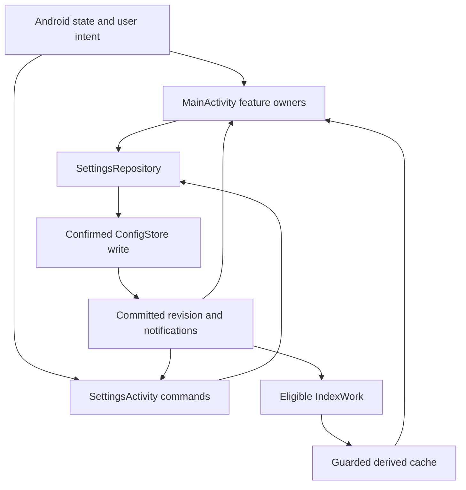

# Grove code documentation

## Guide

This is the consolidated engineering reference. The privacy policy remains in [PRIVACY.md](PRIVACY.md); the root [README](README.md) is the concise entry point. Historical dates, commit IDs, test counts, pending gates, design proposals and source-pinned links retain their original meaning. Statements that a file was unchanged refer to that historical change, before this consolidation. Repeated prose is stored once and linked from later occurrences.

## Launcher icon integration — October 7, 2026

The application now uses `@mipmap/ic_grove`. The original `@drawable/ic_grove` and unrelated `ic_launcher` resources remain available. The three original PNG uploads are copied without pixel changes into `app/src/main/res/drawable-nodpi/` as `ic_grove_background.png`, `ic_grove_foreground.png`, and `ic_grove_monochrome.png`. Assets were identified visually because the recovered attachment order differs from the conversation numbering; the rounded-card composite is excluded.

`mipmap-anydpi-v26/ic_grove.xml` supplies background and foreground on Android 12; `mipmap-anydpi-v33/ic_grove.xml` adds the themed monochrome layer on Android 13+. Foreground and monochrome XML insets are 16% and 12% respectively to account for their different transparent margins and fit the central safe area. Source alpha-edge artifacts are preserved; device visual acceptance is pending. See [Android adaptive icon guidance](https://developer.android.com/develop/ui/views/launch/icon_design_adaptive).

Local build attempt: `gradlew.bat assembleDebug testDebugUnitTest lintDebug` could not start because `JAVA_HOME` is unset and Java is unavailable. This is not a successful build. CI results, if available, are reported in the pull request.

## Contents

- [GROVE-STATUS.md](#grove-status)
- [ARCHITECTURE.md](#architecture)
- [SYSTEM-CATALOG.md](#system-catalog)
- [GROVE-SYSTEM-MAP.md](#grove-system-map)
- [FAILURE-POLICY.md](#failure-policy)
- [BUILD-STATUS.md](#build-status)
- [TESTING.md](#testing)
- [FAILURE-VERIFICATION.md](#failure-verification)
- [FAILURE-BOUNDARY-AUDIT.md](#failure-boundary-audit)
- [SMALL-FILE-FAILURE-REVIEW.md](#small-file-failure-review)
- [CONTACT-REVIEW.md](#contact-review)
- [RUST-PLAN.md](#rust-plan)
- [PLAY-READINESS.md](#play-readiness)
- [GITHUB-UPLOAD.md](#github-upload)
- [signing/README.md](#signing-readme)
- [verification/README.md](#verification-readme)
- [README.md](#readme-history)

<a id="grove-status"></a>

## GROVE-STATUS

Original source: `GROVE-STATUS.md`.

### Grove behavior and failure rules

**Current code map:** [GROVE-SYSTEM-MAP.md](#grove-system-map) is the complete release-pinned ownership, invariant, failure-method and information-flow reference, including every Kotlin/Rust source file and named declaration. [SYSTEM-CATALOG.md](#system-catalog) retains historical source audits. This file remains authoritative for behavior and capability status.

**Status:** Target behavior and failure contract, with release-pinned implementation evidence below. This is not a claim that every rule or device scenario has been verified. See [Open implementation checks](#grove-status-open-implementation-checks) before using it as a test checklist.

Grove is the phone's home screen. A broken wallpaper download or contact index should not make the user lose their launcher. Each feature owns its own failure, and protected data stays unavailable whenever Android permission or the user's Grove setting says it should.

<a id="grove-status-implementation-status-on-main"></a>

#### Implementation status on `main`

This file remains the source of truth for intended behavior and the canonical implementation-status matrix. **Release baseline:** [v1.0.0](https://github.com/davidcit646/Grove/releases/tag/v1.0.0), published October 6, 2026, at `f9455918d0bcd7f5f038bb3cd87fa64c4a93be48` (version code 32). `main` had the same source baseline when this reconciliation was prepared. Later documentation commits do not change the shipped binary. [Release CI](https://github.com/davidcit646/Grove/actions/runs/37491934642) passed Rust/JVM tests, debug assembly, lint, the missing-signing negative gate, signed APK/AAB verification and stable publication.

The five capabilities below are **included in v1.0.0**, replacing the earlier pre-release implementation notes. Included means implemented and packaged; it does not establish every target rule, Android/OEM interaction or failure path as verified. [TESTING.md](#testing) owns detailed execution records and pending checks; [BUILD-STATUS.md](#build-status) owns build/release evidence.

| Target behavior | Release owner / pinned code | Implementation at v1.0.0 | Tracking | Test / device evidence |
| --- | --- | --- | --- | --- |
| Search with indexing independently disabled; live GFS/GCS | [Config](https://github.com/davidcit646/Grove/blob/f9455918d0bcd7f5f038bb3cd87fa64c4a93be48/app/src/main/java/tech/granet/grove/Config.kt), [SearchController](https://github.com/davidcit646/Grove/blob/f9455918d0bcd7f5f038bb3cd87fa64c4a93be48/app/src/main/java/tech/granet/grove/SearchController.kt), [SearchSources](https://github.com/davidcit646/Grove/blob/f9455918d0bcd7f5f038bb3cd87fa64c4a93be48/app/src/main/java/tech/granet/grove/SearchSources.kt) | Separate persisted search/indexing switches; bounded permitted live lookup when indexing is off or a cache is unavailable | [#74](https://github.com/davidcit646/Grove/issues/74) | SearchPublicationGateTest, ConfigTest; device permission/query/action, latency and cancellation checks pending |
| Separate durable GFI/GCI caches and eight index states | [IndexCache](https://github.com/davidcit646/Grove/blob/f9455918d0bcd7f5f038bb3cd87fa64c4a93be48/app/src/main/java/tech/granet/grove/IndexCache.kt), [IndexWork](https://github.com/davidcit646/Grove/blob/f9455918d0bcd7f5f038bb3cd87fa64c4a93be48/app/src/main/java/tech/granet/grove/IndexWork.kt), [IndexState](https://github.com/davidcit646/Grove/blob/f9455918d0bcd7f5f038bb3cd87fa64c4a93be48/app/src/main/java/tech/granet/grove/IndexState.kt) | Separate atomic app-private metadata caches, independently scheduled workers and explicit states; caches never authorize access | [#75](https://github.com/davidcit646/Grove/issues/75) | IndexStateTest, IndexRefreshRequestsTest; device corrupt/stale/partial cache, failed write, revocation and process-death checks pending |
| User-selected wallpaper and solid black choice | [WallpaperArt](https://github.com/davidcit646/Grove/blob/f9455918d0bcd7f5f038bb3cd87fa64c4a93be48/app/src/main/java/tech/granet/grove/WallpaperArt.kt), [WallpaperController](https://github.com/davidcit646/Grove/blob/f9455918d0bcd7f5f038bb3cd87fa64c4a93be48/app/src/main/java/tech/granet/grove/WallpaperController.kt), [WallpaperPicker](https://github.com/davidcit646/Grove/blob/f9455918d0bcd7f5f038bb3cd87fa64c4a93be48/app/src/main/java/tech/granet/grove/WallpaperPicker.kt) | Three generated designs, ten packaged Commons images, solid black and a bounded user-selected image; Android apply precedes Grove preference commit | [#82](https://github.com/davidcit646/Grove/issues/82), [#76](https://github.com/davidcit646/Grove/issues/76) (#76 closed as duplicate) | WallpaperRegistryTest, WallpaperControllerTest; offline/apply/cancel/invalid-input/lifecycle device checks pending |
| Android-applied-wallpaper reconciliation and explicit theme modes | [PresentationController](https://github.com/davidcit646/Grove/blob/f9455918d0bcd7f5f038bb3cd87fa64c4a93be48/app/src/main/java/tech/granet/grove/PresentationController.kt), [Config](https://github.com/davidcit646/Grove/blob/f9455918d0bcd7f5f038bb3cd87fa64c4a93be48/app/src/main/java/tech/granet/grove/Config.kt), [ThemeColors](https://github.com/davidcit646/Grove/blob/f9455918d0bcd7f5f038bb3cd87fa64c4a93be48/app/src/main/java/tech/granet/grove/ThemeColors.kt) | Android renders Home static/live wallpaper; ID/color metadata refreshes button colors; System/Light/Dark/Wallpaper choices persist | [#77](https://github.com/davidcit646/Grove/issues/77), [#29](https://github.com/davidcit646/Grove/issues/29) | PresentationPolicyTest, ConfigTest; external/live/Home/Lock/Both and OEM device checks pending |
| GHEAEW severity/code registry, safe report draft, default recipient | [GroveErrors](https://github.com/davidcit646/Grove/blob/f9455918d0bcd7f5f038bb3cd87fa64c4a93be48/app/src/main/java/tech/granet/grove/GroveErrors.kt), [CrashReporter](https://github.com/davidcit646/Grove/blob/f9455918d0bcd7f5f038bb3cd87fa64c4a93be48/app/src/main/java/tech/granet/grove/CrashReporter.kt) | Assigned numeric/GWS registry, Recover/Degrade/Stop UI, bounded retained reports, support@granet.tech draft and no-mail copy fallback; no automatic send | [#78](https://github.com/davidcit646/Grove/issues/78), [#28](https://github.com/davidcit646/Grove/issues/28) | GroveErrorRegistryTest, GroveErrorRoutingTest, CrashReporterPrivacyTest, ReportPromptPolicyTest; actual dialog/mail/copy/retention failure checks pending |

PRs [#73](https://github.com/davidcit646/Grove/pull/73), [#83](https://github.com/davidcit646/Grove/pull/83), [#87](https://github.com/davidcit646/Grove/pull/87), [#90](https://github.com/davidcit646/Grove/pull/90) and [#92](https://github.com/davidcit646/Grove/pull/92) are merged and included in this baseline. The #6/#34 device gates were closed unrun by user scope decision; closure is not passing evidence. Limited user acceptance of tested workflows does not complete the broader Android/OEM/accessibility/fault-injection matrix in TESTING.md and FAILURE-VERIFICATION.md. [#79](https://github.com/davidcit646/Grove/issues/79) tracks this reconciliation.

**Documented onboarding exception — #89:** The rules below retain the original setup indexing-choice description. [#89](https://github.com/davidcit646/Grove/issues/89) explicitly requested indexing preferences on for genuine fresh installs and indexing controls only in Settings. v1.0.0 implements that request: optional search sources start off, work requires enabled search plus current Android access, and existing/imported/replayed choices are preserved. Search off stops the affected indexer and deletes its cache; an indexing preference alone never authorizes work. This exception is recorded separately rather than silently rewriting the target rules.

#### The rules in plain language

1. **Get the home screen on screen first.** Load saved choices, show a usable home, and fill in icons as they become available. Start package, theme, and wallpaper listeners without holding up that first usable screen.
2. **Ask Android what is true now.** Android owns installed apps, permissions, contacts, accessible files, and the applied wallpaper. Saved settings and caches can speed things up, but they cannot overrule Android.
3. **Honor the user's switches.** Android granting a permission does not turn Grove search or indexing on. The corresponding Grove setting must also be enabled.
4. **Contain failures.** If a feature cannot do its job, stop that operation, explain it, and keep unrelated parts of Grove available.
5. **Report only with the user's action.** Grove can prepare an email to `support@granet.tech`; the user reviews and sends it. Never include private file contents, contact details, or secrets by default.

A **hard dependency** is something a particular operation needs to succeed. It is not automatically a hard dependency of the whole launcher. A **soft dependency** permits a defined fallback. **Fail closed** means do not perform an operation or expose results without its prerequisites. **Fail open** here means the rest of Grove remains usable; it never means bypassing a permission or preference.

#### Starting Grove

1. Android starts or resumes Grove.
2. Grove loads its saved configuration and draws a usable home with available app information. Disk work and icon rendering must not hold up the main thread.
3. Grove checks the current Android state and reconciles it with saved choices.
4. In the background, Grove observes app changes, light/dark theme changes, and wallpaper changes. If a listener cannot start, refresh on resume or retry instead of blocking home.
5. Grove loads or renders missing app icons lazily and caches them for next time.

On a genuine first run with no saved settings, create safe defaults and show setup. If saved custom settings are corrupt, preserve them separately and show a safe fallback with a recovery choice; do not treat corruption as a fresh install. Permission states begin as **ungranted until checked against Android**; gestures begin enabled; theme follows the system. Save chosen settings only after a confirmed write, and never claim a failed write succeeded.

If Android's app inventory cannot be read, retry and show a scoped error with whatever recovery surface Grove can render. Do not present stale cached apps as a verified current list. If Grove cannot render even a minimal home, that is a **Stop** failure.

**Verified v1.0.0 storage:** [GroveApp](https://github.com/davidcit646/Grove/blob/f9455918d0bcd7f5f038bb3cd87fa64c4a93be48/app/src/main/java/tech/granet/grove/GroveApp.kt) supplies private SharedPreferences named `grove` to [ConfigStore](https://github.com/davidcit646/Grove/blob/f9455918d0bcd7f5f038bb3cd87fa64c4a93be48/app/src/main/java/tech/granet/grove/ConfigStore.kt). Config is JSON under `config`, with separate damaged/fallback recovery entries; [Config](https://github.com/davidcit646/Grove/blob/f9455918d0bcd7f5f038bb3cd87fa64c4a93be48/app/src/main/java/tech/granet/grove/Config.kt) emits schema v12. The original draft path was a placeholder and is not used.

#### Who owns each piece of data?

| Data or decision | Source of truth | What Grove may save |
| --- | --- | --- |
| Installed apps and whether an app can launch | Android package APIs | Labels and icons as disposable caches; pinned app choices |
| Permission to read contacts or files | Android's current permission state | Last observed state for display, never as proof of access |
| Whether contact/file search or indexing is enabled | The user's Grove setting | The setting itself |
| Contacts and accessible files | Android providers and permitted storage | Separate, rebuildable local indexes when enabled |
| Applied wallpaper | Android wallpaper state | Grove's selector choices and display preferences |
| Theme preference, layout, and gestures | The user's Grove settings | Persisted configuration, validated on load |

When sources disagree, check the authoritative source before the affected operation. A revoked permission takes effect even if an index or an old settings value says it was previously granted.

#### Search and indexing

Grove has two optional indexes: **Grove File Indexing (GFI)** and **Grove Contact Indexing (GCI)**. They run independently, use separate caches, and follow the same state and failure conventions. Indexing stores discoverable metadata on the device to speed search; it should not read file contents merely to index filenames. Each service can be disabled in settings.

Indexing and searching are separate choices:

- With search and indexing enabled, Grove can use the relevant local index.
- With search enabled but indexing disabled, **Grove File Search (GFS)** or **Grove Contact Search (GCS)** queries the permitted Android source live. It may be slower, but search still works.
- With an index missing, stale, or broken, permitted search can fall back to GFS or GCS while the index rebuilds or remains disabled.
- With search disabled in Grove, the source returns no results, even when Android permission exists.
- With Android permission denied or revoked, both indexing and live search for that source stop and show no protected results. One source's failure does not disable the other or app search.

The first-run tutorial may explain the speed tradeoff and offer indexing as a choice. It must not silently turn indexing on just because a permission was granted. Android permission requests are made when needed; subsequent permission changes are rechecked, including after returning from system settings.

##### Index states

| State | Meaning | Next action |
| --- | --- | --- |
| `1 Indexed` | Cache is current and usable | Search it, subject to current permission and Grove setting |
| `2 Needs indexing` | Work is required | Queue indexing when enabled and permitted |
| `3 Indexing disabled` | User turned indexing off | Do not index; use live search if search is enabled |
| `4 Indexing error` | Indexing failed | Report the scoped error; use permitted live search |
| `5 Indexing ready` | Prerequisites are met | Start or resume indexing |
| `6 Indexing stale` | Cache is out of date | Treat as needs indexing |
| `7 Cache unavailable` | Cache is missing or unreadable | Rebuild if enabled; otherwise use permitted live search |
| `8 Cache disabled` | Cache use is deliberately off | Treat as indexing disabled |

These numbers are contract state labels, **not** Grove error codes; v1.0.0 implements the named states in `IndexState`. The cache never gives itself permission to return data. On revocation, stop the affected indexer immediately and discard or quarantine inaccessible cached results before another query can expose them.

#### Wallpaper selection

**Grove Wallpaper Selector (GWS)** offers built-in wallpapers with credits and license information, plus a choice from the user's photos or files. The selector can appear during setup or later. Previews load in the background; a failed preview must not freeze the home screen.

Android owns the applied wallpaper. Grove reads the current state, asks Android to apply a selection, and shows it as applied only after success. If the user chooses a black background, GWS proposes a `#000000` wallpaper through the Android wallpaper flow; implementation and platform behavior still need verification.

A wallpaper operation **fails closed**: if wallpaper A cannot download, be read, or be applied, do not claim A is active. Keep the prior wallpaper, offer retry or another choice, and let the user continue using Grove. Network, preview cache, and the entire selector are **soft dependencies** of the launcher. An unhandled GWS exception that locks Grove is a Grove-level system fault.

GWS diagnostic categories are `UI`, `CACHE`, `NETWORK`, `APPLY`, `UX`, `READ`, and `WRITE`. Use `GWS-<category>-<detail>` once exact details are assigned, such as `GWS-NETWORK-01`. If it also causes a Grove-level error, report both codes. GWS codes do not consume the main Grove numeric ranges.

#### What depends on what?

| Operation | Must have to succeed | If unavailable |
| --- | --- | --- |
| Render minimal home | Android activity lifecycle and a renderable UI | Stop; offer recovery where possible |
| Show current app inventory or launch an app | Android package/launch APIs | Stop that action, retry, and report; keep other Grove surfaces usable |
| Show app icons | Icon loader/cache | Use placeholders and retry lazily |
| Persist a setting, pin, or folder change | A successful settings write | Reject or roll back that change; do not say it was saved |
| Show an optional feature as permitted | A current Android permission check | Treat access as unavailable until checked |
| Search apps | Current app inventory | Show a scoped failure; other search sources can remain available |
| Search files or contacts | User-enabled search, current Android access, working provider | Return no results for that source; other sources continue |
| Index files or contacts | User-enabled indexing, current Android access, working provider | Stop that indexer; permitted live search may continue |
| Use an index cache | Valid, permitted, current cache | Rebuild or use live search; never trust a stale grant |
| Apply a wallpaper | Readable selected source and Android accepting the change | Leave old wallpaper in place and offer retry/another choice |
| Open a prepared error email | Mail app that handles the intent | Offer copyable diagnostic text; reporting stays optional |

Web and Play Store searches need a resolvable destination and working external service. Their failure does not disable local search. A missing theme or wallpaper listener can be handled with a refresh on resume. A missing settings file can be rebuilt; a failed save cannot be represented as success.

<a id="grove-status-when-something-goes-wrong"></a>

#### When something goes wrong

The **“Grove has encountered an error”** workflow (GHEAEW, “G-He-Ew”) owns user-facing reporting. Show the affected feature, a useful message, severity, and an assigned code when one exists. Offer retry or a safe alternative. The user can choose to prepare an email addressed to `support@granet.tech`, review it in their mail app, and press Send. If no mail app is available, offer to copy the diagnostic text.

| Severity | Meaning | User action |
| --- | --- | --- |
| **Recover** | Grove can restore the service fully | Retry or continue after recovery |
| **Degrade** | The service or Grove can run with reduced function | Continue safely or retry |
| **Stop** | The affected critical function cannot continue | Retry, open relevant settings, or use Android recovery; never label it working |

The reporting choice exists at every severity. “Continue” is offered only when the affected path can safely continue or degrade.

| Grove code range | Owner |
| --- | --- |
| `100–199` | Configuration |
| `200–299` | App inventory and management |
| `300–399` | UI and UX |
| `400–499` | System |
| `500–599` | GFI |
| `600–699` | GCI |

The ranges are reserved; v1.0.0 assigns individual codes in the `GroveErrors` registry linked above. That registry, rather than an example in this document, defines assigned codes. Error reports include safe context, not private data.

<a id="grove-status-open-implementation-checks"></a>

#### Open implementation checks

- Compare this proposal with the current activities, settings schema, search/index code, and wallpaper implementation. Split ownership along those real boundaries rather than creating classes solely to match acronyms.
- Confirm Android's accessible file scope and permission behavior before promising searches across every user folder. Keep app-private and system data outside the promise.
- Keep exact code assignments and diagnostic details in the existing GroveErrors registry; verify actual UI/report behavior on device.
- Test missing/corrupt settings, failed saves, unavailable app inventory, revoked permissions, stale/broken caches, missing mail app, and wallpaper download/apply failure. Verify each failure leaves unrelated features usable and never leaks disabled search results.

<a id="architecture"></a>

## ARCHITECTURE

Original source: `ARCHITECTURE.md`.

### Grove architecture

**v1.0.0 documentation baseline:** `f9455918d0bcd7f5f038bb3cd87fa64c4a93be48`, published October 6, 2026. [GROVE-STATUS.md](#grove-status-implementation-status-on-main) is the authoritative contract and release capability matrix; [release CI](https://github.com/davidcit646/Grove/actions/runs/37491934642) passed source and signed-artifact gates. Included implementation is separate from pending Android device proof. Dated pre-release sections below preserve evidence at their stated commits: “unmerged”, “unchanged”, “skipped” and “blocked” in those records describe that historical run, not current release status. Documentation reconciliation is tracked in [#79](https://github.com/davidcit646/Grove/issues/79).

#### Juniper settings architecture — PR #92

Production/test source `994df71d741b67dd65ed690840bd67b48cef1cdb` passed [Android CI](https://github.com/davidcit646/Grove/actions/runs/37404896738): eight Rust tests, 163 JVM tests, debug APK assembly, Android lint and the missing-signing negative gate. Signed release steps were skipped. This is historical PR build evidence. PRs #90 and #92 are merged and included in v1.0.0; the current architecture below uses release schema v12. Remaining device acceptance cases stay pending in TESTING.md.

| Owner | Incoming source → outgoing consumer | Authority, commit and failure boundary |
| --- | --- | --- |
| `SettingsRepository` in `GroveApp` | ConfigStore load + typed changes → revisioned snapshot → both hosts | Sole active Config authority. Validate complete candidate; persist before publishing. Invalid, Conflict and Unavailable leave prior snapshot/revision intact. No views or feature work. |
| `SettingsCommands` | UI intent → latest repository transform → existing feature owners | Boolean/theme/grid mutations never replace stale UI snapshots. Index reconciliation runs after persistence; scheduling failure reports saved preference with unavailable refresh. Reports and replay retain separate stores. |
| `SettingsActivity`, `SettingsPages`, `SettingsGridPage`, `SettingsDocumentPages` | Committed snapshot + current platform access → categorized views; UI intent → commands | Host owns lifecycle, result launchers, navigation and Material presentation. Views do not write preferences. Retained drafts are provisional. The Settings Activity is packaged in the same APK/process, with an opaque theme; Home wallpaper transparency remains in MainActivity. |
| `SettingsSession`, `ConfigDocuments` | Editor/document → bounded worker read/parse → reviewed candidate → explicit Apply | No retained Activity. Generation invalidation cancels queued/publication effects. Candidate captures config and revision; concurrent changes require re-review. Failed writes preserve draft and active configuration. Rotation retains jobs/drafts; process death requires explicit re-review/reimport. |
| `ConfigController`, `MainActivity` | Shared committed snapshot → Home/search/theme reconciliation | ConfigController is a host adapter, not an independent Config store. Main refreshes on return/resume and observes committed changes while active. Saved preference and unavailable feature refresh remain distinguishable. |
| `SetupController`, `SetupMergePolicy` | Original base + provisional setup lanes + current snapshot → checked Finish | Merge only modified setup lanes; retain current grids/theme/folders/wallpaper. Same-lane conflict restarts review; failed save retains setup. Marker writes are checked. |
| `GridPolicy`, `HomeController`, `DrawerController`, `DrawerTiles` | Optional validated home/drawer grid + actual items → pages and accessible tiles | Schema v12 retains v11 grid support and reads v1–v10 as automatic grid. Columns and rows independently accept integers 1–10. Page capacity = columns × rows; shrink/filter clamps pages without dropping items. Dense grids scroll with minimum touch/font sizing. Existing folder grids and automatic behavior remain unchanged. |
| Existing feature owners | Settings routes → Main feature entry/platform adapter | WidgetFlow/Registry retain ID ownership; FolderActions retains selected-app mutations; wallpaper owners retain Android apply-before-preference; SearchSources/IndexWork retain permission, generation, cache and scheduling gates. Reports, email and tutorial markers remain outside portable Config. |

The categorized workflow replaces the Grove settings modal and configuration dialogs. Home/drawer/search remain in MainActivity. Widget, wallpaper and folder entry routes delegate to their existing owners; their contextual dialogs are retained. There is no second APK, duplicated preference store or exported backend service. The APPLICATION_PREFERENCES route opens SettingsActivity directly.

Portable Config schema v12 includes nullable `homeGrid` and `drawerGrid` (introduced in v11), explicit theme mode and independent search/provider preferences. Kotlin and native preflight agree on integral dimensions 1–10; legacy automatic grids and unrelated preferences are preserved. Local widget IDs, report settings and replay markers keep their existing separate ownership.

For the complete current system/method ownership, invariant, failure-boundary and information-flow reference, see [GROVE-SYSTEM-MAP.md](#grove-system-map). [SYSTEM-CATALOG.md](#system-catalog) retains historical source audits. This page is the shorter ownership overview.

#### PR #87 presentation and failure-boundary changes

Merged PR #87 adds an activity-scoped `PresentationController`: Android owns the applied static/live wallpaper and renders it through the wallpaper window. Home stays transparent without global dimming. Text shadows protect clock/date and wallpaper labels; inset-sized views protect system-bar icons only. Grove does not paint a decoded copy of its remembered selection. Android owns wallpaper ID/color metadata; a private worker reads it, a Home-color listener invalidates it, and resume refresh is the fallback if registration fails. Lifecycle generations reject destroyed/superseded output. No additional wallpaper-reading or file permission is required. Missing color metadata uses the current theme's button colors.

Config schema v10 adds `themeMode` (system/light/dark/wallpaper) in both Kotlin and Rust. Legacy v1–v9 imports retain System and their existing wallpaper-button-color preference. Explicit Light/Dark uses AppCompat night mode; Wallpaper colors follows system night mode and applies Android Home-wallpaper color to launcher buttons. Home/Lock/Both still apply through Android before Grove's remembered Home preference commits; lock-only never replaces Home preference. External changes never rewrite that preference.

Config commits reconcile source switches and theme only after persistence succeeds. Generic failed-save dialogs do not retry a captured Config without the originating UI completion; users retry from that retained surface. Document streams/parsing run on a dedicated executor; activation returns to the main thread and checks the current Config against its start snapshot. Destroyed/superseded documents cannot activate. Settings switches roll back a failed commit.

Search preserves its committed frame through debounce; permission/preference reconciliation explicitly clears protected rows. Stable cache payloads preserve prepared snapshot identity, state-only notifications avoid restarting scans, and `SearchFrameGate` suppresses identical row rebuilds. Query/source generation and current Android access still gate publication and actions. Contact bounds propagate Partial through live results/cache status. Source verification and remaining Android checks are in BUILD-STATUS/TESTING.

Status: the integrated source refactor and [PR #73](https://github.com/davidcit646/Grove/pull/73) MainActivity lane split are on main. The broad device verification ticket #34 was closed unrun by scope decision; the checklist remains in TESTING.md. [GROVE-STATUS.md](#grove-status) is the target behavior; [FAILURE-POLICY.md](#failure-policy) defines the capability outcomes, and [FAILURE-VERIFICATION.md](#failure-verification) separates source checks from Android device work.

`MainActivity` is the Android host for lifecycle, ActivityResult launchers, root views, platform services and routing. Nine activity-scoped controllers own feature state and navigation decisions. `SearchSources` owns activity cache snapshots; process-owned `ContactChanges` owns contact observation, `IndexWork` owns durable scheduling and `IndexCache` owns publication; `WidgetFlow` owns the widget setup sequence while the Activity retains result launchers. `FirstRunSetup` owns the full-screen shell and navigation; `FirstRunPages` renders page content with `FirstRunComponents` visual primitives and `FirstRunState` provisional answers. The earlier 1,145-line Activity was split by #73. The former #6 device gate was closed by user scope decision without a device pass; see TESTING.md for the unrun matrix. These lower-level components still support the controllers:

| Owner | Boundary and timing | Failure outcome / retry | Verification |
| --- | --- | --- | --- |
| `StartupCoordinator`, `AppCatalog`, `CatalogController`, `AppIconStore` | Cold/resume plan; app enumeration is separate from icon decode; catalog publishes Loading/Ready/Degraded/Failed | Typed config/service/catalog recovery shows Retry/Home settings; icon failure degrades imagery only; changed-package/size refresh invalidates the relevant cache; stale generations cannot publish | #20-#22, CoreRecoveryPolicyTest, AppCatalogTest, StartupCoordinatorTest; device gate in TESTING.md |
| `SearchSources`, `SearchSourceState`, `SearchController`, `ContactIndex`, `FileIndex` | Enabled source + current permission + current query generation; access changes cancel before reconciliation; file canonical path is rechecked at action | Disabled/permission/loading/ready/partial/failed remain distinct; stale, revoked, inactive or cache-superseded live results cannot publish; app source exposes its own catalog state | #5, #9, #23, SearchSourceStateTest, SearchPublicationGateTest, FileIndexTest; device gate in TESTING.md |
| `ContactActions`, `FileActions`, `SearchActions` | Current permission/package/path before external action | A failed contact/file/intent action reports local error; Home remains usable | #6, #32, #34 |
| `GestureSession`, `HomeTouchRouter`, `DrawerState`, `DrawerTiles`, `DrawerDragController`, `FolderActions`, `PinDragController`, `UninstallBatch` | Touch/selection state before animation or persisted drawer edit; OS uninstall result before next launch | Disabled/invalid/canceled means no action or commit; cancellation clears queue | #14, #24, #25 and respective unit tests, #34 |
| `WidgetFlow`, `WidgetRegistry`, `WidgetScreen` | Allocation and persisted ID transition; provider again at render | Missing provider/createView yields removable placeholder; interrupted setup offers retry/removal | #26, #34 |
| `WallpaperArt`, `WallpaperController`, `WallpaperPicker`, `WallpaperPresentationController`, `ThemeColors` | Stable source registry; packaged/generated/custom worker preview; Android apply before Grove Home preference commit | Invalid/failed preview is scoped and retryable; failed Android apply preserves prior selection; successful apply followed by Config failure exposes split state and retries persistence without reapplying; cosmetic color failure falls back safely | #29, #82, WallpaperControllerTest, WallpaperRegistryTest; device gate in TESTING.md |
| `ConfigDocuments`, `ConfigStore`, `FirstRunSetup`, `FirstRunPages`, `FirstRunComponents`, `FirstRunState`, `ConfigController.commitConfig` | Bounded read/schema check, committed activation; provisional onboarding answers; startup settings check after minimal UI | Invalid import leaves active config; damaged custom config preserved; write failure keeps prior in-memory layout; unreadable startup settings show Retry and Android Home settings; denied optional source disabled | #2, #27, #30 and unit tests, #34 |
| `CoreBridge`, Rust `search/mime/config/wallpaper/bridge` modules | Native load and per-call payload validation | Bounded diagnostic and equivalent Kotlin fallback where safe | #12, #15, #33, NativeResultsTest, Rust tests, #34 |
| `GroveErrors`, `CrashReporter` | Stable Grove/GWS code registry, severity routing, bounded private report drafting and user-directed handoff | Unrelated Home behavior stays available; chooser launch is not delivery; reports remain until explicit discard/confirmable handoff; no mail handler exposes a copy fallback | #28, #78, GroveErrorRegistryTest, GroveErrorRoutingTest, CrashReporterPrivacyTest, ReportPromptPolicyTest; device gate in TESTING.md |
| Gradle, Rust build script, release verifier/workflow | Compile/import/resource/package checks at build; signature/ABI/checksum/tag at release | Required failure stops job and publication; no runtime import sweep | #3, #10, #36, #34 |

On main before PR #87, the JSON schema reads versions 1–9. Version 8 added independent contact/file indexing choices; version 9 persists wallpaper selections by stable source ID instead of numeric slot. Legacy versions 1–8 remain readable, v1–v7 migration leaves durable indexing off, and a legacy numeric wallpaper slot is rewritten as its stable ID on the next successful save/export. A damaged custom configuration is kept separately from the safe fallback until explicit replacement. Optional permissions do not gate the core Home shell. See the current index ownership and flow addendum in SYSTEM-CATALOG.md.

Gradle `preBuild` calls `scripts/build-rust-android.sh` with NDK 27.3.13750724, producing arm64, ARMv7 and x86-64 `.so` files. PR CI runs Rust tests, Android debug build, JVM tests, lint and the missing-signing negative check. A main build requires signing and verifies APK/AAB certificate, native payloads/alignment and checksums. The manual release workflow rebuilds from a supplied tag and exact commit; nothing is published by the refactor itself. Positive signed install/update remains #36; the #34 device matrix was closed unrun by scope decision. The split passed source CI on its PR branch; Android widget, permission, and onboarding interactions have not been device-tested for this change. Current main release CI fails closed when the signing password is unavailable, while debug build, unit tests, lint and Rust tests pass.

The umbrella #17 was closed by an explicit scope decision after limited user testing; that closure does not mean every device/performance/release gate passed. The dated gates in [TESTING.md](#testing) and [FAILURE-VERIFICATION.md](#failure-verification) remain unrun; closure of #6 and #34 is a scope decision, not passing evidence.

<a id="architecture-mainactivity-lane-split-6"></a>

#### MainActivity lane split (#6)

`MainActivity` is the Android host: lifecycle, result registrations, root views,
platform services, and routing. Lane controllers are activity-scoped and own their
mutable feature state; they use the host for Android effects and explicit calls to
other controllers. This is a single HOME Activity, so switching between Home,
drawer, and search retains the existing task/lifecycle behavior.

| Owner | Lane/state | Failure boundary |
| --- | --- | --- |
| StartupController | Config loading, launcher callback, typed core recovery | Required config/service/catalog failure closes normal Home to a typed Retry/system-settings recovery state; entering recovery supersedes pending catalog/search work. |
| CatalogController | App snapshot, prepared app search, explicit catalog state, icon publication, generation | Enumeration failure is Failed/core recovery; icon failures produce Degraded while apps stay usable; stale generations cannot publish. |
| HomeController | Home rendering, scroll, animation, wallpaper backdrop | Android owns the unmodified wallpaper; local text shadows and system-bar regions supply contrast without a global overlay. |
| DrawerController | Grid, filtering, selection, folders/drag | Folder/pin mutation passes through successful config commit before selection is cleared. |
| SearchController | Search worker, query generation, source snapshots/permissions, publication gate | Source/access changes cancel before reconciliation; stale, revoked, inactive or cache-superseded output cannot publish; app/contact/file outcomes stay distinct. |
| ConfigController | MainActivity adapter to shared SettingsRepository; settings workflow routing | Persistence before publication; reconcile committed state on resume; SettingsSession owns documents/drafts. |
| SetupController | Setup instance, settings and permission explanations | Failed config save retains setup for retry; optional permissions do not block Home. |
| ActionController | External actions, menus, uninstall queue | File/contact adapters recheck access; canceled/failed uninstall stops the batch. |
| WallpaperPresentationController | Picker and applied preference | System apply must succeed before wallpaper preference commit. |

`ConfigTransaction` tests enforce persistence-before-publication and ensure a
publication invariant is propagated rather than mislabeled as a storage failure.
The broader Ready/Degraded/Unavailable/Canceled policy remains specified by
FAILURE-POLICY.md; this extraction preserves existing source/widget outcomes and
does not claim every Android boundary has completed failure-injection coverage.

Device gate: Home scroll/back, drawer filter/selection/folders/pins, search with
permissions denied/revoked, setup finish/skip/replay, widgets bind/cancel/restore,
config import/editor/recovery, wallpaper apply, and rotation/resume during pending
search/catalog/wallpaper work. #6 was closed with this device checklist unrun by user scope decision.

#### Released capabilities and remaining verification

The [GROVE-STATUS.md release matrix](#grove-status-implementation-status-on-main) is authoritative. v1.0.0 includes independent search/indexing and durable caches (#74/#75), custom/black/offline wallpaper (#82 incorporating #76), numeric/severity/report workflow (#78), external wallpaper/theme reconciliation (#77), configuration workflows (#27), replay (#81), onboarding (#89) and Juniper settings (#92). Included implementation does not close unrun device checks. The #89 onboarding exception remains explicitly recorded in Grove Status; detailed evidence is in BUILD-STATUS.md and TESTING.md.

#### PR #90 onboarding implementation — October 5, 2026

<a id="record-35"></a>

Production/test source `026be7f0314c355f0449fe23796a557ee0417e22` passed [Android CI](https://github.com/davidcit646/Grove/actions/runs/37399253894): seven Rust tests, debug APK assembly, JVM tests, lint, and the missing-signing negative gate. This is source/build verification; PR #90 remains unmerged and its Android device acceptance is pending. GROVE-STATUS.md is unchanged. Issue #89 explicitly requests fresh-install indexing defaults and Settings-only indexing controls; this overrides the older onboarding indexing-choice description without editing that contract.

FirstRunSetup retains one shell and a scoped DynamicColors context with a theme fallback. FirstRunComponents uses Material switches/checkboxes/input and bundled Material Symbols Rounded. FirstRunPages owns concise page content and direct permission requests; FirstRunState owns provisional choices. A Bundle snapshot restores the current page, choices, pins and practice flags; it does not activate settings. Finish still requires a successful Config commit.

FirstRunMotion owns cosmetic alpha/translation only: 300 ms initial foreground fade, 220 ms forward/back slides with RTL inversion, immediate final state when Android animators are disabled. Navigation and touch are gated during motion; stop/permission return/destruction settle it, remove outgoing views and restore alpha/translation. Permission redraws and restored instances do not replay the fade. Fresh setup uses an optional worker-rendered Fern backdrop with a cheap Fern-palette fallback; the stationary setup-only image never changes Android wallpaper. Replay uses Android's existing wallpaper. Destroyed/superseded artwork is recycled.

SetupDefaults selects indexing-on preferences only when no config/initialized/setup-complete marker exists. Config() and legacy parser defaults remain indexing-off for recovery/migration; saved choices remain intact. IndexAccessPolicy requires source enabled AND indexing enabled AND current Android access at scheduling, cache loading/publication, observer and worker/cache-commit boundaries. Source disable cancels work and clears the cache without resetting the indexing preference. Missing permission disables the unavailable setup source at Finish without erasing the indexing preference. Settings retains separate index switches and permitted live search remains available when indexing is off.

#### Juniper cleanup after initial device check

<a id="record-39"></a>

Cleanup source `a8f1ecdc5be3cd51b685425f6f4c896bd91d67bc` passed [Android CI](https://github.com/davidcit646/Grove/actions/runs/37407249555): eight Rust tests, JVM tests, debug APK assembly, lint and the missing-signing negative gate. Signed release steps were skipped. The user confirmed the original Juniper build loads and core workflows work, and supplied a recording showing repeated contact-index status transitions. The cleanup still requires device revalidation; no merge occurred.

<a id="record-40"></a>

Settings categories and destinations now use matching Material Symbols Rounded icons. Search groups contact/file controls into equivalent Material cards. Cache availability and WorkManager activity are separate labels (Idle/Queued/Running/Waiting to retry/Failed); cache presence does not claim complete coverage. IndexWork serializes scheduling, coalesces queued notifications, retains at most one deferred follow-up for running work, and rate-limits sequential contact-provider events to a 30-second window. Manual refresh remains immediate when no work is active. A terminal failed scan remains failed rather than appending a dependent job that could be canceled. Permission, settings and generation gates remain authoritative.

#### Contact-path fixes #93–#102 — October 6, 2026

<a id="record-41"></a>

Production/test source `6cafc09247cbc3f96eb1a21a1ebc4bfb025bd130` passed [Android CI](https://github.com/davidcit646/Grove/actions/runs/37409473807): eight Rust tests, the JVM suite (173 test methods), debug APK assembly, lint and the missing-signing negative gate. Signed release steps were skipped. Source trees locally and on the pushed branch match. PR #92 remains draft, stacked on unmerged PR #90; the new device acceptance is pending. GROVE-STATUS.md is unchanged.

<a id="record-42"></a>

The current owner/caller/consumer and failure inventory is [CONTACT-REVIEW.md](#contact-review). Package changes no longer request contact indexing; ContactChanges owns process observation, IndexWork owns scheduling/recovery/repair, IndexCache owns confirmed cache publication and shared metadata, and the two UIs render those outcomes. The previous cleanup pass did not prove idle stability; this source fixes the subsequent full-audit findings.

#### Grouped settings cards — October 6, 2026

<a id="record-43"></a>

Source `42984548fd4c6211bde60df7871acd20a421c9fb` passed [Android CI](https://github.com/davidcit646/Grove/actions/runs/37456480396): Rust tests, the JVM suite, debug APK assembly, lint and the missing-signing gate. Signed release steps were skipped. This is source/build verification; visual device acceptance is pending. GROVE-STATUS.md is unchanged.

<a id="record-44"></a>

`SettingsGroups` owns only Material card surfaces, spacing and accessibility headings. `SettingsPages` and `SettingsDocumentPages` place their existing controls inside these groups; SettingsCommands, the shared repository and platform/feature owners retain all actions and settings authority. Search uses the same helper. Home groups are Buttons, Clock and date, Pinned apps, Gestures, Widgets and Default launcher; Drawer, Appearance, Configuration, Help, About and artwork credits also use labeled cards. No setting keys, navigation routes, platform actions or command calls were removed.

##### Settings scroll ownership

`SettingsActivity` owns transient per-route scroll positions through `SettingsScrollState`, outside configuration and `SettingsRepository`. Before a render it remembers the laid-out displayed route; after the replacement ScrollView lays out it restores that route's position. The layout guard prevents rapid repository updates from saving a newly created view's zero position before restoration. Saved-instance state preserves allowlisted route positions across recreation. The ScrollView receives focus to prevent newly constructed controls from pulling the viewport to the first row. Existing page motion finishes before capture; Android clamps positions when content shrinks.

##### Settings discovery (#103)

`SettingsCatalogue` owns stable discovery IDs, aliases, icons and typed Grove route/anchor or public Android action destinations. `SettingsLabels` binds titles and breadcrumbs to Android resources; typed toggles and anchored action rows reuse the labels. `SettingsMatcher` prepares the small catalogue once and performs bounded, deterministic local matching without permissions, provider queries, disk indexing or settings mutations. Adding a typed SettingKey requires a catalogue destination; SettingsDiscoveryTest checks coverage and ID uniqueness.

`SearchController` owns debounced generation-checked publication of apps, Grove settings, Android settings, contacts, files and web/store results. Grove rows precede Android rows structurally. New rows and capability failure state participate in SearchScreen's frame fingerprint. Android capability snapshots refresh off-thread on search entry/resume and relevant package catalogue events; matching uses a prepared snapshot rather than PackageManager calls per keystroke. Contact/file grants, user switches, indexes and live scans retain their existing owners and gates.

`AndroidSettingsRouter` owns platform resolution and launch. `SettingsCapabilities` distinguishes Ready, unsupported/unavailable and failed discovery, validates enabled/exported/permitted system handlers from packages that handle the public Android Settings root, and rechecks the destination at action time. Failed discovery exposes a scoped retry and bounded diagnostic; unsupported pages are hidden. Launch failure leaves local search available. Targeted manifest intent queries cover the curated actions; no broad package visibility or settings-write permission is introduced. Android remains responsible for changing system settings.

`SettingsSearchPresentation` converts metadata into navigation rows. SettingsActivity validates catalogue anchors and scrolls to the matching view after layout, consuming the anchor once; Back and later preference refreshes preserve normal per-route scroll state. No search result invokes a command merely by being displayed. Add widget navigates to the existing Home widget control, which delegates to WidgetFlow only when tapped. Defaults, report deletion and configuration imports retain their existing explicit review/action workflows.

Android has no universal documented widget-settings page. Widget queries offer Grove Add widget first, plus supported related Default launcher and a labeled Search Android settings (or Android settings root) fallback. ACTION_APP_SEARCH_SETTINGS receives no undocumented query extras. ACTION_SEARCH_SETTINGS, which configures global search, is not used.

##### Calculator search

`SearchCalculator` owns deterministic local arithmetic for expressions ending in `=`: decimal literals, unary signs, parentheses and precedence for addition/subtraction/multiplication/division, including ×/÷/− keyboard symbols. It returns NotCalculation, Answer (with an explicit approximation flag), or Invalid (syntax, division by zero, or limits). It parses no functions/scripts/exponents and never accesses Android, the network or persistent settings. Input is bounded to 256 characters, literals to 64 characters, nesting to 16, operations to 128, and intermediate precision/scale and rendered answers to bounded sizes. BigDecimal preserves exact arithmetic; nonterminating division uses DECIMAL128 and marks the answer approximate.

SearchController evaluates on the existing query worker and publishes under the same generation/target guard as other results. SearchScreen includes the calculation in its frame fingerprint and renders the answer before app results; malformed arithmetic has a non-actionable correction message. Ordinary queries retain their normal search behavior. CalculatorActions owns tap-time handoff through Intent.makeMainSelectorActivity(ACTION_MAIN, CATEGORY_APP_CALCULATOR), without an OEM package name or expression extras. A missing/failed external calculator produces a scoped message and keeps the local answer available. Android owns calculator app selection and launch.

##### Search feature preferences and tutorial ownership (#104–#107)

<a id="record-53"></a>

The current portable Config schema is v12, with calculator/androidSettings/groveSettings booleans defaulting true for old configurations. Kotlin Config and Rust config preflight both accept the version and strictly validate these flags. SettingsRepository remains the sole committed Config/revision authority. SettingsCommands writes through it; SearchSettingsEffects limits index reconciliation to changed protected-source flags. ConfigController passes changed search preferences to SearchController, whose provider computation, final row rendering and generation checks honor the current switches. Android capability snapshots are skipped while their provider is off. SetupMergePolicy merges each search field independently so provisional contact/file choices preserve concurrent provider choices.

| Owner | Source and flow | Failure/lifecycle boundary |
| --- | --- | --- |
| SearchTutorialState | Bounded page plus session suppression; three forward actions lead to completion | Incomplete pages cannot commit completion; failed persistence does not claim success |
| SearchTutorialSession | Captured replay request + page/suppression state → entry gate → host preparation → optional render | Capture occurs before rendering; a failed request stays suppressed across later entries and recreation until a new explicit replay request. Home settles before it is hidden. |
| SearchTutorialController | Actual Search entry → version/replay gate → presentation → confirmed preference commit → Search | Separate app-private version and replay markers; failed completion suppresses current-session prompting; new explicit replay request can bypass that suppression. Saved instance restores active page. Optional render failure falls open to usable Search. |
| SearchTutorial | Static examples + current feature/grant availability → centered Material cards, progress, navigation | No provider reads, permission requests, settings writes or indexing. Resume refreshes availability. Destroy restores underlay and system-bar appearance. |
| TutorialSwipeHost / FirstRunMotion | Horizontal gesture or accessible Next/Back → page change; RTL-aware slide | Cancellation/multitouch/vertical scroll cannot advance; busy transitions reject repeats; reduced motion settles immediately |
| FirstRunPages / SwipePracticeMotion | Genuine enabled Gestures.resolve result → provisional practice answer; motion renders idle dot/trail and feedback | Cosmetic guidance never completes practice. Cancel/horizontal/disabled gestures cannot succeed. Pause/exit/destroy stop owned animators/callbacks and remove overlays. |

<a id="record-54"></a>

Search tutorial completion/version/replay request and session/page snapshots remain outside portable Config and independent of initial setup/widget guidance. Help > Tutorials exposes search replay without resetting either other tutorial. Initial permission pages center their body while preserving fill-viewport scrolling and fixed navigation. Success feedback occupies a transparent full-screen overlay with a prominent Material Symbols Rounded check, coalesces repeats, does not intercept touches, and lasts 250ms total at the default system animator scale. Disabled animation uses static guidance and immediate truthful Done/accessibility feedback.

Tutorial audit follow-up: HomeController resets owned swipe motion without rebuilding Home before guide presentation, preserving its widgets and scroll on incomplete dismissal. Tutorial state/presentation/completion failures use GroveErrorPresenter with registry codes 411/314/412 (Degrade), offering Continue and optional user-reviewed Report. Page/refresh failures tear down the guide and open Search. The guide does not own Config or protected sources.

<a id="system-catalog"></a>

## SYSTEM-CATALOG

Original source: `SYSTEM-CATALOG.md`.

### Grove system catalogue

**Complete current reference:** [GROVE-SYSTEM-MAP.md](#grove-system-map) maps release-pinned lifetimes, operations, method ownership, invariants, failure boundaries and all source declarations. This catalogue retains detailed historical audits and migration evidence. GROVE-STATUS.md remains authoritative for behavior/status.

**v1.0.0 documentation baseline:** `f9455918d0bcd7f5f038bb3cd87fa64c4a93be48`, published October 6, 2026. [GROVE-STATUS.md](#grove-status-implementation-status-on-main) is the authoritative contract and release capability matrix; [release CI](https://github.com/davidcit646/Grove/actions/runs/37491934642) passed source and signed-artifact gates. Included implementation is separate from pending Android device proof. Dated pre-release sections below preserve evidence at their stated commits: “unmerged”, “unchanged”, “skipped” and “blocked” in those records describe that historical run, not current release status. Documentation reconciliation is tracked in [#79](https://github.com/davidcit646/Grove/issues/79).

#### Juniper current ownership — PR #92

Production/test source `994df71d741b67dd65ed690840bd67b48cef1cdb` passed [Android CI](https://github.com/davidcit646/Grove/actions/runs/37404896738): eight Rust tests, 163 JVM tests, debug APK assembly, Android lint and the missing-signing negative gate. Signed release steps were skipped. This is historical PR build evidence. PRs #90/#92 are merged into the v1.0.0 baseline; current Config schema is v12. Remaining device checks are in TESTING.md.

This table supersedes historical settings/controller ownership and deleted LauncherSettingsScreen references below. Current ownership is pinned to release `f9455918d0bcd7f5f038bb3cd87fa64c4a93be48`; historical inventories and their line counts describe only their stated commits. Current sources: [GroveApp](https://github.com/davidcit646/Grove/blob/f9455918d0bcd7f5f038bb3cd87fa64c4a93be48/app/src/main/java/tech/granet/grove/GroveApp.kt), [SettingsRepository](https://github.com/davidcit646/Grove/blob/f9455918d0bcd7f5f038bb3cd87fa64c4a93be48/app/src/main/java/tech/granet/grove/SettingsRepository.kt), [SettingsCommands](https://github.com/davidcit646/Grove/blob/f9455918d0bcd7f5f038bb3cd87fa64c4a93be48/app/src/main/java/tech/granet/grove/SettingsCommands.kt), [SettingsActivity](https://github.com/davidcit646/Grove/blob/f9455918d0bcd7f5f038bb3cd87fa64c4a93be48/app/src/main/java/tech/granet/grove/SettingsActivity.kt), [SettingsSession](https://github.com/davidcit646/Grove/blob/f9455918d0bcd7f5f038bb3cd87fa64c4a93be48/app/src/main/java/tech/granet/grove/SettingsSession.kt), [ConfigController](https://github.com/davidcit646/Grove/blob/f9455918d0bcd7f5f038bb3cd87fa64c4a93be48/app/src/main/java/tech/granet/grove/ConfigController.kt), [SetupMergePolicy](https://github.com/davidcit646/Grove/blob/f9455918d0bcd7f5f038bb3cd87fa64c4a93be48/app/src/main/java/tech/granet/grove/SetupMergePolicy.kt), [GridPolicy](https://github.com/davidcit646/Grove/blob/f9455918d0bcd7f5f038bb3cd87fa64c4a93be48/app/src/main/java/tech/granet/grove/GridPolicy.kt).

| Owner | Incoming source → outgoing consumer | Authority, commit and failure boundary |
| --- | --- | --- |
| `SettingsRepository` in `GroveApp` | ConfigStore load + typed changes → revisioned snapshot → both hosts | Sole active Config authority. Validate complete candidate; persist before publishing. Invalid, Conflict and Unavailable leave prior snapshot/revision intact. No views or feature work. |
| `SettingsCommands` | UI intent → latest repository transform → existing feature owners | Boolean/theme/grid mutations never replace stale UI snapshots. Index reconciliation runs after persistence; scheduling failure reports saved preference with unavailable refresh. Reports and replay retain separate stores. |
| `SettingsActivity`, `SettingsPages`, `SettingsGridPage`, `SettingsDocumentPages` | Committed snapshot + current platform access → categorized views; UI intent → commands | Host owns lifecycle, result launchers, navigation and Material presentation. Views do not write preferences. Retained drafts are provisional. The Settings Activity is packaged in the same APK/process, with an opaque theme; Home wallpaper transparency remains in MainActivity. |
| `SettingsSession`, `ConfigDocuments` | Editor/document → bounded worker read/parse → reviewed candidate → explicit Apply | No retained Activity. Generation invalidation cancels queued/publication effects. Candidate captures config and revision; concurrent changes require re-review. Failed writes preserve draft and active configuration. Rotation retains jobs/drafts; process death requires explicit re-review/reimport. |
| `ConfigController`, `MainActivity` | Shared committed snapshot → Home/search/theme reconciliation | ConfigController is a host adapter, not an independent Config store. Main refreshes on return/resume and observes committed changes while active. Saved preference and unavailable feature refresh remain distinguishable. |
| `SetupController`, `SetupMergePolicy` | Original base + provisional setup lanes + current snapshot → checked Finish | Merge only modified setup lanes; retain current grids/theme/folders/wallpaper. Same-lane conflict restarts review; failed save retains setup. Marker writes are checked. |
| `GridPolicy`, `HomeController`, `DrawerController`, `DrawerTiles` | Optional validated home/drawer grid + actual items → pages and accessible tiles | Schema v12 retains v11 grid support and reads v1–v10 as automatic grid. Columns and rows independently accept integers 1–10. Page capacity = columns × rows; shrink/filter clamps pages without dropping items. Dense grids scroll with minimum touch/font sizing. Existing folder grids and automatic behavior remain unchanged. |
| Existing feature owners | Settings routes → Main feature entry/platform adapter | WidgetFlow/Registry retain ID ownership; FolderActions retains selected-app mutations; wallpaper owners retain Android apply-before-preference; SearchSources/IndexWork retain permission, generation, cache and scheduling gates. Reports, email and tutorial markers remain outside portable Config. |

#### Historical review addendum — PR #87 (merged into v1.0.0)

Source `531d7870222d194018551e4a54cd63b8454ef8b4` passed [CI](https://github.com/davidcit646/Grove/actions/runs/37356982336). The pinned historical catalogue below remains a baseline audit; this addendum describes the review branch, not a merged release. GROVE-STATUS is unchanged.

| Owner/source | Authority and flow | Invariant/failure boundary | Verification |
| --- | --- | --- | --- |
| [PresentationController](https://github.com/davidcit646/Grove/blob/531d7870222d194018551e4a54cd63b8454ef8b4/app/src/main/java/tech/granet/grove/PresentationController.kt), HomeController | Android renders applied wallpaper; Android ID/colors → private worker → lifecycle gate → button-color metadata. Grove Config owns requested picker choice and theme preference only. | No remembered image masks external/live wallpaper. Lock-only callback is ignored for Home. Listener failure refreshes on resume; unavailable colors fall back to theme. No main-thread wallpaper decode. | PresentationPolicyTest; external/live/Home/Lock/Both/device cases in TESTING. |
| Config / Rust config / ConfigController | User preference → aligned v10 validation → confirmed persistence → active config → source/theme reconciliation. Legacy v1–v9 stays readable. | Invalid modes fail closed. Failed writes do not publish; original action is retried from its originating UI, not a stale generic callback. | ConfigTest, PresentationPolicyTest, ConfigTransactionTest; failed-save UI remains device work. |
| ConfigDocuments / ConfigController | Android document stream → dedicated worker, bounded bytes/schema → main-thread activation if generation/lifecycle/config snapshot still match. Export uses a fixed config snapshot. | Slow providers never block Home. Late import cannot overwrite newer choices; canceled/destroyed/superseded result cannot activate. Zero-byte chunk read makes bounded forward progress. | ConfigDocumentGateTest, ConfigDocumentsTest, ConfigWorkflowTest. |
| SearchController / SearchSources / SearchScreen | Current Android grants + Grove switches authorize cache/live snapshots; query worker publishes one frame. Stable cache payloads retain prepared identity. | No blank frame during debounce; identical frames do not rebuild rows. Permission/source disable clears protected rows; generation gates still discard stale queries. | SearchFrameGateTest, SearchPublicationGateTest; rapid typing/background/device checks pending. |
| ContactIndex / IndexCache / ContactActions | Android contacts → bounded ScanResult → private derived metadata with coverage → live/cache Partial; actions recheck user switch and current grant. | Hitting 50,000 results never claims complete coverage; old bound-sized caches are conservatively Partial. Phone/contact actions fail closed after access changes. | ContactCoverage/ConfigDocumentGateTest, existing ContactIndexTest; provider/action revocation device cases pending. |
| CrashReporter / LauncherSettings / UiKit / WidgetFlow | Confirmed settings/report operations → truthful UI; declared mail intent visibility → user-reviewed draft or copy fallback; provider failure → retry message. | No saved/copied/deleted claim after failure; failed config toggles revert. Wallpaper-row icons use their foreground color. | Existing report/privacy tests, CI; clipboard/storage/mail/widget injected device failures pending. |

#### Historical #27/#78/#81/#82 implementation addendum (2026-10-05)

This addendum records the verified source implementation on PR #83. Production/test source at `13aa0c10ac635e216fe555484bc2807d3a98bb2a` passed Android CI run #567 (Rust tests, debug build, JVM tests, lint, and the missing-signing-secret negative gate). It is source/CI evidence, not Android device proof. [GROVE-STATUS.md](#grove-status) remains the operating contract and was not edited.

| System and owner | Authoritative source and flow | Failure boundary / invariant |
| --- | --- | --- |
| Configuration documents — [ConfigWorkflow](https://github.com/davidcit646/Grove/blob/13aa0c10ac635e216fe555484bc2807d3a98bb2a/app/src/main/java/tech/granet/grove/ConfigWorkflow.kt), [ConfigDocuments](https://github.com/davidcit646/Grove/blob/13aa0c10ac635e216fe555484bc2807d3a98bb2a/app/src/main/java/tech/granet/grove/ConfigDocuments.kt), [ConfigController](https://github.com/davidcit646/Grove/blob/13aa0c10ac635e216fe555484bc2807d3a98bb2a/app/src/main/java/tech/granet/grove/ConfigController.kt) | User document → bounded read/UTF-8/schema validation → ConfigWorkflow → committed ConfigStore activation → active Config. Export reads only the current active Config. | Parse/read/write failure cannot mutate active settings. Damaged saved custom configuration remains preserved until an explicit successful replacement. Persistence must succeed before publication. |
| Tutorial replay — [TutorialReplayPolicy](https://github.com/davidcit646/Grove/blob/13aa0c10ac635e216fe555484bc2807d3a98bb2a/app/src/main/java/tech/granet/grove/TutorialReplay.kt), [SetupController](https://github.com/davidcit646/Grove/blob/13aa0c10ac635e216fe555484bc2807d3a98bb2a/app/src/main/java/tech/granet/grove/SetupController.kt), [LauncherSettingsScreen](https://github.com/davidcit646/Grove/blob/13aa0c10ac635e216fe555484bc2807d3a98bb2a/app/src/main/java/tech/granet/grove/LauncherSettingsScreen.kt) | Launcher settings Tutorials action → one persisted `setup_pending` request while existing `setup_complete` remains authoritative → return Home → one setup presentation → Config commit only on successful Finish. | Top-level replay action is removed. Repeated callbacks cannot stack setup; missing app catalogue defers rather than clearing the request; cancellation clears only the persisted replay request; replay Skip does not seed favorites into an existing installation; widget-tip reset occurs when replay actually starts. |
| Wallpaper library — [WallpaperArt](https://github.com/davidcit646/Grove/blob/13aa0c10ac635e216fe555484bc2807d3a98bb2a/app/src/main/java/tech/granet/grove/WallpaperArt.kt), [WallpaperController](https://github.com/davidcit646/Grove/blob/13aa0c10ac635e216fe555484bc2807d3a98bb2a/app/src/main/java/tech/granet/grove/WallpaperController.kt), [WallpaperPicker](https://github.com/davidcit646/Grove/blob/13aa0c10ac635e216fe555484bc2807d3a98bb2a/app/src/main/java/tech/granet/grove/WallpaperPicker.kt), [WallpaperPresentationController](https://github.com/davidcit646/Grove/blob/13aa0c10ac635e216fe555484bc2807d3a98bb2a/app/src/main/java/tech/granet/grove/WallpaperPresentationController.kt) | Stable registry IDs + legacy numeric migration → generated art, ten packaged curated images, solid black, or Android-selected image → bounded worker preview → explicit Home/Lock/Both → Android WallpaperManager → Grove Home preference commit. Config v9 persists the stable source ID; v1–v8 numeric selections remain readable. Built-in author/source/license metadata and the CC BY modification notice travel with the packaged source and are available offline. | Built-ins make no network request. User images are bounded and staged in private storage; Home continues reading the committed custom image until Android accepts a Home apply. Platform apply failure, local custom promotion failure, and post-apply Config persistence failure remain distinct. Lock-only does not change Grove's Home selection. |
##### Packaged wallpaper asset evidence

The ten redistributed curated assets total 4,283,083 bytes (about 4.08 MiB) in `drawable-nodpi`. Exact source-page, author and license attribution is in [NOTICE](NOTICE) and is also carried by the runtime registry. File metadata below was read from the branch resources themselves. Packaging/source tests are source evidence only; offline Android preview/apply remains a device gate in [TESTING.md](#testing).

| Packaged resource | Dimensions | Bytes | License | Offline Android preview/apply |
| --- | ---: | ---: | --- | --- |
| `wallpaper_red.jpg` | 1280×1707 | 475,581 | CC0 1.0 | Pending device check |
| `wallpaper_orange.jpg` | 1280×1923 | 254,506 | CC0 1.0 | Pending device check |
| `wallpaper_yellow.png` | 869×620 | 552,983 | CC0 1.0 | Pending device check |
| `wallpaper_green.jpg` | 1280×717 | 311,139 | CC0 1.0 | Pending device check |
| `wallpaper_blue.jpg` | 1280×854 | 136,697 | CC0 1.0 | Pending device check |
| `wallpaper_purple.jpg` | 1280×720 | 255,322 | CC0 1.0 | Pending device check |
| `wallpaper_pink.jpg` | 1280×1707 | 805,591 | CC0 1.0 | Pending device check |
| `wallpaper_brown.jpg` | 1280×960 | 134,156 | CC0 1.0 | Pending device check |
| `wallpaper_gray.jpg` | 1280×1280 | 843,314 | CC0 1.0 | Pending device check |
| `wallpaper_black_white.jpg` | 1280×845 | 513,794 | CC BY 2.0; bundled copy resized/optimized | Pending device check |

| Grove errors and reports — [GroveErrors](https://github.com/davidcit646/Grove/blob/13aa0c10ac635e216fe555484bc2807d3a98bb2a/app/src/main/java/tech/granet/grove/GroveErrors.kt), [CrashReporter](https://github.com/davidcit646/Grove/blob/13aa0c10ac635e216fe555484bc2807d3a98bb2a/app/src/main/java/tech/granet/grove/CrashReporter.kt) | Owning feature selects one stable registry entry in its reserved range (100s configuration, 200s app inventory, 300s UI/UX, 400s system, 500s GFI, 600s GCI) → visible feature + Degrade/Recover/Stop severity + numeric code and assigned GWS detail where defined → scoped Continue/Retry/Recover/Stop action → optional explicit user report → bounded private report → user-reviewed email draft to `support@granet.tech` or explicit copy fallback. | No automatic network send. A mail handler is checked before handoff; chooser launch is not delivery and does not delete reports. Routine diagnostics omit exception messages, contact data, file paths, imported configuration and sensitive values; stacks are bounded. Repeated prompts are suppressed. Explicit Report remains truthful even if automatic crash capture is disabled. |

#### Historical #74/#75 implementation addendum (2026-10-05)

The historical baseline below remains pinned to its stated commit. This addendum describes the new code on the #74/#75 review branch; CI and device results must be recorded separately. [GROVE-STATUS.md](#grove-status) is the operating source of truth and has not been edited.

| System and owner | Authoritative source and flow | Fail-first / fail-fast / fallback boundary |
| --- | --- | --- |
| Preferences — [Config](https://github.com/davidcit646/Grove/blob/13aa0c10ac635e216fe555484bc2807d3a98bb2a/app/src/main/java/tech/granet/grove/Config.kt), [LauncherSettingsScreen](https://github.com/davidcit646/Grove/blob/13aa0c10ac635e216fe555484bc2807d3a98bb2a/app/src/main/java/tech/granet/grove/LauncherSettingsScreen.kt), [FirstRunState](https://github.com/davidcit646/Grove/blob/13aa0c10ac635e216fe555484bc2807d3a98bb2a/app/src/main/java/tech/granet/grove/FirstRunState.kt) | User choice → Kotlin and native preflight validate the same v1–v9 schema → committed SharedPreferences → independent contact/file search and indexing flags plus stable wallpaper source identity. v1–v7 migration leaves indexing off; v1–v8 numeric wallpaper slots remain readable and serialize as stable IDs under v9. | Invalid type/version rejects import; native preflight validates v8 indexing booleans and v9 wallpaper IDs rather than rejecting or silently skipping the current schema; failed save does not publish a new active Config. Android grant alone cannot opt into indexing. |
| Permission and search — [SearchController](https://github.com/davidcit646/Grove/blob/13aa0c10ac635e216fe555484bc2807d3a98bb2a/app/src/main/java/tech/granet/grove/SearchController.kt), [ContactIndex](https://github.com/davidcit646/Grove/blob/13aa0c10ac635e216fe555484bc2807d3a98bb2a/app/src/main/java/tech/granet/grove/ContactIndex.kt), [FileIndex](https://github.com/davidcit646/Grove/blob/13aa0c10ac635e216fe555484bc2807d3a98bb2a/app/src/main/java/tech/granet/grove/FileIndex.kt) | Current Android READ_CONTACTS/All files access + Grove search flag → either validated snapshot or bounded live provider/storage query → ranked results → [ContactActions](https://github.com/davidcit646/Grove/blob/13aa0c10ac635e216fe555484bc2807d3a98bb2a/app/src/main/java/tech/granet/grove/ContactActions.kt)/[FileActions](https://github.com/davidcit646/Grove/blob/13aa0c10ac635e216fe555484bc2807d3a98bb2a/app/src/main/java/tech/granet/grove/FileActions.kt) recheck at action. | Denied/disabled closes that source; superseded generations discard output. Live provider failure is scoped; files can report partial/time-bounded coverage. Apps and Home remain available. Background work never opens permission UI. |
| Persistent work — [IndexWork](https://github.com/davidcit646/Grove/blob/13aa0c10ac635e216fe555484bc2807d3a98bb2a/app/src/main/java/tech/granet/grove/IndexWork.kt) | Committed indexing flag + current Android grant → separate uniquely named WorkManager jobs → source scan → token/permission/flag recheck → [IndexCache](https://github.com/davidcit646/Grove/blob/13aa0c10ac635e216fe555484bc2807d3a98bb2a/app/src/main/java/tech/granet/grove/IndexCache.kt). | Missing grant/flag fails first; cancellation invalidates token before cache deletion. Worker errors retry at most twice then fail scoped. Battery/storage constraints defer work. No worker result may authorize itself. |
| Durable snapshots — [IndexCache](https://github.com/davidcit646/Grove/blob/13aa0c10ac635e216fe555484bc2807d3a98bb2a/app/src/main/java/tech/granet/grove/IndexCache.kt), [SearchSources](https://github.com/davidcit646/Grove/blob/13aa0c10ac635e216fe555484bc2807d3a98bb2a/app/src/main/java/tech/granet/grove/SearchSources.kt) | Android provider/shared storage owns data; separate app-private JSON files contain rebuildable names/lookup IDs or names/paths/type/coverage. AtomicFile commits only after worker checks current token and permission. SearchSources loads on a worker, rechecks access before UI publication. | Corrupt/oversize caches are deleted and rebuilt when enabled; an unavailable/stale cache falls back to permitted live search. Revocation or indexing disable clears affected memory and disk cache; the other cache and Home remain. Manifest and data extraction rules exclude backup/transfer. |
| Lifecycle — [StartupController](https://github.com/davidcit646/Grove/blob/13aa0c10ac635e216fe555484bc2807d3a98bb2a/app/src/main/java/tech/granet/grove/StartupController.kt), [StartupCoordinator](https://github.com/davidcit646/Grove/blob/13aa0c10ac635e216fe555484bc2807d3a98bb2a/app/src/main/java/tech/granet/grove/StartupCoordinator.kt) | Saved choices and current Android state → usable Home → deferred per-index reconciliation; WorkManager persists jobs across Activity destruction. | Index failure never closes core Home. Resume immediately rerenders active search before deferred reconciliation, preventing a previously visible protected row from surviving a permission change. |
| Core recovery — [StartupController](https://github.com/davidcit646/Grove/blob/13aa0c10ac635e216fe555484bc2807d3a98bb2a/app/src/main/java/tech/granet/grove/StartupController.kt), [CoreRecoveryPolicy](https://github.com/davidcit646/Grove/blob/13aa0c10ac635e216fe555484bc2807d3a98bb2a/app/src/main/java/tech/granet/grove/StartupController.kt) | Config, launcher-service and app-catalog failures map to typed recovery reasons → minimal recovery Home → explicit Retry or Android Home settings escape. | Entering recovery supersedes catalog/search generations before rendering. A successful catalog retry clears only catalog recovery; unrelated recovery reasons stay closed. |
| App catalogue — [AppCatalog](https://github.com/davidcit646/Grove/blob/13aa0c10ac635e216fe555484bc2807d3a98bb2a/app/src/main/java/tech/granet/grove/AppCatalog.kt), [CatalogController](https://github.com/davidcit646/Grove/blob/13aa0c10ac635e216fe555484bc2807d3a98bb2a/app/src/main/java/tech/granet/grove/CatalogController.kt), [AppIconStore](https://github.com/davidcit646/Grove/blob/13aa0c10ac635e216fe555484bc2807d3a98bb2a/app/src/main/java/tech/granet/grove/AppIconStore.kt) | LauncherApps enumeration → Loading → Ready/Degraded/Failed; icon decode runs after app discovery and uses fallback icons without removing apps. | Enumeration failure is core/unavailable; icon failures are degraded-only. Changed-package refresh reuses unaffected icons; generation cancellation prevents late batches/completion. |
| Search publication — [SearchController](https://github.com/davidcit646/Grove/blob/13aa0c10ac635e216fe555484bc2807d3a98bb2a/app/src/main/java/tech/granet/grove/SearchController.kt), [SearchScreen](https://github.com/davidcit646/Grove/blob/13aa0c10ac635e216fe555484bc2807d3a98bb2a/app/src/main/java/tech/granet/grove/SearchScreen.kt), [SearchSourceState](https://github.com/davidcit646/Grove/blob/13aa0c10ac635e216fe555484bc2807d3a98bb2a/app/src/main/java/tech/granet/grove/SearchSourceState.kt) | Current query generation + current Grove switch + current Android access + cache/live ownership → publication gate → app/contact/file rows. | Access/settings changes cancel pending work before reconciliation; stale, revoked, inactive or cache-superseded live results cannot publish. App loading/degraded/failure is distinct from an empty ready result. |

**Invariants to verify on device:** search off reveals no protected row even if indexing stays on; indexing off deletes its cache but permitted live search works; a grant never flips a Grove setting; canceled/revoked jobs cannot commit; empty successful provider data differs from unavailable or partial; neither cache holds file contents or contact phone numbers. Cache freshness uses approximately 15 minutes for contacts and 24 hours for files; a contact observer queues a refresh when available and resume provides a fallback. File updates between periodic scans may be absent until refresh. A 15,000-file limit and a 2.5-second live scan budget bound work, so partial file results must be labeled. This source review does not claim those conditions have passed Android device testing.

[IndexState](https://github.com/davidcit646/Grove/blob/13aa0c10ac635e216fe555484bc2807d3a98bb2a/app/src/main/java/tech/granet/grove/IndexState.kt) names the eight service states from the contract. Its inputs are the user's indexing choice, current Android permission, cache presence/freshness/partial coverage and WorkManager outcome. `CacheDisabled` means the choice is off and no cache remains; `IndexingDisabled` means deletion is pending. `IndexingReady` covers queued/running work; `NeedsIndexing` covers an absent cache before work is queued; `IndexingStale` also covers a usable but partial file snapshot and never claims full coverage. `CacheUnavailable` covers an ungranted or corrupt source, with permission separately shown as required in Settings. A failed worker yields `IndexingError`. The source-specific search state (Ready/Partial/Failed/etc.) remains separate from index lifecycle state; neither supersedes the current permission check.

**Commit points and cancellation lines:** [IndexWork.enqueue](https://github.com/davidcit646/Grove/blob/13aa0c10ac635e216fe555484bc2807d3a98bb2a/app/src/main/java/tech/granet/grove/IndexWork.kt) persists a per-source token and WorkManager ID before scheduling; [cancel](https://github.com/davidcit646/Grove/blob/13aa0c10ac635e216fe555484bc2807d3a98bb2a/app/src/main/java/tech/granet/grove/IndexWork.kt) invalidates them before stopping work and deleting cache. [IndexWorker](https://github.com/davidcit646/Grove/blob/13aa0c10ac635e216fe555484bc2807d3a98bb2a/app/src/main/java/tech/granet/grove/IndexWork.kt) checks the token, current grant and setting during scan and before the cache write. [IndexCache.write](https://github.com/davidcit646/Grove/blob/13aa0c10ac635e216fe555484bc2807d3a98bb2a/app/src/main/java/tech/granet/grove/IndexCache.kt) uses AtomicFile to commit a bounded replacement; [read](https://github.com/davidcit646/Grove/blob/13aa0c10ac635e216fe555484bc2807d3a98bb2a/app/src/main/java/tech/granet/grove/IndexCache.kt) validates schema/size/count. [SearchSources](https://github.com/davidcit646/Grove/blob/13aa0c10ac635e216fe555484bc2807d3a98bb2a/app/src/main/java/tech/granet/grove/SearchSources.kt) decodes and prepares snapshots off the UI thread and checks access again before publication; [clear](https://github.com/davidcit646/Grove/blob/13aa0c10ac635e216fe555484bc2807d3a98bb2a/app/src/main/java/tech/granet/grove/SearchSources.kt) supersedes stale generations. [SearchController](https://github.com/davidcit646/Grove/blob/13aa0c10ac635e216fe555484bc2807d3a98bb2a/app/src/main/java/tech/granet/grove/SearchController.kt) owns live query generations, provider cancellation and bounded file traversal; [display](https://github.com/davidcit646/Grove/blob/13aa0c10ac635e216fe555484bc2807d3a98bb2a/app/src/main/java/tech/granet/grove/SearchController.kt) gates rows at render time. These are historical source statements for review, not device validation; links identify whole files at the recorded commit rather than mutable line ranges.

**Baseline:** `main` at `fbeec5686f815aec84e6748358fe5ff95229694a` (2026-10-05). Code links in this catalogue are pinned to that commit, so their line numbers remain meaningful after later edits. This is a **source audit**, not Android device proof. The MainActivity lane split merged later in PR #73. The pinned baseline below remains a historical source audit; use the current lane map next for the new ownership.

**Contract:** [GROVE-STATUS.md](#grove-status) defines intended user behavior. This catalogue describes the code that exists at the baseline. A **current invariant** is a condition the cited code attempts to maintain; a **target invariant** is a requirement awaiting implementation. A source check does not prove an Android provider or OEM will behave the same way on a device. [FAILURE-POLICY.md](#failure-policy) defines Ready, Degraded, Unavailable and Canceled, plus fail first, fail fast, fail open and fail closed.

#### How to read a system

Each entry records its owner and location, the authoritative data source, information flow, prerequisites and consumers, invariants, failure boundary, and remaining verification. “Fail open” always means a named safe fallback. It never permits bypassing an Android permission or a disabled Grove setting. Line links below point to the operation that enforces or threatens the stated rule. The source inventory at the end accounts for every production Kotlin and Rust file at this baseline.

#### Historical ownership after PR #73

The current [MainActivity](https://github.com/davidcit646/Grove/blob/fe4ac0e4320ae0c8c3b3e05e391f83721e95abfa/app/src/main/java/tech/granet/grove/MainActivity.kt#L21-L200) remains the single Android HOME Activity. It owns lifecycle, result registrations, platform services, root views and routing. The following activity-scoped owners hold the state previously concentrated in it; links are pinned to the tested PR head, whose code was merged. Each lane still depends on the platform and lower-level files in the historical systems below. See [ARCHITECTURE.md](#architecture-mainactivity-lane-split-6) for failure boundaries and device gate.

| Owner | Source of truth and flow | Depends on → used by | Invariant / failure edge |
| --- | --- | --- | --- |
| [StartupController](https://github.com/davidcit646/Grove/blob/fe4ac0e4320ae0c8c3b3e05e391f83721e95abfa/app/src/main/java/tech/granet/grove/StartupController.kt#L16-L130) | Saved config and Android launcher checks → recovery or normal Home | ConfigStore, LauncherApps, StartupCoordinator → Activity/Home | Required load/callback failure shows Retry and system settings; invalidates pending work before recovery. |
| [CatalogController](https://github.com/davidcit646/Grove/blob/fe4ac0e4320ae0c8c3b3e05e391f83721e95abfa/app/src/main/java/tech/granet/grove/CatalogController.kt#L14-L100) | LauncherApps enumeration → generation-checked app and icon snapshot | AppCatalog, AppIconStore → drawer/search/Home | Failed enumeration goes to recovery; missing icons retain placeholders; stale batches are ignored. |
| [HomeController](https://github.com/davidcit646/Grove/blob/fe4ac0e4320ae0c8c3b3e05e391f83721e95abfa/app/src/main/java/tech/granet/grove/HomeController.kt#L19-L217) | Config and app snapshot → Home render and backdrop | Config, catalog, WallpaperController → Home navigation | Backdrop is optional; destroyed/superseded bitmap work cannot publish. |
| [DrawerController](https://github.com/davidcit646/Grove/blob/fe4ac0e4320ae0c8c3b3e05e391f83721e95abfa/app/src/main/java/tech/granet/grove/DrawerController.kt#L18-L210) | App snapshot and committed config → filtered grid, folders, selection | Catalog, ConfigController, DrawerState/Tiles → user edits | Folder/pin changes commit before clearing selection. |
| [SearchController](https://github.com/davidcit646/Grove/blob/fe4ac0e4320ae0c8c3b3e05e391f83721e95abfa/app/src/main/java/tech/granet/grove/SearchController.kt#L24-L210) | Config, permissions and optional source snapshots → generation-checked query results | SearchSources, catalog → search UI/actions | Denied source stays unavailable; stale query work cannot publish. |
| [ConfigController](https://github.com/davidcit646/Grove/blob/fe4ac0e4320ae0c8c3b3e05e391f83721e95abfa/app/src/main/java/tech/granet/grove/ConfigController.kt#L16-L88) | SharedPreferences/ConfigStore → active Config → controllers | ConfigStore, ConfigDocuments, [ConfigTransaction](https://github.com/davidcit646/Grove/blob/fe4ac0e4320ae0c8c3b3e05e391f83721e95abfa/app/src/main/java/tech/granet/grove/ConfigTransaction.kt#L1-L16) → all settings consumers | Parse and persist before activation/publication; failed editor/recovery save retains retry surface. |
| [SetupController](https://github.com/davidcit646/Grove/blob/fe4ac0e4320ae0c8c3b3e05e391f83721e95abfa/app/src/main/java/tech/granet/grove/SetupController.kt#L18-L132) | Provisional first-run answers → config commit and permission requests | FirstRunSetup/State, ConfigController → Home | Failed finish retains setup; optional permission denial does not block Home. |
| [ActionController](https://github.com/davidcit646/Grove/blob/fe4ac0e4320ae0c8c3b3e05e391f83721e95abfa/app/src/main/java/tech/granet/grove/ActionController.kt#L19-L127) | Current selection and Android access → external intents/uninstall results | FileActions, ContactActions, UninstallBatch → platform apps | Access rechecked; canceled uninstall ends queue. |
| [WallpaperPresentationController](https://github.com/davidcit646/Grove/blob/fe4ac0e4320ae0c8c3b3e05e391f83721e95abfa/app/src/main/java/tech/granet/grove/WallpaperPresentationController.kt#L12-L28) | Picker choice → Android apply → committed Grove preference | WallpaperPicker/Controller, ConfigController → Home | Apply succeeds before preference commit; failed apply leaves old choice. |

The historical 15-system inventory below remains pinned to `fbeec568`; its old MainActivity line links describe that earlier layout, not current ownership. PR #73 added the nine controllers and ConfigTransaction. PR #83 now supplies current owners for #27, #74/#75, #78, #81 and #82/#76 as recorded in the addenda above; external Android wallpaper/theme reconciliation remains #77. Source CI passed on production/test head `13aa0c10ac635e216fe555484bc2807d3a98bb2a`; #6/#34 were closed unrun by user scope decision. The historical links below retain their original issue references as provenance.

#### 1. Process, lifecycle and startup

**Owner and location:** [GroveApp](https://github.com/davidcit646/Grove/blob/fbeec5686f815aec84e6748358fe5ff95229694a/app/src/main/java/tech/granet/grove/GroveApp.kt#L6-L11) installs the crash handler. [MainActivity creation and recovery](https://github.com/davidcit646/Grove/blob/fbeec5686f815aec84e6748358fe5ff95229694a/app/src/main/java/tech/granet/grove/MainActivity.kt#L173-L304) own the HOME Activity and minimal recovery surface. [StartupCoordinator](https://github.com/davidcit646/Grove/blob/fbeec5686f815aec84e6748358fe5ff95229694a/app/src/main/java/tech/granet/grove/StartupCoordinator.kt#L4-L40) plans cold/resumed work; [lifecycle calls](https://github.com/davidcit646/Grove/blob/fbeec5686f815aec84e6748358fe5ff95229694a/app/src/main/java/tech/granet/grove/MainActivity.kt#L306-L365) execute it.

**Truth and flow:** Android Activity/LauncherApps lifecycle → config load and widget restore → register launcher callback → show Home → request app, contact and file work. On resume, current permission and source state produce a refresh plan. Android owns whether its services are available; saved flags do not prove that they are.

**Needs → used by:** Needs Android HOME lifecycle, readable or recoverable configuration, and a renderable View. Optional widgets, contacts, files, icons and wallpaper are consumers of the startup plan, not prerequisites for a basic Home.

**Current invariants:** `S-1` A config-load or launcher-callback fault shows Retry and Android Home settings rather than an intentional crash loop ([beginHome](https://github.com/davidcit646/Grove/blob/fbeec5686f815aec84e6748358fe5ff95229694a/app/src/main/java/tech/granet/grove/MainActivity.kt#L227-L304)). `S-2` Widget restore failure is local; app loading still starts ([lines 233–244](https://github.com/davidcit646/Grove/blob/fbeec5686f815aec84e6748358fe5ff95229694a/app/src/main/java/tech/granet/grove/MainActivity.kt#L233-L244)). `S-3` stale worker output must not publish after lifecycle/generation changes ([loadApps](https://github.com/davidcit646/Grove/blob/fbeec5686f815aec84e6748358fe5ff95229694a/app/src/main/java/tech/granet/grove/MainActivity.kt#L409-L463), [SearchSources](https://github.com/davidcit646/Grove/blob/fbeec5686f815aec84e6748358fe5ff95229694a/app/src/main/java/tech/granet/grove/SearchSources.kt#L58-L99)).

**Failure:** Core config/service/app discovery closes normal Home to the recovery surface; optional source failure degrades only its source. The Activity still loads preferences before drawing Home, so the target “no disk work holding up first draw” is not fully proven. Device/process-death and first-draw evidence: [#20](https://github.com/davidcit646/Grove/issues/20), [#21](https://github.com/davidcit646/Grove/issues/21), [#34](https://github.com/davidcit646/Grove/issues/34), [#35](https://github.com/davidcit646/Grove/issues/35).

#### 2. Configuration, persistence and document import/export

**Owner and location:** [Config schema](https://github.com/davidcit646/Grove/blob/fbeec5686f815aec84e6748358fe5ff95229694a/app/src/main/java/tech/granet/grove/Config.kt#L7-L146), [ConfigStore](https://github.com/davidcit646/Grove/blob/fbeec5686f815aec84e6748358fe5ff95229694a/app/src/main/java/tech/granet/grove/ConfigStore.kt#L6-L70), [bounded document I/O](https://github.com/davidcit646/Grove/blob/fbeec5686f815aec84e6748358fe5ff95229694a/app/src/main/java/tech/granet/grove/ConfigDocuments.kt#L11-L37), and [Activity commit/activation](https://github.com/davidcit646/Grove/blob/fbeec5686f815aec84e6748358fe5ff95229694a/app/src/main/java/tech/granet/grove/MainActivity.kt#L482-L497). Android SharedPreferences holds saved JSON; the draft `grovesettings.conf` path in Grove Status is expressly unverified and is not used by this code.

**Truth and flow:** User/settings/import → size, schema and value validation → committed SharedPreferences write → active `Config` → Home, search, gestures, pins, folders and wallpaper presentation. An import parses before activation. A damaged custom value is preserved separately while a safe fallback runs.

**Needs → used by:** Needs readable preferences for restoration and a successful `commit()` for durable changes. Almost every UI subsystem consumes active Config. Android permission and applied wallpaper remain separate sources of truth.

**Current invariants:** `C-1` Only schema versions 1–7 with bounded favorites/folders and valid booleans activate ([parse](https://github.com/davidcit646/Grove/blob/fbeec5686f815aec84e6748358fe5ff95229694a/app/src/main/java/tech/granet/grove/Config.kt#L73-L145)). `C-2` Imports reject oversized/invalid UTF-8 before parsing ([read](https://github.com/davidcit646/Grove/blob/fbeec5686f815aec84e6748358fe5ff95229694a/app/src/main/java/tech/granet/grove/ConfigDocuments.kt#L14-L29)). `C-3` `commitConfig` publishes new in-memory Config only after `ConfigStore.save` succeeds ([store](https://github.com/davidcit646/Grove/blob/fbeec5686f815aec84e6748358fe5ff95229694a/app/src/main/java/tech/granet/grove/ConfigStore.kt#L55-L69), [caller](https://github.com/davidcit646/Grove/blob/fbeec5686f815aec84e6748358fe5ff95229694a/app/src/main/java/tech/granet/grove/MainActivity.kt#L482-L491)). `C-4` Corrupt custom JSON is retained separately; first run and damaged configuration are distinct recovery paths ([load](https://github.com/davidcit646/Grove/blob/fbeec5686f815aec84e6748358fe5ff95229694a/app/src/main/java/tech/granet/grove/ConfigStore.kt#L36-L53)).

**Failure:** Invalid import closes that transaction, retaining prior active settings. Failed saved-config recovery shows core Retry; failed edit reports an error. Setup currently removes its overlay before its finishing save, so a failed finish does not preserve that same UI for retry on `main` ([lines 1047–1053](https://github.com/davidcit646/Grove/blob/fbeec5686f815aec84e6748358fe5ff95229694a/app/src/main/java/tech/granet/grove/MainActivity.kt#L1047-L1053)); PR #73 proposes the correction. Track [#6](https://github.com/davidcit646/Grove/issues/6), [#27](https://github.com/davidcit646/Grove/issues/27), [#34](https://github.com/davidcit646/Grove/issues/34).

#### 3. First-run setup and settings UI

**Owner and location:** [FirstRunState](https://github.com/davidcit646/Grove/blob/fbeec5686f815aec84e6748358fe5ff95229694a/app/src/main/java/tech/granet/grove/FirstRunState.kt#L4-L43) holds provisional answers, [FirstRunSetup](https://github.com/davidcit646/Grove/blob/fbeec5686f815aec84e6748358fe5ff95229694a/app/src/main/java/tech/granet/grove/FirstRunSetup.kt#L17-L124) navigates and renders its shell, [FirstRunPages](https://github.com/davidcit646/Grove/blob/fbeec5686f815aec84e6748358fe5ff95229694a/app/src/main/java/tech/granet/grove/FirstRunPages.kt#L17-L250) and [FirstRunComponents](https://github.com/davidcit646/Grove/blob/fbeec5686f815aec84e6748358fe5ff95229694a/app/src/main/java/tech/granet/grove/FirstRunComponents.kt#L18-L102) build pages; [LauncherSettingsScreen](https://github.com/davidcit646/Grove/blob/fbeec5686f815aec84e6748358fe5ff95229694a/app/src/main/java/tech/granet/grove/LauncherSettingsScreen.kt#L18-L144) emits later changes.

**Truth and flow:** Active Config + current Android grants + app catalog → provisional setup answers → validated Config at Finish → committed store → Home. Settings switches emit candidate Config to the Activity; permission requests return through Android ActivityResult callbacks.

**Needs → used by:** Setup needs a current app list for pin selection and Android permission checks for optional search. It does not require contacts/files to be granted. Home and search consume its committed choices.

**Current invariants:** `F-1` Both swipe gestures off removes the practice page ([pages](https://github.com/davidcit646/Grove/blob/fbeec5686f815aec84e6748358fe5ff95229694a/app/src/main/java/tech/granet/grove/FirstRunState.kt#L15-L16)). `F-2` Denied contacts/files remove those selected search sources from the final candidate ([next](https://github.com/davidcit646/Grove/blob/fbeec5686f815aec84e6748358fe5ff95229694a/app/src/main/java/tech/granet/grove/FirstRunState.kt#L27-L36)). `F-3` pin selection is bounded at 12 ([togglePin](https://github.com/davidcit646/Grove/blob/fbeec5686f815aec84e6748358fe5ff95229694a/app/src/main/java/tech/granet/grove/FirstRunState.kt#L38-L43)).

**Failure:** A permission denial leaves Home available; missing app catalog delays setup. The failed-Finish persistence UI gap is in system 2. Settings switches currently govern search and indexing together, not the separate target controls in [#74](https://github.com/davidcit646/Grove/issues/74). Verify navigation, replay and permission transitions in [#2](https://github.com/davidcit646/Grove/issues/2), [#30](https://github.com/davidcit646/Grove/issues/30), [#34](https://github.com/davidcit646/Grove/issues/34).

#### 4. App catalogue, icon cache and launching

**Owner and location:** [AppCatalog](https://github.com/davidcit646/Grove/blob/fbeec5686f815aec84e6748358fe5ff95229694a/app/src/main/java/tech/granet/grove/AppCatalog.kt#L11-L73) enumerates LauncherApps and decodes icons on a worker. [AppIconStore](https://github.com/davidcit646/Grove/blob/fbeec5686f815aec84e6748358fe5ff95229694a/app/src/main/java/tech/granet/grove/AppIconStore.kt#L11-L42) owns a process-memory bitmap map. [MainActivity](https://github.com/davidcit646/Grove/blob/fbeec5686f815aec84e6748358fe5ff95229694a/app/src/main/java/tech/granet/grove/MainActivity.kt#L409-L480) publishes generation-checked batches and owns launch callbacks.

**Truth and flow:** Android LauncherApps/PackageManager → current app snapshot and normalized labels → placeholder tiles → icon batches → Home/drawer/app search. Package callbacks invalidate and refresh the snapshot. The icon map is in memory, not a durable disk cache.

**Needs → used by:** Catalogue needs Android LauncherApps; icon rendering additionally needs PackageManager/bitmap allocation. Setup pins, drawer and app search need the catalog. None of them requires every icon to succeed.

**Current invariants:** `A-1` An icon failure substitutes the default icon without deleting its app ([load](https://github.com/davidcit646/Grove/blob/fbeec5686f815aec84e6748358fe5ff95229694a/app/src/main/java/tech/granet/grove/AppCatalog.kt#L23-L72)). `A-2` only the current generation can publish a catalog or batch ([MainActivity](https://github.com/davidcit646/Grove/blob/fbeec5686f815aec84e6748358fe5ff95229694a/app/src/main/java/tech/granet/grove/MainActivity.kt#L409-L480)). `A-3` size/package changes invalidate relevant bitmap entries ([AppIconStore](https://github.com/davidcit646/Grove/blob/fbeec5686f815aec84e6748358fe5ff95229694a/app/src/main/java/tech/granet/grove/AppIconStore.kt#L15-L40)).

**Failure:** Enumeration closes app-list operation to a recoverable Home; icon failure degrades a tile. App launch failure gives a local message and refresh. Device proof for all-icons-fail and package churn remains [#8](https://github.com/davidcit646/Grove/issues/8), [#21](https://github.com/davidcit646/Grove/issues/21), [#22](https://github.com/davidcit646/Grove/issues/22), [#34](https://github.com/davidcit646/Grove/issues/34).

#### 5. Home presentation, theme and input

**Owner and location:** [HomeScreen](https://github.com/davidcit646/Grove/blob/fbeec5686f815aec84e6748358fe5ff95229694a/app/src/main/java/tech/granet/grove/HomeScreen.kt#L12-L47) renders controls from Config, [MainActivity base/Home](https://github.com/davidcit646/Grove/blob/fbeec5686f815aec84e6748358fe5ff95229694a/app/src/main/java/tech/granet/grove/MainActivity.kt#L520-L618) builds the root, [ThemeColors](https://github.com/davidcit646/Grove/blob/fbeec5686f815aec84e6748358fe5ff95229694a/app/src/main/java/tech/granet/grove/ThemeColors.kt#L10-L28) resolves UI colors, [HomeTouchRouter](https://github.com/davidcit646/Grove/blob/fbeec5686f815aec84e6748358fe5ff95229694a/app/src/main/java/tech/granet/grove/HomeTouchRouter.kt#L20-L150), [GestureSession](https://github.com/davidcit646/Grove/blob/fbeec5686f815aec84e6748358fe5ff95229694a/app/src/main/java/tech/granet/grove/GestureSession.kt#L4-L121) and [Gestures](https://github.com/davidcit646/Grove/blob/fbeec5686f815aec84e6748358fe5ff95229694a/app/src/main/java/tech/granet/grove/Gestures.kt#L5-L39) classify touch. [UiKit](https://github.com/davidcit646/Grove/blob/fbeec5686f815aec84e6748358fe5ff95229694a/app/src/main/java/tech/granet/grove/ui/UiKit.kt#L31-L241) supplies common rows/dialogs.

**Truth and flow:** Active Config + current Android theme + available app/widget/backdrop state → Home Views. MotionEvent → touch router/session → gesture decision → Home/search/drawer navigation. A widget touch should remain with the widget until an eligible launcher gesture captures it.

**Needs → used by:** A renderable Android View is hard for Home; icons, wallpaper colors, widgets and optional buttons are soft. Drawer/search navigation consumes gesture decisions.

**Current invariants:** `H-1` Disabled gestures resolve to no action ([Gestures](https://github.com/davidcit646/Grove/blob/fbeec5686f815aec84e6748358fe5ff95229694a/app/src/main/java/tech/granet/grove/Gestures.kt#L9-L39)). `H-2` pointer cancellation clears captured touch ([GestureSession](https://github.com/davidcit646/Grove/blob/fbeec5686f815aec84e6748358fe5ff95229694a/app/src/main/java/tech/granet/grove/GestureSession.kt#L48-L60), [router](https://github.com/davidcit646/Grove/blob/fbeec5686f815aec84e6748358fe5ff95229694a/app/src/main/java/tech/granet/grove/HomeTouchRouter.kt#L41-L101)). `H-3` missing theme/color extraction falls back to legible colors ([ThemeColors](https://github.com/davidcit646/Grove/blob/fbeec5686f815aec84e6748358fe5ff95229694a/app/src/main/java/tech/granet/grove/ThemeColors.kt#L16-L28)).

**Failure:** Optional backdrop/theme color failure degrades visually, not core navigation. The explicit system/light/dark/wallpaper preference and external theme/wallpaper reconciliation in Grove Status are targets in [#77](https://github.com/davidcit646/Grove/issues/77). Scrollable widgets, multitouch, rotation and font scaling require [#24](https://github.com/davidcit646/Grove/issues/24), [#31](https://github.com/davidcit646/Grove/issues/31), [#34](https://github.com/davidcit646/Grove/issues/34).

#### 6. Drawer, folders, pins and batch uninstall

**Owner and location:** [DrawerState](https://github.com/davidcit646/Grove/blob/fbeec5686f815aec84e6748358fe5ff95229694a/app/src/main/java/tech/granet/grove/DrawerState.kt#L4-L67), [DrawerTiles](https://github.com/davidcit646/Grove/blob/fbeec5686f815aec84e6748358fe5ff95229694a/app/src/main/java/tech/granet/grove/DrawerTiles.kt#L18-L83), [FolderActions](https://github.com/davidcit646/Grove/blob/fbeec5686f815aec84e6748358fe5ff95229694a/app/src/main/java/tech/granet/grove/FolderActions.kt#L16-L111), [PinnedApps](https://github.com/davidcit646/Grove/blob/fbeec5686f815aec84e6748358fe5ff95229694a/app/src/main/java/tech/granet/grove/PinnedApps.kt#L4-L25), [PinDragController](https://github.com/davidcit646/Grove/blob/fbeec5686f815aec84e6748358fe5ff95229694a/app/src/main/java/tech/granet/grove/PinDragController.kt#L13-L117), [DrawerDragController](https://github.com/davidcit646/Grove/blob/fbeec5686f815aec84e6748358fe5ff95229694a/app/src/main/java/tech/granet/grove/DrawerDragController.kt#L8-L65), and [UninstallBatch](https://github.com/davidcit646/Grove/blob/fbeec5686f815aec84e6748358fe5ff95229694a/app/src/main/java/tech/granet/grove/UninstallBatch.kt#L4-L29). MainActivity owns Android result launchers and commit calls.

**Truth and flow:** Current app snapshot + active Config → drawer/pin UI → selection/drag/folder candidate → validation and successful Config save → published UI. Batch uninstall → one Android confirmation → accepted advances; canceled clears pending work.

**Needs → used by:** App catalog and current Config are hard for valid app/folder actions; persistence is hard for committing edits. Android package-uninstall result is hard before launching the next uninstall. Home/drawer consume the resulting config.

**Current invariants:** `D-1` invalid folder/pin moves return no changed candidate ([DrawerState](https://github.com/davidcit646/Grove/blob/fbeec5686f815aec84e6748358fe5ff95229694a/app/src/main/java/tech/granet/grove/DrawerState.kt#L23-L67), [PinnedApps](https://github.com/davidcit646/Grove/blob/fbeec5686f815aec84e6748358fe5ff95229694a/app/src/main/java/tech/granet/grove/PinnedApps.kt#L5-L25)). `D-2` canceled uninstall drops remaining queue ([UninstallBatch](https://github.com/davidcit646/Grove/blob/fbeec5686f815aec84e6748358fe5ff95229694a/app/src/main/java/tech/granet/grove/UninstallBatch.kt#L8-L28)). `D-3` a failed config save must not publish a new active layout ([commitConfig](https://github.com/davidcit646/Grove/blob/fbeec5686f815aec84e6748358fe5ff95229694a/app/src/main/java/tech/granet/grove/MainActivity.kt#L482-L491)).

**Failure:** Invalid/canceled action closes only that edit or batch; drawer and Home remain usable. Android cancellation and drag interaction need device proof: [#14](https://github.com/davidcit646/Grove/issues/14), [#25](https://github.com/davidcit646/Grove/issues/25), [#34](https://github.com/davidcit646/Grove/issues/34).

#### 7. Search coordination and ranking

**Owner and location:** [SearchSources](https://github.com/davidcit646/Grove/blob/fbeec5686f815aec84e6748358fe5ff95229694a/app/src/main/java/tech/granet/grove/SearchSources.kt#L17-L190) owns optional source snapshots and cancellation; [SearchSourceState](https://github.com/davidcit646/Grove/blob/fbeec5686f815aec84e6748358fe5ff95229694a/app/src/main/java/tech/granet/grove/SearchSourceState.kt#L4-L23) distinguishes Disabled, PermissionRequired, Loading, Ready, Partial and Failed. [Search](https://github.com/davidcit646/Grove/blob/fbeec5686f815aec84e6748358fe5ff95229694a/app/src/main/java/tech/granet/grove/Search.kt#L7-L41), [SearchResults](https://github.com/davidcit646/Grove/blob/fbeec5686f815aec84e6748358fe5ff95229694a/app/src/main/java/tech/granet/grove/SearchResults.kt#L4-L18), [SearchScreen](https://github.com/davidcit646/Grove/blob/fbeec5686f815aec84e6748358fe5ff95229694a/app/src/main/java/tech/granet/grove/SearchScreen.kt#L16-L89) and [MainActivity search routing](https://github.com/davidcit646/Grove/blob/fbeec5686f815aec84e6748358fe5ff95229694a/app/src/main/java/tech/granet/grove/MainActivity.kt#L653-L750) complete the path.

**Truth and flow:** Query + current app/contact/file snapshots → normalized labels → Rust ranking or Kotlin equivalent fallback → category results. Config enables each optional source; Android grants control actual access. Source state, not an empty list alone, tells UI whether zero results means Ready(0) or failure.

**Needs → used by:** App search needs catalog; contact/file search needs its Grove switch, Android access and responsive provider. SearchScreen consumes independently scoped states; Google/Play actions are external and optional.

**Current invariants:** `Q-1` disabled or ungranted source cannot publish its old protected results ([clearContacts/clearFiles](https://github.com/davidcit646/Grove/blob/fbeec5686f815aec84e6748358fe5ff95229694a/app/src/main/java/tech/granet/grove/SearchSources.kt#L160-L184), [state](https://github.com/davidcit646/Grove/blob/fbeec5686f815aec84e6748358fe5ff95229694a/app/src/main/java/tech/granet/grove/SearchSourceState.kt#L13-L23)). `Q-2` stale source work cannot overwrite newer state ([generation checks](https://github.com/davidcit646/Grove/blob/fbeec5686f815aec84e6748358fe5ff95229694a/app/src/main/java/tech/granet/grove/SearchSources.kt#L58-L99)). `Q-3` ranking consumes prepared label arrays and preserves stable result order ([SearchResults](https://github.com/davidcit646/Grove/blob/fbeec5686f815aec84e6748358fe5ff95229694a/app/src/main/java/tech/granet/grove/SearchResults.kt#L4-L18), [CoreBridge](https://github.com/davidcit646/Grove/blob/fbeec5686f815aec84e6748358fe5ff95229694a/app/src/main/java/tech/granet/grove/CoreBridge.kt#L28-L60)).

**Failure:** One optional source can show denied, partial, or Retry while other categories remain. **Target only:** separate indexing switches, live GFS/GCS without indexing, durable GFI/GCI caches and eight cache states ([#74](https://github.com/davidcit646/Grove/issues/74), [#75](https://github.com/davidcit646/Grove/issues/75)). Do not label current memory lists as durable indexes. Check 15,000-file latency and device revocation in [#7](https://github.com/davidcit646/Grove/issues/7), [#23](https://github.com/davidcit646/Grove/issues/23), [#35](https://github.com/davidcit646/Grove/issues/35).

#### 8. Contacts and contact actions

**Owner and location:** [ContactIndex](https://github.com/davidcit646/Grove/blob/fbeec5686f815aec84e6748358fe5ff95229694a/app/src/main/java/tech/granet/grove/ContactIndex.kt#L10-L89) queries Android's aggregate Contacts Provider; [SearchSources refresh](https://github.com/davidcit646/Grove/blob/fbeec5686f815aec84e6748358fe5ff95229694a/app/src/main/java/tech/granet/grove/SearchSources.kt#L100-L174) owns observer, worker, refresh timestamp and in-memory list. [ContactActions](https://github.com/davidcit646/Grove/blob/fbeec5686f815aec84e6748358fe5ff95229694a/app/src/main/java/tech/granet/grove/ContactActions.kt#L14-L106) reads details on selection and creates call/message/contact intents.

**Truth and flow:** Current Grove search switch + Android READ_CONTACTS → provider names/IDs → in-memory search list → user picks result → provider details → compatible external app intent. Android provider remains authoritative for both list and details; a cached name is not permission for an action.

**Needs → used by:** Needs granted permission and responsive provider. Search and contact action menu consume results; Home and files do not depend on them.

**Current invariants:** `CT-1` denied/disabled clears cached contact results and stops observer work ([SearchSources](https://github.com/davidcit646/Grove/blob/fbeec5686f815aec84e6748358fe5ff95229694a/app/src/main/java/tech/granet/grove/SearchSources.kt#L100-L174)). `CT-2` last successful refresh time is written only after provider load succeeds ([lines 120–135](https://github.com/davidcit646/Grove/blob/fbeec5686f815aec84e6748358fe5ff95229694a/app/src/main/java/tech/granet/grove/SearchSources.kt#L120-L135)). `CT-3` details are rechecked against switch and permission before display ([ContactActions](https://github.com/davidcit646/Grove/blob/fbeec5686f815aec84e6748358fe5ff95229694a/app/src/main/java/tech/granet/grove/ContactActions.kt#L22-L32)).

**Failure:** Null/throwing provider is distinct from an empty successful list; it produces Retry without disabling app search. Contact details failure leaves Home intact. Follow [#5](https://github.com/davidcit646/Grove/issues/5), [#23](https://github.com/davidcit646/Grove/issues/23), [#34](https://github.com/davidcit646/Grove/issues/34). A durable GCI and live GCS remain target only.

#### 9. Shared files and file actions

**Owner and location:** [FileIndex](https://github.com/davidcit646/Grove/blob/fbeec5686f815aec84e6748358fe5ff95229694a/app/src/main/java/tech/granet/grove/FileIndex.kt#L11-L80) traverses shared storage with bounds and skipped-directory count; [SearchSources indexing](https://github.com/davidcit646/Grove/blob/fbeec5686f815aec84e6748358fe5ff95229694a/app/src/main/java/tech/granet/grove/SearchSources.kt#L58-L99) owns the worker and in-memory list. [FileActions](https://github.com/davidcit646/Grove/blob/fbeec5686f815aec84e6748358fe5ff95229694a/app/src/main/java/tech/granet/grove/FileActions.kt#L14-L41) rechecks access and canonical path before FileProvider open/share. [Manifest/FileProvider](https://github.com/davidcit646/Grove/blob/fbeec5686f815aec84e6748358fe5ff95229694a/app/src/main/AndroidManifest.xml#L1-L18) declares the platform boundary.

**Truth and flow:** Grove file-search switch + Android all-files grant → bounded scan of accessible shared storage → names/paths in memory → search result → current grant/path/symlink check → per-intent read URI to chosen app. File contents are not indexed. Private app data/system partitions are outside the promise.

**Needs → used by:** Needs current Android grant and readable shared root. File search and actions consume index results; Home, app and contact search are independent.

**Current invariants:** `FI-1` traversal stays within canonical root, skips symlinks/data/obb, and bounds entries/results ([scan](https://github.com/davidcit646/Grove/blob/fbeec5686f815aec84e6748358fe5ff95229694a/app/src/main/java/tech/granet/grove/FileIndex.kt#L19-L73)). `FI-2` child directory failure reports partial count; root failure is an error ([lines 27–58](https://github.com/davidcit646/Grove/blob/fbeec5686f815aec84e6748358fe5ff95229694a/app/src/main/java/tech/granet/grove/FileIndex.kt#L27-L58)). `FI-3` action-time path/access check closes open/share when revoked or outside root ([shareUri](https://github.com/davidcit646/Grove/blob/fbeec5686f815aec84e6748358fe5ff95229694a/app/src/main/java/tech/granet/grove/FileActions.kt#L18-L26)).

**Failure:** Denial clears results; partial scan says folders were skipped; root failure offers Retry. The broad permission is a Play policy risk documented in [PLAY-READINESS.md](#play-readiness). A durable GFI and live GFS remain target only. Follow [#9](https://github.com/davidcit646/Grove/issues/9), [#23](https://github.com/davidcit646/Grove/issues/23), [#74](https://github.com/davidcit646/Grove/issues/74), [#75](https://github.com/davidcit646/Grove/issues/75).

#### 10. Widgets

**Owner and location:** [WidgetRegistry](https://github.com/davidcit646/Grove/blob/fbeec5686f815aec84e6748358fe5ff95229694a/app/src/main/java/tech/granet/grove/WidgetRegistry.kt#L10-L78) owns IDs/pending transitions in preferences. [WidgetFlow](https://github.com/davidcit646/Grove/blob/fbeec5686f815aec84e6748358fe5ff95229694a/app/src/main/java/tech/granet/grove/WidgetFlow.kt#L14-L101) sequences picker, bind and configure. [WidgetScreen](https://github.com/davidcit646/Grove/blob/fbeec5686f815aec84e6748358fe5ff95229694a/app/src/main/java/tech/granet/grove/WidgetScreen.kt#L20-L123) renders provider RemoteViews; MainActivity retains result registrations and host lifecycle.

**Truth and flow:** Android AppWidgetHost/Manager provider and allocated ID → pending preference → bind/configure result → committed widget ID list → provider view on Home. Provider existence is rechecked at rendering, not inferred solely from saved ID.

**Needs → used by:** Widget setup needs host, manager, provider and user/system bind result; Home does not need a working widget provider to show apps.

**Current invariants:** `W-1` only one pending allocation and a failed pending-ID save releases the new ID ([allocate](https://github.com/davidcit646/Grove/blob/fbeec5686f815aec84e6748358fe5ff95229694a/app/src/main/java/tech/granet/grove/WidgetRegistry.kt#L28-L38)). `W-2` a widget enters the stored list only after provider check and committed preference ([finish](https://github.com/davidcit646/Grove/blob/fbeec5686f815aec84e6748358fe5ff95229694a/app/src/main/java/tech/granet/grove/WidgetRegistry.kt#L39-L56)). `W-3` missing/broken provider gets local recovery/removal, not a Home-wide fault ([WidgetScreen](https://github.com/davidcit646/Grove/blob/fbeec5686f815aec84e6748358fe5ff95229694a/app/src/main/java/tech/granet/grove/WidgetScreen.kt#L30-L74)).

**Failure:** Bind/configure cancel stops setup and attempts ID cleanup; failed persistence offers retry/removal. Android-only orphan/process-death proof remains [#26](https://github.com/davidcit646/Grove/issues/26), [#34](https://github.com/davidcit646/Grove/issues/34).

#### 11. Wallpaper, background and colors

**Owner and location:** [WallpaperArt](https://github.com/davidcit646/Grove/blob/fbeec5686f815aec84e6748358fe5ff95229694a/app/src/main/java/tech/granet/grove/WallpaperArt.kt#L21-L76) defines three generated styles and ten Commons choices; [WallpaperController](https://github.com/davidcit646/Grove/blob/fbeec5686f815aec84e6748358fe5ff95229694a/app/src/main/java/tech/granet/grove/WallpaperController.kt#L16-L198) owns HTTPS/download/cache/decode/crop/apply; [WallpaperPicker](https://github.com/davidcit646/Grove/blob/fbeec5686f815aec84e6748358fe5ff95229694a/app/src/main/java/tech/granet/grove/WallpaperPicker.kt#L20-L226) owns preview/selection; [MainActivity](https://github.com/davidcit646/Grove/blob/fbeec5686f815aec84e6748358fe5ff95229694a/app/src/main/java/tech/granet/grove/MainActivity.kt#L529-L567) owns in-app backdrop and [system apply callback](https://github.com/davidcit646/Grove/blob/fbeec5686f815aec84e6748358fe5ff95229694a/app/src/main/java/tech/granet/grove/MainActivity.kt#L1132-L1143).

**Truth and flow:** User choice → preview/download and bounded decode → Android WallpaperManager `setBitmap` → Grove selected-index save for Home. Separately, selected cache/generated art → worker crop/colors → Home backdrop. Android owns the actually applied system wallpaper; Config holds Grove's index, which can diverge after external changes.

**Needs → used by:** Preview needs local generated art or permitted HTTPS/download; apply needs readable bitmap and Android wallpaper service. Home treats backdrop and colors as optional.

**Current invariants:** `WP-1` download enforces HTTPS destination, bounded redirects/bytes and valid bitmap before cache rename ([controller](https://github.com/davidcit646/Grove/blob/fbeec5686f815aec84e6748358fe5ff95229694a/app/src/main/java/tech/granet/grove/WallpaperController.kt#L23-L108)). `WP-2` preview failure offers Retry without blocking Home ([picker](https://github.com/davidcit646/Grove/blob/fbeec5686f815aec84e6748358fe5ff95229694a/app/src/main/java/tech/granet/grove/WallpaperPicker.kt#L166-L195)). `WP-3` selected index is saved only after Android reports successful system apply ([MainActivity](https://github.com/davidcit646/Grove/blob/fbeec5686f815aec84e6748358fe5ff95229694a/app/src/main/java/tech/granet/grove/MainActivity.kt#L1132-L1143)). `WP-4` destroyed/superseded background output is recycled or ignored ([background](https://github.com/davidcit646/Grove/blob/fbeec5686f815aec84e6748358fe5ff95229694a/app/src/main/java/tech/granet/grove/WallpaperController.kt#L60-L71), [MainActivity](https://github.com/davidcit646/Grove/blob/fbeec5686f815aec84e6748358fe5ff95229694a/app/src/main/java/tech/granet/grove/MainActivity.kt#L529-L557)).

**Failure:** Failed asset/apply leaves the old system image; an Android apply followed by failed Config save can still diverge. User image/black choice, external wallpaper sync and explicit theme modes are target only ([#76](https://github.com/davidcit646/Grove/issues/76), [#77](https://github.com/davidcit646/Grove/issues/77)). Transactional proof and bitmap lifecycle: [#4](https://github.com/davidcit646/Grove/issues/4), [#29](https://github.com/davidcit646/Grove/issues/29), [#34](https://github.com/davidcit646/Grove/issues/34).

#### 12. Native Rust and Kotlin fallbacks

**Owner and location:** [CoreBridge](https://github.com/davidcit646/Grove/blob/fbeec5686f815aec84e6748358fe5ff95229694a/app/src/main/java/tech/granet/grove/CoreBridge.kt#L12-L91), [NativeResults](https://github.com/davidcit646/Grove/blob/fbeec5686f815aec84e6748358fe5ff95229694a/app/src/main/java/tech/granet/grove/NativeResults.kt#L4-L32), [NativeFailureReporter](https://github.com/davidcit646/Grove/blob/fbeec5686f815aec84e6748358fe5ff95229694a/app/src/main/java/tech/granet/grove/NativeFailureReporter.kt#L4-L11). Rust JNI exports and implementation are in [bridge.rs](https://github.com/davidcit646/Grove/blob/fbeec5686f815aec84e6748358fe5ff95229694a/rust/grove-core/src/bridge.rs), [search.rs](https://github.com/davidcit646/Grove/blob/fbeec5686f815aec84e6748358fe5ff95229694a/rust/grove-core/src/search.rs), [mime.rs](https://github.com/davidcit646/Grove/blob/fbeec5686f815aec84e6748358fe5ff95229694a/rust/grove-core/src/mime.rs), [config.rs](https://github.com/davidcit646/Grove/blob/fbeec5686f815aec84e6748358fe5ff95229694a/rust/grove-core/src/config.rs), [wallpaper.rs](https://github.com/davidcit646/Grove/blob/fbeec5686f815aec84e6748358fe5ff95229694a/rust/grove-core/src/wallpaper.rs), and [lib.rs](https://github.com/davidcit646/Grove/blob/fbeec5686f815aec84e6748358fe5ff95229694a/rust/grove-core/src/lib.rs).

**Truth and flow:** Kotlin validated input → JNI scoring/MIME/config preflight/wallpaper pixels → payload validation → caller; missing load, thrown call or malformed result → bounded diagnostic → equivalent Kotlin scorer/table/parser/Canvas path where available. Kotlin Config parser remains authoritative.

**Needs → used by:** Native acceleration needs packaged compatible `libgrove_core.so`; search, MIME, config preflight and generated art use it opportunistically. These features need their Kotlin fallback when native is unavailable.

**Current invariants:** `N-1` malformed native indices, MIME table or pixel count are rejected before use ([NativeResults](https://github.com/davidcit646/Grove/blob/fbeec5686f815aec84e6748358fe5ff95229694a/app/src/main/java/tech/granet/grove/NativeResults.kt#L5-L32)). `N-2` load/per-operation failures are logged once per class and fall back ([CoreBridge](https://github.com/davidcit646/Grove/blob/fbeec5686f815aec84e6748358fe5ff95229694a/app/src/main/java/tech/granet/grove/CoreBridge.kt#L12-L21), [NativeFailureReporter](https://github.com/davidcit646/Grove/blob/fbeec5686f815aec84e6748358fe5ff95229694a/app/src/main/java/tech/granet/grove/NativeFailureReporter.kt#L4-L11)). `N-3` Kotlin config parsing, not Rust preflight alone, decides accepted Config ([ConfigStore](https://github.com/davidcit646/Grove/blob/fbeec5686f815aec84e6748358fe5ff95229694a/app/src/main/java/tech/granet/grove/ConfigStore.kt#L8-L34)).

**Failure:** Native failure is a degraded feature when fallback is equivalent; malformed result is not committed. Packaged ABI/JNI and device parity remain [#12](https://github.com/davidcit646/Grove/issues/12), [#33](https://github.com/davidcit646/Grove/issues/33), [#34](https://github.com/davidcit646/Grove/issues/34).

#### 13. Crash reports and user-directed diagnostics

**Owner and location:** [CrashReporter](https://github.com/davidcit646/Grove/blob/fbeec5686f815aec84e6748358fe5ff95229694a/app/src/main/java/tech/granet/grove/CrashReporter.kt#L32-L172) installs an uncaught handler, saves bounded private reports and offers an email chooser on next launch; [settings](https://github.com/davidcit646/Grove/blob/fbeec5686f815aec84e6748358fe5ff95229694a/app/src/main/java/tech/granet/grove/LauncherSettingsScreen.kt#L80-L125) controls reporting, recipient and deletion.

**Truth and flow:** Throwable → locally stored stack trace/device/app version → next-launch prompt → user chooses mail app → user decides whether to send. Opening the chooser does not confirm delivery; saved reports remain until explicit deletion, capped cleanup or uninstall.

**Needs → used by:** Crash capture needs app-private storage; email handoff needs a mail handler. The rest of Grove must not depend on reporting succeeding.

**Current invariants:** `R-1` reporting errors must not recurse into the crash path ([install](https://github.com/davidcit646/Grove/blob/fbeec5686f815aec84e6748358fe5ff95229694a/app/src/main/java/tech/granet/grove/CrashReporter.kt#L41-L52)). `R-2` no automatic send; the chooser leaves pending reports intact ([sendReports](https://github.com/davidcit646/Grove/blob/fbeec5686f815aec84e6748358fe5ff95229694a/app/src/main/java/tech/granet/grove/CrashReporter.kt#L110-L132)). `R-3` stored report count is bounded to ten ([writeReport](https://github.com/davidcit646/Grove/blob/fbeec5686f815aec84e6748358fe5ff95229694a/app/src/main/java/tech/granet/grove/CrashReporter.kt#L138-L145)).

**Historical baseline failure:** No mail app left reports available for later, and the pinned baseline lacked the target GHEAEW registry/copy fallback. PR #83 supersedes that source behavior with the current #78 implementation described in the addendum above: reserved numeric ranges, assigned GWS details, `support@granet.tech`, filtered diagnostics and a no-mail copy fallback. Device lifecycle proof remains in [TESTING.md](#testing).

#### 14. External intents, sharing and Android permissions

**Owner and location:** [SearchActions](https://github.com/davidcit646/Grove/blob/fbeec5686f815aec84e6748358fe5ff95229694a/app/src/main/java/tech/granet/grove/SearchActions.kt#L11-L71) owns Google/Play/AI web, clipboard and share intents; [ContactActions](https://github.com/davidcit646/Grove/blob/fbeec5686f815aec84e6748358fe5ff95229694a/app/src/main/java/tech/granet/grove/ContactActions.kt#L14-L106) owns call/text/contact routes; [FileActions](https://github.com/davidcit646/Grove/blob/fbeec5686f815aec84e6748358fe5ff95229694a/app/src/main/java/tech/granet/grove/FileActions.kt#L14-L41) owns file open/share grants. [Manifest](https://github.com/davidcit646/Grove/blob/fbeec5686f815aec84e6748358fe5ff95229694a/app/src/main/AndroidManifest.xml#L1-L18) declares HOME, contacts, broad storage, wallpaper, internet and the non-exported FileProvider.

**Truth and flow:** User action → validate Grove switch and current Android permission/path/package or HTTPS URI → Android intent chooser/provider → external app. Grove cannot treat an intent launch as completion of a call, message, search or email.

**Needs → used by:** Android resolver and installed destination are hard for a particular external action; search/Home remain usable after one action fails.

**Current invariants:** `X-1` web links from SearchActions require HTTPS; Play Store market intent falls back to HTTPS ([SearchActions](https://github.com/davidcit646/Grove/blob/fbeec5686f815aec84e6748358fe5ff95229694a/app/src/main/java/tech/granet/grove/SearchActions.kt#L15-L30)). `X-2` file share checks current grant, canonical shared-storage path and symlink, then gives only per-intent read URI ([FileActions](https://github.com/davidcit646/Grove/blob/fbeec5686f815aec84e6748358fe5ff95229694a/app/src/main/java/tech/granet/grove/FileActions.kt#L18-L41)). `X-3` contact details are gated again before a menu is shown ([ContactActions](https://github.com/davidcit646/Grove/blob/fbeec5686f815aec84e6748358fe5ff95229694a/app/src/main/java/tech/granet/grove/ContactActions.kt#L22-L32)).

**Failure:** Missing handler returns a local message or web fallback; permission/path failure closes protected action. Android behavior requires device checks in [#23](https://github.com/davidcit646/Grove/issues/23), [#34](https://github.com/davidcit646/Grove/issues/34).

#### 15. Build, signing and publication

**Owner and location:** [Gradle app setup](https://github.com/davidcit646/Grove/blob/fbeec5686f815aec84e6748358fe5ff95229694a/app/build.gradle.kts#L1-L50), [Rust Android build script](https://github.com/davidcit646/Grove/blob/fbeec5686f815aec84e6748358fe5ff95229694a/scripts/build-rust-android.sh), [Android workflow](https://github.com/davidcit646/Grove/blob/fbeec5686f815aec84e6748358fe5ff95229694a/.github/workflows/android.yml#L1-L49), [release verifier](https://github.com/davidcit646/Grove/blob/fbeec5686f815aec84e6748358fe5ff95229694a/scripts/verify-release.sh#L1-L40), and [manual publish workflow](https://github.com/davidcit646/Grove/blob/fbeec5686f815aec84e6748358fe5ff95229694a/.github/workflows/publish-verified.yml#L1-L66).

**Truth and flow:** Source commit → Rust libraries for three ABIs → Gradle debug/test/lint and release APK/AAB → signing and certificate/ABI/alignment/checksum verification → manual tag + expected SHA check → prerelease upload. A GitHub Actions success is not on-device install/update proof.

**Needs → used by:** Build needs SDK/NDK/Rust/JDK/Gradle; signed release needs the configured signing secret and tracked certificate. Publication needs exact tag/SHA and verified artifacts. End users consume only an installed artifact; runtime does not depend on GitHub Actions being available.

**Current invariants:** `B-1` required missing secret/artifact fails release rather than producing a misleading success ([workflow](https://github.com/davidcit646/Grove/blob/fbeec5686f815aec84e6748358fe5ff95229694a/.github/workflows/android.yml#L19-L49), [verifier](https://github.com/davidcit646/Grove/blob/fbeec5686f815aec84e6748358fe5ff95229694a/scripts/verify-release.sh#L1-L16)). `B-2` certificate, three native ABIs, 16 KB alignment and checksums are checked before publication ([verifier](https://github.com/davidcit646/Grove/blob/fbeec5686f815aec84e6748358fe5ff95229694a/scripts/verify-release.sh#L15-L40)). `B-3` manual publishing checks tag, exact commit and duplicate release before rebuild/upload ([workflow](https://github.com/davidcit646/Grove/blob/fbeec5686f815aec84e6748358fe5ff95229694a/.github/workflows/publish-verified.yml#L24-L66)).

**Failure:** Build/release gate fails closed; it does not publish partial artifacts. Positive signed build and install/update proof remain [#3](https://github.com/davidcit646/Grove/issues/3), [#10](https://github.com/davidcit646/Grove/issues/10), [#36](https://github.com/davidcit646/Grove/issues/36). Keep `GROVE_SIGNING_PASSWORD` out of this catalogue and source.

#### Target-only systems and open decisions

PR #83 assigns current production owners to separate live search/indexing (#74), durable GFI/GCI caches (#75), configuration document/recovery flow (#27), tutorial replay (#81), user-selected/solid-black/offline bundled wallpaper (#82 incorporating #76), and the GHEAEW registry/report draft (#78); those owners and invariants are recorded in the review-branch addenda above. The remaining Grove Status target without a current production owner in this area is applied-wallpaper reconciliation and explicit theme modes ([#77](https://github.com/davidcit646/Grove/issues/77)). [#79](https://github.com/davidcit646/Grove/issues/79) tracks documentation alignment.

#### Verification and maintenance

- The current source enforces many conditions above, but full device failure injection, Android 12/current Android runs, performance measurements and positive signed update checks remain open in [TESTING.md](#testing) and [FAILURE-VERIFICATION.md](#failure-verification). Do not mark an invariant device-verified from a JVM unit test alone.
- The pinned baseline below is historical. Use the current ownership map above for the controller split; replace individual historical invariant links with current line-level evidence as later behavior changes.
- For each change, record the owner, incoming source, outgoing consumer, hard/soft prerequisite, fail-first check, state commit point, fallback, retry, cancellation, and focused test/device evidence. A missing or ambiguous edge is a documentation gap, not proof of safety.

#### Production source index at the historical baseline

Each link spans its complete file at the pinned baseline. The sections above identify the narrower entry, invariant and failure lines. Files with multiple duties, especially MainActivity, appear once here but in every relevant system above.

| System area | Production files |
| --- | --- |
| Process and config | [GroveApp.kt](https://github.com/davidcit646/Grove/blob/fbeec5686f815aec84e6748358fe5ff95229694a/app/src/main/java/tech/granet/grove/GroveApp.kt#L1-L11), [MainActivity.kt](https://github.com/davidcit646/Grove/blob/fbeec5686f815aec84e6748358fe5ff95229694a/app/src/main/java/tech/granet/grove/MainActivity.kt#L1-L1146), [StartupCoordinator.kt](https://github.com/davidcit646/Grove/blob/fbeec5686f815aec84e6748358fe5ff95229694a/app/src/main/java/tech/granet/grove/StartupCoordinator.kt#L1-L40), [Config.kt](https://github.com/davidcit646/Grove/blob/fbeec5686f815aec84e6748358fe5ff95229694a/app/src/main/java/tech/granet/grove/Config.kt#L1-L146), [ConfigStore.kt](https://github.com/davidcit646/Grove/blob/fbeec5686f815aec84e6748358fe5ff95229694a/app/src/main/java/tech/granet/grove/ConfigStore.kt#L1-L70), [ConfigDocuments.kt](https://github.com/davidcit646/Grove/blob/fbeec5686f815aec84e6748358fe5ff95229694a/app/src/main/java/tech/granet/grove/ConfigDocuments.kt#L1-L37) |
| Setup and settings | [FirstRunState.kt](https://github.com/davidcit646/Grove/blob/fbeec5686f815aec84e6748358fe5ff95229694a/app/src/main/java/tech/granet/grove/FirstRunState.kt#L1-L43), [FirstRunSetup.kt](https://github.com/davidcit646/Grove/blob/fbeec5686f815aec84e6748358fe5ff95229694a/app/src/main/java/tech/granet/grove/FirstRunSetup.kt#L1-L124), [FirstRunPages.kt](https://github.com/davidcit646/Grove/blob/fbeec5686f815aec84e6748358fe5ff95229694a/app/src/main/java/tech/granet/grove/FirstRunPages.kt#L1-L250), [FirstRunComponents.kt](https://github.com/davidcit646/Grove/blob/fbeec5686f815aec84e6748358fe5ff95229694a/app/src/main/java/tech/granet/grove/FirstRunComponents.kt#L1-L102), [LauncherSettingsScreen.kt](https://github.com/davidcit646/Grove/blob/fbeec5686f815aec84e6748358fe5ff95229694a/app/src/main/java/tech/granet/grove/LauncherSettingsScreen.kt#L1-L144) |
| Apps, Home and gestures | [AppCatalog.kt](https://github.com/davidcit646/Grove/blob/fbeec5686f815aec84e6748358fe5ff95229694a/app/src/main/java/tech/granet/grove/AppCatalog.kt#L1-L73), [AppIconStore.kt](https://github.com/davidcit646/Grove/blob/fbeec5686f815aec84e6748358fe5ff95229694a/app/src/main/java/tech/granet/grove/AppIconStore.kt#L1-L42), [HomeScreen.kt](https://github.com/davidcit646/Grove/blob/fbeec5686f815aec84e6748358fe5ff95229694a/app/src/main/java/tech/granet/grove/HomeScreen.kt#L1-L47), [HomeTouchRouter.kt](https://github.com/davidcit646/Grove/blob/fbeec5686f815aec84e6748358fe5ff95229694a/app/src/main/java/tech/granet/grove/HomeTouchRouter.kt#L1-L150), [GestureSession.kt](https://github.com/davidcit646/Grove/blob/fbeec5686f815aec84e6748358fe5ff95229694a/app/src/main/java/tech/granet/grove/GestureSession.kt#L1-L121), [Gestures.kt](https://github.com/davidcit646/Grove/blob/fbeec5686f815aec84e6748358fe5ff95229694a/app/src/main/java/tech/granet/grove/Gestures.kt#L1-L39), [ThemeColors.kt](https://github.com/davidcit646/Grove/blob/fbeec5686f815aec84e6748358fe5ff95229694a/app/src/main/java/tech/granet/grove/ThemeColors.kt#L1-L28), [ui/UiKit.kt](https://github.com/davidcit646/Grove/blob/fbeec5686f815aec84e6748358fe5ff95229694a/app/src/main/java/tech/granet/grove/ui/UiKit.kt#L1-L241) |
| Drawer, pins and uninstall | [DrawerState.kt](https://github.com/davidcit646/Grove/blob/fbeec5686f815aec84e6748358fe5ff95229694a/app/src/main/java/tech/granet/grove/DrawerState.kt#L1-L67), [DrawerTiles.kt](https://github.com/davidcit646/Grove/blob/fbeec5686f815aec84e6748358fe5ff95229694a/app/src/main/java/tech/granet/grove/DrawerTiles.kt#L1-L83), [DrawerDragController.kt](https://github.com/davidcit646/Grove/blob/fbeec5686f815aec84e6748358fe5ff95229694a/app/src/main/java/tech/granet/grove/DrawerDragController.kt#L1-L65), [FolderActions.kt](https://github.com/davidcit646/Grove/blob/fbeec5686f815aec84e6748358fe5ff95229694a/app/src/main/java/tech/granet/grove/FolderActions.kt#L1-L111), [PinDragController.kt](https://github.com/davidcit646/Grove/blob/fbeec5686f815aec84e6748358fe5ff95229694a/app/src/main/java/tech/granet/grove/PinDragController.kt#L1-L117), [PinnedApps.kt](https://github.com/davidcit646/Grove/blob/fbeec5686f815aec84e6748358fe5ff95229694a/app/src/main/java/tech/granet/grove/PinnedApps.kt#L1-L25), [UninstallBatch.kt](https://github.com/davidcit646/Grove/blob/fbeec5686f815aec84e6748358fe5ff95229694a/app/src/main/java/tech/granet/grove/UninstallBatch.kt#L1-L29) |
| Search, contacts and files | [Search.kt](https://github.com/davidcit646/Grove/blob/fbeec5686f815aec84e6748358fe5ff95229694a/app/src/main/java/tech/granet/grove/Search.kt#L1-L41), [SearchResults.kt](https://github.com/davidcit646/Grove/blob/fbeec5686f815aec84e6748358fe5ff95229694a/app/src/main/java/tech/granet/grove/SearchResults.kt#L1-L18), [SearchScreen.kt](https://github.com/davidcit646/Grove/blob/fbeec5686f815aec84e6748358fe5ff95229694a/app/src/main/java/tech/granet/grove/SearchScreen.kt#L1-L89), [SearchSourceState.kt](https://github.com/davidcit646/Grove/blob/fbeec5686f815aec84e6748358fe5ff95229694a/app/src/main/java/tech/granet/grove/SearchSourceState.kt#L1-L23), [SearchSources.kt](https://github.com/davidcit646/Grove/blob/fbeec5686f815aec84e6748358fe5ff95229694a/app/src/main/java/tech/granet/grove/SearchSources.kt#L1-L190), [ContactIndex.kt](https://github.com/davidcit646/Grove/blob/fbeec5686f815aec84e6748358fe5ff95229694a/app/src/main/java/tech/granet/grove/ContactIndex.kt#L1-L89), [ContactActions.kt](https://github.com/davidcit646/Grove/blob/fbeec5686f815aec84e6748358fe5ff95229694a/app/src/main/java/tech/granet/grove/ContactActions.kt#L1-L106), [FileIndex.kt](https://github.com/davidcit646/Grove/blob/fbeec5686f815aec84e6748358fe5ff95229694a/app/src/main/java/tech/granet/grove/FileIndex.kt#L1-L80), [FileActions.kt](https://github.com/davidcit646/Grove/blob/fbeec5686f815aec84e6748358fe5ff95229694a/app/src/main/java/tech/granet/grove/FileActions.kt#L1-L41), [SearchActions.kt](https://github.com/davidcit646/Grove/blob/fbeec5686f815aec84e6748358fe5ff95229694a/app/src/main/java/tech/granet/grove/SearchActions.kt#L1-L71) |
| Widgets and wallpaper | [WidgetFlow.kt](https://github.com/davidcit646/Grove/blob/fbeec5686f815aec84e6748358fe5ff95229694a/app/src/main/java/tech/granet/grove/WidgetFlow.kt#L1-L101), [WidgetRegistry.kt](https://github.com/davidcit646/Grove/blob/fbeec5686f815aec84e6748358fe5ff95229694a/app/src/main/java/tech/granet/grove/WidgetRegistry.kt#L1-L78), [WidgetScreen.kt](https://github.com/davidcit646/Grove/blob/fbeec5686f815aec84e6748358fe5ff95229694a/app/src/main/java/tech/granet/grove/WidgetScreen.kt#L1-L123), [WallpaperArt.kt](https://github.com/davidcit646/Grove/blob/fbeec5686f815aec84e6748358fe5ff95229694a/app/src/main/java/tech/granet/grove/WallpaperArt.kt#L1-L76), [WallpaperController.kt](https://github.com/davidcit646/Grove/blob/fbeec5686f815aec84e6748358fe5ff95229694a/app/src/main/java/tech/granet/grove/WallpaperController.kt#L1-L198), [WallpaperPicker.kt](https://github.com/davidcit646/Grove/blob/fbeec5686f815aec84e6748358fe5ff95229694a/app/src/main/java/tech/granet/grove/WallpaperPicker.kt#L1-L226) |
| Native and reports | [CoreBridge.kt](https://github.com/davidcit646/Grove/blob/fbeec5686f815aec84e6748358fe5ff95229694a/app/src/main/java/tech/granet/grove/CoreBridge.kt#L1-L91), [NativeFailureReporter.kt](https://github.com/davidcit646/Grove/blob/fbeec5686f815aec84e6748358fe5ff95229694a/app/src/main/java/tech/granet/grove/NativeFailureReporter.kt#L1-L11), [NativeResults.kt](https://github.com/davidcit646/Grove/blob/fbeec5686f815aec84e6748358fe5ff95229694a/app/src/main/java/tech/granet/grove/NativeResults.kt#L1-L32), [CrashReporter.kt](https://github.com/davidcit646/Grove/blob/fbeec5686f815aec84e6748358fe5ff95229694a/app/src/main/java/tech/granet/grove/CrashReporter.kt#L1-L172), [bridge.rs](https://github.com/davidcit646/Grove/blob/fbeec5686f815aec84e6748358fe5ff95229694a/rust/grove-core/src/bridge.rs#L1-L112), [config.rs](https://github.com/davidcit646/Grove/blob/fbeec5686f815aec84e6748358fe5ff95229694a/rust/grove-core/src/config.rs#L1-L102), [lib.rs](https://github.com/davidcit646/Grove/blob/fbeec5686f815aec84e6748358fe5ff95229694a/rust/grove-core/src/lib.rs#L1-L107), [mime.rs](https://github.com/davidcit646/Grove/blob/fbeec5686f815aec84e6748358fe5ff95229694a/rust/grove-core/src/mime.rs#L1-L14), [search.rs](https://github.com/davidcit646/Grove/blob/fbeec5686f815aec84e6748358fe5ff95229694a/rust/grove-core/src/search.rs#L1-L83), [wallpaper.rs](https://github.com/davidcit646/Grove/blob/fbeec5686f815aec84e6748358fe5ff95229694a/rust/grove-core/src/wallpaper.rs#L1-L173) |

**External/platform boundaries:** Android HOME/LauncherApps and PackageManager (systems 1, 4); SharedPreferences (2, 3, 6, 10, 13); Contacts Provider and `READ_CONTACTS` (8); shared storage, `MANAGE_EXTERNAL_STORAGE` and FileProvider (9, 14); AppWidgetHost/Manager and provider RemoteViews (10); WallpaperManager (11; Wikimedia Commons HTTPS was a historical-baseline dependency only, replaced by packaged assets on PR #83); JNI and packaged Rust ABIs (12, 15); Android intents/mail/clipboard (8, 9, 13, 14); Gradle, Android SDK/NDK, GitHub Actions and signing certificate (15). [AndroidManifest.xml](https://github.com/davidcit646/Grove/blob/fbeec5686f815aec84e6748358fe5ff95229694a/app/src/main/AndroidManifest.xml#L1-L18) and [app/build.gradle.kts](https://github.com/davidcit646/Grove/blob/fbeec5686f815aec84e6748358fe5ff95229694a/app/build.gradle.kts#L1-L50) declare the install/build edges. Resources under `app/src/main/res` provide UI assets and styles; they are inputs to the renderers, not independent state owners.

#### PR #90 onboarding implementation — October 5, 2026

See [shared record](#record-35) (same information).

| Owner | Source of truth and flow | Failure boundary / verification |
| --- | --- | --- |
| FirstRunState / SetupController | Active Config + current grants → provisional answers/page → lifecycle snapshot → validated candidate → confirmed Config commit | Snapshot cannot activate preferences; invalid snapshot retains saved settings. OnboardingPolicyTest covers restored choices, denial and replay opt-out. Device rotation/failed-save checks pending. |
| SetupDefaults / ConfigStore | Absence of install/config markers → fresh defaults; existing JSON remains authoritative | Recovery/import do not acquire new defaults. OnboardingPolicyTest covers fresh/existing/default distinctions. |
| IndexAccessPolicy / SearchSources / IndexWork | Source/index switches + current Android permission + worker token → permitted derived cache | Scheduling, observer, cache read/publication and commit fail closed when any prerequisite is absent. Policy truth-table tests; real worker revocation/cancel checks pending. |
| FirstRunSetup / FirstRunMotion | Android animation setting + current page/direction → cosmetic motion; Android retains applied wallpaper | Stop/cancel settles visible content; optional default artwork falls back to Fern palette. Direction/RTL tests; physical motion/accessibility checks pending. |

#### Juniper cleanup after initial device check

See [shared record](#record-39) (same information).

See [shared record](#record-40) (same information).

#### Contact-path fixes #93–#102 — October 6, 2026

See [shared record](#record-41) (same information).

See [shared record](#record-42) (same information).

##### Search feature preferences and tutorial ownership (#104–#107)

See [shared record](#record-53) (same information).

| Owner | Source and flow | Failure/lifecycle boundary |
| --- | --- | --- |
| SearchTutorialState | Bounded page plus session suppression; three forward actions lead to completion | Incomplete pages cannot commit completion; failed persistence does not claim success |
| SearchTutorialController | Actual Search entry → version/replay gate → presentation → confirmed preference commit → Search | Separate app-private version and replay markers; failed completion suppresses current-session prompting; new explicit replay request can bypass that suppression. Saved instance restores active page. Optional render failure falls open to usable Search. |
| SearchTutorial | Static examples + current feature/grant availability → centered Material cards, progress, navigation | No provider reads, permission requests, settings writes or indexing. Resume refreshes availability. Destroy restores underlay and system-bar appearance. |
| TutorialSwipeHost / FirstRunMotion | Horizontal gesture or accessible Next/Back → page change; RTL-aware slide | Cancellation/multitouch/vertical scroll cannot advance; busy transitions reject repeats; reduced motion settles immediately |
| FirstRunPages / SwipePracticeMotion | Genuine enabled Gestures.resolve result → provisional practice answer; motion renders idle dot/trail and feedback | Cosmetic guidance never completes practice. Cancel/horizontal/disabled gestures cannot succeed. Pause/exit/destroy stop owned animators/callbacks and remove overlays. |

See [shared record](#record-54) (same information).

Search tutorial audit follow-up: SearchTutorialSession owns the captured replay request and session gate; SearchTutorialController supplies HomeController reset/presentation adapters, persists completion only on confirmed write, and selects shared registered errors (314 presentation, 411 state, 412 completion). Home is settled before hiding, so closing an incomplete guide restores its existing widgets/scroll. Failed requests remain suppressed through recreation until a new explicit replay. Source/build evidence and remaining Android cases are in TESTING.md.

<a id="grove-system-map"></a>

## GROVE-SYSTEM-MAP

Original source: `GROVE-SYSTEM-MAP.md`.

### Grove system ownership, invariants and information flow

#### Scope and authority

This is the single entry point for understanding how Grove v1.0.0 works: process and host lifetimes, subsystem and method ownership, authoritative data, information flow, commit points, invariants, fail-first/fail-fast checks, scoped fallbacks, cancellation and recovery. The source baseline is `f9455918d0bcd7f5f038bb3cd87fa64c4a93be48`, published October 6, 2026. All source links are pinned to that release, even when documentation later changes.

[GROVE-STATUS.md](#grove-status) remains the source of truth for intended behavior and the canonical release capability/evidence matrix. This document describes ownership and enforcement mechanisms visible in that source; it does not replace the contract or claim full Android/OEM conformance. [FAILURE-POLICY.md](#failure-policy) defines the outcome rules. [TESTING.md](#testing) and [FAILURE-VERIFICATION.md](#failure-verification) retain pending device/fault-injection work. [BUILD-STATUS.md](#build-status) records build and release evidence; [PRIVACY.md](PRIVACY.md) describes actual data handling. [SYSTEM-CATALOG.md](#system-catalog) retains earlier source audits and migration provenance.

The subsystem tables explain meaningful operation boundaries. The declaration index at the end includes every Kotlin source file and Rust module under the production source roots, with named function/method links. Anonymous lambdas, generated data-class methods, property accessors and constructors are not represented as named functions. Source locations distinguish overloaded functions and local callbacks; the index is not an exhaustive runtime call graph. An invariant below states the condition the named implementation is designed to enforce, not proof that every Android failure scenario has been exercised.

#### Reading order

- [Lifetimes and host ownership](#grove-system-map-process-host-and-worker-ownership)
- [Authoritative data and commit boundaries](#grove-system-map-sources-of-truth-and-data-ownership)
- [Operations, fail-first and fail-fast methods](#grove-system-map-operational-ownership-and-failure-boundaries)
- [Invariants and enforcement](#grove-system-map-invariants-and-the-methods-that-enforce-them)
- [End-to-end information flow](#grove-system-map-important-end-to-end-flows)
- [Failure and recovery rules](#grove-system-map-fail-first-fail-fast-and-recovery-rules)
- [Verification limits](#grove-system-map-verification-and-known-limits)
- [Maintenance process](#grove-system-map-maintenance-process)
- [Complete declaration index](#grove-system-map-declaration-ownership-index)

<a id="grove-system-map-process-host-and-worker-ownership"></a>

#### Process, host and worker ownership

| Lifetime | Owner | State and responsibility | Consumers / termination |
| --- | --- | --- | --- |
| Android platform | Package/Contacts/Wallpaper/Widget APIs, grants, document providers, external intent handlers | Installed apps, permission grants, provider records, applied wallpaper, external activity results | Grove checks current platform truth; remembered settings or caches cannot override it |
| Application process | [GroveApp](https://github.com/davidcit646/Grove/blob/f9455918d0bcd7f5f038bb3cd87fa64c4a93be48/app/src/main/java/tech/granet/grove/GroveApp.kt), [SettingsRepository](https://github.com/davidcit646/Grove/blob/f9455918d0bcd7f5f038bb3cd87fa64c4a93be48/app/src/main/java/tech/granet/grove/SettingsRepository.kt), [ConfigStore](https://github.com/davidcit646/Grove/blob/f9455918d0bcd7f5f038bb3cd87fa64c4a93be48/app/src/main/java/tech/granet/grove/ConfigStore.kt), [ContactChanges](https://github.com/davidcit646/Grove/blob/f9455918d0bcd7f5f038bb3cd87fa64c4a93be48/app/src/main/java/tech/granet/grove/ContactChanges.kt) | One lazily created committed Config repository; process contact observation; settings notifications; crash-handler installation in Application.onCreate | Main and Settings hosts share committed state; application death ends in-memory holders |
| HOME Activity | [MainActivity](https://github.com/davidcit646/Grove/blob/f9455918d0bcd7f5f038bb3cd87fa64c4a93be48/app/src/main/java/tech/granet/grove/MainActivity.kt), [StartupController](https://github.com/davidcit646/Grove/blob/f9455918d0bcd7f5f038bb3cd87fa64c4a93be48/app/src/main/java/tech/granet/grove/StartupController.kt), [HomeController](https://github.com/davidcit646/Grove/blob/f9455918d0bcd7f5f038bb3cd87fa64c4a93be48/app/src/main/java/tech/granet/grove/HomeController.kt), [CatalogController](https://github.com/davidcit646/Grove/blob/f9455918d0bcd7f5f038bb3cd87fa64c4a93be48/app/src/main/java/tech/granet/grove/CatalogController.kt), [DrawerController](https://github.com/davidcit646/Grove/blob/f9455918d0bcd7f5f038bb3cd87fa64c4a93be48/app/src/main/java/tech/granet/grove/DrawerController.kt), [SearchController](https://github.com/davidcit646/Grove/blob/f9455918d0bcd7f5f038bb3cd87fa64c4a93be48/app/src/main/java/tech/granet/grove/SearchController.kt), [ConfigController](https://github.com/davidcit646/Grove/blob/f9455918d0bcd7f5f038bb3cd87fa64c4a93be48/app/src/main/java/tech/granet/grove/ConfigController.kt), [SetupController](https://github.com/davidcit646/Grove/blob/f9455918d0bcd7f5f038bb3cd87fa64c4a93be48/app/src/main/java/tech/granet/grove/SetupController.kt), [ActionController](https://github.com/davidcit646/Grove/blob/f9455918d0bcd7f5f038bb3cd87fa64c4a93be48/app/src/main/java/tech/granet/grove/ActionController.kt), [PresentationController](https://github.com/davidcit646/Grove/blob/f9455918d0bcd7f5f038bb3cd87fa64c4a93be48/app/src/main/java/tech/granet/grove/PresentationController.kt), [WallpaperPresentationController](https://github.com/davidcit646/Grove/blob/f9455918d0bcd7f5f038bb3cd87fa64c4a93be48/app/src/main/java/tech/granet/grove/WallpaperPresentationController.kt), [SearchTutorialController](https://github.com/davidcit646/Grove/blob/f9455918d0bcd7f5f038bb3cd87fa64c4a93be48/app/src/main/java/tech/granet/grove/SearchTutorialController.kt) | Android lifecycle/result registrations, views/navigation, Activity-scoped feature state and query/catalog/presentation generations | Main teardown stops owned listeners/workers/controllers; Android owns future recreation |
| Settings Activity | [SettingsActivity](https://github.com/davidcit646/Grove/blob/f9455918d0bcd7f5f038bb3cd87fa64c4a93be48/app/src/main/java/tech/granet/grove/SettingsActivity.kt), [SettingsPages](https://github.com/davidcit646/Grove/blob/f9455918d0bcd7f5f038bb3cd87fa64c4a93be48/app/src/main/java/tech/granet/grove/SettingsPages.kt), [SettingsGridPage](https://github.com/davidcit646/Grove/blob/f9455918d0bcd7f5f038bb3cd87fa64c4a93be48/app/src/main/java/tech/granet/grove/SettingsGridPage.kt), [SettingsDocumentPages](https://github.com/davidcit646/Grove/blob/f9455918d0bcd7f5f038bb3cd87fa64c4a93be48/app/src/main/java/tech/granet/grove/SettingsDocumentPages.kt), [SettingsScrollState](https://github.com/davidcit646/Grove/blob/f9455918d0bcd7f5f038bb3cd87fa64c4a93be48/app/src/main/java/tech/granet/grove/SettingsScrollState.kt) | Categorized rendering, navigation/scroll, document/permission result registrations, platform delegation | Reads shared committed repository; does not create a second active settings store |
| Retained Settings ViewModel | [SettingsSession](https://github.com/davidcit646/Grove/blob/f9455918d0bcd7f5f038bb3cd87fa64c4a93be48/app/src/main/java/tech/granet/grove/SettingsSession.kt), [SettingsCommands](https://github.com/davidcit646/Grove/blob/f9455918d0bcd7f5f038bb3cd87fa64c4a93be48/app/src/main/java/tech/granet/grove/SettingsCommands.kt) | Worker document jobs and provisional drafts/candidates; revision-checked explicit Apply | Rotation can retain work; onCleared invalidates generations and shuts down its worker; process recreation requires re-review |
| Background index scheduling | [IndexWork](https://github.com/davidcit646/Grove/blob/f9455918d0bcd7f5f038bb3cd87fa64c4a93be48/app/src/main/java/tech/granet/grove/IndexWork.kt), [IndexRefreshRequests](https://github.com/davidcit646/Grove/blob/f9455918d0bcd7f5f038bb3cd87fa64c4a93be48/app/src/main/java/tech/granet/grove/IndexRefreshRequests.kt), [IndexRecoveryPolicy](https://github.com/davidcit646/Grove/blob/f9455918d0bcd7f5f038bb3cd87fa64c4a93be48/app/src/main/java/tech/granet/grove/IndexRecoveryPolicy.kt) | Per-source work reservation, token/work-ID metadata, coalescing, deferred follow-up, bounded recovery/repair | WorkManager executes work independently of a visible Activity; scheduler acceptance is not completed indexing |
| WorkManager worker | [IndexWorker.doWork](https://github.com/davidcit646/Grove/blob/f9455918d0bcd7f5f038bb3cd87fa64c4a93be48/app/src/main/java/tech/granet/grove/IndexWork.kt#L174) and [IndexWorker.onStopped](https://github.com/davidcit646/Grove/blob/f9455918d0bcd7f5f038bb3cd87fa64c4a93be48/app/src/main/java/tech/granet/grove/IndexWork.kt#L170) | One source scan and guarded atomic metadata commit; bounded retry | Current token, source choices, permission and stop state determine eligibility; cancellation stops protected publication |
| Native library | [CoreBridge](https://github.com/davidcit646/Grove/blob/f9455918d0bcd7f5f038bb3cd87fa64c4a93be48/app/src/main/java/tech/granet/grove/CoreBridge.kt), Rust bridge/search/MIME/config/wallpaper modules | Bounded computational acceleration through JNI | Does not own Android permission, active Config, provider access or UI; Kotlin validates results/fallbacks |



The repository diagram shows settings publication and derived index consumption, not every startup or Android callback.

MainActivity's own single-thread executors, live-query executors in SearchController, document workers in SettingsSession, presentation metadata worker and persistent WorkManager scans have different lifetimes. Activity destruction cannot be used as proof that all process/background work stopped; token, permission and preference checks remain necessary.

<a id="grove-system-map-sources-of-truth-and-data-ownership"></a>

#### Sources of truth and data ownership

| Data | Authority | Derived/local state | Information flow and commit boundary |
| --- | --- | --- | --- |
| Active configuration | SettingsRepository committed snapshot/revision | ConfigStore JSON in private SharedPreferences `grove`; host reconciliation snapshots | Commands or explicit Apply → validate full candidate → confirmed save/activate → revision increment → publish → host/feature effects |
| Provisional configuration | SettingsSession candidate + captured base/revision | Editor/grid/email drafts and Android saved-instance state | Provider/editor → bounded worker read/parse → review → explicit Apply; a draft never becomes active by rendering |
| Installed apps | Android LauncherApps / package APIs | AppCatalog snapshot, prepared labels, AppIconStore disposable imagery, saved pin/folder choices | Package/resume/startup → catalog worker → generation-gated UI publication; icon failure does not invalidate app launchability |
| Contact/file search and indexing choices | Persisted Grove Config, separately per source | Current host source state | Current choice plus current Android grant → live query/cache use/work eligibility; grant alone cannot enable a disabled source |
| Contacts | Android Contacts Provider | Names/IDs/lookup keys and coverage in disposable private cache; action details read on demand | ContactChanges → invalidation/query refresh/work request → bounded scan → guarded cache/UI publication → fresh action details |
| Shared files | Accessible Android shared storage | Names/paths/MIME/category and scan coverage in disposable private cache | Bounded traversal → guarded cache/query result → canonical path and permission recheck → one-file read URI intent |
| Index validity and refresh activity | Verified cache metadata plus current WorkManager/token outcome | IndexMetadata/IndexState and source-specific UI states | Atomic cache read/write → metadata notifications → source preparation/Settings; cache readiness and background activity stay separate |
| Applied Home wallpaper | Android WallpaperManager/window | Android wallpaper ID/color metadata; remembered Grove library selection | Built-in/custom source → preview → explicit Home/Lock/Both apply → local promotion/preference commit; external changes do not rewrite library preference |
| Custom wallpaper bytes | Validated app-private committed slot | Temporary/pending/backup slots | Document → bounded staging → Android apply → promote committed copy; failed promotion or Config write is an explicit split-state outcome |
| Theme/grid/gesture preference | Committed Config | UI projection and provisional setup answers | SettingsCommands/SetupMergePolicy → repository commit → owning host applies presentation/layout effects |
| Widgets | Android provider/bind result plus WidgetRegistry's confirmed ID metadata | Pending allocated ID and local widget IDs | Allocate → bind consent → optional configuration → confirmed registry save; cancel/removal must release owned IDs |
| Tutorial completion/replay | Confirmed separate private marker writes | Session suppression, provisional page/practice state | Explicit entry/replay → presentation → successful completion marker; incomplete/canceled/failed completion is not saved success |
| Error identity/severity | GroveErrorRegistry entries in GroveErrors | Safe report body and bounded pending report files | Owning feature selects registry entry → scoped UI/recovery → optional reviewed draft/copy; composer launch is not delivery |
| Android settings capability | Current trusted/allowed system intent handler | Capability snapshot and static destination catalogue | Discover → typed Ready/Unavailable/Failed → recheck handler at tap → external launch or scoped fallback |
| Release identity | Exact tag/commit plus verified artifact signatures/digests | CI outputs/provenance/checksums | Source checks → signed build → certificate/ABI/alignment/checksum gates → publish; documentation commits do not replace the released binary |

Search/index caches do not contain file contents. Contact action numbers/channels are read from the provider when needed, not persisted by the index. Index files are independently bounded to 12 MiB; custom images and configuration documents have their own bounds. For retention/deletion and backup policy, use PRIVACY.md and the pinned storage methods, rather than assuming every local store has the same lifetime.

<a id="grove-system-map-operational-ownership-and-failure-boundaries"></a>

#### Operational ownership and failure boundaries

Each row names the methods that own the important operation. A UI caller renders the outcome and routes recovery; it must not invent a successful result for a failed provider or write.

| Operation and entry points | Source → owner → consumer | Fail first: before effects | Fail fast: stop/supersede at failure | Scoped fallback / commit point |
| --- | --- | --- | --- | --- |
| [StartupController.beginHome](https://github.com/davidcit646/Grove/blob/f9455918d0bcd7f5f038bb3cd87fa64c4a93be48/app/src/main/java/tech/granet/grove/StartupController.kt#L51), [StartupController.ensureLauncherCallback](https://github.com/davidcit646/Grove/blob/f9455918d0bcd7f5f038bb3cd87fa64c4a93be48/app/src/main/java/tech/granet/grove/StartupController.kt#L82), [StartupController.showCoreRecovery](https://github.com/davidcit646/Grove/blob/f9455918d0bcd7f5f038bb3cd87fa64c4a93be48/app/src/main/java/tech/granet/grove/StartupController.kt#L101) | Saved config / Android launcher → startup → usable Home or recovery | Load/validate Config; obtain/register launcher service; restore optional widget metadata separately | Return from normal startup on required failure; recovery invalidates catalog generation and pending search | Retry or Android Home/settings escape; optional widget metadata failure leaves other Home work available |
| [CatalogController.loadApps](https://github.com/davidcit646/Grove/blob/f9455918d0bcd7f5f038bb3cd87fa64c4a93be48/app/src/main/java/tech/granet/grove/CatalogController.kt#L23), [CatalogController.publishIcons](https://github.com/davidcit646/Grove/blob/f9455918d0bcd7f5f038bb3cd87fa64c4a93be48/app/src/main/java/tech/granet/grove/CatalogController.kt#L86) | LauncherApps → AppCatalog / catalog worker → Home/drawer/search | Capture generation, current host and package/icon-size context | Reject superseded/destroyed catalog/icon output; enumeration failure enters core recovery | Icons degrade to placeholders; publish current app data separately from icon completion |
| [SettingsRepository.update](https://github.com/davidcit646/Grove/blob/f9455918d0bcd7f5f038bb3cd87fa64c4a93be48/app/src/main/java/tech/granet/grove/SettingsRepository.kt#L20), [SettingsCommands.replace](https://github.com/davidcit646/Grove/blob/f9455918d0bcd7f5f038bb3cd87fa64c4a93be48/app/src/main/java/tech/granet/grove/SettingsCommands.kt#L43), [ConfigController.commitConfig](https://github.com/davidcit646/Grove/blob/f9455918d0bcd7f5f038bb3cd87fa64c4a93be48/app/src/main/java/tech/granet/grove/ConfigController.kt#L41) | Typed user intent → shared repository → both hosts and feature owners | Read latest snapshot; compare expected revision where supplied; validate complete candidate | Invalid/Conflict/Unavailable returns without advancing committed state; do not present save success | Confirmed persistence precedes publication; a subsequent feature-effect failure is saved preference with unavailable refresh |
| [SettingsSession.readDocument](https://github.com/davidcit646/Grove/blob/f9455918d0bcd7f5f038bb3cd87fa64c4a93be48/app/src/main/java/tech/granet/grove/SettingsSession.kt#L28), [SettingsSession.validateDraft](https://github.com/davidcit646/Grove/blob/f9455918d0bcd7f5f038bb3cd87fa64c4a93be48/app/src/main/java/tech/granet/grove/SettingsSession.kt#L44), [SettingsSession.apply](https://github.com/davidcit646/Grove/blob/f9455918d0bcd7f5f038bb3cd87fa64c4a93be48/app/src/main/java/tech/granet/grove/SettingsSession.kt#L67), [ConfigDocuments.read](https://github.com/davidcit646/Grove/blob/f9455918d0bcd7f5f038bb3cd87fa64c4a93be48/app/src/main/java/tech/granet/grove/ConfigDocuments.kt#L14) | Android document/editor → worker → reviewed candidate → repository | 64 KiB input bound, UTF-8/JSON/schema checks; captured base/revision; explicit Apply | Generation invalidation suppresses queued/late result; stale candidate demands new review | Keep prior active Config and recoverable draft; no automatic import activation |
| [SearchController.renderSearch](https://github.com/davidcit646/Grove/blob/f9455918d0bcd7f5f038bb3cd87fa64c4a93be48/app/src/main/java/tech/granet/grove/SearchController.kt#L232), [SearchController.queryLiveContacts](https://github.com/davidcit646/Grove/blob/f9455918d0bcd7f5f038bb3cd87fa64c4a93be48/app/src/main/java/tech/granet/grove/SearchController.kt#L289), [SearchController.queryLiveFiles](https://github.com/davidcit646/Grove/blob/f9455918d0bcd7f5f038bb3cd87fa64c4a93be48/app/src/main/java/tech/granet/grove/SearchController.kt#L315), [SearchController.displaySearch](https://github.com/davidcit646/Grove/blob/f9455918d0bcd7f5f038bb3cd87fa64c4a93be48/app/src/main/java/tech/granet/grove/SearchController.kt#L342) | Current query + permitted source snapshots → query workers → SearchScreen | Provider flags, current source preference/grant, query generation and lifecycle; bounded live query | Supersession/access loss/exit rejects old output; provider failure stays distinct from Ready(0) | Permitted live fallback when cache/index unavailable; unrelated providers remain usable |
| [SearchSources.reconcile](https://github.com/davidcit646/Grove/blob/f9455918d0bcd7f5f038bb3cd87fa64c4a93be48/app/src/main/java/tech/granet/grove/SearchSources.kt#L74), [SearchSources.loadContacts](https://github.com/davidcit646/Grove/blob/f9455918d0bcd7f5f038bb3cd87fa64c4a93be48/app/src/main/java/tech/granet/grove/SearchSources.kt#L89), [SearchSources.loadFiles](https://github.com/davidcit646/Grove/blob/f9455918d0bcd7f5f038bb3cd87fa64c4a93be48/app/src/main/java/tech/granet/grove/SearchSources.kt#L124), [SearchSources.clearContacts](https://github.com/davidcit646/Grove/blob/f9455918d0bcd7f5f038bb3cd87fa64c4a93be48/app/src/main/java/tech/granet/grove/SearchSources.kt#L158), [SearchSources.clearFiles](https://github.com/davidcit646/Grove/blob/f9455918d0bcd7f5f038bb3cd87fa64c4a93be48/app/src/main/java/tech/granet/grove/SearchSources.kt#L170) | Config/current grants + cache metadata → prepared source snapshots → SearchController | Current access and source eligibility before cache read/use/publication | Clear/generation-invalidate revoked or disabled sources; reject old cache publication | Partial/loading/denied/failed remain truthful; one source does not authorize another |
| [ContactChanges.reconcile](https://github.com/davidcit646/Grove/blob/f9455918d0bcd7f5f038bb3cd87fa64c4a93be48/app/src/main/java/tech/granet/grove/ContactChanges.kt#L34), [ContactIndex.load](https://github.com/davidcit646/Grove/blob/f9455918d0bcd7f5f038bb3cd87fa64c4a93be48/app/src/main/java/tech/granet/grove/ContactIndex.kt#L49), [ContactActions.show](https://github.com/davidcit646/Grove/blob/f9455918d0bcd7f5f038bb3cd87fa64c4a93be48/app/src/main/java/tech/granet/grove/ContactActions.kt#L38) | Contacts Provider → bounded scan/details → contact rows/action menu | Enabled contact search and READ_CONTACTS; cancellation/budget; fresh action details | Cancel provider query where supported; reject changed/deleted details and access loss before external launch | Partial versus valid empty is explicit; ask to reopen changed contact menu; Home/app search remain available |
| [FileIndex.scan](https://github.com/davidcit646/Grove/blob/f9455918d0bcd7f5f038bb3cd87fa64c4a93be48/app/src/main/java/tech/granet/grove/FileIndex.kt#L19), [FileActions.shareUri](https://github.com/davidcit646/Grove/blob/f9455918d0bcd7f5f038bb3cd87fa64c4a93be48/app/src/main/java/tech/granet/grove/FileActions.kt#L18), [FileActions.open](https://github.com/davidcit646/Grove/blob/f9455918d0bcd7f5f038bb3cd87fa64c4a93be48/app/src/main/java/tech/granet/grove/FileActions.kt#L27) | Permitted shared root → bounded traversal → row → one-file external app | Root scope, cancellation/deadline/counts; canonical path/existence/no symlink plus current access at action | Stop traversal on bounds/cancel; refuse invalid root/action; never expose canceled results as success | Child failures yield partial coverage; MIME fallback may retry external open; read-only per-intent URI grant |
| [IndexWork.enqueue](https://github.com/davidcit646/Grove/blob/f9455918d0bcd7f5f038bb3cd87fa64c4a93be48/app/src/main/java/tech/granet/grove/IndexWork.kt#L73), [IndexWork.begin](https://github.com/davidcit646/Grove/blob/f9455918d0bcd7f5f038bb3cd87fa64c4a93be48/app/src/main/java/tech/granet/grove/IndexWork.kt#L55), [IndexWork.allowed](https://github.com/davidcit646/Grove/blob/f9455918d0bcd7f5f038bb3cd87fa64c4a93be48/app/src/main/java/tech/granet/grove/IndexWork.kt#L52), [IndexWork.cancel](https://github.com/davidcit646/Grove/blob/f9455918d0bcd7f5f038bb3cd87fa64c4a93be48/app/src/main/java/tech/granet/grove/IndexWork.kt#L136), [IndexWork.finished](https://github.com/davidcit646/Grove/blob/f9455918d0bcd7f5f038bb3cd87fa64c4a93be48/app/src/main/java/tech/granet/grove/IndexWork.kt#L61) | Source event/manual refresh → token/work reservation → worker → cache consumers | Enabled search AND indexing AND current permission; reservation/token; battery/storage constraints | Invalidate token before stopping work/clearing cache; superseded worker cannot publish; terminal failure is not permanent active work | Coalesced refresh, at most one deferred successor, bounded retries/repair; enqueue acceptance is separate from completion |
| [IndexCache.writeFiles](https://github.com/davidcit646/Grove/blob/f9455918d0bcd7f5f038bb3cd87fa64c4a93be48/app/src/main/java/tech/granet/grove/IndexCache.kt#L56), [IndexCache.writeContacts](https://github.com/davidcit646/Grove/blob/f9455918d0bcd7f5f038bb3cd87fa64c4a93be48/app/src/main/java/tech/granet/grove/IndexCache.kt#L63), [IndexCache.clear](https://github.com/davidcit646/Grove/blob/f9455918d0bcd7f5f038bb3cd87fa64c4a93be48/app/src/main/java/tech/granet/grove/IndexCache.kt#L50), [IndexCache.inspect](https://github.com/davidcit646/Grove/blob/f9455918d0bcd7f5f038bb3cd87fa64c4a93be48/app/src/main/java/tech/granet/grove/IndexCache.kt#L24) | Bounded scan → atomic private cache → verified metadata / source preparation | Size/schema/count/coverage; allowed callback at write/commit boundary | Failed replacement does not publish a new verified cache; missing/corrupt state stays unavailable | Rebuild only when eligible; permitted live search remains available; metadata never proves Android permission |
| [WallpaperController.importCustom](https://github.com/davidcit646/Grove/blob/f9455918d0bcd7f5f038bb3cd87fa64c4a93be48/app/src/main/java/tech/granet/grove/WallpaperController.kt#L65), [WallpaperPresentationController.applySelection](https://github.com/davidcit646/Grove/blob/f9455918d0bcd7f5f038bb3cd87fa64c4a93be48/app/src/main/java/tech/granet/grove/WallpaperPresentationController.kt#L46), [WallpaperPresentationController.commitHomeSelection](https://github.com/davidcit646/Grove/blob/f9455918d0bcd7f5f038bb3cd87fa64c4a93be48/app/src/main/java/tech/granet/grove/WallpaperPresentationController.kt#L40) | Local registry/document → worker preview → Android apply → local promotion/Config | Readable supported bounded image; explicit destination and live host; stage without replacing committed custom copy | Failed preview/platform apply leaves prior choice; local promotion/config failure reports split state | Retry correct local stage; lock-only leaves Home choice unchanged; selectors are optional to core Home |
| [PresentationController.start](https://github.com/davidcit646/Grove/blob/f9455918d0bcd7f5f038bb3cd87fa64c4a93be48/app/src/main/java/tech/granet/grove/PresentationController.kt#L26), [PresentationController.refresh](https://github.com/davidcit646/Grove/blob/f9455918d0bcd7f5f038bb3cd87fa64c4a93be48/app/src/main/java/tech/granet/grove/PresentationController.kt#L45), [PresentationController.shutdown](https://github.com/davidcit646/Grove/blob/f9455918d0bcd7f5f038bb3cd87fa64c4a93be48/app/src/main/java/tech/granet/grove/PresentationController.kt#L68) | Android Home wallpaper metadata / committed theme → presentation worker → colors/window | Host lifetime and generation; Android is applied-wallpaper authority | Reject late metadata; shutdown invalidates worker/listeners; missing listener uses resume refresh | Safe theme button colors; Android displays actual static/live wallpaper without a remembered-image overlay |
| [WidgetFlow.pick](https://github.com/davidcit646/Grove/blob/f9455918d0bcd7f5f038bb3cd87fa64c4a93be48/app/src/main/java/tech/granet/grove/WidgetFlow.kt#L26), [WidgetFlow.configure](https://github.com/davidcit646/Grove/blob/f9455918d0bcd7f5f038bb3cd87fa64c4a93be48/app/src/main/java/tech/granet/grove/WidgetFlow.kt#L75), [WidgetRegistry.allocate](https://github.com/davidcit646/Grove/blob/f9455918d0bcd7f5f038bb3cd87fa64c4a93be48/app/src/main/java/tech/granet/grove/WidgetRegistry.kt#L28), [WidgetRegistry.finish](https://github.com/davidcit646/Grove/blob/f9455918d0bcd7f5f038bb3cd87fa64c4a93be48/app/src/main/java/tech/granet/grove/WidgetRegistry.kt#L39), [WidgetRegistry.cancel](https://github.com/davidcit646/Grove/blob/f9455918d0bcd7f5f038bb3cd87fa64c4a93be48/app/src/main/java/tech/granet/grove/WidgetRegistry.kt#L57) | Android provider list → ID allocation/bind/configure → registry → Home widget view | One pending ID, tutorial acknowledgment save, real provider/bind/configuration outcome | Cancel interrupted/failed external flow; reject success after failed registry persistence | Retry or remove pending widget; render/provider failure is a local placeholder, not core Home failure |
| [FolderActions.move](https://github.com/davidcit646/Grove/blob/f9455918d0bcd7f5f038bb3cd87fa64c4a93be48/app/src/main/java/tech/granet/grove/FolderActions.kt#L69), [FolderActions.promptCreate](https://github.com/davidcit646/Grove/blob/f9455918d0bcd7f5f038bb3cd87fa64c4a93be48/app/src/main/java/tech/granet/grove/FolderActions.kt#L74), [FolderActions.promptRename](https://github.com/davidcit646/Grove/blob/f9455918d0bcd7f5f038bb3cd87fa64c4a93be48/app/src/main/java/tech/granet/grove/FolderActions.kt#L94), [DrawerController.refreshDrawer](https://github.com/davidcit646/Grove/blob/f9455918d0bcd7f5f038bb3cd87fa64c4a93be48/app/src/main/java/tech/granet/grove/DrawerController.kt#L151) | Current installed apps and selection → folder/config mutation → drawer/pins | Valid selection/name/destination and current Config | Failed commit does not confirm edit or clear selection as success; canceled uninstall stops remaining batch | Unchanged saved layout remains active; Android owns actual uninstall confirmation |
| [SetupController.startFirstRunSetup](https://github.com/davidcit646/Grove/blob/f9455918d0bcd7f5f038bb3cd87fa64c4a93be48/app/src/main/java/tech/granet/grove/SetupController.kt#L32), [SetupMergePolicy.merge](https://github.com/davidcit646/Grove/blob/f9455918d0bcd7f5f038bb3cd87fa64c4a93be48/app/src/main/java/tech/granet/grove/SetupMergePolicy.kt#L5) | Saved base + provisional setup lanes + current Config → Finish → repository/markers | Fresh-install detection; current Android access; compare concurrently changed lanes | Conflicting same-lane change or failed save retains setup/review; cancel does not activate draft | Preserve unrelated current choices; #89 indexing defaults are explicit, Settings owns separate index controls |
| [SearchTutorialController.interceptEntry](https://github.com/davidcit646/Grove/blob/f9455918d0bcd7f5f038bb3cd87fa64c4a93be48/app/src/main/java/tech/granet/grove/SearchTutorialController.kt#L35), [SearchTutorialController.forward](https://github.com/davidcit646/Grove/blob/f9455918d0bcd7f5f038bb3cd87fa64c4a93be48/app/src/main/java/tech/granet/grove/SearchTutorialController.kt#L90), [SearchTutorialController.fail](https://github.com/davidcit646/Grove/blob/f9455918d0bcd7f5f038bb3cd87fa64c4a93be48/app/src/main/java/tech/granet/grove/SearchTutorialController.kt#L69) | Actual Search entry / replay marker → session/page presentation → Search | Capture request and completion gate; static samples cannot read protected data or change settings | Settle Home motion first; suppress failed request in session/recreation; incomplete exit does not mark complete | Registry-backed Degrade Continue/Report; usable Search is the named safe fallback |
| [SettingsMatcher.matching](https://github.com/davidcit646/Grove/blob/f9455918d0bcd7f5f038bb3cd87fa64c4a93be48/app/src/main/java/tech/granet/grove/SettingsCatalogue.kt#L110), [AndroidSettingsRouter.snapshot](https://github.com/davidcit646/Grove/blob/f9455918d0bcd7f5f038bb3cd87fa64c4a93be48/app/src/main/java/tech/granet/grove/AndroidSettingsRouter.kt#L29), [AndroidSettingsRouter.open](https://github.com/davidcit646/Grove/blob/f9455918d0bcd7f5f038bb3cd87fa64c4a93be48/app/src/main/java/tech/granet/grove/AndroidSettingsRouter.kt#L43) | Static Grove entries + Android handler capability → ranked rows → navigation | Provider preference, valid route/anchor, trusted enabled/exported/permitted system handler | Typed capability failure cannot masquerade as empty success; recheck handler at launch | Labeled generic Android settings fallback or scoped launch error; no settings mutation from discovery |
| [SearchCalculator.calculate](https://github.com/davidcit646/Grove/blob/f9455918d0bcd7f5f038bb3cd87fa64c4a93be48/app/src/main/java/tech/granet/grove/SearchCalculator.kt#L14), [CalculatorActions.open](https://github.com/davidcit646/Grove/blob/f9455918d0bcd7f5f038bb3cd87fa64c4a93be48/app/src/main/java/tech/granet/grove/CalculatorActions.kt#L12) | Bounded arithmetic query → local parser/result → optional Android calculator | Recognized syntax ending in equals; token/depth/size bounds; current query generation | Malformed arithmetic, zero division or limits reject calculation; old query result cannot publish | Exact/explicit approximate local answer remains useful if external calculator is unavailable |
| [CoreBridge.searchOrder](https://github.com/davidcit646/Grove/blob/f9455918d0bcd7f5f038bb3cd87fa64c4a93be48/app/src/main/java/tech/granet/grove/CoreBridge.kt#L28), [CoreBridge.configProblem](https://github.com/davidcit646/Grove/blob/f9455918d0bcd7f5f038bb3cd87fa64c4a93be48/app/src/main/java/tech/granet/grove/CoreBridge.kt#L89), [NativeResults.search](https://github.com/davidcit646/Grove/blob/f9455918d0bcd7f5f038bb3cd87fa64c4a93be48/app/src/main/java/tech/granet/grove/NativeResults.kt#L5) | Kotlin prepared/bounded payload → JNI Rust algorithm → validated Kotlin result | Native availability; output shape/range and configuration preflight checks | Reject malformed native payload; native failure cannot become a trusted app/provider result | Equivalent Kotlin fallback where defined; Android effects and final Config authority stay Kotlin |
| [CrashReporter.install](https://github.com/davidcit646/Grove/blob/f9455918d0bcd7f5f038bb3cd87fa64c4a93be48/app/src/main/java/tech/granet/grove/CrashReporter.kt#L57), [CrashReporter.sendReports](https://github.com/davidcit646/Grove/blob/f9455918d0bcd7f5f038bb3cd87fa64c4a93be48/app/src/main/java/tech/granet/grove/CrashReporter.kt#L151), [CrashReporter.safeDiagnostic](https://github.com/davidcit646/Grove/blob/f9455918d0bcd7f5f038bb3cd87fa64c4a93be48/app/src/main/java/tech/granet/grove/CrashReporter.kt#L237), [GroveErrorPresenter.show](https://github.com/davidcit646/Grove/blob/f9455918d0bcd7f5f038bb3cd87fa64c4a93be48/app/src/main/java/tech/granet/grove/GroveErrors.kt#L112) | Owning error registry entry → scoped UI → retained safe report → reviewed external draft/copy | Stable code/severity and safe action route; bounded filtered diagnostic; mail capability | Reporter failures do not recursively become a new crash-report loop; no false send/copy/delete success | At most ten retained reports; user-directed email/copy and explicit delete; chooser launch never means delivered |
| [HomeTouchRouter.dispatch](https://github.com/davidcit646/Grove/blob/f9455918d0bcd7f5f038bb3cd87fa64c4a93be48/app/src/main/java/tech/granet/grove/HomeTouchRouter.kt#L47), [HomeTouchRouter.cancel](https://github.com/davidcit646/Grove/blob/f9455918d0bcd7f5f038bb3cd87fa64c4a93be48/app/src/main/java/tech/granet/grove/HomeTouchRouter.kt#L41), [GestureSession.move](https://github.com/davidcit646/Grove/blob/f9455918d0bcd7f5f038bb3cd87fa64c4a93be48/app/src/main/java/tech/granet/grove/GestureSession.kt#L61), [GestureSession.release](https://github.com/davidcit646/Grove/blob/f9455918d0bcd7f5f038bb3cd87fa64c4a93be48/app/src/main/java/tech/granet/grove/GestureSession.kt#L87) | Android MotionEvent + current gesture preferences → gesture state machine → Home/drawer navigation | Current gesture switches; child/widget/scroll ownership; slop/direction/multitouch eligibility | Cancel child/session/long-press on interruption; settle owned motion on cancel/exit; disabled gesture never completes navigation | Normal child/widget/scroll handling continues when no launcher gesture owns the touch |
| [GridPolicy.columns](https://github.com/davidcit646/Grove/blob/f9455918d0bcd7f5f038bb3cd87fa64c4a93be48/app/src/main/java/tech/granet/grove/GridPolicy.kt#L9), [GridPolicy.page](https://github.com/davidcit646/Grove/blob/f9455918d0bcd7f5f038bb3cd87fa64c4a93be48/app/src/main/java/tech/granet/grove/GridPolicy.kt#L11), [GridPolicy.items](https://github.com/davidcit646/Grove/blob/f9455918d0bcd7f5f038bb3cd87fa64c4a93be48/app/src/main/java/tech/granet/grove/GridPolicy.kt#L12) | Validated optional grid + item snapshot → page partition → Home/drawer tiles | Integral dimensions 1–10 in Config validation; current count and page | Clamp invalidated page after shrinking/filtering; layout does not mutate the catalogue | Automatic grid remains available; dense layouts scroll/page rather than discard unreachable items |
| [UninstallBatch.start](https://github.com/davidcit646/Grove/blob/f9455918d0bcd7f5f038bb3cd87fa64c4a93be48/app/src/main/java/tech/granet/grove/UninstallBatch.kt#L8), [UninstallBatch.accepted](https://github.com/davidcit646/Grove/blob/f9455918d0bcd7f5f038bb3cd87fa64c4a93be48/app/src/main/java/tech/granet/grove/UninstallBatch.kt#L14), [UninstallBatch.cancel](https://github.com/davidcit646/Grove/blob/f9455918d0bcd7f5f038bb3cd87fa64c4a93be48/app/src/main/java/tech/granet/grove/UninstallBatch.kt#L20) | Selected package queue → Activity Android uninstall confirmation → next package | Explicit selection and resolvable current package action | Declined/failed confirmation cancels remaining queue rather than implicitly accepting | Android owns removal; catalogue refresh consumes the actual outcome |

Build/release enforcement is outside the Android feature owners: Gradle and Rust build scripts own compile/package inputs; `scripts/verify-release.sh` owns certificate, artifact, ABI, alignment and digest checks; `.github/workflows/android.yml` owns the stable main publication path. The separate `publish-verified.yml` workflow accepts alpha tags; it is not the workflow that published stable v1.0.0. Missing signing inputs or a failed required verification stops publication. Signed-device install/update is a separate pending check.

<a id="grove-system-map-invariants-and-the-methods-that-enforce-them"></a>

#### Invariants and the methods that enforce them

| ID | Invariant | Enforcement owner / boundary |
| --- | --- | --- |
| CFG-1 | Only confirmed persistent settings can become the active committed snapshot. | [SettingsRepository.update](https://github.com/davidcit646/Grove/blob/f9455918d0bcd7f5f038bb3cd87fa64c4a93be48/app/src/main/java/tech/granet/grove/SettingsRepository.kt#L20) |
| CFG-2 | A reviewed candidate cannot replace a different revision, including intervening changes back to the same content. | [SettingsSession.apply](https://github.com/davidcit646/Grove/blob/f9455918d0bcd7f5f038bb3cd87fa64c4a93be48/app/src/main/java/tech/granet/grove/SettingsSession.kt#L67), [SettingsRepository.update](https://github.com/davidcit646/Grove/blob/f9455918d0bcd7f5f038bb3cd87fa64c4a93be48/app/src/main/java/tech/granet/grove/SettingsRepository.kt#L20) |
| CFG-3 | Invalid saved custom configuration remains recoverable rather than being erased as a fresh install. | [ConfigStore.load](https://github.com/davidcit646/Grove/blob/f9455918d0bcd7f5f038bb3cd87fa64c4a93be48/app/src/main/java/tech/granet/grove/ConfigStore.kt#L36), [ConfigStore.activate](https://github.com/davidcit646/Grove/blob/f9455918d0bcd7f5f038bb3cd87fa64c4a93be48/app/src/main/java/tech/granet/grove/ConfigStore.kt#L63) |
| SRC-1 | A cache or remembered grant never grants permission to search, index or act. | [SearchSources.reconcile](https://github.com/davidcit646/Grove/blob/f9455918d0bcd7f5f038bb3cd87fa64c4a93be48/app/src/main/java/tech/granet/grove/SearchSources.kt#L74), [IndexWork.allowed](https://github.com/davidcit646/Grove/blob/f9455918d0bcd7f5f038bb3cd87fa64c4a93be48/app/src/main/java/tech/granet/grove/IndexWork.kt#L52), [FileActions.shareUri](https://github.com/davidcit646/Grove/blob/f9455918d0bcd7f5f038bb3cd87fa64c4a93be48/app/src/main/java/tech/granet/grove/FileActions.kt#L18), [ContactActions.show](https://github.com/davidcit646/Grove/blob/f9455918d0bcd7f5f038bb3cd87fa64c4a93be48/app/src/main/java/tech/granet/grove/ContactActions.kt#L38) |
| SRC-2 | Search off returns no protected results and stops index work/cache use; indexing off retains permitted live search. | [SearchController.applySearchSettings](https://github.com/davidcit646/Grove/blob/f9455918d0bcd7f5f038bb3cd87fa64c4a93be48/app/src/main/java/tech/granet/grove/SearchController.kt#L181), [IndexWork.cancel](https://github.com/davidcit646/Grove/blob/f9455918d0bcd7f5f038bb3cd87fa64c4a93be48/app/src/main/java/tech/granet/grove/IndexWork.kt#L136) |
| PUB-1 | Superseded, revoked, destroyed-host or inactive-query output cannot become the current search frame. | [SearchPublicationGate.allowed](https://github.com/davidcit646/Grove/blob/f9455918d0bcd7f5f038bb3cd87fa64c4a93be48/app/src/main/java/tech/granet/grove/SearchController.kt#L24), [SearchController.cancelPending](https://github.com/davidcit646/Grove/blob/f9455918d0bcd7f5f038bb3cd87fa64c4a93be48/app/src/main/java/tech/granet/grove/SearchController.kt#L109), [SearchController.displaySearch](https://github.com/davidcit646/Grove/blob/f9455918d0bcd7f5f038bb3cd87fa64c4a93be48/app/src/main/java/tech/granet/grove/SearchController.kt#L342) |
| IDX-1 | A worker must still own its source reservation and current access at scan/commit time. | [IndexWork.allowed](https://github.com/davidcit646/Grove/blob/f9455918d0bcd7f5f038bb3cd87fa64c4a93be48/app/src/main/java/tech/granet/grove/IndexWork.kt#L52), [IndexWork.begin](https://github.com/davidcit646/Grove/blob/f9455918d0bcd7f5f038bb3cd87fa64c4a93be48/app/src/main/java/tech/granet/grove/IndexWork.kt#L55), [IndexCache.writeFiles](https://github.com/davidcit646/Grove/blob/f9455918d0bcd7f5f038bb3cd87fa64c4a93be48/app/src/main/java/tech/granet/grove/IndexCache.kt#L56), [IndexCache.writeContacts](https://github.com/davidcit646/Grove/blob/f9455918d0bcd7f5f038bb3cd87fa64c4a93be48/app/src/main/java/tech/granet/grove/IndexCache.kt#L63) |
| IDX-2 | Cache availability/coverage and background refresh activity are different facts. | [IndexCache.inspect](https://github.com/davidcit646/Grove/blob/f9455918d0bcd7f5f038bb3cd87fa64c4a93be48/app/src/main/java/tech/granet/grove/IndexCache.kt#L24), [SettingsCommands.indexStatus](https://github.com/davidcit646/Grove/blob/f9455918d0bcd7f5f038bb3cd87fa64c4a93be48/app/src/main/java/tech/granet/grove/SettingsCommands.kt#L86), [SettingsCommands.indexActivity](https://github.com/davidcit646/Grove/blob/f9455918d0bcd7f5f038bb3cd87fa64c4a93be48/app/src/main/java/tech/granet/grove/SettingsCommands.kt#L103) |
| IDX-3 | Partial/bounded discovery is not complete coverage or a fabricated empty success. | [ContactIndex.load](https://github.com/davidcit646/Grove/blob/f9455918d0bcd7f5f038bb3cd87fa64c4a93be48/app/src/main/java/tech/granet/grove/ContactIndex.kt#L49), [FileIndex.scan](https://github.com/davidcit646/Grove/blob/f9455918d0bcd7f5f038bb3cd87fa64c4a93be48/app/src/main/java/tech/granet/grove/FileIndex.kt#L19) |
| WAL-1 | Android owns applied wallpaper; Grove owns selector/theme choices. | [PresentationController.refresh](https://github.com/davidcit646/Grove/blob/f9455918d0bcd7f5f038bb3cd87fa64c4a93be48/app/src/main/java/tech/granet/grove/PresentationController.kt#L45), [WallpaperPresentationController.applySelection](https://github.com/davidcit646/Grove/blob/f9455918d0bcd7f5f038bb3cd87fa64c4a93be48/app/src/main/java/tech/granet/grove/WallpaperPresentationController.kt#L46) |
| WAL-2 | Pending custom bytes do not replace committed custom bytes before Android apply; post-apply local failure is split state. | [WallpaperController.importCustom](https://github.com/davidcit646/Grove/blob/f9455918d0bcd7f5f038bb3cd87fa64c4a93be48/app/src/main/java/tech/granet/grove/WallpaperController.kt#L65), [WallpaperPresentationController.applySelection](https://github.com/davidcit646/Grove/blob/f9455918d0bcd7f5f038bb3cd87fa64c4a93be48/app/src/main/java/tech/granet/grove/WallpaperPresentationController.kt#L46) |
| WID-1 | Widget setup owns exactly its allocated/pending IDs and cannot claim a failed metadata save succeeded. | [WidgetRegistry.allocate](https://github.com/davidcit646/Grove/blob/f9455918d0bcd7f5f038bb3cd87fa64c4a93be48/app/src/main/java/tech/granet/grove/WidgetRegistry.kt#L28), [WidgetRegistry.finish](https://github.com/davidcit646/Grove/blob/f9455918d0bcd7f5f038bb3cd87fa64c4a93be48/app/src/main/java/tech/granet/grove/WidgetRegistry.kt#L39), [WidgetRegistry.cancel](https://github.com/davidcit646/Grove/blob/f9455918d0bcd7f5f038bb3cd87fa64c4a93be48/app/src/main/java/tech/granet/grove/WidgetRegistry.kt#L57) |
| SET-1 | A Settings UI never independently owns active Config or performs an implicit document apply. | [SettingsRepository.update](https://github.com/davidcit646/Grove/blob/f9455918d0bcd7f5f038bb3cd87fa64c4a93be48/app/src/main/java/tech/granet/grove/SettingsRepository.kt#L20), [SettingsSession.apply](https://github.com/davidcit646/Grove/blob/f9455918d0bcd7f5f038bb3cd87fa64c4a93be48/app/src/main/java/tech/granet/grove/SettingsSession.kt#L67) |
| TUT-1 | Static tutorial examples do not grant access/read providers/mutate Config; completion requires explicit successful Finish. | [SearchTutorialController.forward](https://github.com/davidcit646/Grove/blob/f9455918d0bcd7f5f038bb3cd87fa64c4a93be48/app/src/main/java/tech/granet/grove/SearchTutorialController.kt#L90), [SetupMergePolicy.merge](https://github.com/davidcit646/Grove/blob/f9455918d0bcd7f5f038bb3cd87fa64c4a93be48/app/src/main/java/tech/granet/grove/SetupMergePolicy.kt#L5) |
| ACT-1 | Protected actions recheck access and authoritative target state at action time. | [FileActions.shareUri](https://github.com/davidcit646/Grove/blob/f9455918d0bcd7f5f038bb3cd87fa64c4a93be48/app/src/main/java/tech/granet/grove/FileActions.kt#L18), [ContactActions.show](https://github.com/davidcit646/Grove/blob/f9455918d0bcd7f5f038bb3cd87fa64c4a93be48/app/src/main/java/tech/granet/grove/ContactActions.kt#L38), [AndroidSettingsRouter.open](https://github.com/davidcit646/Grove/blob/f9455918d0bcd7f5f038bb3cd87fa64c4a93be48/app/src/main/java/tech/granet/grove/AndroidSettingsRouter.kt#L43) |
| NAT-1 | Native computation never supersedes Kotlin validation or Android authority. | [CoreBridge.configProblem](https://github.com/davidcit646/Grove/blob/f9455918d0bcd7f5f038bb3cd87fa64c4a93be48/app/src/main/java/tech/granet/grove/CoreBridge.kt#L89), [NativeResults.search](https://github.com/davidcit646/Grove/blob/f9455918d0bcd7f5f038bb3cd87fa64c4a93be48/app/src/main/java/tech/granet/grove/NativeResults.kt#L5), [ConfigStore.Companion.parse](https://github.com/davidcit646/Grove/blob/f9455918d0bcd7f5f038bb3cd87fa64c4a93be48/app/src/main/java/tech/granet/grove/ConfigStore.kt#L8) |
| REP-1 | Reporting is optional and user-directed; preparing an external draft is not confirmed delivery. | [CrashReporter.sendReports](https://github.com/davidcit646/Grove/blob/f9455918d0bcd7f5f038bb3cd87fa64c4a93be48/app/src/main/java/tech/granet/grove/CrashReporter.kt#L151), [CrashReporter.safeDiagnostic](https://github.com/davidcit646/Grove/blob/f9455918d0bcd7f5f038bb3cd87fa64c4a93be48/app/src/main/java/tech/granet/grove/CrashReporter.kt#L237) |

<a id="grove-system-map-important-end-to-end-flows"></a>

#### Important end-to-end flows

| Trigger | Ordered information flow | Where authority changes / what can fail |
| --- | --- | --- |
| Cold Home launch | Android → GroveApp crash protection → MainActivity shell → StartupController config/service checks → Home → catalogue/icons and optional access/index reconciliation | Required Config/service/catalog failure routes to recovery; optional sources do not gate first usable Home |
| User toggles a preference | Settings UI → SettingsCommands transform of latest snapshot → SettingsRepository validation/persistence → committed notification → ConfigController/source/presentation reconciliation | Save failure keeps old state; post-save scheduling/render degradation does not retroactively make the save fail |
| User imports settings | Android document result → SettingsSession worker → bounded ConfigDocuments/ConfigStore validation → candidate with captured base → review → explicit Apply → revision-checked activation | Cancel/generation conflict/invalid content keeps previous settings; process-death drafts require review |
| Search with indexing off | Query → current flags/grants → SearchController bounded live worker → Contacts Provider/shared traversal → generation/access gate → SearchScreen | Provider empty is different from failure; bounds are Partial; disabled/revoked/superseded rows cannot publish |
| Contact changes while indexing | Provider observer → ContactChanges debounce/invalidate → query refresh and eligible work request → coalesced IndexWork reservation → worker scan → guarded atomic cache commit → metadata/source notifications | Changes during scan can leave cache stale and queue one follow-up; a stale cache never gains authority over provider/access |
| User applies custom wallpaper | Android selected URI → bounded staging/preview → explicit destination → Android apply → custom-copy promotion → Grove Home preference commit | Platform failure preserves prior application; local/config failure after apply requires truthful split-state recovery; lock-only does not commit Home choice |
| User adds widget | Widget tutorial/provider selection → allocate ID → Android bind consent → optional provider configuration → confirmed registry save → Home render | Decline/exception/interruption retains recoverable pending state or cleanup; failed save cannot claim installed widget success |
| User opens contact/file result | Current row → current choice/grant → fresh contact identity/details or canonical file scope → Android intent | Changed/deleted/revoked target blocks launch; remembered result alone does not authorize access |
| Search tutorial opens | Actual entry/replay request → session gate → settle existing Home motion → static guide → final forward action → confirmed marker → usable Search | Incomplete dismissal restores Home; failed guide/completion offers safe Search and request-scoped suppression |
| Error/report | Feature failure → registry code/severity → scoped Retry/Continue/Recovery → optional safe pending report → reviewed mail draft or copy | No automatic send; unavailable mail/copy/storage remains a scoped failure; retained report is not deleted merely by opening composer |

<a id="grove-system-map-fail-first-fail-fast-and-recovery-rules"></a>

#### Fail first, fail fast and recovery rules

**Fail first** means a prerequisite is checked before protected reads, external effects, replacement writes or dependent work. In Grove it appears as revision/config validation before persistence, grant/source checks before query/cache/action, worker-token checks before indexing, staged validation before wallpaper apply, and handler/provider checks before launching an external action.

**Fail fast** means stop that operation as soon as its prerequisite fails or its request is superseded. It does not mean crash the launcher. Typical mechanisms are an early return with a typed outcome, generation increment/guard, worker-token invalidation, CancellationSignal, current-host checks, failed activation without publication, and immediate cancellation of the remaining uninstall/setup operation.

**Fail closed** suppresses the affected unauthorized/invalid action or result. **Fail open** permits a named safe fallback such as placeholder icons, permitted live search, safe theme colors or usable Search after a tutorial failure. A denied Contacts grant can never be bypassed as a fallback. Required Home startup failures use a recovery surface with Retry and Android settings escape; optional provider/picker/mail problems stay local.

Ready, Degraded/Partial, Unavailable/Failed and Canceled are not interchangeable. A successful empty provider response is Ready(0); a truncated scan is Partial; a superseded query must not manufacture an empty current result. Grove's Recover/Degrade/Stop registry controls user-facing error routing; the affected operation owns its outcome, and its caller owns presentation. Some boundaries use typed results, some Boolean feedback and some scoped messages; this document does not claim a universal error-return type throughout the code.

Retry must re-read current authority, not blindly replay an obsolete snapshot. Background work coalesces requests, has bounded repair/retry, and differentiates accepted scheduling from completed work. Never mark a cache current solely because a work request exists. Never log or report private contact/file/config/signing data merely to make a failure easier to explain; the privacy policy and safe-report implementation remain separate from the target logging policy.

<a id="grove-system-map-verification-and-known-limits"></a>

#### Verification and known limits

Source inspection and release CI establish the methods and builds described here. They do not independently prove every Activity/Android provider/OEM/clipboard/widget/mail/device-transfer interaction. Closed tickets #6/#34/#35 retain unrun evidence; limited user acceptance covers only the actually tested workflows. #89's onboarding exception is recorded in Grove Status. Existing pending checks remain in TESTING.md, including low storage, denied/revoked grants during work, provider cancellation compliance, failed persistence, process death, custom wallpaper split states, 16 KB native load/update, accessibility and actual severity dialogs/report handoff.

This index covers named source declarations, not dynamically generated WorkManager internals or third-party Android/Material implementations. Resource XML, packaged wallpaper assets, NOTICE, manifests, Gradle configuration and release scripts are inputs/boundaries rather than Kotlin callable owners. Inspect their pinned sources when changing those interfaces. Historical audits remain useful provenance but cannot establish current ownership if a class has been deleted or responsibility moved.

<a id="grove-system-map-maintenance-process"></a>

#### Maintenance process

For a change, identify the owner and incoming authority here before implementation; preserve the owning lane and its explicit consumer interface. Record changed prerequisites, commit points, generations/tokens, failure propagation and safe recovery. Implement source first, then verify appropriate contracts/build checks, then update the documents against an exact commit. Update Grove Status's capability/evidence matrix rather than creating another competing status table. Update privacy before changing persistent metadata/report behavior. Update this map and declaration index when files or methods move. Record actual device outcomes with build SHA/device/API/steps; unrun scenarios remain pending. Do not close an implementation ticket by promoting a target requirement or source-only test into Android proof.

<a id="grove-system-map-declaration-ownership-index"></a>

#### Declaration ownership index

Coverage at the pinned release: **96 Kotlin files, 6 Rust modules and 643 named callable declarations**.

Each entry identifies the production source file, declared owner types and named callables at their exact declaration lines. A file may contain several objects/classes or local named callbacks; the linked declaration establishes the lexical owner and signature. Overloaded names appear more than once because they have different source locations. Data-only files are included even when they have no named methods. Rust unit-test-only functions in lib.rs are excluded from the runtime callable list.

##### ActionController.kt

Source: [ActionController.kt](https://github.com/davidcit646/Grove/blob/f9455918d0bcd7f5f038bb3cd87fa64c4a93be48/app/src/main/java/tech/granet/grove/ActionController.kt). Declared owners: `ActionController`.

| Enclosing type / module | Callable declaration | Source |
| --- | --- | --- |
| `ActionController` | `sharedFileUri` | [line 28](https://github.com/davidcit646/Grove/blob/f9455918d0bcd7f5f038bb3cd87fa64c4a93be48/app/src/main/java/tech/granet/grove/ActionController.kt#L28) |
| `ActionController` | `contactMenu` | [line 31](https://github.com/davidcit646/Grove/blob/f9455918d0bcd7f5f038bb3cd87fa64c4a93be48/app/src/main/java/tech/granet/grove/ActionController.kt#L31) |
| `ActionController` | `openFile` | [line 34](https://github.com/davidcit646/Grove/blob/f9455918d0bcd7f5f038bb3cd87fa64c4a93be48/app/src/main/java/tech/granet/grove/ActionController.kt#L34) |
| `ActionController` | `openPlayStore` | [line 37](https://github.com/davidcit646/Grove/blob/f9455918d0bcd7f5f038bb3cd87fa64c4a93be48/app/src/main/java/tech/granet/grove/ActionController.kt#L37) |
| `ActionController` | `appMenu` | [line 41](https://github.com/davidcit646/Grove/blob/f9455918d0bcd7f5f038bb3cd87fa64c4a93be48/app/src/main/java/tech/granet/grove/ActionController.kt#L41) |
| `ActionController` | `searchItemMenu` | [line 61](https://github.com/davidcit646/Grove/blob/f9455918d0bcd7f5f038bb3cd87fa64c4a93be48/app/src/main/java/tech/granet/grove/ActionController.kt#L61) |
| `ActionController` | `webResultMenu` | [line 88](https://github.com/davidcit646/Grove/blob/f9455918d0bcd7f5f038bb3cd87fa64c4a93be48/app/src/main/java/tech/granet/grove/ActionController.kt#L88) |
| `ActionController` | `playStoreMenu` | [line 91](https://github.com/davidcit646/Grove/blob/f9455918d0bcd7f5f038bb3cd87fa64c4a93be48/app/src/main/java/tech/granet/grove/ActionController.kt#L91) |
| `ActionController` | `showActionMenu` | [line 94](https://github.com/davidcit646/Grove/blob/f9455918d0bcd7f5f038bb3cd87fa64c4a93be48/app/src/main/java/tech/granet/grove/ActionController.kt#L94) |
| `ActionController` | `openWeb` | [line 100](https://github.com/davidcit646/Grove/blob/f9455918d0bcd7f5f038bb3cd87fa64c4a93be48/app/src/main/java/tech/granet/grove/ActionController.kt#L100) |
| `ActionController` | `uninstallSelected` | [line 103](https://github.com/davidcit646/Grove/blob/f9455918d0bcd7f5f038bb3cd87fa64c4a93be48/app/src/main/java/tech/granet/grove/ActionController.kt#L103) |
| `ActionController` | `launchNextUninstall` | [line 114](https://github.com/davidcit646/Grove/blob/f9455918d0bcd7f5f038bb3cd87fa64c4a93be48/app/src/main/java/tech/granet/grove/ActionController.kt#L114) |

##### AndroidSettingsRouter.kt

Source: [AndroidSettingsRouter.kt](https://github.com/davidcit646/Grove/blob/f9455918d0bcd7f5f038bb3cd87fa64c4a93be48/app/src/main/java/tech/granet/grove/AndroidSettingsRouter.kt). Declared owners: `AndroidSettingsRouter`.

| Enclosing type / module | Callable declaration | Source |
| --- | --- | --- |
| `AndroidSettingsRouter` | `settingsPackages` | [line 12](https://github.com/davidcit646/Grove/blob/f9455918d0bcd7f5f038bb3cd87fa64c4a93be48/app/src/main/java/tech/granet/grove/AndroidSettingsRouter.kt#L12) |
| `AndroidSettingsRouter` | `resolve` | [line 17](https://github.com/davidcit646/Grove/blob/f9455918d0bcd7f5f038bb3cd87fa64c4a93be48/app/src/main/java/tech/granet/grove/AndroidSettingsRouter.kt#L17) |
| `AndroidSettingsRouter` | `handler` | [line 24](https://github.com/davidcit646/Grove/blob/f9455918d0bcd7f5f038bb3cd87fa64c4a93be48/app/src/main/java/tech/granet/grove/AndroidSettingsRouter.kt#L24) |
| `AndroidSettingsRouter` | `snapshot` | [line 29](https://github.com/davidcit646/Grove/blob/f9455918d0bcd7f5f038bb3cd87fa64c4a93be48/app/src/main/java/tech/granet/grove/AndroidSettingsRouter.kt#L29) |
| `AndroidSettingsRouter` | `logFailure` | [line 40](https://github.com/davidcit646/Grove/blob/f9455918d0bcd7f5f038bb3cd87fa64c4a93be48/app/src/main/java/tech/granet/grove/AndroidSettingsRouter.kt#L40) |
| `AndroidSettingsRouter` | `open` | [line 43](https://github.com/davidcit646/Grove/blob/f9455918d0bcd7f5f038bb3cd87fa64c4a93be48/app/src/main/java/tech/granet/grove/AndroidSettingsRouter.kt#L43) |

##### AppCatalog.kt

Source: [AppCatalog.kt](https://github.com/davidcit646/Grove/blob/f9455918d0bcd7f5f038bb3cd87fa64c4a93be48/app/src/main/java/tech/granet/grove/AppCatalog.kt). Declared owners: `App`, `CatalogState`, `Loading`, `Ready`, `Degraded`, `Failed`, `CatalogPipeline`, `AppCatalog`.

| Enclosing type / module | Callable declaration | Source |
| --- | --- | --- |
| `CatalogPipeline` | `run` | [line 35](https://github.com/davidcit646/Grove/blob/f9455918d0bcd7f5f038bb3cd87fa64c4a93be48/app/src/main/java/tech/granet/grove/AppCatalog.kt#L35) |
| `AppCatalog` | `load` | [line 87](https://github.com/davidcit646/Grove/blob/f9455918d0bcd7f5f038bb3cd87fa64c4a93be48/app/src/main/java/tech/granet/grove/AppCatalog.kt#L87) |

##### AppIconStore.kt

Source: [AppIconStore.kt](https://github.com/davidcit646/Grove/blob/f9455918d0bcd7f5f038bb3cd87fa64c4a93be48/app/src/main/java/tech/granet/grove/AppIconStore.kt). Declared owners: `SizedCache`, `AppIconStore`.

| Enclosing type / module | Callable declaration | Source |
| --- | --- | --- |
| `SizedCache` | `useSize` | [line 11](https://github.com/davidcit646/Grove/blob/f9455918d0bcd7f5f038bb3cd87fa64c4a93be48/app/src/main/java/tech/granet/grove/AppIconStore.kt#L11) |
| `SizedCache` | `get` | [line 18](https://github.com/davidcit646/Grove/blob/f9455918d0bcd7f5f038bb3cd87fa64c4a93be48/app/src/main/java/tech/granet/grove/AppIconStore.kt#L18) |
| `SizedCache` | `snapshot` | [line 19](https://github.com/davidcit646/Grove/blob/f9455918d0bcd7f5f038bb3cd87fa64c4a93be48/app/src/main/java/tech/granet/grove/AppIconStore.kt#L19) |
| `SizedCache` | `replace` | [line 20](https://github.com/davidcit646/Grove/blob/f9455918d0bcd7f5f038bb3cd87fa64c4a93be48/app/src/main/java/tech/granet/grove/AppIconStore.kt#L20) |
| `SizedCache` | `putAll` | [line 21](https://github.com/davidcit646/Grove/blob/f9455918d0bcd7f5f038bb3cd87fa64c4a93be48/app/src/main/java/tech/granet/grove/AppIconStore.kt#L21) |
| `SizedCache` | `clear` | [line 22](https://github.com/davidcit646/Grove/blob/f9455918d0bcd7f5f038bb3cd87fa64c4a93be48/app/src/main/java/tech/granet/grove/AppIconStore.kt#L22) |
| `AppIconStore` | `useSize` | [line 33](https://github.com/davidcit646/Grove/blob/f9455918d0bcd7f5f038bb3cd87fa64c4a93be48/app/src/main/java/tech/granet/grove/AppIconStore.kt#L33) |
| `AppIconStore` | `get` | [line 35](https://github.com/davidcit646/Grove/blob/f9455918d0bcd7f5f038bb3cd87fa64c4a93be48/app/src/main/java/tech/granet/grove/AppIconStore.kt#L35) |
| `AppIconStore` | `snapshotExcluding` | [line 37](https://github.com/davidcit646/Grove/blob/f9455918d0bcd7f5f038bb3cd87fa64c4a93be48/app/src/main/java/tech/granet/grove/AppIconStore.kt#L37) |
| `AppIconStore` | `replace` | [line 45](https://github.com/davidcit646/Grove/blob/f9455918d0bcd7f5f038bb3cd87fa64c4a93be48/app/src/main/java/tech/granet/grove/AppIconStore.kt#L45) |
| `AppIconStore` | `putAll` | [line 47](https://github.com/davidcit646/Grove/blob/f9455918d0bcd7f5f038bb3cd87fa64c4a93be48/app/src/main/java/tech/granet/grove/AppIconStore.kt#L47) |
| `AppIconStore` | `clear` | [line 49](https://github.com/davidcit646/Grove/blob/f9455918d0bcd7f5f038bb3cd87fa64c4a93be48/app/src/main/java/tech/granet/grove/AppIconStore.kt#L49) |

##### CalculatorActions.kt

Source: [CalculatorActions.kt](https://github.com/davidcit646/Grove/blob/f9455918d0bcd7f5f038bb3cd87fa64c4a93be48/app/src/main/java/tech/granet/grove/CalculatorActions.kt). Declared owners: `CalculatorActions`.

| Enclosing type / module | Callable declaration | Source |
| --- | --- | --- |
| `CalculatorActions` | `open` | [line 12](https://github.com/davidcit646/Grove/blob/f9455918d0bcd7f5f038bb3cd87fa64c4a93be48/app/src/main/java/tech/granet/grove/CalculatorActions.kt#L12) |

##### CatalogController.kt

Source: [CatalogController.kt](https://github.com/davidcit646/Grove/blob/f9455918d0bcd7f5f038bb3cd87fa64c4a93be48/app/src/main/java/tech/granet/grove/CatalogController.kt). Declared owners: `CatalogController`.

| Enclosing type / module | Callable declaration | Source |
| --- | --- | --- |
| `CatalogController` | `loadApps` | [line 23](https://github.com/davidcit646/Grove/blob/f9455918d0bcd7f5f038bb3cd87fa64c4a93be48/app/src/main/java/tech/granet/grove/CatalogController.kt#L23) |
| `CatalogController` | `publishIcons` | [line 86](https://github.com/davidcit646/Grove/blob/f9455918d0bcd7f5f038bb3cd87fa64c4a93be48/app/src/main/java/tech/granet/grove/CatalogController.kt#L86) |
| `CatalogController` | `update` | [line 92](https://github.com/davidcit646/Grove/blob/f9455918d0bcd7f5f038bb3cd87fa64c4a93be48/app/src/main/java/tech/granet/grove/CatalogController.kt#L92) |

##### Config.kt

Source: [Config.kt](https://github.com/davidcit646/Grove/blob/f9455918d0bcd7f5f038bb3cd87fa64c4a93be48/app/src/main/java/tech/granet/grove/Config.kt). Declared owners: `GestureSettings`, `HomeScreenSettings`, `AppFolder`, `SearchSettings`, `IndexAccessPolicy`, `SetupDefaults`, `Config`.

| Enclosing type / module | Callable declaration | Source |
| --- | --- | --- |
| `IndexAccessPolicy` | `contacts` | [line 43](https://github.com/davidcit646/Grove/blob/f9455918d0bcd7f5f038bb3cd87fa64c4a93be48/app/src/main/java/tech/granet/grove/Config.kt#L43) |
| `IndexAccessPolicy` | `files` | [line 45](https://github.com/davidcit646/Grove/blob/f9455918d0bcd7f5f038bb3cd87fa64c4a93be48/app/src/main/java/tech/granet/grove/Config.kt#L45) |
| `SetupDefaults` | `configuration` | [line 51](https://github.com/davidcit646/Grove/blob/f9455918d0bcd7f5f038bb3cd87fa64c4a93be48/app/src/main/java/tech/granet/grove/Config.kt#L51) |
| `Config` | `json` | [line 69](https://github.com/davidcit646/Grove/blob/f9455918d0bcd7f5f038bb3cd87fa64c4a93be48/app/src/main/java/tech/granet/grove/Config.kt#L69) |
| `Config.Companion` | `parse` | [line 106](https://github.com/davidcit646/Grove/blob/f9455918d0bcd7f5f038bb3cd87fa64c4a93be48/app/src/main/java/tech/granet/grove/Config.kt#L106) |
| `Config.Companion` | `section` | [line 128](https://github.com/davidcit646/Grove/blob/f9455918d0bcd7f5f038bb3cd87fa64c4a93be48/app/src/main/java/tech/granet/grove/Config.kt#L128) |
| `Config.Companion` | `flag` | [line 133](https://github.com/davidcit646/Grove/blob/f9455918d0bcd7f5f038bb3cd87fa64c4a93be48/app/src/main/java/tech/granet/grove/Config.kt#L133) |
| `Config.Companion` | `grid` | [line 194](https://github.com/davidcit646/Grove/blob/f9455918d0bcd7f5f038bb3cd87fa64c4a93be48/app/src/main/java/tech/granet/grove/Config.kt#L194) |
| `Config.Companion` | `dimension` | [line 198](https://github.com/davidcit646/Grove/blob/f9455918d0bcd7f5f038bb3cd87fa64c4a93be48/app/src/main/java/tech/granet/grove/Config.kt#L198) |

##### ConfigController.kt

Source: [ConfigController.kt](https://github.com/davidcit646/Grove/blob/f9455918d0bcd7f5f038bb3cd87fa64c4a93be48/app/src/main/java/tech/granet/grove/ConfigController.kt). Declared owners: `ConfigController`, `ConfigDocumentGate`.

| Enclosing type / module | Callable declaration | Source |
| --- | --- | --- |
| `ConfigController` | `load` | [line 24](https://github.com/davidcit646/Grove/blob/f9455918d0bcd7f5f038bb3cd87fa64c4a93be48/app/src/main/java/tech/granet/grove/ConfigController.kt#L24) |
| `ConfigController` | `resume` | [line 26](https://github.com/davidcit646/Grove/blob/f9455918d0bcd7f5f038bb3cd87fa64c4a93be48/app/src/main/java/tech/granet/grove/ConfigController.kt#L26) |
| `ConfigController` | `commitConfig` | [line 41](https://github.com/davidcit646/Grove/blob/f9455918d0bcd7f5f038bb3cd87fa64c4a93be48/app/src/main/java/tech/granet/grove/ConfigController.kt#L41) |
| `ConfigController` | `activateConfig` | [line 42](https://github.com/davidcit646/Grove/blob/f9455918d0bcd7f5f038bb3cd87fa64c4a93be48/app/src/main/java/tech/granet/grove/ConfigController.kt#L42) |
| `ConfigController` | `commit` | [line 43](https://github.com/davidcit646/Grove/blob/f9455918d0bcd7f5f038bb3cd87fa64c4a93be48/app/src/main/java/tech/granet/grove/ConfigController.kt#L43) |
| `ConfigController` | `editConfig` | [line 64](https://github.com/davidcit646/Grove/blob/f9455918d0bcd7f5f038bb3cd87fa64c4a93be48/app/src/main/java/tech/granet/grove/ConfigController.kt#L64) |
| `ConfigController` | `showConfigRecoveryDialog` | [line 68](https://github.com/davidcit646/Grove/blob/f9455918d0bcd7f5f038bb3cd87fa64c4a93be48/app/src/main/java/tech/granet/grove/ConfigController.kt#L68) |
| `ConfigController` | `exportDocument` | [line 71](https://github.com/davidcit646/Grove/blob/f9455918d0bcd7f5f038bb3cd87fa64c4a93be48/app/src/main/java/tech/granet/grove/ConfigController.kt#L71) |
| `ConfigController` | `importDocument` | [line 75](https://github.com/davidcit646/Grove/blob/f9455918d0bcd7f5f038bb3cd87fa64c4a93be48/app/src/main/java/tech/granet/grove/ConfigController.kt#L75) |
| `ConfigController` | `shutdown` | [line 79](https://github.com/davidcit646/Grove/blob/f9455918d0bcd7f5f038bb3cd87fa64c4a93be48/app/src/main/java/tech/granet/grove/ConfigController.kt#L79) |
| `ConfigDocumentGate` | `canActivate` | [line 83](https://github.com/davidcit646/Grove/blob/f9455918d0bcd7f5f038bb3cd87fa64c4a93be48/app/src/main/java/tech/granet/grove/ConfigController.kt#L83) |

##### ConfigDocuments.kt

Source: [ConfigDocuments.kt](https://github.com/davidcit646/Grove/blob/f9455918d0bcd7f5f038bb3cd87fa64c4a93be48/app/src/main/java/tech/granet/grove/ConfigDocuments.kt). Declared owners: `ConfigDocuments`.

| Enclosing type / module | Callable declaration | Source |
| --- | --- | --- |
| `ConfigDocuments` | `read` | [line 14](https://github.com/davidcit646/Grove/blob/f9455918d0bcd7f5f038bb3cd87fa64c4a93be48/app/src/main/java/tech/granet/grove/ConfigDocuments.kt#L14) |
| `ConfigDocuments` | `write` | [line 37](https://github.com/davidcit646/Grove/blob/f9455918d0bcd7f5f038bb3cd87fa64c4a93be48/app/src/main/java/tech/granet/grove/ConfigDocuments.kt#L37) |

##### ConfigStore.kt

Source: [ConfigStore.kt](https://github.com/davidcit646/Grove/blob/f9455918d0bcd7f5f038bb3cd87fa64c4a93be48/app/src/main/java/tech/granet/grove/ConfigStore.kt). Declared owners: `ConfigStore`.

| Enclosing type / module | Callable declaration | Source |
| --- | --- | --- |
| `ConfigStore.Companion` | `parse` | [line 8](https://github.com/davidcit646/Grove/blob/f9455918d0bcd7f5f038bb3cd87fa64c4a93be48/app/src/main/java/tech/granet/grove/ConfigStore.kt#L8) |
| `ConfigStore` | `load` | [line 36](https://github.com/davidcit646/Grove/blob/f9455918d0bcd7f5f038bb3cd87fa64c4a93be48/app/src/main/java/tech/granet/grove/ConfigStore.kt#L36) |
| `ConfigStore` | `save` | [line 56](https://github.com/davidcit646/Grove/blob/f9455918d0bcd7f5f038bb3cd87fa64c4a93be48/app/src/main/java/tech/granet/grove/ConfigStore.kt#L56) |
| `ConfigStore` | `activate` | [line 63](https://github.com/davidcit646/Grove/blob/f9455918d0bcd7f5f038bb3cd87fa64c4a93be48/app/src/main/java/tech/granet/grove/ConfigStore.kt#L63) |

##### ConfigTransaction.kt

Source: [ConfigTransaction.kt](https://github.com/davidcit646/Grove/blob/f9455918d0bcd7f5f038bb3cd87fa64c4a93be48/app/src/main/java/tech/granet/grove/ConfigTransaction.kt). Declared owners: `ConfigTransaction`.

| Enclosing type / module | Callable declaration | Source |
| --- | --- | --- |
| `ConfigTransaction` | `commit` | [line 5](https://github.com/davidcit646/Grove/blob/f9455918d0bcd7f5f038bb3cd87fa64c4a93be48/app/src/main/java/tech/granet/grove/ConfigTransaction.kt#L5) |

##### ConfigWorkflow.kt

Source: [ConfigWorkflow.kt](https://github.com/davidcit646/Grove/blob/f9455918d0bcd7f5f038bb3cd87fa64c4a93be48/app/src/main/java/tech/granet/grove/ConfigWorkflow.kt). Declared owners: `ConfigWorkflow`.

| Enclosing type / module | Callable declaration | Source |
| --- | --- | --- |
| `ConfigWorkflow` | `import` | [line 14](https://github.com/davidcit646/Grove/blob/f9455918d0bcd7f5f038bb3cd87fa64c4a93be48/app/src/main/java/tech/granet/grove/ConfigWorkflow.kt#L14) |
| `ConfigWorkflow` | `export` | [line 19](https://github.com/davidcit646/Grove/blob/f9455918d0bcd7f5f038bb3cd87fa64c4a93be48/app/src/main/java/tech/granet/grove/ConfigWorkflow.kt#L19) |
| `ConfigWorkflow` | `replaceWithDefaults` | [line 23](https://github.com/davidcit646/Grove/blob/f9455918d0bcd7f5f038bb3cd87fa64c4a93be48/app/src/main/java/tech/granet/grove/ConfigWorkflow.kt#L23) |
| `ConfigWorkflow` | `replaceBroken` | [line 25](https://github.com/davidcit646/Grove/blob/f9455918d0bcd7f5f038bb3cd87fa64c4a93be48/app/src/main/java/tech/granet/grove/ConfigWorkflow.kt#L25) |

##### ContactActions.kt

Source: [ContactActions.kt](https://github.com/davidcit646/Grove/blob/f9455918d0bcd7f5f038bb3cd87fa64c4a93be48/app/src/main/java/tech/granet/grove/ContactActions.kt). Declared owners: `ContactActions`.

| Enclosing type / module | Callable declaration | Source |
| --- | --- | --- |
| `ContactActions` | `menu` | [line 22](https://github.com/davidcit646/Grove/blob/f9455918d0bcd7f5f038bb3cd87fa64c4a93be48/app/src/main/java/tech/granet/grove/ContactActions.kt#L22) |
| `ContactActions` | `launch` | [line 30](https://github.com/davidcit646/Grove/blob/f9455918d0bcd7f5f038bb3cd87fa64c4a93be48/app/src/main/java/tech/granet/grove/ContactActions.kt#L30) |
| `ContactActions` | `show` | [line 38](https://github.com/davidcit646/Grove/blob/f9455918d0bcd7f5f038bb3cd87fa64c4a93be48/app/src/main/java/tech/granet/grove/ContactActions.kt#L38) |
| `ContactActions` | `launchCurrent` | [line 46](https://github.com/davidcit646/Grove/blob/f9455918d0bcd7f5f038bb3cd87fa64c4a93be48/app/src/main/java/tech/granet/grove/ContactActions.kt#L46) |
| `ContactActions` | `action` | [line 57](https://github.com/davidcit646/Grove/blob/f9455918d0bcd7f5f038bb3cd87fa64c4a93be48/app/src/main/java/tech/granet/grove/ContactActions.kt#L57) |
| `ContactActions` | `callRow` | [line 66](https://github.com/davidcit646/Grove/blob/f9455918d0bcd7f5f038bb3cd87fa64c4a93be48/app/src/main/java/tech/granet/grove/ContactActions.kt#L66) |
| `ContactActions` | `textRow` | [line 73](https://github.com/davidcit646/Grove/blob/f9455918d0bcd7f5f038bb3cd87fa64c4a93be48/app/src/main/java/tech/granet/grove/ContactActions.kt#L73) |

##### ContactChanges.kt

Source: [ContactChanges.kt](https://github.com/davidcit646/Grove/blob/f9455918d0bcd7f5f038bb3cd87fa64c4a93be48/app/src/main/java/tech/granet/grove/ContactChanges.kt). Declared owners: `ContactChanges`.

| Enclosing type / module | Callable declaration | Source |
| --- | --- | --- |
| `ContactChanges` | `settings` | [line 17](https://github.com/davidcit646/Grove/blob/f9455918d0bcd7f5f038bb3cd87fa64c4a93be48/app/src/main/java/tech/granet/grove/ContactChanges.kt#L17) |
| `ContactChanges` | `eligible` | [line 18](https://github.com/davidcit646/Grove/blob/f9455918d0bcd7f5f038bb3cd87fa64c4a93be48/app/src/main/java/tech/granet/grove/ContactChanges.kt#L18) |
| `ContactChanges.<anonymous@28>` | `onChange` | [line 29](https://github.com/davidcit646/Grove/blob/f9455918d0bcd7f5f038bb3cd87fa64c4a93be48/app/src/main/java/tech/granet/grove/ContactChanges.kt#L29) |
| `ContactChanges` | `reconcile` | [line 34](https://github.com/davidcit646/Grove/blob/f9455918d0bcd7f5f038bb3cd87fa64c4a93be48/app/src/main/java/tech/granet/grove/ContactChanges.kt#L34) |

##### ContactIndex.kt

Source: [ContactIndex.kt](https://github.com/davidcit646/Grove/blob/f9455918d0bcd7f5f038bb3cd87fa64c4a93be48/app/src/main/java/tech/granet/grove/ContactIndex.kt). Declared owners: `ContactIndex`, `Contact`, `Number`, `Channel`, `Details`, `WhatsAppTarget`, `ScanResult`, `ContactCoverage`.

| Enclosing type / module | Callable declaration | Source |
| --- | --- | --- |
| `ContactIndex` | `normalizeNumber` | [line 24](https://github.com/davidcit646/Grove/blob/f9455918d0bcd7f5f038bb3cd87fa64c4a93be48/app/src/main/java/tech/granet/grove/ContactIndex.kt#L24) |
| `ContactIndex` | `collapseChannels` | [line 29](https://github.com/davidcit646/Grove/blob/f9455918d0bcd7f5f038bb3cd87fa64c4a93be48/app/src/main/java/tech/granet/grove/ContactIndex.kt#L29) |
| `ContactIndex` | `whatsAppTargets` | [line 37](https://github.com/davidcit646/Grove/blob/f9455918d0bcd7f5f038bb3cd87fa64c4a93be48/app/src/main/java/tech/granet/grove/ContactIndex.kt#L37) |
| `ContactIndex` | `load` | [line 49](https://github.com/davidcit646/Grove/blob/f9455918d0bcd7f5f038bb3cd87fa64c4a93be48/app/src/main/java/tech/granet/grove/ContactIndex.kt#L49) |
| `ContactIndex` | `details` | [line 82](https://github.com/davidcit646/Grove/blob/f9455918d0bcd7f5f038bb3cd87fa64c4a93be48/app/src/main/java/tech/granet/grove/ContactIndex.kt#L82) |
| `ContactCoverage` | `isPartial` | [line 118](https://github.com/davidcit646/Grove/blob/f9455918d0bcd7f5f038bb3cd87fa64c4a93be48/app/src/main/java/tech/granet/grove/ContactIndex.kt#L118) |

##### ContactScanBudget.kt

Source: [ContactScanBudget.kt](https://github.com/davidcit646/Grove/blob/f9455918d0bcd7f5f038bb3cd87fa64c4a93be48/app/src/main/java/tech/granet/grove/ContactScanBudget.kt). Declared owners: `ContactScanBudget`.

| Enclosing type / module | Callable declaration | Source |
| --- | --- | --- |
| `ContactScanBudget` | `expired` | [line 8](https://github.com/davidcit646/Grove/blob/f9455918d0bcd7f5f038bb3cd87fa64c4a93be48/app/src/main/java/tech/granet/grove/ContactScanBudget.kt#L8) |
| `ContactScanBudget` | `exhausted` | [line 9](https://github.com/davidcit646/Grove/blob/f9455918d0bcd7f5f038bb3cd87fa64c4a93be48/app/src/main/java/tech/granet/grove/ContactScanBudget.kt#L9) |
| `ContactScanBudget` | `visited` | [line 10](https://github.com/davidcit646/Grove/blob/f9455918d0bcd7f5f038bb3cd87fa64c4a93be48/app/src/main/java/tech/granet/grove/ContactScanBudget.kt#L10) |

##### CoreBridge.kt

Source: [CoreBridge.kt](https://github.com/davidcit646/Grove/blob/f9455918d0bcd7f5f038bb3cd87fa64c4a93be48/app/src/main/java/tech/granet/grove/CoreBridge.kt). Declared owners: `CoreBridge`.

| Enclosing type / module | Callable declaration | Source |
| --- | --- | --- |
| `CoreBridge` | `native` | [line 19](https://github.com/davidcit646/Grove/blob/f9455918d0bcd7f5f038bb3cd87fa64c4a93be48/app/src/main/java/tech/granet/grove/CoreBridge.kt#L19) |
| `CoreBridge` | `searchNative` | [line 22](https://github.com/davidcit646/Grove/blob/f9455918d0bcd7f5f038bb3cd87fa64c4a93be48/app/src/main/java/tech/granet/grove/CoreBridge.kt#L22) |
| `CoreBridge` | `classifyNative` | [line 23](https://github.com/davidcit646/Grove/blob/f9455918d0bcd7f5f038bb3cd87fa64c4a93be48/app/src/main/java/tech/granet/grove/CoreBridge.kt#L23) |
| `CoreBridge` | `renderWallpaperNative` | [line 24](https://github.com/davidcit646/Grove/blob/f9455918d0bcd7f5f038bb3cd87fa64c4a93be48/app/src/main/java/tech/granet/grove/CoreBridge.kt#L24) |
| `CoreBridge` | `configErrorNative` | [line 25](https://github.com/davidcit646/Grove/blob/f9455918d0bcd7f5f038bb3cd87fa64c4a93be48/app/src/main/java/tech/granet/grove/CoreBridge.kt#L25) |
| `CoreBridge` | `searchOrder` | [line 28](https://github.com/davidcit646/Grove/blob/f9455918d0bcd7f5f038bb3cd87fa64c4a93be48/app/src/main/java/tech/granet/grove/CoreBridge.kt#L28) |
| `CoreBridge` | `searchOrder` | [line 31](https://github.com/davidcit646/Grove/blob/f9455918d0bcd7f5f038bb3cd87fa64c4a93be48/app/src/main/java/tech/granet/grove/CoreBridge.kt#L31) |
| `CoreBridge` | `fallbackOrder` | [line 39](https://github.com/davidcit646/Grove/blob/f9455918d0bcd7f5f038bb3cd87fa64c4a93be48/app/src/main/java/tech/granet/grove/CoreBridge.kt#L39) |
| `CoreBridge` | `classifyTable` | [line 62](https://github.com/davidcit646/Grove/blob/f9455918d0bcd7f5f038bb3cd87fa64c4a93be48/app/src/main/java/tech/granet/grove/CoreBridge.kt#L62) |
| `CoreBridge` | `extensionOverride` | [line 71](https://github.com/davidcit646/Grove/blob/f9455918d0bcd7f5f038bb3cd87fa64c4a93be48/app/src/main/java/tech/granet/grove/CoreBridge.kt#L71) |
| `CoreBridge` | `renderWallpaper` | [line 81](https://github.com/davidcit646/Grove/blob/f9455918d0bcd7f5f038bb3cd87fa64c4a93be48/app/src/main/java/tech/granet/grove/CoreBridge.kt#L81) |
| `CoreBridge` | `configProblem` | [line 89](https://github.com/davidcit646/Grove/blob/f9455918d0bcd7f5f038bb3cd87fa64c4a93be48/app/src/main/java/tech/granet/grove/CoreBridge.kt#L89) |

##### CrashReporter.kt

Source: [CrashReporter.kt](https://github.com/davidcit646/Grove/blob/f9455918d0bcd7f5f038bb3cd87fa64c4a93be48/app/src/main/java/tech/granet/grove/CrashReporter.kt). Declared owners: `ReportPromptPolicy`, `ReportHandoffPolicy`, `CrashReporter`.

| Enclosing type / module | Callable declaration | Source |
| --- | --- | --- |
| `ReportPromptPolicy` | `shouldPrompt` | [line 36](https://github.com/davidcit646/Grove/blob/f9455918d0bcd7f5f038bb3cd87fa64c4a93be48/app/src/main/java/tech/granet/grove/CrashReporter.kt#L36) |
| `ReportHandoffPolicy` | `hasMailHandler` | [line 42](https://github.com/davidcit646/Grove/blob/f9455918d0bcd7f5f038bb3cd87fa64c4a93be48/app/src/main/java/tech/granet/grove/CrashReporter.kt#L42) |
| `CrashReporter` | `install` | [line 57](https://github.com/davidcit646/Grove/blob/f9455918d0bcd7f5f038bb3cd87fa64c4a93be48/app/src/main/java/tech/granet/grove/CrashReporter.kt#L57) |
| `CrashReporter` | `isEnabled` | [line 70](https://github.com/davidcit646/Grove/blob/f9455918d0bcd7f5f038bb3cd87fa64c4a93be48/app/src/main/java/tech/granet/grove/CrashReporter.kt#L70) |
| `CrashReporter` | `setEnabled` | [line 73](https://github.com/davidcit646/Grove/blob/f9455918d0bcd7f5f038bb3cd87fa64c4a93be48/app/src/main/java/tech/granet/grove/CrashReporter.kt#L73) |
| `CrashReporter` | `developerEmail` | [line 76](https://github.com/davidcit646/Grove/blob/f9455918d0bcd7f5f038bb3cd87fa64c4a93be48/app/src/main/java/tech/granet/grove/CrashReporter.kt#L76) |
| `CrashReporter` | `setDeveloperEmail` | [line 79](https://github.com/davidcit646/Grove/blob/f9455918d0bcd7f5f038bb3cd87fa64c4a93be48/app/src/main/java/tech/granet/grove/CrashReporter.kt#L79) |
| `CrashReporter` | `reportNonFatal` | [line 83](https://github.com/davidcit646/Grove/blob/f9455918d0bcd7f5f038bb3cd87fa64c4a93be48/app/src/main/java/tech/granet/grove/CrashReporter.kt#L83) |
| `CrashReporter` | `reportNonFatal` | [line 92](https://github.com/davidcit646/Grove/blob/f9455918d0bcd7f5f038bb3cd87fa64c4a93be48/app/src/main/java/tech/granet/grove/CrashReporter.kt#L92) |
| `CrashReporter` | `reportUserRequested` | [line 100](https://github.com/davidcit646/Grove/blob/f9455918d0bcd7f5f038bb3cd87fa64c4a93be48/app/src/main/java/tech/granet/grove/CrashReporter.kt#L100) |
| `CrashReporter` | `promptIfPending` | [line 108](https://github.com/davidcit646/Grove/blob/f9455918d0bcd7f5f038bb3cd87fa64c4a93be48/app/src/main/java/tech/granet/grove/CrashReporter.kt#L108) |
| `CrashReporter` | `reviewPending` | [line 113](https://github.com/davidcit646/Grove/blob/f9455918d0bcd7f5f038bb3cd87fa64c4a93be48/app/src/main/java/tech/granet/grove/CrashReporter.kt#L113) |
| `CrashReporter` | `prompt` | [line 117](https://github.com/davidcit646/Grove/blob/f9455918d0bcd7f5f038bb3cd87fa64c4a93be48/app/src/main/java/tech/granet/grove/CrashReporter.kt#L117) |
| `CrashReporter` | `pendingCount` | [line 138](https://github.com/davidcit646/Grove/blob/f9455918d0bcd7f5f038bb3cd87fa64c4a93be48/app/src/main/java/tech/granet/grove/CrashReporter.kt#L138) |
| `CrashReporter` | `deleteAll` | [line 144](https://github.com/davidcit646/Grove/blob/f9455918d0bcd7f5f038bb3cd87fa64c4a93be48/app/src/main/java/tech/granet/grove/CrashReporter.kt#L144) |
| `CrashReporter` | `sendReports` | [line 151](https://github.com/davidcit646/Grove/blob/f9455918d0bcd7f5f038bb3cd87fa64c4a93be48/app/src/main/java/tech/granet/grove/CrashReporter.kt#L151) |
| `CrashReporter` | `showCopyFallback` | [line 183](https://github.com/davidcit646/Grove/blob/f9455918d0bcd7f5f038bb3cd87fa64c4a93be48/app/src/main/java/tech/granet/grove/CrashReporter.kt#L183) |
| `CrashReporter` | `pendingReports` | [line 199](https://github.com/davidcit646/Grove/blob/f9455918d0bcd7f5f038bb3cd87fa64c4a93be48/app/src/main/java/tech/granet/grove/CrashReporter.kt#L199) |
| `CrashReporter` | `writeReport` | [line 203](https://github.com/davidcit646/Grove/blob/f9455918d0bcd7f5f038bb3cd87fa64c4a93be48/app/src/main/java/tech/granet/grove/CrashReporter.kt#L203) |
| `CrashReporter` | `buildBody` | [line 212](https://github.com/davidcit646/Grove/blob/f9455918d0bcd7f5f038bb3cd87fa64c4a93be48/app/src/main/java/tech/granet/grove/CrashReporter.kt#L212) |
| `CrashReporter` | `safeDiagnostic` | [line 237](https://github.com/davidcit646/Grove/blob/f9455918d0bcd7f5f038bb3cd87fa64c4a93be48/app/src/main/java/tech/granet/grove/CrashReporter.kt#L237) |
| `CrashReporter` | `reportsDir` | [line 248](https://github.com/davidcit646/Grove/blob/f9455918d0bcd7f5f038bb3cd87fa64c4a93be48/app/src/main/java/tech/granet/grove/CrashReporter.kt#L248) |
| `CrashReporter` | `prefs` | [line 250](https://github.com/davidcit646/Grove/blob/f9455918d0bcd7f5f038bb3cd87fa64c4a93be48/app/src/main/java/tech/granet/grove/CrashReporter.kt#L250) |

##### DrawerController.kt

Source: [DrawerController.kt](https://github.com/davidcit646/Grove/blob/f9455918d0bcd7f5f038bb3cd87fa64c4a93be48/app/src/main/java/tech/granet/grove/DrawerController.kt). Declared owners: `DrawerController`.

| Enclosing type / module | Callable declaration | Source |
| --- | --- | --- |
| `DrawerController` | `tileHeight` | [line 26](https://github.com/davidcit646/Grove/blob/f9455918d0bcd7f5f038bb3cd87fa64c4a93be48/app/src/main/java/tech/granet/grove/DrawerController.kt#L26) |
| `DrawerController` | `clearAppSelection` | [line 36](https://github.com/davidcit646/Grove/blob/f9455918d0bcd7f5f038bb3cd87fa64c4a93be48/app/src/main/java/tech/granet/grove/DrawerController.kt#L36) |
| `DrawerController` | `showDrawer` | [line 42](https://github.com/davidcit646/Grove/blob/f9455918d0bcd7f5f038bb3cd87fa64c4a93be48/app/src/main/java/tech/granet/grove/DrawerController.kt#L42) |
| `DrawerController.<anonymous@94>` | `beforeTextChanged` | [line 95](https://github.com/davidcit646/Grove/blob/f9455918d0bcd7f5f038bb3cd87fa64c4a93be48/app/src/main/java/tech/granet/grove/DrawerController.kt#L95) |
| `DrawerController.<anonymous@94>` | `onTextChanged` | [line 96](https://github.com/davidcit646/Grove/blob/f9455918d0bcd7f5f038bb3cd87fa64c4a93be48/app/src/main/java/tech/granet/grove/DrawerController.kt#L96) |
| `DrawerController.<anonymous@94>` | `afterTextChanged` | [line 97](https://github.com/davidcit646/Grove/blob/f9455918d0bcd7f5f038bb3cd87fa64c4a93be48/app/src/main/java/tech/granet/grove/DrawerController.kt#L97) |
| `DrawerController` | `renderApps` | [line 106](https://github.com/davidcit646/Grove/blob/f9455918d0bcd7f5f038bb3cd87fa64c4a93be48/app/src/main/java/tech/granet/grove/DrawerController.kt#L106) |
| `DrawerController` | `launchDrawerApp` | [line 138](https://github.com/davidcit646/Grove/blob/f9455918d0bcd7f5f038bb3cd87fa64c4a93be48/app/src/main/java/tech/granet/grove/DrawerController.kt#L138) |
| `DrawerController` | `createTile` | [line 145](https://github.com/davidcit646/Grove/blob/f9455918d0bcd7f5f038bb3cd87fa64c4a93be48/app/src/main/java/tech/granet/grove/DrawerController.kt#L145) |
| `DrawerController` | `bindTile` | [line 148](https://github.com/davidcit646/Grove/blob/f9455918d0bcd7f5f038bb3cd87fa64c4a93be48/app/src/main/java/tech/granet/grove/DrawerController.kt#L148) |
| `DrawerController` | `refreshDrawer` | [line 151](https://github.com/davidcit646/Grove/blob/f9455918d0bcd7f5f038bb3cd87fa64c4a93be48/app/src/main/java/tech/granet/grove/DrawerController.kt#L151) |
| `DrawerController` | `bindDrawerApp` | [line 156](https://github.com/davidcit646/Grove/blob/f9455918d0bcd7f5f038bb3cd87fa64c4a93be48/app/src/main/java/tech/granet/grove/DrawerController.kt#L156) |
| `DrawerController` | `bindDrawerFolder` | [line 189](https://github.com/davidcit646/Grove/blob/f9455918d0bcd7f5f038bb3cd87fa64c4a93be48/app/src/main/java/tech/granet/grove/DrawerController.kt#L189) |
| `DrawerController` | `drawerOptions` | [line 216](https://github.com/davidcit646/Grove/blob/f9455918d0bcd7f5f038bb3cd87fa64c4a93be48/app/src/main/java/tech/granet/grove/DrawerController.kt#L216) |

##### DrawerDragController.kt

Source: [DrawerDragController.kt](https://github.com/davidcit646/Grove/blob/f9455918d0bcd7f5f038bb3cd87fa64c4a93be48/app/src/main/java/tech/granet/grove/DrawerDragController.kt). Declared owners: `DrawerDragController`, `Drag`.

| Enclosing type / module | Callable declaration | Source |
| --- | --- | --- |
| `DrawerDragController` | `attach` | [line 12](https://github.com/davidcit646/Grove/blob/f9455918d0bcd7f5f038bb3cd87fa64c4a93be48/app/src/main/java/tech/granet/grove/DrawerDragController.kt#L12) |
| `DrawerDragController` | `release` | [line 18](https://github.com/davidcit646/Grove/blob/f9455918d0bcd7f5f038bb3cd87fa64c4a93be48/app/src/main/java/tech/granet/grove/DrawerDragController.kt#L18) |

##### DrawerState.kt

Source: [DrawerState.kt](https://github.com/davidcit646/Grove/blob/f9455918d0bcd7f5f038bb3cd87fa64c4a93be48/app/src/main/java/tech/granet/grove/DrawerState.kt). Declared owners: `DrawerState`.

| Enclosing type / module | Callable declaration | Source |
| --- | --- | --- |
| `DrawerState` | `isSelected` | [line 9](https://github.com/davidcit646/Grove/blob/f9455918d0bcd7f5f038bb3cd87fa64c4a93be48/app/src/main/java/tech/granet/grove/DrawerState.kt#L9) |
| `DrawerState` | `clear` | [line 11](https://github.com/davidcit646/Grove/blob/f9455918d0bcd7f5f038bb3cd87fa64c4a93be48/app/src/main/java/tech/granet/grove/DrawerState.kt#L11) |
| `DrawerState` | `clearKeys` | [line 12](https://github.com/davidcit646/Grove/blob/f9455918d0bcd7f5f038bb3cd87fa64c4a93be48/app/src/main/java/tech/granet/grove/DrawerState.kt#L12) |
| `DrawerState` | `toggleMode` | [line 13](https://github.com/davidcit646/Grove/blob/f9455918d0bcd7f5f038bb3cd87fa64c4a93be48/app/src/main/java/tech/granet/grove/DrawerState.kt#L13) |
| `DrawerState` | `toggle` | [line 17](https://github.com/davidcit646/Grove/blob/f9455918d0bcd7f5f038bb3cd87fa64c4a93be48/app/src/main/java/tech/granet/grove/DrawerState.kt#L17) |
| `DrawerState` | `select` | [line 20](https://github.com/davidcit646/Grove/blob/f9455918d0bcd7f5f038bb3cd87fa64c4a93be48/app/src/main/java/tech/granet/grove/DrawerState.kt#L20) |
| `DrawerState.Companion` | `createFolder` | [line 23](https://github.com/davidcit646/Grove/blob/f9455918d0bcd7f5f038bb3cd87fa64c4a93be48/app/src/main/java/tech/granet/grove/DrawerState.kt#L23) |
| `DrawerState.Companion` | `renameFolder` | [line 32](https://github.com/davidcit646/Grove/blob/f9455918d0bcd7f5f038bb3cd87fa64c4a93be48/app/src/main/java/tech/granet/grove/DrawerState.kt#L32) |
| `DrawerState.Companion` | `deleteFolder` | [line 41](https://github.com/davidcit646/Grove/blob/f9455918d0bcd7f5f038bb3cd87fa64c4a93be48/app/src/main/java/tech/granet/grove/DrawerState.kt#L41) |
| `DrawerState.Companion` | `moveToFolder` | [line 46](https://github.com/davidcit646/Grove/blob/f9455918d0bcd7f5f038bb3cd87fa64c4a93be48/app/src/main/java/tech/granet/grove/DrawerState.kt#L46) |
| `DrawerState.Companion` | `removeFromFolders` | [line 54](https://github.com/davidcit646/Grove/blob/f9455918d0bcd7f5f038bb3cd87fa64c4a93be48/app/src/main/java/tech/granet/grove/DrawerState.kt#L54) |
| `DrawerState.Companion` | `pin` | [line 59](https://github.com/davidcit646/Grove/blob/f9455918d0bcd7f5f038bb3cd87fa64c4a93be48/app/src/main/java/tech/granet/grove/DrawerState.kt#L59) |
| `DrawerState.Companion` | `movePin` | [line 62](https://github.com/davidcit646/Grove/blob/f9455918d0bcd7f5f038bb3cd87fa64c4a93be48/app/src/main/java/tech/granet/grove/DrawerState.kt#L62) |

##### DrawerTiles.kt

Source: [DrawerTiles.kt](https://github.com/davidcit646/Grove/blob/f9455918d0bcd7f5f038bb3cd87fa64c4a93be48/app/src/main/java/tech/granet/grove/DrawerTiles.kt). Declared owners: `DrawerTiles`, `Item`, `Application`, `Folder`, `Tile`, `Adapter`.

| Enclosing type / module | Callable declaration | Source |
| --- | --- | --- |
| `DrawerTiles` | `minimumCellHeight` | [line 31](https://github.com/davidcit646/Grove/blob/f9455918d0bcd7f5f038bb3cd87fa64c4a93be48/app/src/main/java/tech/granet/grove/DrawerTiles.kt#L31) |
| `DrawerTiles` | `create` | [line 33](https://github.com/davidcit646/Grove/blob/f9455918d0bcd7f5f038bb3cd87fa64c4a93be48/app/src/main/java/tech/granet/grove/DrawerTiles.kt#L33) |
| `DrawerTiles` | `bind` | [line 61](https://github.com/davidcit646/Grove/blob/f9455918d0bcd7f5f038bb3cd87fa64c4a93be48/app/src/main/java/tech/granet/grove/DrawerTiles.kt#L61) |
| `DrawerTiles.Adapter` | `submit` | [line 77](https://github.com/davidcit646/Grove/blob/f9455918d0bcd7f5f038bb3cd87fa64c4a93be48/app/src/main/java/tech/granet/grove/DrawerTiles.kt#L77) |
| `DrawerTiles.Adapter` | `getCount` | [line 78](https://github.com/davidcit646/Grove/blob/f9455918d0bcd7f5f038bb3cd87fa64c4a93be48/app/src/main/java/tech/granet/grove/DrawerTiles.kt#L78) |
| `DrawerTiles.Adapter` | `getItem` | [line 79](https://github.com/davidcit646/Grove/blob/f9455918d0bcd7f5f038bb3cd87fa64c4a93be48/app/src/main/java/tech/granet/grove/DrawerTiles.kt#L79) |
| `DrawerTiles.Adapter` | `getItemId` | [line 80](https://github.com/davidcit646/Grove/blob/f9455918d0bcd7f5f038bb3cd87fa64c4a93be48/app/src/main/java/tech/granet/grove/DrawerTiles.kt#L80) |
| `DrawerTiles.Adapter` | `getView` | [line 81](https://github.com/davidcit646/Grove/blob/f9455918d0bcd7f5f038bb3cd87fa64c4a93be48/app/src/main/java/tech/granet/grove/DrawerTiles.kt#L81) |

##### FileActions.kt

Source: [FileActions.kt](https://github.com/davidcit646/Grove/blob/f9455918d0bcd7f5f038bb3cd87fa64c4a93be48/app/src/main/java/tech/granet/grove/FileActions.kt). Declared owners: `FileActions`.

| Enclosing type / module | Callable declaration | Source |
| --- | --- | --- |
| `FileActions` | `shareUri` | [line 18](https://github.com/davidcit646/Grove/blob/f9455918d0bcd7f5f038bb3cd87fa64c4a93be48/app/src/main/java/tech/granet/grove/FileActions.kt#L18) |
| `FileActions` | `open` | [line 27](https://github.com/davidcit646/Grove/blob/f9455918d0bcd7f5f038bb3cd87fa64c4a93be48/app/src/main/java/tech/granet/grove/FileActions.kt#L27) |
| `FileActions` | `openAs` | [line 30](https://github.com/davidcit646/Grove/blob/f9455918d0bcd7f5f038bb3cd87fa64c4a93be48/app/src/main/java/tech/granet/grove/FileActions.kt#L30) |

##### FileIndex.kt

Source: [FileIndex.kt](https://github.com/davidcit646/Grove/blob/f9455918d0bcd7f5f038bb3cd87fa64c4a93be48/app/src/main/java/tech/granet/grove/FileIndex.kt). Declared owners: `IndexedFile`, `FileIndex`, `ScanResult`, `Raw`.

| Enclosing type / module | Callable declaration | Source |
| --- | --- | --- |
| `FileIndex` | `scan` | [line 19](https://github.com/davidcit646/Grove/blob/f9455918d0bcd7f5f038bb3cd87fa64c4a93be48/app/src/main/java/tech/granet/grove/FileIndex.kt#L19) |
| `FileIndex` | `categoryOf` | [line 77](https://github.com/davidcit646/Grove/blob/f9455918d0bcd7f5f038bb3cd87fa64c4a93be48/app/src/main/java/tech/granet/grove/FileIndex.kt#L77) |

##### FirstRunComponents.kt

Source: [FirstRunComponents.kt](https://github.com/davidcit646/Grove/blob/f9455918d0bcd7f5f038bb3cd87fa64c4a93be48/app/src/main/java/tech/granet/grove/FirstRunComponents.kt). Declared owners: `FirstRunComponents`.

| Enclosing type / module | Callable declaration | Source |
| --- | --- | --- |
| `FirstRunComponents` | `color` | [line 19](https://github.com/davidcit646/Grove/blob/f9455918d0bcd7f5f038bb3cd87fa64c4a93be48/app/src/main/java/tech/granet/grove/FirstRunComponents.kt#L19) |
| `FirstRunComponents` | `text` | [line 27](https://github.com/davidcit646/Grove/blob/f9455918d0bcd7f5f038bb3cd87fa64c4a93be48/app/src/main/java/tech/granet/grove/FirstRunComponents.kt#L27) |
| `FirstRunComponents` | `icon` | [line 34](https://github.com/davidcit646/Grove/blob/f9455918d0bcd7f5f038bb3cd87fa64c4a93be48/app/src/main/java/tech/granet/grove/FirstRunComponents.kt#L34) |
| `FirstRunComponents` | `card` | [line 40](https://github.com/davidcit646/Grove/blob/f9455918d0bcd7f5f038bb3cd87fa64c4a93be48/app/src/main/java/tech/granet/grove/FirstRunComponents.kt#L40) |
| `FirstRunComponents` | `heading` | [line 54](https://github.com/davidcit646/Grove/blob/f9455918d0bcd7f5f038bb3cd87fa64c4a93be48/app/src/main/java/tech/granet/grove/FirstRunComponents.kt#L54) |
| `FirstRunComponents` | `choice` | [line 62](https://github.com/davidcit646/Grove/blob/f9455918d0bcd7f5f038bb3cd87fa64c4a93be48/app/src/main/java/tech/granet/grove/FirstRunComponents.kt#L62) |
| `FirstRunComponents` | `action` | [line 83](https://github.com/davidcit646/Grove/blob/f9455918d0bcd7f5f038bb3cd87fa64c4a93be48/app/src/main/java/tech/granet/grove/FirstRunComponents.kt#L83) |

##### FirstRunMotion.kt

Source: [FirstRunMotion.kt](https://github.com/davidcit646/Grove/blob/f9455918d0bcd7f5f038bb3cd87fa64c4a93be48/app/src/main/java/tech/granet/grove/FirstRunMotion.kt). Declared owners: `FirstRunMotion`, `FirstRunMotionPolicy`.

| Enclosing type / module | Callable declaration | Source |
| --- | --- | --- |
| `FirstRunMotion` | `finish` | [line 18](https://github.com/davidcit646/Grove/blob/f9455918d0bcd7f5f038bb3cd87fa64c4a93be48/app/src/main/java/tech/granet/grove/FirstRunMotion.kt#L18) |
| `FirstRunMotion` | `fade` | [line 28](https://github.com/davidcit646/Grove/blob/f9455918d0bcd7f5f038bb3cd87fa64c4a93be48/app/src/main/java/tech/granet/grove/FirstRunMotion.kt#L28) |
| `FirstRunMotion` | `slide` | [line 37](https://github.com/davidcit646/Grove/blob/f9455918d0bcd7f5f038bb3cd87fa64c4a93be48/app/src/main/java/tech/granet/grove/FirstRunMotion.kt#L37) |
| `FirstRunMotion` | `run` | [line 56](https://github.com/davidcit646/Grove/blob/f9455918d0bcd7f5f038bb3cd87fa64c4a93be48/app/src/main/java/tech/granet/grove/FirstRunMotion.kt#L56) |
| `FirstRunMotion.<anonymous@62>` | `onAnimationEnd` | [line 63](https://github.com/davidcit646/Grove/blob/f9455918d0bcd7f5f038bb3cd87fa64c4a93be48/app/src/main/java/tech/granet/grove/FirstRunMotion.kt#L63) |
| `FirstRunMotionPolicy` | `offset` | [line 71](https://github.com/davidcit646/Grove/blob/f9455918d0bcd7f5f038bb3cd87fa64c4a93be48/app/src/main/java/tech/granet/grove/FirstRunMotion.kt#L71) |

##### FirstRunPages.kt

Source: [FirstRunPages.kt](https://github.com/davidcit646/Grove/blob/f9455918d0bcd7f5f038bb3cd87fa64c4a93be48/app/src/main/java/tech/granet/grove/FirstRunPages.kt). Declared owners: `FirstRunPages`.

| Enclosing type / module | Callable declaration | Source |
| --- | --- | --- |
| `FirstRunPages` | `pausePractice` | [line 32](https://github.com/davidcit646/Grove/blob/f9455918d0bcd7f5f038bb3cd87fa64c4a93be48/app/src/main/java/tech/granet/grove/FirstRunPages.kt#L32) |
| `FirstRunPages` | `resumePractice` | [line 33](https://github.com/davidcit646/Grove/blob/f9455918d0bcd7f5f038bb3cd87fa64c4a93be48/app/src/main/java/tech/granet/grove/FirstRunPages.kt#L33) |
| `FirstRunPages` | `destroyPractice` | [line 34](https://github.com/davidcit646/Grove/blob/f9455918d0bcd7f5f038bb3cd87fa64c4a93be48/app/src/main/java/tech/granet/grove/FirstRunPages.kt#L34) |
| `FirstRunPages` | `render` | [line 36](https://github.com/davidcit646/Grove/blob/f9455918d0bcd7f5f038bb3cd87fa64c4a93be48/app/src/main/java/tech/granet/grove/FirstRunPages.kt#L36) |
| `FirstRunPages` | `update` | [line 59](https://github.com/davidcit646/Grove/blob/f9455918d0bcd7f5f038bb3cd87fa64c4a93be48/app/src/main/java/tech/granet/grove/FirstRunPages.kt#L59) |
| `FirstRunPages` | `updateCounter` | [line 146](https://github.com/davidcit646/Grove/blob/f9455918d0bcd7f5f038bb3cd87fa64c4a93be48/app/src/main/java/tech/granet/grove/FirstRunPages.kt#L146) |
| `FirstRunPages` | `updateList` | [line 163](https://github.com/davidcit646/Grove/blob/f9455918d0bcd7f5f038bb3cd87fa64c4a93be48/app/src/main/java/tech/granet/grove/FirstRunPages.kt#L163) |
| `FirstRunPages.<anonymous@194>` | `beforeTextChanged` | [line 195](https://github.com/davidcit646/Grove/blob/f9455918d0bcd7f5f038bb3cd87fa64c4a93be48/app/src/main/java/tech/granet/grove/FirstRunPages.kt#L195) |
| `FirstRunPages.<anonymous@194>` | `onTextChanged` | [line 196](https://github.com/davidcit646/Grove/blob/f9455918d0bcd7f5f038bb3cd87fa64c4a93be48/app/src/main/java/tech/granet/grove/FirstRunPages.kt#L196) |
| `FirstRunPages.<anonymous@194>` | `afterTextChanged` | [line 197](https://github.com/davidcit646/Grove/blob/f9455918d0bcd7f5f038bb3cd87fa64c4a93be48/app/src/main/java/tech/granet/grove/FirstRunPages.kt#L197) |
| `FirstRunPages` | `permissionPage` | [line 209](https://github.com/davidcit646/Grove/blob/f9455918d0bcd7f5f038bb3cd87fa64c4a93be48/app/src/main/java/tech/granet/grove/FirstRunPages.kt#L209) |

##### FirstRunSetup.kt

Source: [FirstRunSetup.kt](https://github.com/davidcit646/Grove/blob/f9455918d0bcd7f5f038bb3cd87fa64c4a93be48/app/src/main/java/tech/granet/grove/FirstRunSetup.kt). Declared owners: `FirstRunSetup`.

| Enclosing type / module | Callable declaration | Source |
| --- | --- | --- |
| `FirstRunSetup` | `saveState` | [line 74](https://github.com/davidcit646/Grove/blob/f9455918d0bcd7f5f038bb3cd87fa64c4a93be48/app/src/main/java/tech/granet/grove/FirstRunSetup.kt#L74) |
| `FirstRunSetup` | `show` | [line 81](https://github.com/davidcit646/Grove/blob/f9455918d0bcd7f5f038bb3cd87fa64c4a93be48/app/src/main/java/tech/granet/grove/FirstRunSetup.kt#L81) |
| `FirstRunSetup.<anonymous@88>` | `onInterceptTouchEvent` | [line 89](https://github.com/davidcit646/Grove/blob/f9455918d0bcd7f5f038bb3cd87fa64c4a93be48/app/src/main/java/tech/granet/grove/FirstRunSetup.kt#L89) |
| `FirstRunSetup` | `refreshPermissions` | [line 160](https://github.com/davidcit646/Grove/blob/f9455918d0bcd7f5f038bb3cd87fa64c4a93be48/app/src/main/java/tech/granet/grove/FirstRunSetup.kt#L160) |
| `FirstRunSetup` | `settleMotion` | [line 165](https://github.com/davidcit646/Grove/blob/f9455918d0bcd7f5f038bb3cd87fa64c4a93be48/app/src/main/java/tech/granet/grove/FirstRunSetup.kt#L165) |
| `FirstRunSetup` | `back` | [line 166](https://github.com/davidcit646/Grove/blob/f9455918d0bcd7f5f038bb3cd87fa64c4a93be48/app/src/main/java/tech/granet/grove/FirstRunSetup.kt#L166) |
| `FirstRunSetup` | `refreshPage` | [line 170](https://github.com/davidcit646/Grove/blob/f9455918d0bcd7f5f038bb3cd87fa64c4a93be48/app/src/main/java/tech/granet/grove/FirstRunSetup.kt#L170) |
| `FirstRunSetup` | `displayPage` | [line 171](https://github.com/davidcit646/Grove/blob/f9455918d0bcd7f5f038bb3cd87fa64c4a93be48/app/src/main/java/tech/granet/grove/FirstRunSetup.kt#L171) |
| `FirstRunSetup` | `updateNavigation` | [line 188](https://github.com/davidcit646/Grove/blob/f9455918d0bcd7f5f038bb3cd87fa64c4a93be48/app/src/main/java/tech/granet/grove/FirstRunSetup.kt#L188) |
| `FirstRunSetup` | `close` | [line 196](https://github.com/davidcit646/Grove/blob/f9455918d0bcd7f5f038bb3cd87fa64c4a93be48/app/src/main/java/tech/granet/grove/FirstRunSetup.kt#L196) |
| `FirstRunSetup` | `destroy` | [line 208](https://github.com/davidcit646/Grove/blob/f9455918d0bcd7f5f038bb3cd87fa64c4a93be48/app/src/main/java/tech/granet/grove/FirstRunSetup.kt#L208) |

##### FirstRunState.kt

Source: [FirstRunState.kt](https://github.com/davidcit646/Grove/blob/f9455918d0bcd7f5f038bb3cd87fa64c4a93be48/app/src/main/java/tech/granet/grove/FirstRunState.kt). Declared owners: `FirstRunState`.

| Enclosing type / module | Callable declaration | Source |
| --- | --- | --- |
| `FirstRunState` | `pages` | [line 15](https://github.com/davidcit646/Grove/blob/f9455918d0bcd7f5f038bb3cd87fa64c4a93be48/app/src/main/java/tech/granet/grove/FirstRunState.kt#L15) |
| `FirstRunState` | `back` | [line 18](https://github.com/davidcit646/Grove/blob/f9455918d0bcd7f5f038bb3cd87fa64c4a93be48/app/src/main/java/tech/granet/grove/FirstRunState.kt#L18) |
| `FirstRunState` | `next` | [line 27](https://github.com/davidcit646/Grove/blob/f9455918d0bcd7f5f038bb3cd87fa64c4a93be48/app/src/main/java/tech/granet/grove/FirstRunState.kt#L27) |
| `FirstRunState` | `snapshot` | [line 38](https://github.com/davidcit646/Grove/blob/f9455918d0bcd7f5f038bb3cd87fa64c4a93be48/app/src/main/java/tech/granet/grove/FirstRunState.kt#L38) |
| `FirstRunState` | `restore` | [line 41](https://github.com/davidcit646/Grove/blob/f9455918d0bcd7f5f038bb3cd87fa64c4a93be48/app/src/main/java/tech/granet/grove/FirstRunState.kt#L41) |
| `FirstRunState` | `togglePin` | [line 48](https://github.com/davidcit646/Grove/blob/f9455918d0bcd7f5f038bb3cd87fa64c4a93be48/app/src/main/java/tech/granet/grove/FirstRunState.kt#L48) |

##### FolderActions.kt

Source: [FolderActions.kt](https://github.com/davidcit646/Grove/blob/f9455918d0bcd7f5f038bb3cd87fa64c4a93be48/app/src/main/java/tech/granet/grove/FolderActions.kt). Declared owners: `FolderActions`.

| Enclosing type / module | Callable declaration | Source |
| --- | --- | --- |
| `FolderActions` | `options` | [line 27](https://github.com/davidcit646/Grove/blob/f9455918d0bcd7f5f038bb3cd87fa64c4a93be48/app/src/main/java/tech/granet/grove/FolderActions.kt#L27) |
| `FolderActions` | `open` | [line 39](https://github.com/davidcit646/Grove/blob/f9455918d0bcd7f5f038bb3cd87fa64c4a93be48/app/src/main/java/tech/granet/grove/FolderActions.kt#L39) |
| `FolderActions.<anonymous@44>` | `getCount` | [line 45](https://github.com/davidcit646/Grove/blob/f9455918d0bcd7f5f038bb3cd87fa64c4a93be48/app/src/main/java/tech/granet/grove/FolderActions.kt#L45) |
| `FolderActions.<anonymous@44>` | `getItem` | [line 46](https://github.com/davidcit646/Grove/blob/f9455918d0bcd7f5f038bb3cd87fa64c4a93be48/app/src/main/java/tech/granet/grove/FolderActions.kt#L46) |
| `FolderActions.<anonymous@44>` | `getItemId` | [line 47](https://github.com/davidcit646/Grove/blob/f9455918d0bcd7f5f038bb3cd87fa64c4a93be48/app/src/main/java/tech/granet/grove/FolderActions.kt#L47) |
| `FolderActions.<anonymous@44>` | `getView` | [line 48](https://github.com/davidcit646/Grove/blob/f9455918d0bcd7f5f038bb3cd87fa64c4a93be48/app/src/main/java/tech/granet/grove/FolderActions.kt#L48) |
| `FolderActions` | `move` | [line 69](https://github.com/davidcit646/Grove/blob/f9455918d0bcd7f5f038bb3cd87fa64c4a93be48/app/src/main/java/tech/granet/grove/FolderActions.kt#L69) |
| `FolderActions` | `promptCreate` | [line 74](https://github.com/davidcit646/Grove/blob/f9455918d0bcd7f5f038bb3cd87fa64c4a93be48/app/src/main/java/tech/granet/grove/FolderActions.kt#L74) |
| `FolderActions` | `promptRename` | [line 94](https://github.com/davidcit646/Grove/blob/f9455918d0bcd7f5f038bb3cd87fa64c4a93be48/app/src/main/java/tech/granet/grove/FolderActions.kt#L94) |
| `FolderActions` | `choose` | [line 107](https://github.com/davidcit646/Grove/blob/f9455918d0bcd7f5f038bb3cd87fa64c4a93be48/app/src/main/java/tech/granet/grove/FolderActions.kt#L107) |

##### GestureSession.kt

Source: [GestureSession.kt](https://github.com/davidcit646/Grove/blob/f9455918d0bcd7f5f038bb3cd87fa64c4a93be48/app/src/main/java/tech/granet/grove/GestureSession.kt). Declared owners: `GestureSession`, `Move`, `Release`.

| Enclosing type / module | Callable declaration | Source |
| --- | --- | --- |
| `GestureSession` | `begin` | [line 33](https://github.com/davidcit646/Grove/blob/f9455918d0bcd7f5f038bb3cd87fa64c4a93be48/app/src/main/java/tech/granet/grove/GestureSession.kt#L33) |
| `GestureSession` | `verticalDelta` | [line 46](https://github.com/davidcit646/Grove/blob/f9455918d0bcd7f5f038bb3cd87fa64c4a93be48/app/src/main/java/tech/granet/grove/GestureSession.kt#L46) |
| `GestureSession` | `longPress` | [line 48](https://github.com/davidcit646/Grove/blob/f9455918d0bcd7f5f038bb3cd87fa64c4a93be48/app/src/main/java/tech/granet/grove/GestureSession.kt#L48) |
| `GestureSession` | `cancel` | [line 55](https://github.com/davidcit646/Grove/blob/f9455918d0bcd7f5f038bb3cd87fa64c4a93be48/app/src/main/java/tech/granet/grove/GestureSession.kt#L55) |
| `GestureSession` | `move` | [line 61](https://github.com/davidcit646/Grove/blob/f9455918d0bcd7f5f038bb3cd87fa64c4a93be48/app/src/main/java/tech/granet/grove/GestureSession.kt#L61) |
| `GestureSession` | `release` | [line 87](https://github.com/davidcit646/Grove/blob/f9455918d0bcd7f5f038bb3cd87fa64c4a93be48/app/src/main/java/tech/granet/grove/GestureSession.kt#L87) |

##### Gestures.kt

Source: [Gestures.kt](https://github.com/davidcit646/Grove/blob/f9455918d0bcd7f5f038bb3cd87fa64c4a93be48/app/src/main/java/tech/granet/grove/Gestures.kt). Declared owners: `HomeGesture`, `Gestures`.

| Enclosing type / module | Callable declaration | Source |
| --- | --- | --- |
| `Gestures` | `resolve` | [line 9](https://github.com/davidcit646/Grove/blob/f9455918d0bcd7f5f038bb3cd87fa64c4a93be48/app/src/main/java/tech/granet/grove/Gestures.kt#L9) |
| `Gestures` | `drawerClose` | [line 28](https://github.com/davidcit646/Grove/blob/f9455918d0bcd7f5f038bb3cd87fa64c4a93be48/app/src/main/java/tech/granet/grove/Gestures.kt#L28) |

##### GridPolicy.kt

Source: [GridPolicy.kt](https://github.com/davidcit646/Grove/blob/f9455918d0bcd7f5f038bb3cd87fa64c4a93be48/app/src/main/java/tech/granet/grove/GridPolicy.kt). Declared owners: `IconGrid`, `GridPolicy`.

| Enclosing type / module | Callable declaration | Source |
| --- | --- | --- |
| `GridPolicy` | `columns` | [line 9](https://github.com/davidcit646/Grove/blob/f9455918d0bcd7f5f038bb3cd87fa64c4a93be48/app/src/main/java/tech/granet/grove/GridPolicy.kt#L9) |
| `GridPolicy` | `pageCount` | [line 10](https://github.com/davidcit646/Grove/blob/f9455918d0bcd7f5f038bb3cd87fa64c4a93be48/app/src/main/java/tech/granet/grove/GridPolicy.kt#L10) |
| `GridPolicy` | `page` | [line 11](https://github.com/davidcit646/Grove/blob/f9455918d0bcd7f5f038bb3cd87fa64c4a93be48/app/src/main/java/tech/granet/grove/GridPolicy.kt#L11) |
| `GridPolicy` | `items` | [line 12](https://github.com/davidcit646/Grove/blob/f9455918d0bcd7f5f038bb3cd87fa64c4a93be48/app/src/main/java/tech/granet/grove/GridPolicy.kt#L12) |

##### GroveApp.kt

Source: [GroveApp.kt](https://github.com/davidcit646/Grove/blob/f9455918d0bcd7f5f038bb3cd87fa64c4a93be48/app/src/main/java/tech/granet/grove/GroveApp.kt). Declared owners: `GroveApp`.

| Enclosing type / module | Callable declaration | Source |
| --- | --- | --- |
| `GroveApp` | `onCreate` | [line 11](https://github.com/davidcit646/Grove/blob/f9455918d0bcd7f5f038bb3cd87fa64c4a93be48/app/src/main/java/tech/granet/grove/GroveApp.kt#L11) |

##### GroveErrors.kt

Source: [GroveErrors.kt](https://github.com/davidcit646/Grove/blob/f9455918d0bcd7f5f038bb3cd87fa64c4a93be48/app/src/main/java/tech/granet/grove/GroveErrors.kt). Declared owners: `GroveErrorOwner`, `ErrorSeverity`, `GroveError`, `GroveErrorRegistry`, `GroveErrorRoute`, `GroveErrorRouting`, `GroveErrorPresenter`.

| Enclosing type / module | Callable declaration | Source |
| --- | --- | --- |
| `GroveError` | `codeLine` | [line 30](https://github.com/davidcit646/Grove/blob/f9455918d0bcd7f5f038bb3cd87fa64c4a93be48/app/src/main/java/tech/granet/grove/GroveErrors.kt#L30) |
| `GroveErrorRegistry` | `byCode` | [line 92](https://github.com/davidcit646/Grove/blob/f9455918d0bcd7f5f038bb3cd87fa64c4a93be48/app/src/main/java/tech/granet/grove/GroveErrors.kt#L92) |
| `GroveErrorRouting` | `route` | [line 98](https://github.com/davidcit646/Grove/blob/f9455918d0bcd7f5f038bb3cd87fa64c4a93be48/app/src/main/java/tech/granet/grove/GroveErrors.kt#L98) |
| `GroveErrorPresenter` | `show` | [line 112](https://github.com/davidcit646/Grove/blob/f9455918d0bcd7f5f038bb3cd87fa64c4a93be48/app/src/main/java/tech/granet/grove/GroveErrors.kt#L112) |

##### HomeController.kt

Source: [HomeController.kt](https://github.com/davidcit646/Grove/blob/f9455918d0bcd7f5f038bb3cd87fa64c4a93be48/app/src/main/java/tech/granet/grove/HomeController.kt). Declared owners: `HomeController`.

| Enclosing type / module | Callable declaration | Source |
| --- | --- | --- |
| `HomeController` | `bodyInitialized` | [line 21](https://github.com/davidcit646/Grove/blob/f9455918d0bcd7f5f038bb3cd87fa64c4a93be48/app/src/main/java/tech/granet/grove/HomeController.kt#L21) |
| `HomeController` | `button` | [line 23](https://github.com/davidcit646/Grove/blob/f9455918d0bcd7f5f038bb3cd87fa64c4a93be48/app/src/main/java/tech/granet/grove/HomeController.kt#L23) |
| `HomeController` | `base` | [line 47](https://github.com/davidcit646/Grove/blob/f9455918d0bcd7f5f038bb3cd87fa64c4a93be48/app/src/main/java/tech/granet/grove/HomeController.kt#L47) |
| `HomeController` | `openSearch` | [line 60](https://github.com/davidcit646/Grove/blob/f9455918d0bcd7f5f038bb3cd87fa64c4a93be48/app/src/main/java/tech/granet/grove/HomeController.kt#L60) |
| `HomeController` | `openAppDrawer` | [line 63](https://github.com/davidcit646/Grove/blob/f9455918d0bcd7f5f038bb3cd87fa64c4a93be48/app/src/main/java/tech/granet/grove/HomeController.kt#L63) |
| `HomeController` | `openClock` | [line 66](https://github.com/davidcit646/Grove/blob/f9455918d0bcd7f5f038bb3cd87fa64c4a93be48/app/src/main/java/tech/granet/grove/HomeController.kt#L66) |
| `HomeController` | `openCalendar` | [line 73](https://github.com/davidcit646/Grove/blob/f9455918d0bcd7f5f038bb3cd87fa64c4a93be48/app/src/main/java/tech/granet/grove/HomeController.kt#L73) |
| `HomeController` | `enterContent` | [line 81](https://github.com/davidcit646/Grove/blob/f9455918d0bcd7f5f038bb3cd87fa64c4a93be48/app/src/main/java/tech/granet/grove/HomeController.kt#L81) |
| `HomeController` | `showHome` | [line 89](https://github.com/davidcit646/Grove/blob/f9455918d0bcd7f5f038bb3cd87fa64c4a93be48/app/src/main/java/tech/granet/grove/HomeController.kt#L89) |
| `HomeController` | `rememberHomeScroll` | [line 107](https://github.com/davidcit646/Grove/blob/f9455918d0bcd7f5f038bb3cd87fa64c4a93be48/app/src/main/java/tech/granet/grove/HomeController.kt#L107) |
| `HomeController` | `renderPinnedApps` | [line 114](https://github.com/davidcit646/Grove/blob/f9455918d0bcd7f5f038bb3cd87fa64c4a93be48/app/src/main/java/tech/granet/grove/HomeController.kt#L114) |
| `HomeController` | `addGrid` | [line 127](https://github.com/davidcit646/Grove/blob/f9455918d0bcd7f5f038bb3cd87fa64c4a93be48/app/src/main/java/tech/granet/grove/HomeController.kt#L127) |
| `HomeController` | `move` | [line 155](https://github.com/davidcit646/Grove/blob/f9455918d0bcd7f5f038bb3cd87fa64c4a93be48/app/src/main/java/tech/granet/grove/HomeController.kt#L155) |
| `HomeController` | `resetSwipeFeedback` | [line 168](https://github.com/davidcit646/Grove/blob/f9455918d0bcd7f5f038bb3cd87fa64c4a93be48/app/src/main/java/tech/granet/grove/HomeController.kt#L168) |
| `HomeController` | `settleSwipeFeedback` | [line 176](https://github.com/davidcit646/Grove/blob/f9455918d0bcd7f5f038bb3cd87fa64c4a93be48/app/src/main/java/tech/granet/grove/HomeController.kt#L176) |
| `HomeController` | `animateHomeGesture` | [line 183](https://github.com/davidcit646/Grove/blob/f9455918d0bcd7f5f038bb3cd87fa64c4a93be48/app/src/main/java/tech/granet/grove/HomeController.kt#L183) |
| `HomeController` | `animateDrawerClosed` | [line 193](https://github.com/davidcit646/Grove/blob/f9455918d0bcd7f5f038bb3cd87fa64c4a93be48/app/src/main/java/tech/granet/grove/HomeController.kt#L193) |

##### HomeScreen.kt

Source: [HomeScreen.kt](https://github.com/davidcit646/Grove/blob/f9455918d0bcd7f5f038bb3cd87fa64c4a93be48/app/src/main/java/tech/granet/grove/HomeScreen.kt). Declared owners: `HomeScreen`.

| Enclosing type / module | Callable declaration | Source |
| --- | --- | --- |
| `HomeScreen` | `render` | [line 14](https://github.com/davidcit646/Grove/blob/f9455918d0bcd7f5f038bb3cd87fa64c4a93be48/app/src/main/java/tech/granet/grove/HomeScreen.kt#L14) |

##### HomeTouchRouter.kt

Source: [HomeTouchRouter.kt](https://github.com/davidcit646/Grove/blob/f9455918d0bcd7f5f038bb3cd87fa64c4a93be48/app/src/main/java/tech/granet/grove/HomeTouchRouter.kt). Declared owners: `HomeTouchRouter`.

| Enclosing type / module | Callable declaration | Source |
| --- | --- | --- |
| `HomeTouchRouter` | `cancel` | [line 41](https://github.com/davidcit646/Grove/blob/f9455918d0bcd7f5f038bb3cd87fa64c4a93be48/app/src/main/java/tech/granet/grove/HomeTouchRouter.kt#L41) |
| `HomeTouchRouter` | `dispatch` | [line 47](https://github.com/davidcit646/Grove/blob/f9455918d0bcd7f5f038bb3cd87fa64c4a93be48/app/src/main/java/tech/granet/grove/HomeTouchRouter.kt#L47) |
| `HomeTouchRouter` | `cancelChildTouch` | [line 102](https://github.com/davidcit646/Grove/blob/f9455918d0bcd7f5f038bb3cd87fa64c4a93be48/app/src/main/java/tech/granet/grove/HomeTouchRouter.kt#L102) |
| `HomeTouchRouter` | `settle` | [line 109](https://github.com/davidcit646/Grove/blob/f9455918d0bcd7f5f038bb3cd87fa64c4a93be48/app/src/main/java/tech/granet/grove/HomeTouchRouter.kt#L109) |
| `HomeTouchRouter` | `pointInside` | [line 114](https://github.com/davidcit646/Grove/blob/f9455918d0bcd7f5f038bb3cd87fa64c4a93be48/app/src/main/java/tech/granet/grove/HomeTouchRouter.kt#L114) |
| `HomeTouchRouter` | `scrollAt` | [line 121](https://github.com/davidcit646/Grove/blob/f9455918d0bcd7f5f038bb3cd87fa64c4a93be48/app/src/main/java/tech/granet/grove/HomeTouchRouter.kt#L121) |
| `HomeTouchRouter` | `insideWidget` | [line 131](https://github.com/davidcit646/Grove/blob/f9455918d0bcd7f5f038bb3cd87fa64c4a93be48/app/src/main/java/tech/granet/grove/HomeTouchRouter.kt#L131) |
| `HomeTouchRouter` | `insideInteractive` | [line 140](https://github.com/davidcit646/Grove/blob/f9455918d0bcd7f5f038bb3cd87fa64c4a93be48/app/src/main/java/tech/granet/grove/HomeTouchRouter.kt#L140) |

##### IndexCache.kt

Source: [IndexCache.kt](https://github.com/davidcit646/Grove/blob/f9455918d0bcd7f5f038bb3cd87fa64c4a93be48/app/src/main/java/tech/granet/grove/IndexCache.kt). Declared owners: `IndexCache`, `Snapshot`.

| Enclosing type / module | Callable declaration | Source |
| --- | --- | --- |
| `IndexCache` | `metadata` | [line 17](https://github.com/davidcit646/Grove/blob/f9455918d0bcd7f5f038bb3cd87fa64c4a93be48/app/src/main/java/tech/granet/grove/IndexCache.kt#L17) |
| `IndexCache` | `record` | [line 20](https://github.com/davidcit646/Grove/blob/f9455918d0bcd7f5f038bb3cd87fa64c4a93be48/app/src/main/java/tech/granet/grove/IndexCache.kt#L20) |
| `IndexCache` | `inspect` | [line 24](https://github.com/davidcit646/Grove/blob/f9455918d0bcd7f5f038bb3cd87fa64c4a93be48/app/src/main/java/tech/granet/grove/IndexCache.kt#L24) |
| `IndexCache` | `verified` | [line 30](https://github.com/davidcit646/Grove/blob/f9455918d0bcd7f5f038bb3cd87fa64c4a93be48/app/src/main/java/tech/granet/grove/IndexCache.kt#L30) |
| `IndexCache` | `invalidate` | [line 39](https://github.com/davidcit646/Grove/blob/f9455918d0bcd7f5f038bb3cd87fa64c4a93be48/app/src/main/java/tech/granet/grove/IndexCache.kt#L39) |
| `IndexCache` | `invalidated` | [line 40](https://github.com/davidcit646/Grove/blob/f9455918d0bcd7f5f038bb3cd87fa64c4a93be48/app/src/main/java/tech/granet/grove/IndexCache.kt#L40) |
| `IndexCache` | `generation` | [line 41](https://github.com/davidcit646/Grove/blob/f9455918d0bcd7f5f038bb3cd87fa64c4a93be48/app/src/main/java/tech/granet/grove/IndexCache.kt#L41) |
| `IndexCache` | `published` | [line 42](https://github.com/davidcit646/Grove/blob/f9455918d0bcd7f5f038bb3cd87fa64c4a93be48/app/src/main/java/tech/granet/grove/IndexCache.kt#L42) |
| `IndexCache` | `target` | [line 48](https://github.com/davidcit646/Grove/blob/f9455918d0bcd7f5f038bb3cd87fa64c4a93be48/app/src/main/java/tech/granet/grove/IndexCache.kt#L48) |
| `IndexCache` | `clear` | [line 50](https://github.com/davidcit646/Grove/blob/f9455918d0bcd7f5f038bb3cd87fa64c4a93be48/app/src/main/java/tech/granet/grove/IndexCache.kt#L50) |
| `IndexCache` | `writeFiles` | [line 56](https://github.com/davidcit646/Grove/blob/f9455918d0bcd7f5f038bb3cd87fa64c4a93be48/app/src/main/java/tech/granet/grove/IndexCache.kt#L56) |
| `IndexCache` | `writeContacts` | [line 63](https://github.com/davidcit646/Grove/blob/f9455918d0bcd7f5f038bb3cd87fa64c4a93be48/app/src/main/java/tech/granet/grove/IndexCache.kt#L63) |
| `IndexCache` | `write` | [line 70](https://github.com/davidcit646/Grove/blob/f9455918d0bcd7f5f038bb3cd87fa64c4a93be48/app/src/main/java/tech/granet/grove/IndexCache.kt#L70) |
| `IndexCache` | `read` | [line 94](https://github.com/davidcit646/Grove/blob/f9455918d0bcd7f5f038bb3cd87fa64c4a93be48/app/src/main/java/tech/granet/grove/IndexCache.kt#L94) |
| `IndexCache` | `files` | [line 103](https://github.com/davidcit646/Grove/blob/f9455918d0bcd7f5f038bb3cd87fa64c4a93be48/app/src/main/java/tech/granet/grove/IndexCache.kt#L103) |
| `IndexCache` | `contacts` | [line 112](https://github.com/davidcit646/Grove/blob/f9455918d0bcd7f5f038bb3cd87fa64c4a93be48/app/src/main/java/tech/granet/grove/IndexCache.kt#L112) |

##### IndexMetadata.kt

Source: [IndexMetadata.kt](https://github.com/davidcit646/Grove/blob/f9455918d0bcd7f5f038bb3cd87fa64c4a93be48/app/src/main/java/tech/granet/grove/IndexMetadata.kt). Declared owners: `IndexValidity`, `IndexMetadata`.

| Enclosing type / module | Callable declaration | Source |
| --- | --- | --- |
| `IndexMetadata` | `fresh` | [line 10](https://github.com/davidcit646/Grove/blob/f9455918d0bcd7f5f038bb3cd87fa64c4a93be48/app/src/main/java/tech/granet/grove/IndexMetadata.kt#L10) |

##### IndexRecoveryPolicy.kt

Source: [IndexRecoveryPolicy.kt](https://github.com/davidcit646/Grove/blob/f9455918d0bcd7f5f038bb3cd87fa64c4a93be48/app/src/main/java/tech/granet/grove/IndexRecoveryPolicy.kt). Declared owners: `IndexRecoveryPolicy`.

| Enclosing type / module | Callable declaration | Source |
| --- | --- | --- |
| `IndexRecoveryPolicy` | `release` | [line 4](https://github.com/davidcit646/Grove/blob/f9455918d0bcd7f5f038bb3cd87fa64c4a93be48/app/src/main/java/tech/granet/grove/IndexRecoveryPolicy.kt#L4) |
| `IndexRecoveryPolicy` | `repairAllowed` | [line 6](https://github.com/davidcit646/Grove/blob/f9455918d0bcd7f5f038bb3cd87fa64c4a93be48/app/src/main/java/tech/granet/grove/IndexRecoveryPolicy.kt#L6) |

##### IndexRefreshRequests.kt

Source: [IndexRefreshRequests.kt](https://github.com/davidcit646/Grove/blob/f9455918d0bcd7f5f038bb3cd87fa64c4a93be48/app/src/main/java/tech/granet/grove/IndexRefreshRequests.kt). Declared owners: `IndexRefreshCause`, `IndexRefreshRequests`.

| Enclosing type / module | Callable declaration | Source |
| --- | --- | --- |
| `IndexRefreshRequests` | `delayMillis` | [line 6](https://github.com/davidcit646/Grove/blob/f9455918d0bcd7f5f038bb3cd87fa64c4a93be48/app/src/main/java/tech/granet/grove/IndexRefreshRequests.kt#L6) |
| `IndexRefreshRequests` | `request` | [line 10](https://github.com/davidcit646/Grove/blob/f9455918d0bcd7f5f038bb3cd87fa64c4a93be48/app/src/main/java/tech/granet/grove/IndexRefreshRequests.kt#L10) |

##### IndexState.kt

Source: [IndexState.kt](https://github.com/davidcit646/Grove/blob/f9455918d0bcd7f5f038bb3cd87fa64c4a93be48/app/src/main/java/tech/granet/grove/IndexState.kt). Declared owners: `IndexState`.

| Enclosing type / module | Callable declaration | Source |
| --- | --- | --- |
| `IndexState.Companion` | `resolve` | [line 15](https://github.com/davidcit646/Grove/blob/f9455918d0bcd7f5f038bb3cd87fa64c4a93be48/app/src/main/java/tech/granet/grove/IndexState.kt#L15) |

##### IndexWork.kt

Source: [IndexWork.kt](https://github.com/davidcit646/Grove/blob/f9455918d0bcd7f5f038bb3cd87fa64c4a93be48/app/src/main/java/tech/granet/grove/IndexWork.kt). Declared owners: `IndexWork`, `IndexWorker`.

| Enclosing type / module | Callable declaration | Source |
| --- | --- | --- |
| `IndexWork` | `failure` | [line 22](https://github.com/davidcit646/Grove/blob/f9455918d0bcd7f5f038bb3cd87fa64c4a93be48/app/src/main/java/tech/granet/grove/IndexWork.kt#L22) |
| `IndexWork` | `recover` | [line 26](https://github.com/davidcit646/Grove/blob/f9455918d0bcd7f5f038bb3cd87fa64c4a93be48/app/src/main/java/tech/granet/grove/IndexWork.kt#L26) |
| `IndexWork` | `prefs` | [line 37](https://github.com/davidcit646/Grove/blob/f9455918d0bcd7f5f038bb3cd87fa64c4a93be48/app/src/main/java/tech/granet/grove/IndexWork.kt#L37) |
| `IndexWork` | `name` | [line 38](https://github.com/davidcit646/Grove/blob/f9455918d0bcd7f5f038bb3cd87fa64c4a93be48/app/src/main/java/tech/granet/grove/IndexWork.kt#L38) |
| `IndexWork` | `token` | [line 39](https://github.com/davidcit646/Grove/blob/f9455918d0bcd7f5f038bb3cd87fa64c4a93be48/app/src/main/java/tech/granet/grove/IndexWork.kt#L39) |
| `IndexWork` | `started` | [line 40](https://github.com/davidcit646/Grove/blob/f9455918d0bcd7f5f038bb3cd87fa64c4a93be48/app/src/main/java/tech/granet/grove/IndexWork.kt#L40) |
| `IndexWork` | `lastStarted` | [line 41](https://github.com/davidcit646/Grove/blob/f9455918d0bcd7f5f038bb3cd87fa64c4a93be48/app/src/main/java/tech/granet/grove/IndexWork.kt#L41) |
| `IndexWork` | `pending` | [line 42](https://github.com/davidcit646/Grove/blob/f9455918d0bcd7f5f038bb3cd87fa64c4a93be48/app/src/main/java/tech/granet/grove/IndexWork.kt#L42) |
| `IndexWork` | `repair` | [line 43](https://github.com/davidcit646/Grove/blob/f9455918d0bcd7f5f038bb3cd87fa64c4a93be48/app/src/main/java/tech/granet/grove/IndexWork.kt#L43) |
| `IndexWork` | `workId` | [line 44](https://github.com/davidcit646/Grove/blob/f9455918d0bcd7f5f038bb3cd87fa64c4a93be48/app/src/main/java/tech/granet/grove/IndexWork.kt#L44) |
| `IndexWork` | `currentWorkId` | [line 45](https://github.com/davidcit646/Grove/blob/f9455918d0bcd7f5f038bb3cd87fa64c4a93be48/app/src/main/java/tech/granet/grove/IndexWork.kt#L45) |
| `IndexWork` | `enabled` | [line 46](https://github.com/davidcit646/Grove/blob/f9455918d0bcd7f5f038bb3cd87fa64c4a93be48/app/src/main/java/tech/granet/grove/IndexWork.kt#L46) |
| `IndexWork` | `allowed` | [line 52](https://github.com/davidcit646/Grove/blob/f9455918d0bcd7f5f038bb3cd87fa64c4a93be48/app/src/main/java/tech/granet/grove/IndexWork.kt#L52) |
| `IndexWork` | `begin` | [line 55](https://github.com/davidcit646/Grove/blob/f9455918d0bcd7f5f038bb3cd87fa64c4a93be48/app/src/main/java/tech/granet/grove/IndexWork.kt#L55) |
| `IndexWork` | `finished` | [line 61](https://github.com/davidcit646/Grove/blob/f9455918d0bcd7f5f038bb3cd87fa64c4a93be48/app/src/main/java/tech/granet/grove/IndexWork.kt#L61) |
| `IndexWork` | `enqueue` | [line 73](https://github.com/davidcit646/Grove/blob/f9455918d0bcd7f5f038bb3cd87fa64c4a93be48/app/src/main/java/tech/granet/grove/IndexWork.kt#L73) |
| `IndexWork` | `enqueueRecovered` | [line 88](https://github.com/davidcit646/Grove/blob/f9455918d0bcd7f5f038bb3cd87fa64c4a93be48/app/src/main/java/tech/granet/grove/IndexWork.kt#L88) |
| `IndexWork` | `schedule` | [line 104](https://github.com/davidcit646/Grove/blob/f9455918d0bcd7f5f038bb3cd87fa64c4a93be48/app/src/main/java/tech/granet/grove/IndexWork.kt#L104) |
| `IndexWork` | `cancel` | [line 136](https://github.com/davidcit646/Grove/blob/f9455918d0bcd7f5f038bb3cd87fa64c4a93be48/app/src/main/java/tech/granet/grove/IndexWork.kt#L136) |
| `IndexWork` | `reconcile` | [line 151](https://github.com/davidcit646/Grove/blob/f9455918d0bcd7f5f038bb3cd87fa64c4a93be48/app/src/main/java/tech/granet/grove/IndexWork.kt#L151) |
| `IndexWorker` | `onStopped` | [line 170](https://github.com/davidcit646/Grove/blob/f9455918d0bcd7f5f038bb3cd87fa64c4a93be48/app/src/main/java/tech/granet/grove/IndexWork.kt#L170) |
| `IndexWorker` | `doWork` | [line 174](https://github.com/davidcit646/Grove/blob/f9455918d0bcd7f5f038bb3cd87fa64c4a93be48/app/src/main/java/tech/granet/grove/IndexWork.kt#L174) |

##### LauncherPackageEvents.kt

Source: [LauncherPackageEvents.kt](https://github.com/davidcit646/Grove/blob/f9455918d0bcd7f5f038bb3cd87fa64c4a93be48/app/src/main/java/tech/granet/grove/LauncherPackageEvents.kt). Declared owners: `LauncherPackageEvents`.

| Enclosing type / module | Callable declaration | Source |
| --- | --- | --- |
| `LauncherPackageEvents` | `changed` | [line 5](https://github.com/davidcit646/Grove/blob/f9455918d0bcd7f5f038bb3cd87fa64c4a93be48/app/src/main/java/tech/granet/grove/LauncherPackageEvents.kt#L5) |

##### MainActivity.kt

Source: [MainActivity.kt](https://github.com/davidcit646/Grove/blob/f9455918d0bcd7f5f038bb3cd87fa64c4a93be48/app/src/main/java/tech/granet/grove/MainActivity.kt). Declared owners: `MainActivity`.

| Enclosing type / module | Callable declaration | Source |
| --- | --- | --- |
| `MainActivity.<anonymous@90>` | `onPackageAdded` | [line 91](https://github.com/davidcit646/Grove/blob/f9455918d0bcd7f5f038bb3cd87fa64c4a93be48/app/src/main/java/tech/granet/grove/MainActivity.kt#L91) |
| `MainActivity.<anonymous@90>` | `onPackageRemoved` | [line 92](https://github.com/davidcit646/Grove/blob/f9455918d0bcd7f5f038bb3cd87fa64c4a93be48/app/src/main/java/tech/granet/grove/MainActivity.kt#L92) |
| `MainActivity.<anonymous@90>` | `onPackageChanged` | [line 93](https://github.com/davidcit646/Grove/blob/f9455918d0bcd7f5f038bb3cd87fa64c4a93be48/app/src/main/java/tech/granet/grove/MainActivity.kt#L93) |
| `MainActivity.<anonymous@90>` | `onPackagesAvailable` | [line 94](https://github.com/davidcit646/Grove/blob/f9455918d0bcd7f5f038bb3cd87fa64c4a93be48/app/src/main/java/tech/granet/grove/MainActivity.kt#L94) |
| `MainActivity.<anonymous@90>` | `onPackagesUnavailable` | [line 95](https://github.com/davidcit646/Grove/blob/f9455918d0bcd7f5f038bb3cd87fa64c4a93be48/app/src/main/java/tech/granet/grove/MainActivity.kt#L95) |
| `MainActivity` | `onCreate` | [line 98](https://github.com/davidcit646/Grove/blob/f9455918d0bcd7f5f038bb3cd87fa64c4a93be48/app/src/main/java/tech/granet/grove/MainActivity.kt#L98) |
| `MainActivity.<anonymous@143>` | `handleOnBackPressed` | [line 144](https://github.com/davidcit646/Grove/blob/f9455918d0bcd7f5f038bb3cd87fa64c4a93be48/app/src/main/java/tech/granet/grove/MainActivity.kt#L144) |
| `MainActivity` | `onStart` | [line 173](https://github.com/davidcit646/Grove/blob/f9455918d0bcd7f5f038bb3cd87fa64c4a93be48/app/src/main/java/tech/granet/grove/MainActivity.kt#L173) |
| `MainActivity` | `onResume` | [line 178](https://github.com/davidcit646/Grove/blob/f9455918d0bcd7f5f038bb3cd87fa64c4a93be48/app/src/main/java/tech/granet/grove/MainActivity.kt#L178) |
| `MainActivity` | `onStop` | [line 192](https://github.com/davidcit646/Grove/blob/f9455918d0bcd7f5f038bb3cd87fa64c4a93be48/app/src/main/java/tech/granet/grove/MainActivity.kt#L192) |
| `MainActivity` | `onDestroy` | [line 201](https://github.com/davidcit646/Grove/blob/f9455918d0bcd7f5f038bb3cd87fa64c4a93be48/app/src/main/java/tech/granet/grove/MainActivity.kt#L201) |
| `MainActivity` | `onSaveInstanceState` | [line 220](https://github.com/davidcit646/Grove/blob/f9455918d0bcd7f5f038bb3cd87fa64c4a93be48/app/src/main/java/tech/granet/grove/MainActivity.kt#L220) |
| `MainActivity` | `onNewIntent` | [line 228](https://github.com/davidcit646/Grove/blob/f9455918d0bcd7f5f038bb3cd87fa64c4a93be48/app/src/main/java/tech/granet/grove/MainActivity.kt#L228) |
| `MainActivity` | `dispatchTouchEvent` | [line 243](https://github.com/davidcit646/Grove/blob/f9455918d0bcd7f5f038bb3cd87fa64c4a93be48/app/src/main/java/tech/granet/grove/MainActivity.kt#L243) |

##### NativeFailureReporter.kt

Source: [NativeFailureReporter.kt](https://github.com/davidcit646/Grove/blob/f9455918d0bcd7f5f038bb3cd87fa64c4a93be48/app/src/main/java/tech/granet/grove/NativeFailureReporter.kt). Declared owners: `NativeFailureReporter`.

| Enclosing type / module | Callable declaration | Source |
| --- | --- | --- |
| `NativeFailureReporter` | `failed` | [line 7](https://github.com/davidcit646/Grove/blob/f9455918d0bcd7f5f038bb3cd87fa64c4a93be48/app/src/main/java/tech/granet/grove/NativeFailureReporter.kt#L7) |

##### NativeResults.kt

Source: [NativeResults.kt](https://github.com/davidcit646/Grove/blob/f9455918d0bcd7f5f038bb3cd87fa64c4a93be48/app/src/main/java/tech/granet/grove/NativeResults.kt). Declared owners: `NativeResults`.

| Enclosing type / module | Callable declaration | Source |
| --- | --- | --- |
| `NativeResults` | `search` | [line 5](https://github.com/davidcit646/Grove/blob/f9455918d0bcd7f5f038bb3cd87fa64c4a93be48/app/src/main/java/tech/granet/grove/NativeResults.kt#L5) |
| `NativeResults` | `mime` | [line 11](https://github.com/davidcit646/Grove/blob/f9455918d0bcd7f5f038bb3cd87fa64c4a93be48/app/src/main/java/tech/granet/grove/NativeResults.kt#L11) |
| `NativeResults` | `wallpaper` | [line 26](https://github.com/davidcit646/Grove/blob/f9455918d0bcd7f5f038bb3cd87fa64c4a93be48/app/src/main/java/tech/granet/grove/NativeResults.kt#L26) |

##### PinDragController.kt

Source: [PinDragController.kt](https://github.com/davidcit646/Grove/blob/f9455918d0bcd7f5f038bb3cd87fa64c4a93be48/app/src/main/java/tech/granet/grove/PinDragController.kt). Declared owners: `PinDragController`, `Drag`.

| Enclosing type / module | Callable declaration | Source |
| --- | --- | --- |
| `PinDragController` | `scrollNearEdge` | [line 26](https://github.com/davidcit646/Grove/blob/f9455918d0bcd7f5f038bb3cd87fa64c4a93be48/app/src/main/java/tech/granet/grove/PinDragController.kt#L26) |
| `PinDragController` | `releaseHold` | [line 35](https://github.com/davidcit646/Grove/blob/f9455918d0bcd7f5f038bb3cd87fa64c4a93be48/app/src/main/java/tech/granet/grove/PinDragController.kt#L35) |
| `PinDragController` | `finishDrag` | [line 43](https://github.com/davidcit646/Grove/blob/f9455918d0bcd7f5f038bb3cd87fa64c4a93be48/app/src/main/java/tech/granet/grove/PinDragController.kt#L43) |
| `PinDragController` | `attach` | [line 49](https://github.com/davidcit646/Grove/blob/f9455918d0bcd7f5f038bb3cd87fa64c4a93be48/app/src/main/java/tech/granet/grove/PinDragController.kt#L49) |

##### PinnedApps.kt

Source: [PinnedApps.kt](https://github.com/davidcit646/Grove/blob/f9455918d0bcd7f5f038bb3cd87fa64c4a93be48/app/src/main/java/tech/granet/grove/PinnedApps.kt). Declared owners: `PinnedApps`.

| Enclosing type / module | Callable declaration | Source |
| --- | --- | --- |
| `PinnedApps` | `moveTo` | [line 5](https://github.com/davidcit646/Grove/blob/f9455918d0bcd7f5f038bb3cd87fa64c4a93be48/app/src/main/java/tech/granet/grove/PinnedApps.kt#L5) |
| `PinnedApps` | `shift` | [line 15](https://github.com/davidcit646/Grove/blob/f9455918d0bcd7f5f038bb3cd87fa64c4a93be48/app/src/main/java/tech/granet/grove/PinnedApps.kt#L15) |

##### PresentationController.kt

Source: [PresentationController.kt](https://github.com/davidcit646/Grove/blob/f9455918d0bcd7f5f038bb3cd87fa64c4a93be48/app/src/main/java/tech/granet/grove/PresentationController.kt). Declared owners: `PresentationController`.

| Enclosing type / module | Callable declaration | Source |
| --- | --- | --- |
| `PresentationController` | `start` | [line 26](https://github.com/davidcit646/Grove/blob/f9455918d0bcd7f5f038bb3cd87fa64c4a93be48/app/src/main/java/tech/granet/grove/PresentationController.kt#L26) |
| `PresentationController` | `applyTheme` | [line 36](https://github.com/davidcit646/Grove/blob/f9455918d0bcd7f5f038bb3cd87fa64c4a93be48/app/src/main/java/tech/granet/grove/PresentationController.kt#L36) |
| `PresentationController` | `refresh` | [line 45](https://github.com/davidcit646/Grove/blob/f9455918d0bcd7f5f038bb3cd87fa64c4a93be48/app/src/main/java/tech/granet/grove/PresentationController.kt#L45) |
| `PresentationController` | `shutdown` | [line 68](https://github.com/davidcit646/Grove/blob/f9455918d0bcd7f5f038bb3cd87fa64c4a93be48/app/src/main/java/tech/granet/grove/PresentationController.kt#L68) |

##### Search.kt

Source: [Search.kt](https://github.com/davidcit646/Grove/blob/f9455918d0bcd7f5f038bb3cd87fa64c4a93be48/app/src/main/java/tech/granet/grove/Search.kt). Declared owners: `Search`, `Query`.

| Enclosing type / module | Callable declaration | Source |
| --- | --- | --- |
| `Search` | `normalize` | [line 11](https://github.com/davidcit646/Grove/blob/f9455918d0bcd7f5f038bb3cd87fa64c4a93be48/app/src/main/java/tech/granet/grove/Search.kt#L11) |
| `Search` | `prepare` | [line 13](https://github.com/davidcit646/Grove/blob/f9455918d0bcd7f5f038bb3cd87fa64c4a93be48/app/src/main/java/tech/granet/grove/Search.kt#L13) |
| `Search` | `score` | [line 17](https://github.com/davidcit646/Grove/blob/f9455918d0bcd7f5f038bb3cd87fa64c4a93be48/app/src/main/java/tech/granet/grove/Search.kt#L17) |
| `Search` | `scoreNormalized` | [line 18](https://github.com/davidcit646/Grove/blob/f9455918d0bcd7f5f038bb3cd87fa64c4a93be48/app/src/main/java/tech/granet/grove/Search.kt#L18) |
| `Search` | `editDistanceAtMost` | [line 27](https://github.com/davidcit646/Grove/blob/f9455918d0bcd7f5f038bb3cd87fa64c4a93be48/app/src/main/java/tech/granet/grove/Search.kt#L27) |

##### SearchActions.kt

Source: [SearchActions.kt](https://github.com/davidcit646/Grove/blob/f9455918d0bcd7f5f038bb3cd87fa64c4a93be48/app/src/main/java/tech/granet/grove/SearchActions.kt). Declared owners: `SearchActions`.

| Enclosing type / module | Callable declaration | Source |
| --- | --- | --- |
| `SearchActions` | `openWeb` | [line 15](https://github.com/davidcit646/Grove/blob/f9455918d0bcd7f5f038bb3cd87fa64c4a93be48/app/src/main/java/tech/granet/grove/SearchActions.kt#L15) |
| `SearchActions` | `openPlayStore` | [line 23](https://github.com/davidcit646/Grove/blob/f9455918d0bcd7f5f038bb3cd87fa64c4a93be48/app/src/main/java/tech/granet/grove/SearchActions.kt#L23) |
| `SearchActions` | `webResultMenu` | [line 32](https://github.com/davidcit646/Grove/blob/f9455918d0bcd7f5f038bb3cd87fa64c4a93be48/app/src/main/java/tech/granet/grove/SearchActions.kt#L32) |
| `SearchActions` | `playStoreMenu` | [line 53](https://github.com/davidcit646/Grove/blob/f9455918d0bcd7f5f038bb3cd87fa64c4a93be48/app/src/main/java/tech/granet/grove/SearchActions.kt#L53) |

##### SearchCalculator.kt

Source: [SearchCalculator.kt](https://github.com/davidcit646/Grove/blob/f9455918d0bcd7f5f038bb3cd87fa64c4a93be48/app/src/main/java/tech/granet/grove/SearchCalculator.kt). Declared owners: `SearchCalculator`, `Result`, `NotCalculation`, `Answer`, `Invalid`, `Reason`, `InvalidExpression`, `Parser`.

| Enclosing type / module | Callable declaration | Source |
| --- | --- | --- |
| `SearchCalculator` | `calculate` | [line 14](https://github.com/davidcit646/Grove/blob/f9455918d0bcd7f5f038bb3cd87fa64c4a93be48/app/src/main/java/tech/granet/grove/SearchCalculator.kt#L14) |
| `SearchCalculator.Parser` | `parse` | [line 33](https://github.com/davidcit646/Grove/blob/f9455918d0bcd7f5f038bb3cd87fa64c4a93be48/app/src/main/java/tech/granet/grove/SearchCalculator.kt#L33) |
| `SearchCalculator.Parser` | `expression` | [line 39](https://github.com/davidcit646/Grove/blob/f9455918d0bcd7f5f038bb3cd87fa64c4a93be48/app/src/main/java/tech/granet/grove/SearchCalculator.kt#L39) |
| `SearchCalculator.Parser` | `term` | [line 50](https://github.com/davidcit646/Grove/blob/f9455918d0bcd7f5f038bb3cd87fa64c4a93be48/app/src/main/java/tech/granet/grove/SearchCalculator.kt#L50) |
| `SearchCalculator.Parser` | `factor` | [line 67](https://github.com/davidcit646/Grove/blob/f9455918d0bcd7f5f038bb3cd87fa64c4a93be48/app/src/main/java/tech/granet/grove/SearchCalculator.kt#L67) |
| `SearchCalculator.Parser` | `number` | [line 84](https://github.com/davidcit646/Grove/blob/f9455918d0bcd7f5f038bb3cd87fa64c4a93be48/app/src/main/java/tech/granet/grove/SearchCalculator.kt#L84) |
| `SearchCalculator.Parser` | `bounded` | [line 96](https://github.com/davidcit646/Grove/blob/f9455918d0bcd7f5f038bb3cd87fa64c4a93be48/app/src/main/java/tech/granet/grove/SearchCalculator.kt#L96) |
| `SearchCalculator.Parser` | `operator` | [line 100](https://github.com/davidcit646/Grove/blob/f9455918d0bcd7f5f038bb3cd87fa64c4a93be48/app/src/main/java/tech/granet/grove/SearchCalculator.kt#L100) |
| `SearchCalculator.Parser` | `peek` | [line 101](https://github.com/davidcit646/Grove/blob/f9455918d0bcd7f5f038bb3cd87fa64c4a93be48/app/src/main/java/tech/granet/grove/SearchCalculator.kt#L101) |
| `SearchCalculator.Parser` | `whitespace` | [line 102](https://github.com/davidcit646/Grove/blob/f9455918d0bcd7f5f038bb3cd87fa64c4a93be48/app/src/main/java/tech/granet/grove/SearchCalculator.kt#L102) |
| `SearchCalculator.Parser` | `fail` | [line 103](https://github.com/davidcit646/Grove/blob/f9455918d0bcd7f5f038bb3cd87fa64c4a93be48/app/src/main/java/tech/granet/grove/SearchCalculator.kt#L103) |

##### SearchController.kt

Source: [SearchController.kt](https://github.com/davidcit646/Grove/blob/f9455918d0bcd7f5f038bb3cd87fa64c4a93be48/app/src/main/java/tech/granet/grove/SearchController.kt). Declared owners: `SearchPublicationGate`, `SearchController`.

| Enclosing type / module | Callable declaration | Source |
| --- | --- | --- |
| `SearchPublicationGate` | `allowed` | [line 24](https://github.com/davidcit646/Grove/blob/f9455918d0bcd7f5f038bb3cd87fa64c4a93be48/app/src/main/java/tech/granet/grove/SearchController.kt#L24) |
| `SearchController` | `refreshSettings` | [line 70](https://github.com/davidcit646/Grove/blob/f9455918d0bcd7f5f038bb3cd87fa64c4a93be48/app/src/main/java/tech/granet/grove/SearchController.kt#L70) |
| `SearchController` | `sourceKey` | [line 98](https://github.com/davidcit646/Grove/blob/f9455918d0bcd7f5f038bb3cd87fa64c4a93be48/app/src/main/java/tech/granet/grove/SearchController.kt#L98) |
| `SearchController` | `refreshSources` | [line 103](https://github.com/davidcit646/Grove/blob/f9455918d0bcd7f5f038bb3cd87fa64c4a93be48/app/src/main/java/tech/granet/grove/SearchController.kt#L103) |
| `SearchController` | `cancelPending` | [line 109](https://github.com/davidcit646/Grove/blob/f9455918d0bcd7f5f038bb3cd87fa64c4a93be48/app/src/main/java/tech/granet/grove/SearchController.kt#L109) |
| `SearchController` | `shutdown` | [line 118](https://github.com/davidcit646/Grove/blob/f9455918d0bcd7f5f038bb3cd87fa64c4a93be48/app/src/main/java/tech/granet/grove/SearchController.kt#L118) |
| `SearchController` | `reconcileAccess` | [line 120](https://github.com/davidcit646/Grove/blob/f9455918d0bcd7f5f038bb3cd87fa64c4a93be48/app/src/main/java/tech/granet/grove/SearchController.kt#L120) |
| `SearchController` | `indexFiles` | [line 133](https://github.com/davidcit646/Grove/blob/f9455918d0bcd7f5f038bb3cd87fa64c4a93be48/app/src/main/java/tech/granet/grove/SearchController.kt#L133) |
| `SearchController` | `refreshContacts` | [line 136](https://github.com/davidcit646/Grove/blob/f9455918d0bcd7f5f038bb3cd87fa64c4a93be48/app/src/main/java/tech/granet/grove/SearchController.kt#L136) |
| `SearchController` | `hasContactAccess` | [line 139](https://github.com/davidcit646/Grove/blob/f9455918d0bcd7f5f038bb3cd87fa64c4a93be48/app/src/main/java/tech/granet/grove/SearchController.kt#L139) |
| `SearchController` | `requestContactAccess` | [line 143](https://github.com/davidcit646/Grove/blob/f9455918d0bcd7f5f038bb3cd87fa64c4a93be48/app/src/main/java/tech/granet/grove/SearchController.kt#L143) |
| `SearchController` | `explainContactAccess` | [line 148](https://github.com/davidcit646/Grove/blob/f9455918d0bcd7f5f038bb3cd87fa64c4a93be48/app/src/main/java/tech/granet/grove/SearchController.kt#L148) |
| `SearchController` | `requestFileAccess` | [line 160](https://github.com/davidcit646/Grove/blob/f9455918d0bcd7f5f038bb3cd87fa64c4a93be48/app/src/main/java/tech/granet/grove/SearchController.kt#L160) |
| `SearchController` | `explainFileAccess` | [line 169](https://github.com/davidcit646/Grove/blob/f9455918d0bcd7f5f038bb3cd87fa64c4a93be48/app/src/main/java/tech/granet/grove/SearchController.kt#L169) |
| `SearchController` | `applySearchSettings` | [line 181](https://github.com/davidcit646/Grove/blob/f9455918d0bcd7f5f038bb3cd87fa64c4a93be48/app/src/main/java/tech/granet/grove/SearchController.kt#L181) |
| `SearchController` | `showSearch` | [line 199](https://github.com/davidcit646/Grove/blob/f9455918d0bcd7f5f038bb3cd87fa64c4a93be48/app/src/main/java/tech/granet/grove/SearchController.kt#L199) |
| `SearchController.<anonymous@219>` | `beforeTextChanged` | [line 220](https://github.com/davidcit646/Grove/blob/f9455918d0bcd7f5f038bb3cd87fa64c4a93be48/app/src/main/java/tech/granet/grove/SearchController.kt#L220) |
| `SearchController.<anonymous@219>` | `onTextChanged` | [line 221](https://github.com/davidcit646/Grove/blob/f9455918d0bcd7f5f038bb3cd87fa64c4a93be48/app/src/main/java/tech/granet/grove/SearchController.kt#L221) |
| `SearchController.<anonymous@219>` | `afterTextChanged` | [line 222](https://github.com/davidcit646/Grove/blob/f9455918d0bcd7f5f038bb3cd87fa64c4a93be48/app/src/main/java/tech/granet/grove/SearchController.kt#L222) |
| `SearchController` | `renderSearch` | [line 232](https://github.com/davidcit646/Grove/blob/f9455918d0bcd7f5f038bb3cd87fa64c4a93be48/app/src/main/java/tech/granet/grove/SearchController.kt#L232) |
| `SearchController` | `queryLiveContacts` | [line 289](https://github.com/davidcit646/Grove/blob/f9455918d0bcd7f5f038bb3cd87fa64c4a93be48/app/src/main/java/tech/granet/grove/SearchController.kt#L289) |
| `SearchController` | `queryLiveFiles` | [line 315](https://github.com/davidcit646/Grove/blob/f9455918d0bcd7f5f038bb3cd87fa64c4a93be48/app/src/main/java/tech/granet/grove/SearchController.kt#L315) |
| `SearchController` | `refreshLiveDisplay` | [line 337](https://github.com/davidcit646/Grove/blob/f9455918d0bcd7f5f038bb3cd87fa64c4a93be48/app/src/main/java/tech/granet/grove/SearchController.kt#L337) |
| `SearchController` | `displaySearch` | [line 342](https://github.com/davidcit646/Grove/blob/f9455918d0bcd7f5f038bb3cd87fa64c4a93be48/app/src/main/java/tech/granet/grove/SearchController.kt#L342) |

##### SearchFrameGate.kt

Source: [SearchFrameGate.kt](https://github.com/davidcit646/Grove/blob/f9455918d0bcd7f5f038bb3cd87fa64c4a93be48/app/src/main/java/tech/granet/grove/SearchFrameGate.kt). Declared owners: `SearchFrameGate`.

| Enclosing type / module | Callable declaration | Source |
| --- | --- | --- |
| `SearchFrameGate` | `shouldRender` | [line 7](https://github.com/davidcit646/Grove/blob/f9455918d0bcd7f5f038bb3cd87fa64c4a93be48/app/src/main/java/tech/granet/grove/SearchFrameGate.kt#L7) |

##### SearchResults.kt

Source: [SearchResults.kt](https://github.com/davidcit646/Grove/blob/f9455918d0bcd7f5f038bb3cd87fa64c4a93be48/app/src/main/java/tech/granet/grove/SearchResults.kt). Declared owners: `SearchResults`, `Prepared`.

| Enclosing type / module | Callable declaration | Source |
| --- | --- | --- |
| `SearchResults` | `prepare` | [line 7](https://github.com/davidcit646/Grove/blob/f9455918d0bcd7f5f038bb3cd87fa64c4a93be48/app/src/main/java/tech/granet/grove/SearchResults.kt#L7) |
| `SearchResults` | `matching` | [line 10](https://github.com/davidcit646/Grove/blob/f9455918d0bcd7f5f038bb3cd87fa64c4a93be48/app/src/main/java/tech/granet/grove/SearchResults.kt#L10) |
| `SearchResults` | `matching` | [line 15](https://github.com/davidcit646/Grove/blob/f9455918d0bcd7f5f038bb3cd87fa64c4a93be48/app/src/main/java/tech/granet/grove/SearchResults.kt#L15) |

##### SearchScreen.kt

Source: [SearchScreen.kt](https://github.com/davidcit646/Grove/blob/f9455918d0bcd7f5f038bb3cd87fa64c4a93be48/app/src/main/java/tech/granet/grove/SearchScreen.kt). Declared owners: `SearchScreen`, `AppRow`, `FileRow`, `SettingsRow`, `ContactRow`.

| Enclosing type / module | Callable declaration | Source |
| --- | --- | --- |
| `SearchScreen` | `row` | [line 24](https://github.com/davidcit646/Grove/blob/f9455918d0bcd7f5f038bb3cd87fa64c4a93be48/app/src/main/java/tech/granet/grove/SearchScreen.kt#L24) |
| `SearchScreen` | `heading` | [line 29](https://github.com/davidcit646/Grove/blob/f9455918d0bcd7f5f038bb3cd87fa64c4a93be48/app/src/main/java/tech/granet/grove/SearchScreen.kt#L29) |
| `SearchScreen` | `render` | [line 41](https://github.com/davidcit646/Grove/blob/f9455918d0bcd7f5f038bb3cd87fa64c4a93be48/app/src/main/java/tech/granet/grove/SearchScreen.kt#L41) |

##### SearchSettingsEffects.kt

Source: [SearchSettingsEffects.kt](https://github.com/davidcit646/Grove/blob/f9455918d0bcd7f5f038bb3cd87fa64c4a93be48/app/src/main/java/tech/granet/grove/SearchSettingsEffects.kt). Declared owners: `SearchSettingsEffects`.

| Enclosing type / module | Callable declaration | Source |
| --- | --- | --- |
| `SearchSettingsEffects` | `contacts` | [line 5](https://github.com/davidcit646/Grove/blob/f9455918d0bcd7f5f038bb3cd87fa64c4a93be48/app/src/main/java/tech/granet/grove/SearchSettingsEffects.kt#L5) |
| `SearchSettingsEffects` | `files` | [line 7](https://github.com/davidcit646/Grove/blob/f9455918d0bcd7f5f038bb3cd87fa64c4a93be48/app/src/main/java/tech/granet/grove/SearchSettingsEffects.kt#L7) |
| `SearchSettingsEffects` | `protectedSources` | [line 9](https://github.com/davidcit646/Grove/blob/f9455918d0bcd7f5f038bb3cd87fa64c4a93be48/app/src/main/java/tech/granet/grove/SearchSettingsEffects.kt#L9) |
| `SearchSettingsEffects` | `reconcile` | [line 10](https://github.com/davidcit646/Grove/blob/f9455918d0bcd7f5f038bb3cd87fa64c4a93be48/app/src/main/java/tech/granet/grove/SearchSettingsEffects.kt#L10) |

##### SearchSourceState.kt

Source: [SearchSourceState.kt](https://github.com/davidcit646/Grove/blob/f9455918d0bcd7f5f038bb3cd87fa64c4a93be48/app/src/main/java/tech/granet/grove/SearchSourceState.kt). Declared owners: `SearchSourceState`, `Disabled`, `PermissionRequired`, `Loading`, `Ready`, `Partial`, `Failed`.

| Enclosing type / module | Callable declaration | Source |
| --- | --- | --- |
| `SearchSourceState.Companion` | `fromFileScan` | [line 13](https://github.com/davidcit646/Grove/blob/f9455918d0bcd7f5f038bb3cd87fa64c4a93be48/app/src/main/java/tech/granet/grove/SearchSourceState.kt#L13) |
| `SearchSourceState.Companion` | `resolve` | [line 18](https://github.com/davidcit646/Grove/blob/f9455918d0bcd7f5f038bb3cd87fa64c4a93be48/app/src/main/java/tech/granet/grove/SearchSourceState.kt#L18) |

##### SearchSources.kt

Source: [SearchSources.kt](https://github.com/davidcit646/Grove/blob/f9455918d0bcd7f5f038bb3cd87fa64c4a93be48/app/src/main/java/tech/granet/grove/SearchSources.kt). Declared owners: `SearchSources`.

| Enclosing type / module | Callable declaration | Source |
| --- | --- | --- |
| `SearchSources` | `reconcile` | [line 74](https://github.com/davidcit646/Grove/blob/f9455918d0bcd7f5f038bb3cd87fa64c4a93be48/app/src/main/java/tech/granet/grove/SearchSources.kt#L74) |
| `SearchSources` | `indexFiles` | [line 86](https://github.com/davidcit646/Grove/blob/f9455918d0bcd7f5f038bb3cd87fa64c4a93be48/app/src/main/java/tech/granet/grove/SearchSources.kt#L86) |
| `SearchSources` | `refreshContacts` | [line 87](https://github.com/davidcit646/Grove/blob/f9455918d0bcd7f5f038bb3cd87fa64c4a93be48/app/src/main/java/tech/granet/grove/SearchSources.kt#L87) |
| `SearchSources` | `loadContacts` | [line 89](https://github.com/davidcit646/Grove/blob/f9455918d0bcd7f5f038bb3cd87fa64c4a93be48/app/src/main/java/tech/granet/grove/SearchSources.kt#L89) |
| `SearchSources` | `loadFiles` | [line 124](https://github.com/davidcit646/Grove/blob/f9455918d0bcd7f5f038bb3cd87fa64c4a93be48/app/src/main/java/tech/granet/grove/SearchSources.kt#L124) |
| `SearchSources` | `clearContacts` | [line 158](https://github.com/davidcit646/Grove/blob/f9455918d0bcd7f5f038bb3cd87fa64c4a93be48/app/src/main/java/tech/granet/grove/SearchSources.kt#L158) |
| `SearchSources` | `clearFiles` | [line 170](https://github.com/davidcit646/Grove/blob/f9455918d0bcd7f5f038bb3cd87fa64c4a93be48/app/src/main/java/tech/granet/grove/SearchSources.kt#L170) |
| `SearchSources` | `shutdown` | [line 181](https://github.com/davidcit646/Grove/blob/f9455918d0bcd7f5f038bb3cd87fa64c4a93be48/app/src/main/java/tech/granet/grove/SearchSources.kt#L181) |
| `SearchSources` | `status` | [line 187](https://github.com/davidcit646/Grove/blob/f9455918d0bcd7f5f038bb3cd87fa64c4a93be48/app/src/main/java/tech/granet/grove/SearchSources.kt#L187) |

##### SearchTutorial.kt

Source: [SearchTutorial.kt](https://github.com/davidcit646/Grove/blob/f9455918d0bcd7f5f038bb3cd87fa64c4a93be48/app/src/main/java/tech/granet/grove/SearchTutorial.kt). Declared owners: `SearchTutorial`.

| Enclosing type / module | Callable declaration | Source |
| --- | --- | --- |
| `SearchTutorial` | `show` | [line 36](https://github.com/davidcit646/Grove/blob/f9455918d0bcd7f5f038bb3cd87fa64c4a93be48/app/src/main/java/tech/granet/grove/SearchTutorial.kt#L36) |
| `SearchTutorial` | `centered` | [line 78](https://github.com/davidcit646/Grove/blob/f9455918d0bcd7f5f038bb3cd87fa64c4a93be48/app/src/main/java/tech/granet/grove/SearchTutorial.kt#L78) |
| `SearchTutorial` | `feature` | [line 79](https://github.com/davidcit646/Grove/blob/f9455918d0bcd7f5f038bb3cd87fa64c4a93be48/app/src/main/java/tech/granet/grove/SearchTutorial.kt#L79) |
| `SearchTutorial` | `page` | [line 91](https://github.com/davidcit646/Grove/blob/f9455918d0bcd7f5f038bb3cd87fa64c4a93be48/app/src/main/java/tech/granet/grove/SearchTutorial.kt#L91) |
| `SearchTutorial` | `navigation` | [line 120](https://github.com/davidcit646/Grove/blob/f9455918d0bcd7f5f038bb3cd87fa64c4a93be48/app/src/main/java/tech/granet/grove/SearchTutorial.kt#L120) |
| `SearchTutorial` | `refresh` | [line 127](https://github.com/davidcit646/Grove/blob/f9455918d0bcd7f5f038bb3cd87fa64c4a93be48/app/src/main/java/tech/granet/grove/SearchTutorial.kt#L127) |
| `SearchTutorial` | `settle` | [line 130](https://github.com/davidcit646/Grove/blob/f9455918d0bcd7f5f038bb3cd87fa64c4a93be48/app/src/main/java/tech/granet/grove/SearchTutorial.kt#L130) |
| `SearchTutorial` | `destroy` | [line 131](https://github.com/davidcit646/Grove/blob/f9455918d0bcd7f5f038bb3cd87fa64c4a93be48/app/src/main/java/tech/granet/grove/SearchTutorial.kt#L131) |

##### SearchTutorialController.kt

Source: [SearchTutorialController.kt](https://github.com/davidcit646/Grove/blob/f9455918d0bcd7f5f038bb3cd87fa64c4a93be48/app/src/main/java/tech/granet/grove/SearchTutorialController.kt). Declared owners: `SearchTutorialController`, `SearchTutorialAvailability`.

| Enclosing type / module | Callable declaration | Source |
| --- | --- | --- |
| `SearchTutorialController` | `restore` | [line 16](https://github.com/davidcit646/Grove/blob/f9455918d0bcd7f5f038bb3cd87fa64c4a93be48/app/src/main/java/tech/granet/grove/SearchTutorialController.kt#L16) |
| `SearchTutorialController` | `save` | [line 23](https://github.com/davidcit646/Grove/blob/f9455918d0bcd7f5f038bb3cd87fa64c4a93be48/app/src/main/java/tech/granet/grove/SearchTutorialController.kt#L23) |
| `SearchTutorialController` | `restoreEntry` | [line 29](https://github.com/davidcit646/Grove/blob/f9455918d0bcd7f5f038bb3cd87fa64c4a93be48/app/src/main/java/tech/granet/grove/SearchTutorialController.kt#L29) |
| `SearchTutorialController` | `interceptEntry` | [line 35](https://github.com/davidcit646/Grove/blob/f9455918d0bcd7f5f038bb3cd87fa64c4a93be48/app/src/main/java/tech/granet/grove/SearchTutorialController.kt#L35) |
| `SearchTutorialController` | `availability` | [line 50](https://github.com/davidcit646/Grove/blob/f9455918d0bcd7f5f038bb3cd87fa64c4a93be48/app/src/main/java/tech/granet/grove/SearchTutorialController.kt#L50) |
| `SearchTutorialController` | `show` | [line 56](https://github.com/davidcit646/Grove/blob/f9455918d0bcd7f5f038bb3cd87fa64c4a93be48/app/src/main/java/tech/granet/grove/SearchTutorialController.kt#L56) |
| `SearchTutorialController` | `fail` | [line 69](https://github.com/davidcit646/Grove/blob/f9455918d0bcd7f5f038bb3cd87fa64c4a93be48/app/src/main/java/tech/granet/grove/SearchTutorialController.kt#L69) |
| `SearchTutorialController` | `page` | [line 75](https://github.com/davidcit646/Grove/blob/f9455918d0bcd7f5f038bb3cd87fa64c4a93be48/app/src/main/java/tech/granet/grove/SearchTutorialController.kt#L75) |
| `SearchTutorialController` | `refresh` | [line 82](https://github.com/davidcit646/Grove/blob/f9455918d0bcd7f5f038bb3cd87fa64c4a93be48/app/src/main/java/tech/granet/grove/SearchTutorialController.kt#L82) |
| `SearchTutorialController` | `forward` | [line 90](https://github.com/davidcit646/Grove/blob/f9455918d0bcd7f5f038bb3cd87fa64c4a93be48/app/src/main/java/tech/granet/grove/SearchTutorialController.kt#L90) |
| `SearchTutorialController` | `back` | [line 101](https://github.com/davidcit646/Grove/blob/f9455918d0bcd7f5f038bb3cd87fa64c4a93be48/app/src/main/java/tech/granet/grove/SearchTutorialController.kt#L101) |
| `SearchTutorialController` | `stop` | [line 105](https://github.com/davidcit646/Grove/blob/f9455918d0bcd7f5f038bb3cd87fa64c4a93be48/app/src/main/java/tech/granet/grove/SearchTutorialController.kt#L105) |
| `SearchTutorialController` | `destroy` | [line 106](https://github.com/davidcit646/Grove/blob/f9455918d0bcd7f5f038bb3cd87fa64c4a93be48/app/src/main/java/tech/granet/grove/SearchTutorialController.kt#L106) |

##### SearchTutorialSession.kt

Source: [SearchTutorialSession.kt](https://github.com/davidcit646/Grove/blob/f9455918d0bcd7f5f038bb3cd87fa64c4a93be48/app/src/main/java/tech/granet/grove/SearchTutorialSession.kt). Declared owners: `SearchTutorialSession`.

| Enclosing type / module | Callable declaration | Source |
| --- | --- | --- |
| `SearchTutorialSession` | `shouldPresent` | [line 8](https://github.com/davidcit646/Grove/blob/f9455918d0bcd7f5f038bb3cd87fa64c4a93be48/app/src/main/java/tech/granet/grove/SearchTutorialSession.kt#L8) |
| `SearchTutorialSession` | `present` | [line 15](https://github.com/davidcit646/Grove/blob/f9455918d0bcd7f5f038bb3cd87fa64c4a93be48/app/src/main/java/tech/granet/grove/SearchTutorialSession.kt#L15) |
| `SearchTutorialSession` | `suppress` | [line 29](https://github.com/davidcit646/Grove/blob/f9455918d0bcd7f5f038bb3cd87fa64c4a93be48/app/src/main/java/tech/granet/grove/SearchTutorialSession.kt#L29) |

##### SearchTutorialState.kt

Source: [SearchTutorialState.kt](https://github.com/davidcit646/Grove/blob/f9455918d0bcd7f5f038bb3cd87fa64c4a93be48/app/src/main/java/tech/granet/grove/SearchTutorialState.kt). Declared owners: `SearchTutorialState`.

| Enclosing type / module | Callable declaration | Source |
| --- | --- | --- |
| `SearchTutorialState` | `forward` | [line 6](https://github.com/davidcit646/Grove/blob/f9455918d0bcd7f5f038bb3cd87fa64c4a93be48/app/src/main/java/tech/granet/grove/SearchTutorialState.kt#L6) |
| `SearchTutorialState` | `back` | [line 11](https://github.com/davidcit646/Grove/blob/f9455918d0bcd7f5f038bb3cd87fa64c4a93be48/app/src/main/java/tech/granet/grove/SearchTutorialState.kt#L11) |
| `SearchTutorialState` | `completed` | [line 16](https://github.com/davidcit646/Grove/blob/f9455918d0bcd7f5f038bb3cd87fa64c4a93be48/app/src/main/java/tech/granet/grove/SearchTutorialState.kt#L16) |
| `SearchTutorialState.Companion` | `shouldShow` | [line 24](https://github.com/davidcit646/Grove/blob/f9455918d0bcd7f5f038bb3cd87fa64c4a93be48/app/src/main/java/tech/granet/grove/SearchTutorialState.kt#L24) |

##### SettingsActivity.kt

Source: [SettingsActivity.kt](https://github.com/davidcit646/Grove/blob/f9455918d0bcd7f5f038bb3cd87fa64c4a93be48/app/src/main/java/tech/granet/grove/SettingsActivity.kt). Declared owners: `SettingsActivity`.

| Enclosing type / module | Callable declaration | Source |
| --- | --- | --- |
| `SettingsActivity` | `onCreate` | [line 42](https://github.com/davidcit646/Grove/blob/f9455918d0bcd7f5f038bb3cd87fa64c4a93be48/app/src/main/java/tech/granet/grove/SettingsActivity.kt#L42) |
| `SettingsActivity.<anonymous@113>` | `handleOnBackPressed` | [line 114](https://github.com/davidcit646/Grove/blob/f9455918d0bcd7f5f038bb3cd87fa64c4a93be48/app/src/main/java/tech/granet/grove/SettingsActivity.kt#L114) |
| `SettingsActivity` | `onResume` | [line 124](https://github.com/davidcit646/Grove/blob/f9455918d0bcd7f5f038bb3cd87fa64c4a93be48/app/src/main/java/tech/granet/grove/SettingsActivity.kt#L124) |
| `SettingsActivity` | `reconcileAccess` | [line 133](https://github.com/davidcit646/Grove/blob/f9455918d0bcd7f5f038bb3cd87fa64c4a93be48/app/src/main/java/tech/granet/grove/SettingsActivity.kt#L133) |
| `SettingsActivity` | `onStop` | [line 137](https://github.com/davidcit646/Grove/blob/f9455918d0bcd7f5f038bb3cd87fa64c4a93be48/app/src/main/java/tech/granet/grove/SettingsActivity.kt#L137) |
| `SettingsActivity` | `onDestroy` | [line 138](https://github.com/davidcit646/Grove/blob/f9455918d0bcd7f5f038bb3cd87fa64c4a93be48/app/src/main/java/tech/granet/grove/SettingsActivity.kt#L138) |
| `SettingsActivity` | `onSaveInstanceState` | [line 139](https://github.com/davidcit646/Grove/blob/f9455918d0bcd7f5f038bb3cd87fa64c4a93be48/app/src/main/java/tech/granet/grove/SettingsActivity.kt#L139) |
| `SettingsActivity` | `applyTheme` | [line 150](https://github.com/davidcit646/Grove/blob/f9455918d0bcd7f5f038bb3cd87fa64c4a93be48/app/src/main/java/tech/granet/grove/SettingsActivity.kt#L150) |
| `SettingsActivity` | `navigate` | [line 158](https://github.com/davidcit646/Grove/blob/f9455918d0bcd7f5f038bb3cd87fa64c4a93be48/app/src/main/java/tech/granet/grove/SettingsActivity.kt#L158) |
| `SettingsActivity` | `back` | [line 166](https://github.com/davidcit646/Grove/blob/f9455918d0bcd7f5f038bb3cd87fa64c4a93be48/app/src/main/java/tech/granet/grove/SettingsActivity.kt#L166) |
| `SettingsActivity` | `rememberScroll` | [line 173](https://github.com/davidcit646/Grove/blob/f9455918d0bcd7f5f038bb3cd87fa64c4a93be48/app/src/main/java/tech/granet/grove/SettingsActivity.kt#L173) |
| `SettingsActivity` | `render` | [line 177](https://github.com/davidcit646/Grove/blob/f9455918d0bcd7f5f038bb3cd87fa64c4a93be48/app/src/main/java/tech/granet/grove/SettingsActivity.kt#L177) |
| `SettingsActivity.<anonymous@192>` | `onLayoutChange` | [line 193](https://github.com/davidcit646/Grove/blob/f9455918d0bcd7f5f038bb3cd87fa64c4a93be48/app/src/main/java/tech/granet/grove/SettingsActivity.kt#L193) |
| `SettingsActivity` | `delegate` | [line 214](https://github.com/davidcit646/Grove/blob/f9455918d0bcd7f5f038bb3cd87fa64c4a93be48/app/src/main/java/tech/granet/grove/SettingsActivity.kt#L214) |
| `SettingsActivity` | `requestAccess` | [line 221](https://github.com/davidcit646/Grove/blob/f9455918d0bcd7f5f038bb3cd87fa64c4a93be48/app/src/main/java/tech/granet/grove/SettingsActivity.kt#L221) |
| `SettingsActivity` | `chooseHome` | [line 227](https://github.com/davidcit646/Grove/blob/f9455918d0bcd7f5f038bb3cd87fa64c4a93be48/app/src/main/java/tech/granet/grove/SettingsActivity.kt#L227) |
| `SettingsActivity` | `openLink` | [line 234](https://github.com/davidcit646/Grove/blob/f9455918d0bcd7f5f038bb3cd87fa64c4a93be48/app/src/main/java/tech/granet/grove/SettingsActivity.kt#L234) |
| `SettingsActivity` | `permitted` | [line 237](https://github.com/davidcit646/Grove/blob/f9455918d0bcd7f5f038bb3cd87fa64c4a93be48/app/src/main/java/tech/granet/grove/SettingsActivity.kt#L237) |

##### SettingsCapabilities.kt

Source: [SettingsCapabilities.kt](https://github.com/davidcit646/Grove/blob/f9455918d0bcd7f5f038bb3cd87fa64c4a93be48/app/src/main/java/tech/granet/grove/SettingsCapabilities.kt). Declared owners: `SettingsHandler`, `SettingsCapabilities`, `Availability`, `Snapshot`, `Launch`, `SettingsMatches`, `SettingsSearchFallback`.

| Enclosing type / module | Callable declaration | Source |
| --- | --- | --- |
| `SettingsCapabilities` | `trusted` | [line 6](https://github.com/davidcit646/Grove/blob/f9455918d0bcd7f5f038bb3cd87fa64c4a93be48/app/src/main/java/tech/granet/grove/SettingsCapabilities.kt#L6) |
| `SettingsCapabilities` | `allowed` | [line 8](https://github.com/davidcit646/Grove/blob/f9455918d0bcd7f5f038bb3cd87fa64c4a93be48/app/src/main/java/tech/granet/grove/SettingsCapabilities.kt#L8) |
| `SettingsCapabilities` | `snapshot` | [line 14](https://github.com/davidcit646/Grove/blob/f9455918d0bcd7f5f038bb3cd87fa64c4a93be48/app/src/main/java/tech/granet/grove/SettingsCapabilities.kt#L14) |
| `SettingsCapabilities` | `launch` | [line 21](https://github.com/davidcit646/Grove/blob/f9455918d0bcd7f5f038bb3cd87fa64c4a93be48/app/src/main/java/tech/granet/grove/SettingsCapabilities.kt#L21) |
| `SettingsSearchFallback` | `rows` | [line 34](https://github.com/davidcit646/Grove/blob/f9455918d0bcd7f5f038bb3cd87fa64c4a93be48/app/src/main/java/tech/granet/grove/SettingsCapabilities.kt#L34) |

##### SettingsCatalogue.kt

Source: [SettingsCatalogue.kt](https://github.com/davidcit646/Grove/blob/f9455918d0bcd7f5f038bb3cd87fa64c4a93be48/app/src/main/java/tech/granet/grove/SettingsCatalogue.kt). Declared owners: `SettingsIcon`, `SettingsDestination`, `Grove`, `Android`, `SettingsEntry`, `SettingsCatalogue`, `SettingsMatcher`.

| Enclosing type / module | Callable declaration | Source |
| --- | --- | --- |
| `SettingsCatalogue` | `grove` | [line 14](https://github.com/davidcit646/Grove/blob/f9455918d0bcd7f5f038bb3cd87fa64c4a93be48/app/src/main/java/tech/granet/grove/SettingsCatalogue.kt#L14) |
| `SettingsCatalogue` | `android` | [line 73](https://github.com/davidcit646/Grove/blob/f9455918d0bcd7f5f038bb3cd87fa64c4a93be48/app/src/main/java/tech/granet/grove/SettingsCatalogue.kt#L73) |
| `SettingsCatalogue` | `entry` | [line 99](https://github.com/davidcit646/Grove/blob/f9455918d0bcd7f5f038bb3cd87fa64c4a93be48/app/src/main/java/tech/granet/grove/SettingsCatalogue.kt#L99) |
| `SettingsCatalogue` | `destination` | [line 100](https://github.com/davidcit646/Grove/blob/f9455918d0bcd7f5f038bb3cd87fa64c4a93be48/app/src/main/java/tech/granet/grove/SettingsCatalogue.kt#L100) |
| `SettingsMatcher` | `matching` | [line 110](https://github.com/davidcit646/Grove/blob/f9455918d0bcd7f5f038bb3cd87fa64c4a93be48/app/src/main/java/tech/granet/grove/SettingsCatalogue.kt#L110) |
| `SettingsMatcher.Companion` | `normalize` | [line 119](https://github.com/davidcit646/Grove/blob/f9455918d0bcd7f5f038bb3cd87fa64c4a93be48/app/src/main/java/tech/granet/grove/SettingsCatalogue.kt#L119) |

##### SettingsCommands.kt

Source: [SettingsCommands.kt](https://github.com/davidcit646/Grove/blob/f9455918d0bcd7f5f038bb3cd87fa64c4a93be48/app/src/main/java/tech/granet/grove/SettingsCommands.kt). Declared owners: `SettingKey`, `CommandFeedback`, `SettingsCommands`.

| Enclosing type / module | Callable declaration | Source |
| --- | --- | --- |
| `SettingsCommands` | `toggle` | [line 13](https://github.com/davidcit646/Grove/blob/f9455918d0bcd7f5f038bb3cd87fa64c4a93be48/app/src/main/java/tech/granet/grove/SettingsCommands.kt#L13) |
| `SettingsCommands` | `theme` | [line 36](https://github.com/davidcit646/Grove/blob/f9455918d0bcd7f5f038bb3cd87fa64c4a93be48/app/src/main/java/tech/granet/grove/SettingsCommands.kt#L36) |
| `SettingsCommands` | `grid` | [line 37](https://github.com/davidcit646/Grove/blob/f9455918d0bcd7f5f038bb3cd87fa64c4a93be48/app/src/main/java/tech/granet/grove/SettingsCommands.kt#L37) |
| `SettingsCommands` | `change` | [line 38](https://github.com/davidcit646/Grove/blob/f9455918d0bcd7f5f038bb3cd87fa64c4a93be48/app/src/main/java/tech/granet/grove/SettingsCommands.kt#L38) |
| `SettingsCommands` | `replace` | [line 43](https://github.com/davidcit646/Grove/blob/f9455918d0bcd7f5f038bb3cd87fa64c4a93be48/app/src/main/java/tech/granet/grove/SettingsCommands.kt#L43) |
| `SettingsCommands` | `feedback` | [line 48](https://github.com/davidcit646/Grove/blob/f9455918d0bcd7f5f038bb3cd87fa64c4a93be48/app/src/main/java/tech/granet/grove/SettingsCommands.kt#L48) |
| `SettingsCommands` | `searchReplayPending` | [line 61](https://github.com/davidcit646/Grove/blob/f9455918d0bcd7f5f038bb3cd87fa64c4a93be48/app/src/main/java/tech/granet/grove/SettingsCommands.kt#L61) |
| `SettingsCommands` | `replaySearch` | [line 62](https://github.com/davidcit646/Grove/blob/f9455918d0bcd7f5f038bb3cd87fa64c4a93be48/app/src/main/java/tech/granet/grove/SettingsCommands.kt#L62) |
| `SettingsCommands` | `replayPending` | [line 70](https://github.com/davidcit646/Grove/blob/f9455918d0bcd7f5f038bb3cd87fa64c4a93be48/app/src/main/java/tech/granet/grove/SettingsCommands.kt#L70) |
| `SettingsCommands` | `replay` | [line 71](https://github.com/davidcit646/Grove/blob/f9455918d0bcd7f5f038bb3cd87fa64c4a93be48/app/src/main/java/tech/granet/grove/SettingsCommands.kt#L71) |
| `SettingsCommands` | `capture` | [line 76](https://github.com/davidcit646/Grove/blob/f9455918d0bcd7f5f038bb3cd87fa64c4a93be48/app/src/main/java/tech/granet/grove/SettingsCommands.kt#L76) |
| `SettingsCommands` | `email` | [line 77](https://github.com/davidcit646/Grove/blob/f9455918d0bcd7f5f038bb3cd87fa64c4a93be48/app/src/main/java/tech/granet/grove/SettingsCommands.kt#L77) |
| `SettingsCommands` | `deleteReports` | [line 78](https://github.com/davidcit646/Grove/blob/f9455918d0bcd7f5f038bb3cd87fa64c4a93be48/app/src/main/java/tech/granet/grove/SettingsCommands.kt#L78) |
| `SettingsCommands` | `checked` | [line 79](https://github.com/davidcit646/Grove/blob/f9455918d0bcd7f5f038bb3cd87fa64c4a93be48/app/src/main/java/tech/granet/grove/SettingsCommands.kt#L79) |
| `SettingsCommands` | `observeIndex` | [line 83](https://github.com/davidcit646/Grove/blob/f9455918d0bcd7f5f038bb3cd87fa64c4a93be48/app/src/main/java/tech/granet/grove/SettingsCommands.kt#L83) |
| `SettingsCommands` | `indexStatus` | [line 86](https://github.com/davidcit646/Grove/blob/f9455918d0bcd7f5f038bb3cd87fa64c4a93be48/app/src/main/java/tech/granet/grove/SettingsCommands.kt#L86) |
| `SettingsCommands` | `indexActivity` | [line 103](https://github.com/davidcit646/Grove/blob/f9455918d0bcd7f5f038bb3cd87fa64c4a93be48/app/src/main/java/tech/granet/grove/SettingsCommands.kt#L103) |
| `SettingsCommands` | `retryIndex` | [line 118](https://github.com/davidcit646/Grove/blob/f9455918d0bcd7f5f038bb3cd87fa64c4a93be48/app/src/main/java/tech/granet/grove/SettingsCommands.kt#L118) |

##### SettingsDocumentPages.kt

Source: [SettingsDocumentPages.kt](https://github.com/davidcit646/Grove/blob/f9455918d0bcd7f5f038bb3cd87fa64c4a93be48/app/src/main/java/tech/granet/grove/SettingsDocumentPages.kt). Declared owners: `SettingsDocumentPages`.

| Enclosing type / module | Callable declaration | Source |
| --- | --- | --- |
| `SettingsDocumentPages` | `render` | [line 21](https://github.com/davidcit646/Grove/blob/f9455918d0bcd7f5f038bb3cd87fa64c4a93be48/app/src/main/java/tech/granet/grove/SettingsDocumentPages.kt#L21) |
| `SettingsDocumentPages.<anonymous@63>` | `beforeTextChanged` | [line 64](https://github.com/davidcit646/Grove/blob/f9455918d0bcd7f5f038bb3cd87fa64c4a93be48/app/src/main/java/tech/granet/grove/SettingsDocumentPages.kt#L64) |
| `SettingsDocumentPages.<anonymous@63>` | `onTextChanged` | [line 65](https://github.com/davidcit646/Grove/blob/f9455918d0bcd7f5f038bb3cd87fa64c4a93be48/app/src/main/java/tech/granet/grove/SettingsDocumentPages.kt#L65) |
| `SettingsDocumentPages.<anonymous@63>` | `afterTextChanged` | [line 66](https://github.com/davidcit646/Grove/blob/f9455918d0bcd7f5f038bb3cd87fa64c4a93be48/app/src/main/java/tech/granet/grove/SettingsDocumentPages.kt#L66) |
| `SettingsDocumentPages.<anonymous@98>` | `beforeTextChanged` | [line 99](https://github.com/davidcit646/Grove/blob/f9455918d0bcd7f5f038bb3cd87fa64c4a93be48/app/src/main/java/tech/granet/grove/SettingsDocumentPages.kt#L99) |
| `SettingsDocumentPages.<anonymous@98>` | `onTextChanged` | [line 100](https://github.com/davidcit646/Grove/blob/f9455918d0bcd7f5f038bb3cd87fa64c4a93be48/app/src/main/java/tech/granet/grove/SettingsDocumentPages.kt#L100) |
| `SettingsDocumentPages.<anonymous@98>` | `afterTextChanged` | [line 101](https://github.com/davidcit646/Grove/blob/f9455918d0bcd7f5f038bb3cd87fa64c4a93be48/app/src/main/java/tech/granet/grove/SettingsDocumentPages.kt#L101) |
| `SettingsDocumentPages` | `button` | [line 113](https://github.com/davidcit646/Grove/blob/f9455918d0bcd7f5f038bb3cd87fa64c4a93be48/app/src/main/java/tech/granet/grove/SettingsDocumentPages.kt#L113) |

##### SettingsGridPage.kt

Source: [SettingsGridPage.kt](https://github.com/davidcit646/Grove/blob/f9455918d0bcd7f5f038bb3cd87fa64c4a93be48/app/src/main/java/tech/granet/grove/SettingsGridPage.kt). Declared owners: `SettingsGridPage`.

| Enclosing type / module | Callable declaration | Source |
| --- | --- | --- |
| `SettingsGridPage` | `render` | [line 16](https://github.com/davidcit646/Grove/blob/f9455918d0bcd7f5f038bb3cd87fa64c4a93be48/app/src/main/java/tech/granet/grove/SettingsGridPage.kt#L16) |
| `SettingsGridPage` | `draw` | [line 24](https://github.com/davidcit646/Grove/blob/f9455918d0bcd7f5f038bb3cd87fa64c4a93be48/app/src/main/java/tech/granet/grove/SettingsGridPage.kt#L24) |
| `SettingsGridPage` | `slider` | [line 39](https://github.com/davidcit646/Grove/blob/f9455918d0bcd7f5f038bb3cd87fa64c4a93be48/app/src/main/java/tech/granet/grove/SettingsGridPage.kt#L39) |

##### SettingsGroups.kt

Source: [SettingsGroups.kt](https://github.com/davidcit646/Grove/blob/f9455918d0bcd7f5f038bb3cd87fa64c4a93be48/app/src/main/java/tech/granet/grove/SettingsGroups.kt). Declared owners: `SettingsGroups`.

| Enclosing type / module | Callable declaration | Source |
| --- | --- | --- |
| `SettingsGroups` | `card` | [line 12](https://github.com/davidcit646/Grove/blob/f9455918d0bcd7f5f038bb3cd87fa64c4a93be48/app/src/main/java/tech/granet/grove/SettingsGroups.kt#L12) |

##### SettingsLabels.kt

Source: [SettingsLabels.kt](https://github.com/davidcit646/Grove/blob/f9455918d0bcd7f5f038bb3cd87fa64c4a93be48/app/src/main/java/tech/granet/grove/SettingsLabels.kt). Declared owners: `SettingsLabels`.

| Enclosing type / module | Callable declaration | Source |
| --- | --- | --- |
| `SettingsLabels` | `title` | [line 83](https://github.com/davidcit646/Grove/blob/f9455918d0bcd7f5f038bb3cd87fa64c4a93be48/app/src/main/java/tech/granet/grove/SettingsLabels.kt#L83) |
| `SettingsLabels` | `localize` | [line 84](https://github.com/davidcit646/Grove/blob/f9455918d0bcd7f5f038bb3cd87fa64c4a93be48/app/src/main/java/tech/granet/grove/SettingsLabels.kt#L84) |

##### SettingsPages.kt

Source: [SettingsPages.kt](https://github.com/davidcit646/Grove/blob/f9455918d0bcd7f5f038bb3cd87fa64c4a93be48/app/src/main/java/tech/granet/grove/SettingsPages.kt). Declared owners: `SettingsPages`.

| Enclosing type / module | Callable declaration | Source |
| --- | --- | --- |
| `SettingsPages.Companion` | `title` | [line 29](https://github.com/davidcit646/Grove/blob/f9455918d0bcd7f5f038bb3cd87fa64c4a93be48/app/src/main/java/tech/granet/grove/SettingsPages.kt#L29) |
| `SettingsPages` | `render` | [line 43](https://github.com/davidcit646/Grove/blob/f9455918d0bcd7f5f038bb3cd87fa64c4a93be48/app/src/main/java/tech/granet/grove/SettingsPages.kt#L43) |
| `SettingsPages` | `source` | [line 148](https://github.com/davidcit646/Grove/blob/f9455918d0bcd7f5f038bb3cd87fa64c4a93be48/app/src/main/java/tech/granet/grove/SettingsPages.kt#L148) |
| `SettingsPages` | `toggle` | [line 166](https://github.com/davidcit646/Grove/blob/f9455918d0bcd7f5f038bb3cd87fa64c4a93be48/app/src/main/java/tech/granet/grove/SettingsPages.kt#L166) |
| `SettingsPages` | `toggleAction` | [line 168](https://github.com/davidcit646/Grove/blob/f9455918d0bcd7f5f038bb3cd87fa64c4a93be48/app/src/main/java/tech/granet/grove/SettingsPages.kt#L168) |
| `SettingsPages` | `refreshStatus` | [line 181](https://github.com/davidcit646/Grove/blob/f9455918d0bcd7f5f038bb3cd87fa64c4a93be48/app/src/main/java/tech/granet/grove/SettingsPages.kt#L181) |
| `SettingsPages` | `feedback` | [line 193](https://github.com/davidcit646/Grove/blob/f9455918d0bcd7f5f038bb3cd87fa64c4a93be48/app/src/main/java/tech/granet/grove/SettingsPages.kt#L193) |
| `SettingsPages` | `row` | [line 194](https://github.com/davidcit646/Grove/blob/f9455918d0bcd7f5f038bb3cd87fa64c4a93be48/app/src/main/java/tech/granet/grove/SettingsPages.kt#L194) |
| `SettingsPages` | `link` | [line 197](https://github.com/davidcit646/Grove/blob/f9455918d0bcd7f5f038bb3cd87fa64c4a93be48/app/src/main/java/tech/granet/grove/SettingsPages.kt#L197) |
| `SettingsPages` | `gridLabel` | [line 198](https://github.com/davidcit646/Grove/blob/f9455918d0bcd7f5f038bb3cd87fa64c4a93be48/app/src/main/java/tech/granet/grove/SettingsPages.kt#L198) |

##### SettingsRepository.kt

Source: [SettingsRepository.kt](https://github.com/davidcit646/Grove/blob/f9455918d0bcd7f5f038bb3cd87fa64c4a93be48/app/src/main/java/tech/granet/grove/SettingsRepository.kt). Declared owners: `SettingsSnapshot`, `SettingsOutcome`, `Saved`, `Invalid`, `Conflict`, `Unavailable`, `SettingsRepository`.

| Enclosing type / module | Callable declaration | Source |
| --- | --- | --- |
| `SettingsRepository` | `snapshot` | [line 19](https://github.com/davidcit646/Grove/blob/f9455918d0bcd7f5f038bb3cd87fa64c4a93be48/app/src/main/java/tech/granet/grove/SettingsRepository.kt#L19) |
| `SettingsRepository` | `update` | [line 20](https://github.com/davidcit646/Grove/blob/f9455918d0bcd7f5f038bb3cd87fa64c4a93be48/app/src/main/java/tech/granet/grove/SettingsRepository.kt#L20) |

##### SettingsScrollState.kt

Source: [SettingsScrollState.kt](https://github.com/davidcit646/Grove/blob/f9455918d0bcd7f5f038bb3cd87fa64c4a93be48/app/src/main/java/tech/granet/grove/SettingsScrollState.kt). Declared owners: `SettingsScrollState`.

| Enclosing type / module | Callable declaration | Source |
| --- | --- | --- |
| `SettingsScrollState` | `remember` | [line 6](https://github.com/davidcit646/Grove/blob/f9455918d0bcd7f5f038bb3cd87fa64c4a93be48/app/src/main/java/tech/granet/grove/SettingsScrollState.kt#L6) |
| `SettingsScrollState` | `position` | [line 7](https://github.com/davidcit646/Grove/blob/f9455918d0bcd7f5f038bb3cd87fa64c4a93be48/app/src/main/java/tech/granet/grove/SettingsScrollState.kt#L7) |
| `SettingsScrollState` | `snapshot` | [line 8](https://github.com/davidcit646/Grove/blob/f9455918d0bcd7f5f038bb3cd87fa64c4a93be48/app/src/main/java/tech/granet/grove/SettingsScrollState.kt#L8) |
| `SettingsScrollState` | `restore` | [line 9](https://github.com/davidcit646/Grove/blob/f9455918d0bcd7f5f038bb3cd87fa64c4a93be48/app/src/main/java/tech/granet/grove/SettingsScrollState.kt#L9) |

##### SettingsSearchPresentation.kt

Source: [SettingsSearchPresentation.kt](https://github.com/davidcit646/Grove/blob/f9455918d0bcd7f5f038bb3cd87fa64c4a93be48/app/src/main/java/tech/granet/grove/SettingsSearchPresentation.kt). Declared owners: `SettingsSearchPresentation`.

| Enclosing type / module | Callable declaration | Source |
| --- | --- | --- |
| `SettingsSearchPresentation` | `icon` | [line 8](https://github.com/davidcit646/Grove/blob/f9455918d0bcd7f5f038bb3cd87fa64c4a93be48/app/src/main/java/tech/granet/grove/SettingsSearchPresentation.kt#L8) |
| `SettingsSearchPresentation` | `row` | [line 28](https://github.com/davidcit646/Grove/blob/f9455918d0bcd7f5f038bb3cd87fa64c4a93be48/app/src/main/java/tech/granet/grove/SettingsSearchPresentation.kt#L28) |

##### SettingsSession.kt

Source: [SettingsSession.kt](https://github.com/davidcit646/Grove/blob/f9455918d0bcd7f5f038bb3cd87fa64c4a93be48/app/src/main/java/tech/granet/grove/SettingsSession.kt). Declared owners: `ConfigCandidate`, `SettingsSession`.

| Enclosing type / module | Callable declaration | Source |
| --- | --- | --- |
| `SettingsSession` | `readDocument` | [line 28](https://github.com/davidcit646/Grove/blob/f9455918d0bcd7f5f038bb3cd87fa64c4a93be48/app/src/main/java/tech/granet/grove/SettingsSession.kt#L28) |
| `SettingsSession` | `export` | [line 36](https://github.com/davidcit646/Grove/blob/f9455918d0bcd7f5f038bb3cd87fa64c4a93be48/app/src/main/java/tech/granet/grove/SettingsSession.kt#L36) |
| `SettingsSession` | `validateDraft` | [line 44](https://github.com/davidcit646/Grove/blob/f9455918d0bcd7f5f038bb3cd87fa64c4a93be48/app/src/main/java/tech/granet/grove/SettingsSession.kt#L44) |
| `SettingsSession` | `runDocument` | [line 52](https://github.com/davidcit646/Grove/blob/f9455918d0bcd7f5f038bb3cd87fa64c4a93be48/app/src/main/java/tech/granet/grove/SettingsSession.kt#L52) |
| `SettingsSession` | `cancelDocument` | [line 66](https://github.com/davidcit646/Grove/blob/f9455918d0bcd7f5f038bb3cd87fa64c4a93be48/app/src/main/java/tech/granet/grove/SettingsSession.kt#L66) |
| `SettingsSession` | `apply` | [line 67](https://github.com/davidcit646/Grove/blob/f9455918d0bcd7f5f038bb3cd87fa64c4a93be48/app/src/main/java/tech/granet/grove/SettingsSession.kt#L67) |
| `SettingsSession` | `onCleared` | [line 75](https://github.com/davidcit646/Grove/blob/f9455918d0bcd7f5f038bb3cd87fa64c4a93be48/app/src/main/java/tech/granet/grove/SettingsSession.kt#L75) |

##### SetupController.kt

Source: [SetupController.kt](https://github.com/davidcit646/Grove/blob/f9455918d0bcd7f5f038bb3cd87fa64c4a93be48/app/src/main/java/tech/granet/grove/SetupController.kt). Declared owners: `SetupController`.

| Enclosing type / module | Callable declaration | Source |
| --- | --- | --- |
| `SetupController` | `restore` | [line 22](https://github.com/davidcit646/Grove/blob/f9455918d0bcd7f5f038bb3cd87fa64c4a93be48/app/src/main/java/tech/granet/grove/SetupController.kt#L22) |
| `SetupController` | `saveState` | [line 23](https://github.com/davidcit646/Grove/blob/f9455918d0bcd7f5f038bb3cd87fa64c4a93be48/app/src/main/java/tech/granet/grove/SetupController.kt#L23) |
| `SetupController` | `destroy` | [line 24](https://github.com/davidcit646/Grove/blob/f9455918d0bcd7f5f038bb3cd87fa64c4a93be48/app/src/main/java/tech/granet/grove/SetupController.kt#L24) |
| `SetupController` | `setupPending` | [line 26](https://github.com/davidcit646/Grove/blob/f9455918d0bcd7f5f038bb3cd87fa64c4a93be48/app/src/main/java/tech/granet/grove/SetupController.kt#L26) |
| `SetupController` | `settings` | [line 30](https://github.com/davidcit646/Grove/blob/f9455918d0bcd7f5f038bb3cd87fa64c4a93be48/app/src/main/java/tech/granet/grove/SetupController.kt#L30) |
| `SetupController` | `startFirstRunSetup` | [line 32](https://github.com/davidcit646/Grove/blob/f9455918d0bcd7f5f038bb3cd87fa64c4a93be48/app/src/main/java/tech/granet/grove/SetupController.kt#L32) |
| `SetupController` | `launcherSettings` | [line 112](https://github.com/davidcit646/Grove/blob/f9455918d0bcd7f5f038bb3cd87fa64c4a93be48/app/src/main/java/tech/granet/grove/SetupController.kt#L112) |

##### SetupMergePolicy.kt

Source: [SetupMergePolicy.kt](https://github.com/davidcit646/Grove/blob/f9455918d0bcd7f5f038bb3cd87fa64c4a93be48/app/src/main/java/tech/granet/grove/SetupMergePolicy.kt). Declared owners: `SetupMergePolicy`.

| Enclosing type / module | Callable declaration | Source |
| --- | --- | --- |
| `SetupMergePolicy` | `merge` | [line 5](https://github.com/davidcit646/Grove/blob/f9455918d0bcd7f5f038bb3cd87fa64c4a93be48/app/src/main/java/tech/granet/grove/SetupMergePolicy.kt#L5) |
| `SetupMergePolicy` | `conflict` | [line 6](https://github.com/davidcit646/Grove/blob/f9455918d0bcd7f5f038bb3cd87fa64c4a93be48/app/src/main/java/tech/granet/grove/SetupMergePolicy.kt#L6) |
| `SetupMergePolicy` | `field` | [line 10](https://github.com/davidcit646/Grove/blob/f9455918d0bcd7f5f038bb3cd87fa64c4a93be48/app/src/main/java/tech/granet/grove/SetupMergePolicy.kt#L10) |

##### StartupController.kt

Source: [StartupController.kt](https://github.com/davidcit646/Grove/blob/f9455918d0bcd7f5f038bb3cd87fa64c4a93be48/app/src/main/java/tech/granet/grove/StartupController.kt). Declared owners: `CoreRecoveryReason`, `CoreRecoveryState`, `CoreRecoveryPolicy`, `StartupController`.

| Enclosing type / module | Callable declaration | Source |
| --- | --- | --- |
| `CoreRecoveryPolicy` | `forReason` | [line 27](https://github.com/davidcit646/Grove/blob/f9455918d0bcd7f5f038bb3cd87fa64c4a93be48/app/src/main/java/tech/granet/grove/StartupController.kt#L27) |
| `StartupController` | `beginHome` | [line 51](https://github.com/davidcit646/Grove/blob/f9455918d0bcd7f5f038bb3cd87fa64c4a93be48/app/src/main/java/tech/granet/grove/StartupController.kt#L51) |
| `StartupController` | `ensureLauncherCallback` | [line 82](https://github.com/davidcit646/Grove/blob/f9455918d0bcd7f5f038bb3cd87fa64c4a93be48/app/src/main/java/tech/granet/grove/StartupController.kt#L82) |
| `StartupController` | `clearCoreRecovery` | [line 97](https://github.com/davidcit646/Grove/blob/f9455918d0bcd7f5f038bb3cd87fa64c4a93be48/app/src/main/java/tech/granet/grove/StartupController.kt#L97) |
| `StartupController` | `showCoreRecovery` | [line 101](https://github.com/davidcit646/Grove/blob/f9455918d0bcd7f5f038bb3cd87fa64c4a93be48/app/src/main/java/tech/granet/grove/StartupController.kt#L101) |
| `StartupController` | `applyStartupPlan` | [line 153](https://github.com/davidcit646/Grove/blob/f9455918d0bcd7f5f038bb3cd87fa64c4a93be48/app/src/main/java/tech/granet/grove/StartupController.kt#L153) |

##### StartupCoordinator.kt

Source: [StartupCoordinator.kt](https://github.com/davidcit646/Grove/blob/f9455918d0bcd7f5f038bb3cd87fa64c4a93be48/app/src/main/java/tech/granet/grove/StartupCoordinator.kt). Declared owners: `StartupCoordinator`, `Plan`.

| Enclosing type / module | Callable declaration | Source |
| --- | --- | --- |
| `StartupCoordinator` | `coldStart` | [line 6](https://github.com/davidcit646/Grove/blob/f9455918d0bcd7f5f038bb3cd87fa64c4a93be48/app/src/main/java/tech/granet/grove/StartupCoordinator.kt#L6) |
| `StartupCoordinator` | `resume` | [line 7](https://github.com/davidcit646/Grove/blob/f9455918d0bcd7f5f038bb3cd87fa64c4a93be48/app/src/main/java/tech/granet/grove/StartupCoordinator.kt#L7) |

##### SwipePracticeMotion.kt

Source: [SwipePracticeMotion.kt](https://github.com/davidcit646/Grove/blob/f9455918d0bcd7f5f038bb3cd87fa64c4a93be48/app/src/main/java/tech/granet/grove/SwipePracticeMotion.kt). Declared owners: `SwipePracticeMotion`, `Guide`.

| Enclosing type / module | Callable declaration | Source |
| --- | --- | --- |
| `SwipePracticeMotion` | `touched` | [line 28](https://github.com/davidcit646/Grove/blob/f9455918d0bcd7f5f038bb3cd87fa64c4a93be48/app/src/main/java/tech/granet/grove/SwipePracticeMotion.kt#L28) |
| `SwipePracticeMotion` | `released` | [line 29](https://github.com/davidcit646/Grove/blob/f9455918d0bcd7f5f038bb3cd87fa64c4a93be48/app/src/main/java/tech/granet/grove/SwipePracticeMotion.kt#L29) |
| `SwipePracticeMotion` | `resume` | [line 30](https://github.com/davidcit646/Grove/blob/f9455918d0bcd7f5f038bb3cd87fa64c4a93be48/app/src/main/java/tech/granet/grove/SwipePracticeMotion.kt#L30) |
| `SwipePracticeMotion` | `pause` | [line 31](https://github.com/davidcit646/Grove/blob/f9455918d0bcd7f5f038bb3cd87fa64c4a93be48/app/src/main/java/tech/granet/grove/SwipePracticeMotion.kt#L31) |
| `SwipePracticeMotion` | `destroy` | [line 32](https://github.com/davidcit646/Grove/blob/f9455918d0bcd7f5f038bb3cd87fa64c4a93be48/app/src/main/java/tech/granet/grove/SwipePracticeMotion.kt#L32) |
| `SwipePracticeMotion` | `success` | [line 33](https://github.com/davidcit646/Grove/blob/f9455918d0bcd7f5f038bb3cd87fa64c4a93be48/app/src/main/java/tech/granet/grove/SwipePracticeMotion.kt#L33) |
| `SwipePracticeMotion.<anonymous@60>` | `onAnimationEnd` | [line 60](https://github.com/davidcit646/Grove/blob/f9455918d0bcd7f5f038bb3cd87fa64c4a93be48/app/src/main/java/tech/granet/grove/SwipePracticeMotion.kt#L60) |
| `SwipePracticeMotion` | `clearSuccess` | [line 64](https://github.com/davidcit646/Grove/blob/f9455918d0bcd7f5f038bb3cd87fa64c4a93be48/app/src/main/java/tech/granet/grove/SwipePracticeMotion.kt#L64) |
| `SwipePracticeMotion.Guide` | `direction` | [line 73](https://github.com/davidcit646/Grove/blob/f9455918d0bcd7f5f038bb3cd87fa64c4a93be48/app/src/main/java/tech/granet/grove/SwipePracticeMotion.kt#L73) |
| `SwipePracticeMotion.Guide` | `start` | [line 79](https://github.com/davidcit646/Grove/blob/f9455918d0bcd7f5f038bb3cd87fa64c4a93be48/app/src/main/java/tech/granet/grove/SwipePracticeMotion.kt#L79) |
| `SwipePracticeMotion.Guide.<anonymous@87>` | `onAnimationRepeat` | [line 88](https://github.com/davidcit646/Grove/blob/f9455918d0bcd7f5f038bb3cd87fa64c4a93be48/app/src/main/java/tech/granet/grove/SwipePracticeMotion.kt#L88) |
| `SwipePracticeMotion.Guide` | `stop` | [line 95](https://github.com/davidcit646/Grove/blob/f9455918d0bcd7f5f038bb3cd87fa64c4a93be48/app/src/main/java/tech/granet/grove/SwipePracticeMotion.kt#L95) |
| `SwipePracticeMotion.Guide` | `onAttachedToWindow` | [line 96](https://github.com/davidcit646/Grove/blob/f9455918d0bcd7f5f038bb3cd87fa64c4a93be48/app/src/main/java/tech/granet/grove/SwipePracticeMotion.kt#L96) |
| `SwipePracticeMotion.Guide` | `onDetachedFromWindow` | [line 97](https://github.com/davidcit646/Grove/blob/f9455918d0bcd7f5f038bb3cd87fa64c4a93be48/app/src/main/java/tech/granet/grove/SwipePracticeMotion.kt#L97) |
| `SwipePracticeMotion.Guide` | `onDraw` | [line 98](https://github.com/davidcit646/Grove/blob/f9455918d0bcd7f5f038bb3cd87fa64c4a93be48/app/src/main/java/tech/granet/grove/SwipePracticeMotion.kt#L98) |

##### ThemeColors.kt

Source: [ThemeColors.kt](https://github.com/davidcit646/Grove/blob/f9455918d0bcd7f5f038bb3cd87fa64c4a93be48/app/src/main/java/tech/granet/grove/ThemeColors.kt). Declared owners: `ThemeColors`.

| Enclosing type / module | Callable declaration | Source |
| --- | --- | --- |
| `ThemeColors` | `surface` | [line 11](https://github.com/davidcit646/Grove/blob/f9455918d0bcd7f5f038bb3cd87fa64c4a93be48/app/src/main/java/tech/granet/grove/ThemeColors.kt#L11) |
| `ThemeColors` | `icon` | [line 12](https://github.com/davidcit646/Grove/blob/f9455918d0bcd7f5f038bb3cd87fa64c4a93be48/app/src/main/java/tech/granet/grove/ThemeColors.kt#L12) |
| `ThemeColors` | `iconSurface` | [line 13](https://github.com/davidcit646/Grove/blob/f9455918d0bcd7f5f038bb3cd87fa64c4a93be48/app/src/main/java/tech/granet/grove/ThemeColors.kt#L13) |
| `ThemeColors` | `buttonSurface` | [line 14](https://github.com/davidcit646/Grove/blob/f9455918d0bcd7f5f038bb3cd87fa64c4a93be48/app/src/main/java/tech/granet/grove/ThemeColors.kt#L14) |
| `ThemeColors` | `onButtonSurface` | [line 15](https://github.com/davidcit646/Grove/blob/f9455918d0bcd7f5f038bb3cd87fa64c4a93be48/app/src/main/java/tech/granet/grove/ThemeColors.kt#L15) |
| `ThemeColors` | `wallpaperButtonColors` | [line 17](https://github.com/davidcit646/Grove/blob/f9455918d0bcd7f5f038bb3cd87fa64c4a93be48/app/src/main/java/tech/granet/grove/ThemeColors.kt#L17) |
| `ThemeColors` | `resolve` | [line 25](https://github.com/davidcit646/Grove/blob/f9455918d0bcd7f5f038bb3cd87fa64c4a93be48/app/src/main/java/tech/granet/grove/ThemeColors.kt#L25) |

##### ThemeMode.kt

Source: [ThemeMode.kt](https://github.com/davidcit646/Grove/blob/f9455918d0bcd7f5f038bb3cd87fa64c4a93be48/app/src/main/java/tech/granet/grove/ThemeMode.kt). Declared owners: `ThemeMode`, `PresentationPolicy`.

| Enclosing type / module | Callable declaration | Source |
| --- | --- | --- |
| `ThemeMode.Companion` | `parse` | [line 8](https://github.com/davidcit646/Grove/blob/f9455918d0bcd7f5f038bb3cd87fa64c4a93be48/app/src/main/java/tech/granet/grove/ThemeMode.kt#L8) |
| `PresentationPolicy` | `wallpaperColors` | [line 14](https://github.com/davidcit646/Grove/blob/f9455918d0bcd7f5f038bb3cd87fa64c4a93be48/app/src/main/java/tech/granet/grove/ThemeMode.kt#L14) |
| `PresentationPolicy` | `sourceChanged` | [line 16](https://github.com/davidcit646/Grove/blob/f9455918d0bcd7f5f038bb3cd87fa64c4a93be48/app/src/main/java/tech/granet/grove/ThemeMode.kt#L16) |

##### TutorialReplay.kt

Source: [TutorialReplay.kt](https://github.com/davidcit646/Grove/blob/f9455918d0bcd7f5f038bb3cd87fa64c4a93be48/app/src/main/java/tech/granet/grove/TutorialReplay.kt). Declared owners: `TutorialReplayDecision`, `TutorialReplayPolicy`.

| Enclosing type / module | Callable declaration | Source |
| --- | --- | --- |
| `TutorialReplayPolicy` | `decide` | [line 6](https://github.com/davidcit646/Grove/blob/f9455918d0bcd7f5f038bb3cd87fa64c4a93be48/app/src/main/java/tech/granet/grove/TutorialReplay.kt#L6) |
| `TutorialReplayPolicy` | `shouldSeedFavoritesOnSkip` | [line 12](https://github.com/davidcit646/Grove/blob/f9455918d0bcd7f5f038bb3cd87fa64c4a93be48/app/src/main/java/tech/granet/grove/TutorialReplay.kt#L12) |

##### TutorialSwipeHost.kt

Source: [TutorialSwipeHost.kt](https://github.com/davidcit646/Grove/blob/f9455918d0bcd7f5f038bb3cd87fa64c4a93be48/app/src/main/java/tech/granet/grove/TutorialSwipeHost.kt). Declared owners: `TutorialSwipeHost`.

| Enclosing type / module | Callable declaration | Source |
| --- | --- | --- |
| `TutorialSwipeHost` | `onInterceptTouchEvent` | [line 16](https://github.com/davidcit646/Grove/blob/f9455918d0bcd7f5f038bb3cd87fa64c4a93be48/app/src/main/java/tech/granet/grove/TutorialSwipeHost.kt#L16) |
| `TutorialSwipeHost` | `onTouchEvent` | [line 27](https://github.com/davidcit646/Grove/blob/f9455918d0bcd7f5f038bb3cd87fa64c4a93be48/app/src/main/java/tech/granet/grove/TutorialSwipeHost.kt#L27) |
| `TutorialSwipeHost` | `performClick` | [line 42](https://github.com/davidcit646/Grove/blob/f9455918d0bcd7f5f038bb3cd87fa64c4a93be48/app/src/main/java/tech/granet/grove/TutorialSwipeHost.kt#L42) |

##### UninstallBatch.kt

Source: [UninstallBatch.kt](https://github.com/davidcit646/Grove/blob/f9455918d0bcd7f5f038bb3cd87fa64c4a93be48/app/src/main/java/tech/granet/grove/UninstallBatch.kt). Declared owners: `UninstallBatch`.

| Enclosing type / module | Callable declaration | Source |
| --- | --- | --- |
| `UninstallBatch` | `start` | [line 8](https://github.com/davidcit646/Grove/blob/f9455918d0bcd7f5f038bb3cd87fa64c4a93be48/app/src/main/java/tech/granet/grove/UninstallBatch.kt#L8) |
| `UninstallBatch` | `accepted` | [line 14](https://github.com/davidcit646/Grove/blob/f9455918d0bcd7f5f038bb3cd87fa64c4a93be48/app/src/main/java/tech/granet/grove/UninstallBatch.kt#L14) |
| `UninstallBatch` | `cancel` | [line 20](https://github.com/davidcit646/Grove/blob/f9455918d0bcd7f5f038bb3cd87fa64c4a93be48/app/src/main/java/tech/granet/grove/UninstallBatch.kt#L20) |
| `UninstallBatch` | `advance` | [line 27](https://github.com/davidcit646/Grove/blob/f9455918d0bcd7f5f038bb3cd87fa64c4a93be48/app/src/main/java/tech/granet/grove/UninstallBatch.kt#L27) |

##### WallpaperArt.kt

Source: [WallpaperArt.kt](https://github.com/davidcit646/Grove/blob/f9455918d0bcd7f5f038bb3cd87fa64c4a93be48/app/src/main/java/tech/granet/grove/WallpaperArt.kt). Declared owners: `WallpaperKind`, `WallpaperSource`, `CommonsWallpaper`, `UriCompat`, `WallpaperArt`.

| Enclosing type / module | Callable declaration | Source |
| --- | --- | --- |
| `UriCompat` | `encodeTitle` | [line 34](https://github.com/davidcit646/Grove/blob/f9455918d0bcd7f5f038bb3cd87fa64c4a93be48/app/src/main/java/tech/granet/grove/WallpaperArt.kt#L34) |
| `WallpaperArt` | `source` | [line 96](https://github.com/davidcit646/Grove/blob/f9455918d0bcd7f5f038bb3cd87fa64c4a93be48/app/src/main/java/tech/granet/grove/WallpaperArt.kt#L96) |
| `WallpaperArt` | `indexForId` | [line 97](https://github.com/davidcit646/Grove/blob/f9455918d0bcd7f5f038bb3cd87fa64c4a93be48/app/src/main/java/tech/granet/grove/WallpaperArt.kt#L97) |
| `WallpaperArt` | `customFile` | [line 98](https://github.com/davidcit646/Grove/blob/f9455918d0bcd7f5f038bb3cd87fa64c4a93be48/app/src/main/java/tech/granet/grove/WallpaperArt.kt#L98) |
| `WallpaperArt` | `customCandidateFile` | [line 99](https://github.com/davidcit646/Grove/blob/f9455918d0bcd7f5f038bb3cd87fa64c4a93be48/app/src/main/java/tech/granet/grove/WallpaperArt.kt#L99) |
| `WallpaperArt` | `customBackupFile` | [line 100](https://github.com/davidcit646/Grove/blob/f9455918d0bcd7f5f038bb3cd87fa64c4a93be48/app/src/main/java/tech/granet/grove/WallpaperArt.kt#L100) |
| `WallpaperArt` | `create` | [line 105](https://github.com/davidcit646/Grove/blob/f9455918d0bcd7f5f038bb3cd87fa64c4a93be48/app/src/main/java/tech/granet/grove/WallpaperArt.kt#L105) |
| `WallpaperArt` | `createCanvas` | [line 114](https://github.com/davidcit646/Grove/blob/f9455918d0bcd7f5f038bb3cd87fa64c4a93be48/app/src/main/java/tech/granet/grove/WallpaperArt.kt#L114) |

##### WallpaperController.kt

Source: [WallpaperController.kt](https://github.com/davidcit646/Grove/blob/f9455918d0bcd7f5f038bb3cd87fa64c4a93be48/app/src/main/java/tech/granet/grove/WallpaperController.kt). Declared owners: `WallpaperApplyOutcome`, `WallpaperController`.

| Enclosing type / module | Callable declaration | Source |
| --- | --- | --- |
| `WallpaperController` | `artwork` | [line 47](https://github.com/davidcit646/Grove/blob/f9455918d0bcd7f5f038bb3cd87fa64c4a93be48/app/src/main/java/tech/granet/grove/WallpaperController.kt#L47) |
| `WallpaperController` | `importCustom` | [line 65](https://github.com/davidcit646/Grove/blob/f9455918d0bcd7f5f038bb3cd87fa64c4a93be48/app/src/main/java/tech/granet/grove/WallpaperController.kt#L65) |
| `WallpaperController` | `background` | [line 101](https://github.com/davidcit646/Grove/blob/f9455918d0bcd7f5f038bb3cd87fa64c4a93be48/app/src/main/java/tech/granet/grove/WallpaperController.kt#L101) |
| `WallpaperController` | `preview` | [line 121](https://github.com/davidcit646/Grove/blob/f9455918d0bcd7f5f038bb3cd87fa64c4a93be48/app/src/main/java/tech/granet/grove/WallpaperController.kt#L121) |
| `WallpaperController` | `apply` | [line 137](https://github.com/davidcit646/Grove/blob/f9455918d0bcd7f5f038bb3cd87fa64c4a93be48/app/src/main/java/tech/granet/grove/WallpaperController.kt#L137) |
| `WallpaperController` | `decodeBundled` | [line 179](https://github.com/davidcit646/Grove/blob/f9455918d0bcd7f5f038bb3cd87fa64c4a93be48/app/src/main/java/tech/granet/grove/WallpaperController.kt#L179) |
| `WallpaperController.Companion` | `validateCustomImage` | [line 195](https://github.com/davidcit646/Grove/blob/f9455918d0bcd7f5f038bb3cd87fa64c4a93be48/app/src/main/java/tech/granet/grove/WallpaperController.kt#L195) |
| `WallpaperController.Companion` | `promoteCandidate` | [line 201](https://github.com/davidcit646/Grove/blob/f9455918d0bcd7f5f038bb3cd87fa64c4a93be48/app/src/main/java/tech/granet/grove/WallpaperController.kt#L201) |
| `WallpaperController.Companion` | `decode` | [line 213](https://github.com/davidcit646/Grove/blob/f9455918d0bcd7f5f038bb3cd87fa64c4a93be48/app/src/main/java/tech/granet/grove/WallpaperController.kt#L213) |
| `WallpaperController.Companion` | `centerCrop` | [line 225](https://github.com/davidcit646/Grove/blob/f9455918d0bcd7f5f038bb3cd87fa64c4a93be48/app/src/main/java/tech/granet/grove/WallpaperController.kt#L225) |

##### WallpaperPicker.kt

Source: [WallpaperPicker.kt](https://github.com/davidcit646/Grove/blob/f9455918d0bcd7f5f038bb3cd87fa64c4a93be48/app/src/main/java/tech/granet/grove/WallpaperPicker.kt). Declared owners: `WallpaperPicker`.

| Enclosing type / module | Callable declaration | Source |
| --- | --- | --- |
| `WallpaperPicker` | `show` | [line 43](https://github.com/davidcit646/Grove/blob/f9455918d0bcd7f5f038bb3cd87fa64c4a93be48/app/src/main/java/tech/granet/grove/WallpaperPicker.kt#L43) |
| `WallpaperPicker` | `iconButton` | [line 162](https://github.com/davidcit646/Grove/blob/f9455918d0bcd7f5f038bb3cd87fa64c4a93be48/app/src/main/java/tech/granet/grove/WallpaperPicker.kt#L162) |
| `WallpaperPicker` | `move` | [line 171](https://github.com/davidcit646/Grove/blob/f9455918d0bcd7f5f038bb3cd87fa64c4a93be48/app/src/main/java/tech/granet/grove/WallpaperPicker.kt#L171) |
| `WallpaperPicker` | `load` | [line 176](https://github.com/davidcit646/Grove/blob/f9455918d0bcd7f5f038bb3cd87fa64c4a93be48/app/src/main/java/tech/granet/grove/WallpaperPicker.kt#L176) |
| `WallpaperPicker` | `chooseDestination` | [line 213](https://github.com/davidcit646/Grove/blob/f9455918d0bcd7f5f038bb3cd87fa64c4a93be48/app/src/main/java/tech/granet/grove/WallpaperPicker.kt#L213) |
| `WallpaperPicker` | `showCredits` | [line 231](https://github.com/davidcit646/Grove/blob/f9455918d0bcd7f5f038bb3cd87fa64c4a93be48/app/src/main/java/tech/granet/grove/WallpaperPicker.kt#L231) |

##### WallpaperPresentationController.kt

Source: [WallpaperPresentationController.kt](https://github.com/davidcit646/Grove/blob/f9455918d0bcd7f5f038bb3cd87fa64c4a93be48/app/src/main/java/tech/granet/grove/WallpaperPresentationController.kt). Declared owners: `WallpaperPresentationController`.

| Enclosing type / module | Callable declaration | Source |
| --- | --- | --- |
| `WallpaperPresentationController` | `wallpapers` | [line 8](https://github.com/davidcit646/Grove/blob/f9455918d0bcd7f5f038bb3cd87fa64c4a93be48/app/src/main/java/tech/granet/grove/WallpaperPresentationController.kt#L8) |
| `WallpaperPresentationController` | `importCustom` | [line 20](https://github.com/davidcit646/Grove/blob/f9455918d0bcd7f5f038bb3cd87fa64c4a93be48/app/src/main/java/tech/granet/grove/WallpaperPresentationController.kt#L20) |
| `WallpaperPresentationController` | `commitHomeSelection` | [line 40](https://github.com/davidcit646/Grove/blob/f9455918d0bcd7f5f038bb3cd87fa64c4a93be48/app/src/main/java/tech/granet/grove/WallpaperPresentationController.kt#L40) |
| `WallpaperPresentationController` | `applySelection` | [line 46](https://github.com/davidcit646/Grove/blob/f9455918d0bcd7f5f038bb3cd87fa64c4a93be48/app/src/main/java/tech/granet/grove/WallpaperPresentationController.kt#L46) |

##### WidgetFlow.kt

Source: [WidgetFlow.kt](https://github.com/davidcit646/Grove/blob/f9455918d0bcd7f5f038bb3cd87fa64c4a93be48/app/src/main/java/tech/granet/grove/WidgetFlow.kt). Declared owners: `WidgetFlow`.

| Enclosing type / module | Callable declaration | Source |
| --- | --- | --- |
| `WidgetFlow` | `pick` | [line 26](https://github.com/davidcit646/Grove/blob/f9455918d0bcd7f5f038bb3cd87fa64c4a93be48/app/src/main/java/tech/granet/grove/WidgetFlow.kt#L26) |
| `WidgetFlow` | `showPicker` | [line 48](https://github.com/davidcit646/Grove/blob/f9455918d0bcd7f5f038bb3cd87fa64c4a93be48/app/src/main/java/tech/granet/grove/WidgetFlow.kt#L48) |
| `WidgetFlow` | `configure` | [line 75](https://github.com/davidcit646/Grove/blob/f9455918d0bcd7f5f038bb3cd87fa64c4a93be48/app/src/main/java/tech/granet/grove/WidgetFlow.kt#L75) |
| `WidgetFlow` | `finish` | [line 89](https://github.com/davidcit646/Grove/blob/f9455918d0bcd7f5f038bb3cd87fa64c4a93be48/app/src/main/java/tech/granet/grove/WidgetFlow.kt#L89) |
| `WidgetFlow` | `cancel` | [line 94](https://github.com/davidcit646/Grove/blob/f9455918d0bcd7f5f038bb3cd87fa64c4a93be48/app/src/main/java/tech/granet/grove/WidgetFlow.kt#L94) |
| `WidgetFlow` | `render` | [line 98](https://github.com/davidcit646/Grove/blob/f9455918d0bcd7f5f038bb3cd87fa64c4a93be48/app/src/main/java/tech/granet/grove/WidgetFlow.kt#L98) |

##### WidgetRegistry.kt

Source: [WidgetRegistry.kt](https://github.com/davidcit646/Grove/blob/f9455918d0bcd7f5f038bb3cd87fa64c4a93be48/app/src/main/java/tech/granet/grove/WidgetRegistry.kt). Declared owners: `WidgetRegistry`.

| Enclosing type / module | Callable declaration | Source |
| --- | --- | --- |
| `WidgetRegistry` | `restore` | [line 20](https://github.com/davidcit646/Grove/blob/f9455918d0bcd7f5f038bb3cd87fa64c4a93be48/app/src/main/java/tech/granet/grove/WidgetRegistry.kt#L20) |
| `WidgetRegistry` | `allocate` | [line 28](https://github.com/davidcit646/Grove/blob/f9455918d0bcd7f5f038bb3cd87fa64c4a93be48/app/src/main/java/tech/granet/grove/WidgetRegistry.kt#L28) |
| `WidgetRegistry` | `finish` | [line 39](https://github.com/davidcit646/Grove/blob/f9455918d0bcd7f5f038bb3cd87fa64c4a93be48/app/src/main/java/tech/granet/grove/WidgetRegistry.kt#L39) |
| `WidgetRegistry` | `cancel` | [line 57](https://github.com/davidcit646/Grove/blob/f9455918d0bcd7f5f038bb3cd87fa64c4a93be48/app/src/main/java/tech/granet/grove/WidgetRegistry.kt#L57) |
| `WidgetRegistry` | `remove` | [line 67](https://github.com/davidcit646/Grove/blob/f9455918d0bcd7f5f038bb3cd87fa64c4a93be48/app/src/main/java/tech/granet/grove/WidgetRegistry.kt#L67) |

##### WidgetScreen.kt

Source: [WidgetScreen.kt](https://github.com/davidcit646/Grove/blob/f9455918d0bcd7f5f038bb3cd87fa64c4a93be48/app/src/main/java/tech/granet/grove/WidgetScreen.kt). Declared owners: `WidgetScreen`.

| Enclosing type / module | Callable declaration | Source |
| --- | --- | --- |
| `WidgetScreen` | `render` | [line 30](https://github.com/davidcit646/Grove/blob/f9455918d0bcd7f5f038bb3cd87fa64c4a93be48/app/src/main/java/tech/granet/grove/WidgetScreen.kt#L30) |
| `WidgetScreen` | `installLongPress` | [line 75](https://github.com/davidcit646/Grove/blob/f9455918d0bcd7f5f038bb3cd87fa64c4a93be48/app/src/main/java/tech/granet/grove/WidgetScreen.kt#L75) |
| `WidgetScreen` | `showMenu` | [line 83](https://github.com/davidcit646/Grove/blob/f9455918d0bcd7f5f038bb3cd87fa64c4a93be48/app/src/main/java/tech/granet/grove/WidgetScreen.kt#L83) |
| `WidgetScreen` | `resize` | [line 107](https://github.com/davidcit646/Grove/blob/f9455918d0bcd7f5f038bb3cd87fa64c4a93be48/app/src/main/java/tech/granet/grove/WidgetScreen.kt#L107) |
| `WidgetScreen` | `configure` | [line 113](https://github.com/davidcit646/Grove/blob/f9455918d0bcd7f5f038bb3cd87fa64c4a93be48/app/src/main/java/tech/granet/grove/WidgetScreen.kt#L113) |

##### ui/UiKit.kt

Source: [UiKit.kt](https://github.com/davidcit646/Grove/blob/f9455918d0bcd7f5f038bb3cd87fa64c4a93be48/app/src/main/java/tech/granet/grove/ui/UiKit.kt). Declared owners: `MenuRow`.

| Enclosing type / module | Callable declaration | Source |
| --- | --- | --- |
| `file scope` | `Context.dp` | [line 31](https://github.com/davidcit646/Grove/blob/f9455918d0bcd7f5f038bb3cd87fa64c4a93be48/app/src/main/java/tech/granet/grove/ui/UiKit.kt#L31) |
| `file scope` | `Context.message` | [line 34](https://github.com/davidcit646/Grove/blob/f9455918d0bcd7f5f038bb3cd87fa64c4a93be48/app/src/main/java/tech/granet/grove/ui/UiKit.kt#L34) |
| `file scope` | `Context.label` | [line 40](https://github.com/davidcit646/Grove/blob/f9455918d0bcd7f5f038bb3cd87fa64c4a93be48/app/src/main/java/tech/granet/grove/ui/UiKit.kt#L40) |
| `file scope` | `Context.wallpaperLabel` | [line 50](https://github.com/davidcit646/Grove/blob/f9455918d0bcd7f5f038bb3cd87fa64c4a93be48/app/src/main/java/tech/granet/grove/ui/UiKit.kt#L50) |
| `file scope` | `TextView.wallpaperTextContrast` | [line 54](https://github.com/davidcit646/Grove/blob/f9455918d0bcd7f5f038bb3cd87fa64c4a93be48/app/src/main/java/tech/granet/grove/ui/UiKit.kt#L54) |
| `file scope` | `Context.titleText` | [line 61](https://github.com/davidcit646/Grove/blob/f9455918d0bcd7f5f038bb3cd87fa64c4a93be48/app/src/main/java/tech/granet/grove/ui/UiKit.kt#L61) |
| `file scope` | `Context.bodyText` | [line 70](https://github.com/davidcit646/Grove/blob/f9455918d0bcd7f5f038bb3cd87fa64c4a93be48/app/src/main/java/tech/granet/grove/ui/UiKit.kt#L70) |
| `file scope` | `Context.warningText` | [line 77](https://github.com/davidcit646/Grove/blob/f9455918d0bcd7f5f038bb3cd87fa64c4a93be48/app/src/main/java/tech/granet/grove/ui/UiKit.kt#L77) |
| `file scope` | `Context.iconRow` | [line 88](https://github.com/davidcit646/Grove/blob/f9455918d0bcd7f5f038bb3cd87fa64c4a93be48/app/src/main/java/tech/granet/grove/ui/UiKit.kt#L88) |
| `file scope` | `Context.menuDialog` | [line 139](https://github.com/davidcit646/Grove/blob/f9455918d0bcd7f5f038bb3cd87fa64c4a93be48/app/src/main/java/tech/granet/grove/ui/UiKit.kt#L139) |
| `file scope` | `Context.infoDialog` | [line 166](https://github.com/davidcit646/Grove/blob/f9455918d0bcd7f5f038bb3cd87fa64c4a93be48/app/src/main/java/tech/granet/grove/ui/UiKit.kt#L166) |
| `file scope` | `Context.confirmDialog` | [line 171](https://github.com/davidcit646/Grove/blob/f9455918d0bcd7f5f038bb3cd87fa64c4a93be48/app/src/main/java/tech/granet/grove/ui/UiKit.kt#L171) |
| `file scope` | `Context.listDialog` | [line 177](https://github.com/davidcit646/Grove/blob/f9455918d0bcd7f5f038bb3cd87fa64c4a93be48/app/src/main/java/tech/granet/grove/ui/UiKit.kt#L177) |
| `file scope` | `Context.scrollDialog` | [line 183](https://github.com/davidcit646/Grove/blob/f9455918d0bcd7f5f038bb3cd87fa64c4a93be48/app/src/main/java/tech/granet/grove/ui/UiKit.kt#L183) |
| `file scope` | `Context.inputDialog` | [line 189](https://github.com/davidcit646/Grove/blob/f9455918d0bcd7f5f038bb3cd87fa64c4a93be48/app/src/main/java/tech/granet/grove/ui/UiKit.kt#L189) |
| `file scope` | `Context.settingsButton` | [line 214](https://github.com/davidcit646/Grove/blob/f9455918d0bcd7f5f038bb3cd87fa64c4a93be48/app/src/main/java/tech/granet/grove/ui/UiKit.kt#L214) |
| `file scope` | `Context.toggleRow` | [line 224](https://github.com/davidcit646/Grove/blob/f9455918d0bcd7f5f038bb3cd87fa64c4a93be48/app/src/main/java/tech/granet/grove/ui/UiKit.kt#L224) |
| `file scope` | `LinearLayout.addSection` | [line 236](https://github.com/davidcit646/Grove/blob/f9455918d0bcd7f5f038bb3cd87fa64c4a93be48/app/src/main/java/tech/granet/grove/ui/UiKit.kt#L236) |

##### Rust / bridge.rs

Source: [bridge.rs](https://github.com/davidcit646/Grove/blob/f9455918d0bcd7f5f038bb3cd87fa64c4a93be48/rust/grove-core/src/bridge.rs). Declared owners: module scope.

| Enclosing type / module | Callable declaration | Source |
| --- | --- | --- |
| `bridge` | `java_strings` | [line 8](https://github.com/davidcit646/Grove/blob/f9455918d0bcd7f5f038bb3cd87fa64c4a93be48/rust/grove-core/src/bridge.rs#L8) |
| `bridge` | `Java_tech_granet_grove_CoreBridge_searchNative` | [line 24](https://github.com/davidcit646/Grove/blob/f9455918d0bcd7f5f038bb3cd87fa64c4a93be48/rust/grove-core/src/bridge.rs#L24) |
| `bridge` | `Java_tech_granet_grove_CoreBridge_classifyNative` | [line 54](https://github.com/davidcit646/Grove/blob/f9455918d0bcd7f5f038bb3cd87fa64c4a93be48/rust/grove-core/src/bridge.rs#L54) |
| `bridge` | `Java_tech_granet_grove_CoreBridge_renderWallpaperNative` | [line 79](https://github.com/davidcit646/Grove/blob/f9455918d0bcd7f5f038bb3cd87fa64c4a93be48/rust/grove-core/src/bridge.rs#L79) |
| `bridge` | `Java_tech_granet_grove_CoreBridge_configErrorNative` | [line 100](https://github.com/davidcit646/Grove/blob/f9455918d0bcd7f5f038bb3cd87fa64c4a93be48/rust/grove-core/src/bridge.rs#L100) |

##### Rust / config.rs

Source: [config.rs](https://github.com/davidcit646/Grove/blob/f9455918d0bcd7f5f038bb3cd87fa64c4a93be48/rust/grove-core/src/config.rs). Declared owners: module scope.

| Enclosing type / module | Callable declaration | Source |
| --- | --- | --- |
| `config` | `validate_config` | [line 3](https://github.com/davidcit646/Grove/blob/f9455918d0bcd7f5f038bb3cd87fa64c4a93be48/rust/grove-core/src/config.rs#L3) |

##### Rust / lib.rs

Source: [lib.rs](https://github.com/davidcit646/Grove/blob/f9455918d0bcd7f5f038bb3cd87fa64c4a93be48/rust/grove-core/src/lib.rs). Declared owners: module scope.

No explicit named runtime functions; declarations/module wiring supply data or structure.

##### Rust / mime.rs

Source: [mime.rs](https://github.com/davidcit646/Grove/blob/f9455918d0bcd7f5f038bb3cd87fa64c4a93be48/rust/grove-core/src/mime.rs). Declared owners: module scope.

| Enclosing type / module | Callable declaration | Source |
| --- | --- | --- |
| `mime` | `classify` | [line 4](https://github.com/davidcit646/Grove/blob/f9455918d0bcd7f5f038bb3cd87fa64c4a93be48/rust/grove-core/src/mime.rs#L4) |

##### Rust / search.rs

Source: [search.rs](https://github.com/davidcit646/Grove/blob/f9455918d0bcd7f5f038bb3cd87fa64c4a93be48/rust/grove-core/src/search.rs). Declared owners: module scope.

| Enclosing type / module | Callable declaration | Source |
| --- | --- | --- |
| `search` | `is_java_space` | [line 5](https://github.com/davidcit646/Grove/blob/f9455918d0bcd7f5f038bb3cd87fa64c4a93be48/rust/grove-core/src/search.rs#L5) |
| `search` | `cmp_index` | [line 9](https://github.com/davidcit646/Grove/blob/f9455918d0bcd7f5f038bb3cd87fa64c4a93be48/rust/grove-core/src/search.rs#L9) |
| `search` | `top_indices` | [line 16](https://github.com/davidcit646/Grove/blob/f9455918d0bcd7f5f038bb3cd87fa64c4a93be48/rust/grove-core/src/search.rs#L16) |
| `search` | `score_label` | [line 27](https://github.com/davidcit646/Grove/blob/f9455918d0bcd7f5f038bb3cd87fa64c4a93be48/rust/grove-core/src/search.rs#L27) |
| `search` | `edit_distance_at_most` | [line 61](https://github.com/davidcit646/Grove/blob/f9455918d0bcd7f5f038bb3cd87fa64c4a93be48/rust/grove-core/src/search.rs#L61) |

##### Rust / wallpaper.rs

Source: [wallpaper.rs](https://github.com/davidcit646/Grove/blob/f9455918d0bcd7f5f038bb3cd87fa64c4a93be48/rust/grove-core/src/wallpaper.rs). Declared owners: module scope.

| Enclosing type / module | Callable declaration | Source |
| --- | --- | --- |
| `wallpaper` | `argb_to_f` | [line 13](https://github.com/davidcit646/Grove/blob/f9455918d0bcd7f5f038bb3cd87fa64c4a93be48/rust/grove-core/src/wallpaper.rs#L13) |
| `wallpaper` | `f_to_argb` | [line 22](https://github.com/davidcit646/Grove/blob/f9455918d0bcd7f5f038bb3cd87fa64c4a93be48/rust/grove-core/src/wallpaper.rs#L22) |
| `wallpaper` | `blend_over` | [line 28](https://github.com/davidcit646/Grove/blob/f9455918d0bcd7f5f038bb3cd87fa64c4a93be48/rust/grove-core/src/wallpaper.rs#L28) |
| `wallpaper` | `lerp_color` | [line 39](https://github.com/davidcit646/Grove/blob/f9455918d0bcd7f5f038bb3cd87fa64c4a93be48/rust/grove-core/src/wallpaper.rs#L39) |
| `wallpaper` | `gradient_at` | [line 52](https://github.com/davidcit646/Grove/blob/f9455918d0bcd7f5f038bb3cd87fa64c4a93be48/rust/grove-core/src/wallpaper.rs#L52) |
| `wallpaper` | `render_wallpaper` | [line 63](https://github.com/davidcit646/Grove/blob/f9455918d0bcd7f5f038bb3cd87fa64c4a93be48/rust/grove-core/src/wallpaper.rs#L63) |

<a id="failure-policy"></a>

## FAILURE-POLICY

Original source: `FAILURE-POLICY.md`.

### Grove capability and failure policy

Baseline capability-outcome design for #19 under the repository-wide refactor #17. [GROVE-STATUS.md](#grove-status) is the source of truth for the target user behavior and service dependencies; this file defines how operations express Ready/Degraded/Unavailable/Canceled outcomes. Neither document claims all target behavior is implemented. The historical file-by-file baseline is [FAILURE-BOUNDARY-AUDIT.md](#failure-boundary-audit); release implementation and remaining verification are listed in [Grove Status](#grove-status-implementation-status-on-main).

#### Terms and outcomes

- **Fail first:** check prerequisites at the beginning of the operation or loading sequence that needs them, before mutating persistent state or launching dependent work. Build-time imports, resources and packaging are checked by build/install gates.
- **Fail fast:** stop that operation promptly after an unrecoverable error, cancel dependent work, and surface a useful outcome. Do not allow a queued operation to continue after the user cancels it.
- **Fail open:** continue a capability with a *named, behaviorally safe fallback*, for example an app name and placeholder icon after icon decoding fails. Report degraded state; do not turn unknown or partial results into a silent success.
- **Fail closed:** prevent the action or capability when a required check cannot establish permission, validity, or safety. For a default launcher, closing a core capability should display a minimal recovery Home when feasible, not intentionally crash-loop the entire process.

Use a testable outcome shape (exact Kotlin names can be chosen in implementation):

| Outcome | Meaning | UI/diagnostic obligation |
| --- | --- | --- |
| `Ready(value)` | Verified operation succeeded. | Commit successful state; clear previous transient error. |
| `Degraded(value, reason, fallback)` | A documented fallback supplies safe, useful behavior. | Make degradation observable without interrupting routine app use. Record one bounded diagnostic per failure class. |
| `Unavailable(reason, retry)` | Required condition absent; no valid result. | Suppress affected action/results, retain unrelated Home features, offer retry or settings/recovery route. |
| `Canceled` | User/lifecycle superseded work. | Stop dependent operations and discard unfinished output; do not report success or failure as if work completed. |

An empty, valid result is `Ready(empty)`, not `Unavailable`. A partial file index is `Degraded(partial, skippedCount)` unless a documented policy declares the root unusable. Do not use `null`/empty list alone to conflate these cases.

#### Check timing

| Boundary | Required checks | Work deliberately deferred |
| --- | --- | --- |
| Build and release | Compile imports/resources, SDK/NDK/Rust targets, tests/lint, packaged ABI/JNI, signature/fingerprint, checksum, exact commit/tag and artifact presence. | No runtime reflection of every Kotlin class. A missing required artifact fails the job. |
| Process start (`GroveApp`) | Install minimal crash protection and initialize lightweight, process-scoped status holders. | No file scan, contact query, icon decoding, network download, or large bitmap on main thread. |
| Activity creation | Parse/validate config; restore lifecycle state; check essential Android service availability; show Home or recovery surface. | App enumeration and optional data load on workers after a responsive surface exists. |
| Feature entry/enablement | Check setting, current permission, provider/service availability and cached-state validity for that feature. | Do not eagerly initialize disabled sources. |
| Resume/change events | Recheck volatile permission/provider/package states as needed; use generation tokens to cancel stale work. | Do not repeat every scan/bitmap decode simply because `onResume` ran. |
| Action time | Recheck permission, canonical file path/existence, current package/widget provider, and action preconditions immediately before sensitive or external intents. | Startup success is not a permanent authorization. |

#### Capability decisions

| Capability | Required condition | Failure policy and recovery | Owner/issues |
| --- | --- | --- | --- |
| Core Home shell | Activity can show basic UI. | Closed for broken core action; show minimal recovery Home with Retry and reachable system/default-Home route where feasible. No intentional crash loop. | #20 #21 |
| App catalog/launch | `LauncherApps` and a valid current app list/action. | Enumeration unavailable: close app-list action and show retry. Individual app launch failure: message, refresh list. | #21 #22 |
| Icons/theme colors | Decodable icon/color resource. | Open with placeholder or safe theme color; keep labels and actions; report degraded state. | #8 #22 #31 |
| Saved config/import | Size, supported schema and valid values; successful commit for changed state. | Invalid custom config: preserve source and use known safe fallback with recovery. Failed import never changes active config. | #27 |
| Rust acceleration | Loadable compatible library and valid output for each operation. | Open only to tested equivalent Kotlin algorithm; record native failure once per class. Close a feature if no valid fallback. | #12 #15 #33 |
| Contact search | Feature enabled, current permission and responsive provider. | Denied/provider unavailable: no stale results; show permission/retry state. Empty valid contacts is Ready. | #5 #23 #30 |
| File search/share | Feature enabled, current access, bounded scan; at share time canonical path and access verified. | Denied: no results/share. Directory failures: report partial count; failed root: unavailable; cancel clears unfinished results. | #9 #23 |
| Widgets | Valid allocated ID/provider/bind/configuration result. | A broken widget yields local placeholder/retry/remove; never leak orphan IDs or block other Home content. | #26 |
| Wallpaper | Valid source/preview; successful system application before applied-state commit. | Preview failure offers retry; apply failure preserves truthful previous applied state. Built-in art may be a named fallback. | #4 #29 |
| Drawer/uninstall | Valid selection and explicit OS result. | Cancel stops remaining batch; persist folder/pin change only after validation. | #14 #24 #25 |
| Crash reports | Private bounded report and user-directed handoff. | Reporter error cannot recurse into crash path. Email chooser launch is not confirmed delivery; retain report until explicit discard/confirmed handoff. | #28 |
| Release | Same-commit, correctly signed, verified APK/AAB and metadata. | Closed: fail workflow and do not publish when required verification fails. | #3 #10 #36 |

#### Ownership and propagation

The component that performs the work owns its outcome; its caller decides how to display it. `MainActivity` retains Android lifecycle/result registrations and navigation but does not turn component exceptions into generic empty data. A startup coordinator orders only essential checks and subscribes to optional capability states. Each capability keeps its own retry/cancellation and one source of truth. Pure helpers (`Gestures`, `PinnedApps`, `Search`) return deterministic values; Android adapters translate platform errors to outcomes. UI helpers render the outcome passed to them and do not independently decide whether a permission or provider is valid.

Catch errors only where the caller can name the operation, distinguish canceled/empty/partial/unavailable, and recover or propagate. Do not swallow `OutOfMemoryError`, linkage/VM errors, or programmer invariants as ordinary optional-feature failures. Log a bounded diagnostic with cause category and operation; do not include contact names, numbers, file paths, imported config, or signing secrets in routine logs. A user-facing message gives a recovery action rather than raw exception text.

Persistent state changes use validate -> perform -> confirm -> commit, or a recoverable transaction when the platform cannot confirm success. Asynchronous results carry a generation/lifecycle token; stale results are discarded and any owned bitmaps/IDs are released. Retried operations are idempotent where practical. Missing permission is rechecked at the action boundary even if an earlier load succeeded.

#### Verification gate

For every row in [FAILURE-BOUNDARY-AUDIT.md](#failure-boundary-audit), record a focused automated test or a named Android device case (#32, #34). Inject failure before work, during work, and after a canceled/superseded request when relevant. Assert both the outcome and the absence of unauthorized/stale state. Measure cold/warm Home startup and search latency against the pinned baseline (#35). CI and signed release validation must fail on missing artifacts (#36). The umbrella #17 was closed by an explicit scope decision after limited user testing; its device and performance checks were later closed unrun by user scope decision (#34/#35); signed build/artifact verification passed for v1.0.0; installed-device release/update checks remain separate from that CI evidence (#36). Keep the unrun checks in TESTING.md as factual history, and close remaining implementation issues only when their own scope is met.

#### v1.0.0 capabilities beyond the original refactor

Separate search from indexing ([#74](https://github.com/davidcit646/Grove/issues/74)) and durable GFI/GCI caches ([#75](https://github.com/davidcit646/Grove/issues/75)) extend the prior in-memory search contract and are included in v1.0.0. Permission and the user's search/index switches are checked independently; a revoked grant closes protected reads, while a failed or disabled index may degrade to permitted live search. A partial scan is visibly partial, not Ready(empty). Cache commit checks worker token, permission and indexing choice; UI publication checks permission again. Source CI passed on production/test head `13aa0c10ac635e216fe555484bc2807d3a98bb2a`; Android device proof remains outstanding.

v1.0.0 includes user-selected and solid-black wallpaper through [#82](https://github.com/davidcit646/Grove/issues/82) (incorporating #76), preserving the existing transactional apply rule: a failed preview/apply leaves prior Grove state truthful and Home usable, while a successful Android Home apply followed by a Config write failure is surfaced as a split state. Version 9 persists the selected built-in/custom source by stable ID while legacy v1–v8 numeric slots remain readable. External Android wallpaper/theme reconciliation is included through merged PR #87 under [#77](https://github.com/davidcit646/Grove/issues/77); remaining device checks stay in TESTING.md. The GHEAEW workflow in [#78](https://github.com/davidcit646/Grove/issues/78) now uses the reserved Grove ranges, Degrade/Recover/Stop severities, assigned wallpaper GWS diagnostics, bounded safe reports, `support@granet.tech`, and a copy fallback when no mail handler exists. Reporting remains user-directed and excludes private contact/file/config data by default. See [GROVE-STATUS.md](#grove-status-when-something-goes-wrong).

#### Juniper propagation and conflicts

MainActivity and SettingsActivity each own their lifecycle, navigation and Android result registrations. SettingsRepository owns active Config and committed revisions; SettingsCommands owns typed settings mutations; feature owners retain their operations/outcomes. SettingsSession owns bounded document work and provisional drafts, without retaining a host. Failed persistence cannot publish a new snapshot or success. A saved preference followed by scheduling/render failure remains saved with unavailable refresh. Revision/content conflicts close activation until explicit re-review. Cancellation invalidates queued work and publication. Setup Finish merges against current settings and rejects conflicting setup-lane changes instead of overwriting them. All existing permission, cache, widget-ID and wallpaper apply prerequisites remain in their domain owners.

#### Settings discovery boundaries (#103)

Static Grove discovery is independent of contact/file permissions and index availability. Unknown route/anchor combinations cannot authorize a mutation. Android discovery returns separate Ready, Unavailable and Failed states per destination; a resolver exception cannot masquerade as a valid empty catalogue. Unsupported destinations are suppressed, failed discovery presents Retry Android settings, and available destinations remain usable. The adapter logs one bounded diagnostic per operation without the user's query. At tap time Android handlers are checked again for enabled/exported/permitted system ownership and canonical public-action identity. Missing/failed launch closes that action with a scoped recovery message while Grove search stays available. A labeled Settings search/root fallback is navigation, never a claim that an unavailable exact page opened.

#### Calculator search boundary

Only bounded, parsed arithmetic ending in equals can publish an answer. Invalid syntax, division by zero and resource limits close that calculation with a short correction message; ordinary queries remain normal search. Nonterminating decimal division is explicitly approximate. Query generation/lifecycle checks reject superseded answers. External calculator launch is optional to the already calculated local answer: Android resolves the standard calculator selector at tap time; missing/failed launch leaves the answer and unrelated search available with a recovery message. Launch diagnostics are bounded and exclude expressions/results.

#### Search feature/tutor boundaries (#104–#107)

Schema v12 must pass both native and Kotlin validation before preference persistence. Missing new provider fields migrate on, preserving shipped search behavior; malformed booleans remain invalid. Provider-only changes do not authorize contact/file permission requests or index reconciliation. SearchController cancels superseded queries and gates calculator, Grove discovery, Android discovery/fallback/retry and final row publication independently; disabling Grove discovery does not close SettingsActivity.

Search tutorial completion is committed only at the final forward action. Back/Close/incomplete recreation does not mark it seen. A failed preference commit reports the scoped failure, keeps Search usable and suppresses repeated current-session prompting; the durable marker remains unconfirmed. Presentation failure cleans up the optional guide and falls open to Search. Static samples cannot access protected records or mutate preferences. Availability is derived from committed settings and current Android grants; tutorials do not own either. The practice guide is cosmetic, and only enabled genuine gestures set provisional practice answers. Motion is canceled on exit/stop/destroy without undoing those answers.

Search tutorial audit follow-up: capture the explicit replay request before optional presentation, and retain request-scoped suppression after render/refresh/completion failure, including recreation. A newer explicit request may retry. Settle the Home swipe before hiding its existing view, so incomplete dismissal restores a stable Home without rebuilding it. State, presentation and completion failures use registered Degrade codes 411, 314 and 412 through the shared Continue/Report workflow; Search remains the named safe fallback.

<a id="build-status"></a>

## BUILD-STATUS

Original source: `BUILD-STATUS.md`.

### Grove build verification

#### Published Grove 1.0.0 — October 6, 2026

[v1.0.0](https://github.com/davidcit646/Grove/releases/tag/v1.0.0) was published from `f9455918d0bcd7f5f038bb3cd87fa64c4a93be48` with signed APK, AAB, checksums and provenance. [CI run 37491934642](https://github.com/davidcit646/Grove/actions/runs/37491934642) completed Rust tests, JVM tests, debug assembly, lint, missing-signing negative check, signed build/verification, artifact upload and stable publication. Certificate, three native ABIs, alignment and checksums passed release verification. Source version is 1.0.0, version code 32, portable Config schema v12. PRs #83/#87/#90/#92 are merged. Signing-secret setup is no longer a blocker for this release; the replacement-key compatibility limitation recorded below remains applicable. Installed-device update/native-load tests, broad OEM/accessibility/fault-injection coverage and Google Play approval remain separate pending work.

#### Historical build records

**v1.0.0 documentation baseline:** `f9455918d0bcd7f5f038bb3cd87fa64c4a93be48`, published October 6, 2026. [GROVE-STATUS.md](#grove-status-implementation-status-on-main) is the authoritative contract and release capability matrix; [release CI](https://github.com/davidcit646/Grove/actions/runs/37491934642) passed source and signed-artifact gates. Included implementation is separate from pending Android device proof. Dated pre-release sections below preserve evidence at their stated commits: “unmerged”, “unchanged”, “skipped” and “blocked” in those records describe that historical run, not current release status. Documentation reconciliation is tracked in [#79](https://github.com/davidcit646/Grove/issues/79).

#### Juniper source verification (2026-10-06)

<a id="record-198"></a>

Production/test source `994df71d741b67dd65ed690840bd67b48cef1cdb` passed [Android CI](https://github.com/davidcit646/Grove/actions/runs/37404896738): eight Rust tests, 163 JVM tests, debug APK assembly, Android lint and the missing-signing negative gate. Signed release steps were skipped. PR #92 is stacked on unmerged PR #90; Juniper device acceptance remains pending. GROVE-STATUS.md is unchanged.

The debug APK contains Juniper and the pending onboarding source. This run verifies compilation, pure ownership/conflict/grid contracts and lint; it does not verify OEM interactions, screen accessibility or process recreation on a device.

#### PR #87 source verification (2026-10-05)

<a id="record-200"></a>

Review branch `codex/search-theme-audit-31-77-85`, production/test source `531d7870222d194018551e4a54cd63b8454ef8b4`, passed [Android CI](https://github.com/davidcit646/Grove/actions/runs/37356982336): Rust tests, debug APK assembly, JVM tests, lint and the missing-signing-secret negative gate. Signed release steps were skipped in this PR run. This is source/build verification; new Android visual, permission, provider and lifecycle cases below have not been run by the assistant. `GROVE-STATUS.md` remains unchanged.

PR #83 production/test source at `13aa0c10ac635e216fe555484bc2807d3a98bb2a` passed Android CI run #567 on 2026-10-05: Rust tests, Android debug assembly, JVM unit tests, Android lint, and the missing-signing-secret negative gate all succeeded. The positive signed-release step remained skipped because `GROVE_SIGNING_PASSWORD` is not available in that PR context. This verifies source/build behavior only; Android device acceptance remains in [TESTING.md](#testing). `GROVE-STATUS.md` was not modified by this implementation.

The 0.1.30 alpha source at baseline commit `181c4ab` passed Android debug build, unit tests, lint and Rust tests. That run did not produce a signed release artifact because the signing secret was unavailable. The integrated source refactor and [PR #73](https://github.com/davidcit646/Grove/pull/73) MainActivity lane split are on main. PR #73 passed Rust tests, debug APK assembly, JVM tests, Android lint, and the missing-signing-secret negative check at `fe4ac0e`. That is source verification, not device validation. Main's release workflow still fails closed without `GROVE_SIGNING_PASSWORD`; no full Android device matrix has been run for this change. Some integrated Grove Test conditions were accepted by the user when #17 was closed, but the broader dated evidence in [TESTING.md](#testing) remains pending.

The source targets API 36. See [PLAY-READINESS.md](#play-readiness) for the current distribution checklist. The optional broad file-search permission still requires a Play policy decision and declaration before a Play release; see [PLAY-READINESS.md](#play-readiness).

#### Earlier 0.1.24 verification

This revision adds contact search through Android's aggregate Contacts Provider, with a contact action menu for available numbers, compatible messaging apps, and the device's contact card. Contact data is read only after permission is granted, refreshed on provider changes and app changes, and rechecked when returning to Grove. The app drawer lists applications promptly, then reveals more while icons load in batches.

- Android debug APK build succeeded with Gradle 8.11.1, SDK 35, NDK 27.2.12479018, and Rust cross compilation for arm64, ARMv7, and x86-64.
- 38 Android unit tests and 2 Rust unit tests passed.
- Android lint completed with 0 errors and 32 warnings: 23 Kotlin extension suggestions, 6 text localization suggestions, 2 accessibility suggestions, and 1 all files storage policy warning.
- Contact actions use Android intents and the contact's own provider data. WhatsApp messaging is offered when Android can format a number internationally and its app is installed; third-party contact actions depend on the app publishing a contact data row. No contact records are saved to disk by Grove.
- The APK has not been installed or profiled on a device for this revision. It uses a development signing key.

Historical verification records in `verification/` describe earlier releases only.

[GROVE-STATUS.md](#grove-status) remains the immutable target specification for this work. PR #83 implements the linked search/indexing, configuration workflow, tutorial replay, wallpaper-library and error-reporting behavior in source, while external wallpaper/theme reconciliation and Android device evidence remain separate work.

#### PR #90 onboarding implementation — October 5, 2026

See [shared record](#record-35) (same information).

#### Juniper cleanup after initial device check

See [shared record](#record-39) (same information).

See [shared record](#record-40) (same information).

#### Contact-path fixes #93–#102 — October 6, 2026

See [shared record](#record-41) (same information).

See [shared record](#record-42) (same information).

#### Search feature controls and tutorials (#104–#107) — October 6, 2026

Production/test source `193c30fb14775f9f885eec9e1a8548cd50345d7c` passed [Android CI](https://github.com/davidcit646/Grove/actions/runs/37472889992): nine Rust tests, the JVM suite (205 test methods), debug APK assembly, lint and the missing-signing negative gate. Signed release steps were skipped. PR #92 remains draft, stacked on unmerged PR #90. This is source/build verification; the new animation/layout and device workflows remain pending. GROVE-STATUS.md is unchanged.

Search settings now offers independent Calculator, Grove settings search and Android settings search switches, all defaulting on. Schema v12 and both Kotlin/Rust validation preserve older preferences. Provider-only changes do not reconcile contact/file index work. Initial permission pages are vertically centered; swipe practice has an idle guide and a non-intercepting success overlay lasting 75ms entrance + 100ms hold + 75ms fade at the default system animation scale.

The first actual Search entry shows a separate full-screen Material You guide with centered two-card pages: Calculator/Apps, Contacts/Files, Grove/Android settings. Three forward actions enter Search; Back/Close before Finish never records completion. Completion and explicit Help replay use independent app-private markers. No demonstration reads protected providers, changes settings, asks for access or schedules indexing. Keyboard focus is deferred until completion. Failed completion or optional presentation leaves Search available; failed completion is suppressed for the current session and is not falsely saved.

#### Search tutorial operating-agreement fixes — October 6, 2026

Production/test source `60f8f7fe1beeb0ad08219cc1e82ccfbcbed68f8d` passed [Android CI](https://github.com/davidcit646/Grove/actions/runs/37476750855): nine Rust tests, JVM suite (213 source test methods), debug APK assembly, lint and the missing-signing negative gate. Signed release steps were skipped. Home swipe cleanup precedes tutorial presentation; failed replay requests retain session suppression; tutorial failures use the shared severity/code/report workflow. The user accepted the preceding APK in their tested workflows; the new dismissal and failure-path device cases remain in TESTING.md. No merge occurred; GROVE-STATUS.md is unchanged.

<a id="record-210"></a>

Debug APK: `Grove-Juniper-audit-60f8f7f.apk`, SHA-256 `ea51e905f61909741ef52bff096d29c2fdb6ef6c015e71e049ee5f10571090e5`. Verified artifact archive digest, APK ZIP integrity, manifest and three Rust ABIs.

#### Grove 1.0.0 preparation — October 6, 2026

<a id="record-211"></a>

Source `f1bce9b98f92d1b5322121a0764e041de592b254` passed [Android CI](https://github.com/davidcit646/Grove/actions/runs/37481707804): nine Rust tests, JVM suite (213 source test methods), debug APK assembly, lint and the missing-signing negative gate. The only production change after the device-accepted audit build is versionName 1.0.0 and versionCode 32. The user confirmed that APK works, then authorized merging for 1.0. Functional device acceptance does not establish every Android/OEM/accessibility/fault-injection case in the historical matrix. PR #90 is merged; PR #92 is authorized for main. GROVE-STATUS.md is unchanged.

<a id="record-212"></a>

This run skips signed release steps; production APK/AAB delivery remains conditional on main CI's existing certificate, ABI, alignment and checksum gates. The previous main release attempt lacked GROVE_SIGNING_PASSWORD. Do not label a debug Grove Test APK as a signed production release.

<a id="record-213"></a>

Verified debug APK: `Grove-1.0.0-test.apk`, SHA-256 `a0a94fa31c08e7c4d5054c84b3e4d08b152335eb295c10d1557b1f0a9a452140`; archive digest, APK integrity, 1.0.0/test manifest and three Rust ABIs verified.

#### Grove 1.0 signing-key replacement — October 6, 2026

The user explicitly authorized replacing the unavailable-password release key. Source `d8ad0c95b03c02b30edb2f971d0b2e970f2221d5` passed [CI](https://github.com/davidcit646/Grove/actions/runs/37487799875): nine Rust tests, JVM suite, debug APK assembly, lint and missing-signing negative gate. Local cryptographic checks confirmed the selected password unlocks the new private key, signing/verification works and a wrong password fails. The release script pins the new certificate in APK/AAB checks and provenance. Old-key production installs require exporting settings and reinstalling; no old-key update continuity is claimed. Signed production generation remains blocked until GROVE_SIGNING_PASSWORD is configured with the selected password. GROVE-STATUS.md is unchanged.

<a id="testing"></a>

## TESTING

Original source: `TESTING.md`.

### Device acceptance checklist

**v1.0.0 documentation baseline:** `f9455918d0bcd7f5f038bb3cd87fa64c4a93be48`, published October 6, 2026. [GROVE-STATUS.md](#grove-status-implementation-status-on-main) is the authoritative contract and release capability matrix; [release CI](https://github.com/davidcit646/Grove/actions/runs/37491934642) passed source and signed-artifact gates. Included implementation is separate from pending Android device proof. Dated pre-release sections below preserve evidence at their stated commits: “unmerged”, “unchanged”, “skipped” and “blocked” in those records describe that historical run, not current release status. Documentation reconciliation is tracked in [#79](https://github.com/davidcit646/Grove/issues/79).

#### PR #87 source verification (2026-10-05)

See [shared record](#record-200) (same information).

#86 follow-up source `a2b7347ff0afefb401fbd5fe96bf60f653e5d2aa` passed [Android CI](https://github.com/davidcit646/Grove/actions/runs/37360704390) (Rust, APK, JVM tests, lint and missing-signing gate). It removes the global Home gradient; text shadows and inset-sized system-bar protection are local only. Device visual acceptance remains pending.

#### PR #87 Android acceptance checklist

- #86: compare bright, dark and solid-black wallpapers against Android/source views in each theme. No full-screen dimming; clock/date, pinned labels, app icons and status/navigation icons remain readable. Repeat with live wallpaper, rotation, gesture/three-button navigation and IME open; bar protection must stay within system-bar bounds.
- Type, erase and replace queries rapidly while contact/file live queries and index jobs complete. Search must not blank/flash or repeatedly rebuild unchanged rows. Revoke/disable a source during this test: its protected rows disappear immediately; app search stays usable.
- Change Home wallpaper outside Grove, including a live wallpaper; return Home/restart and verify Android's actual image remains visible. The library may remember Grove's last choice but must not assert it is currently applied.
- Apply Home, Lock and Both choices. Lock-only must leave Home wallpaper and Home-derived button colors unchanged. Test apply failure and successful Android apply followed by failed Config save; Home still reflects Android, and only a confirmed save updates the remembered choice.
- Change System/Light/Dark/Wallpaper colors, switch Android night mode, rotate/restart and import legacy v1/v8/v9 settings. Verify v11 roundtrip and Kotlin/native acceptance; malformed themes/grids and future v12 reject. Unavailable Android colors use legible theme fallback, including light wallpaper colors with black button text.
- Use a slow/broken document provider while Home remains responsive. Change a setting during import: the delayed document must not overwrite it. Cancel/recreate while reading. Fail a config save and verify settings toggle rollback, retained setup/editor recovery, and no stale generic retry.
- Reach the contact scan bound and verify Partial rather than complete Indexed. Revoke contacts after opening a menu, then select call/text/contact actions: no protected intent may launch. Verify genuine empty results remain Ready(0).
- Verify real mail-app detection, no-handler copy fallback and failed clipboard access. Fail report-setting saves and report deletion: no false saved/copied/deleted message. Make widget-provider enumeration throw: report unavailable rather than empty.

These are new review-branch checks, not covered by the earlier main acceptance. Historical verification-only issues #20–#26, #29, #30, #32 and #33 were closed on David's explicit acceptance on 2026-10-05; that decision does not manufacture individual test results.

#### #74/#75 indexer review gate (pending device execution)

Record build SHA, device/API, and result for each case. Do not mark source review or JVM tests as Android proof.

- Upgrade v7 settings with both search flags on: both indexing flags remain off, live search still returns contacts/files with current grants, and Home remains responsive. Import a v8 document with each search/index combination, then export/reload v12 and verify the wallpaper is represented by a stable source ID while the four search/index choices are unchanged.
- Regression #84: with the native library loaded, load a valid legacy v8 configuration, change a wallpaper or ordinary setting so Grove commits v12, recreate/restart Grove, and verify both legacy input and the resulting v12 save reload without fallback recovery. Malformed input and unsupported v13 must enter the normal rejection/recovery path without erasing preserved raw configuration; v10–v12 are supported.
- Grant, deny, and revoke contacts and All files access while a query and background build are running. No protected row may remain visible or be committed after revocation; restoring a grant alone must not enable a Grove switch.
- Turn indexing off during a build and verify worker cancellation, private cache deletion and permitted live search; turn search off independently and verify no protected rows, canceled indexing and deleted cache even if its saved indexing preference remains on (#89). App search and Home must work throughout.
- Force unavailable, empty, corrupt, oversize, stale and partially scanned caches; force provider null/throw and a failed/low-storage atomic write. Check scoped status, retry/fallback, no false Indexed result, and isolation of the other source.
- Type quickly and leave Search during a live 15,000-file scan. Verify bounded time, cancellation, a truthful partial label, no main-thread stall, and no old query publication. Repeat after process kill/reboot, low battery, storage pressure, and contact observer registration failure.
- Inspect app-private cache contents and privacy text: only contact name/lookup ID and file name/path/type/coverage, no phone numbers or file contents. Verify backup/device-transfer exclusion, deletion on indexing disable/revocation, and no contact/file data in logs.

**Scope note (2026-10-05):** Validation-only issues #2, #5, #6, #14, #34 and #35 were closed at the user's request. Their unrun device and performance rows below remain a checklist, not passing evidence. The current test APK is a debug `.test` package from source identical to main at `7015420`; a signed production install/update remains #36.

[GROVE-STATUS.md](#grove-status) is the target behavior, with a [release implementation matrix](#grove-status-implementation-status-on-main). Use the release matrix to distinguish included implementation, contract deviations and unrun checks; do not infer device success from release publication. The 2026-10-04 user acceptance of some integrated Grove Test conditions closed #17 by a scope decision; it was not the full dated Android 12/current-device matrix below.

#### #21/#22/#23 recovery, catalogue and search gate (pending device execution)

Source CI on the review branch proves the deterministic state machines, cancellation gates, app/icon fallback behavior, bounded/partial file-state mapping, and build/lint/unit integration. Device evidence is still required for Android framework behavior.

- Force LauncherApps/service enumeration failure while Grove is the default Home. Verify the minimal recovery surface appears with Retry and Android Home settings, no crash loop occurs, and a successful Retry restores the app list. Restart the process while failed and after recovery.
- Force every app icon decode to fail while enumeration succeeds. Verify every app remains launchable/searchable with fallback imagery and that Home/drawer do not enter core recovery.
- Install, update/change, and remove one package. Verify only the changed package's icon is invalidated/reloaded where applicable, stale icon batches do not overwrite the refreshed generation, and drawer/pin behavior is unchanged.
- Change display density/icon size or otherwise trigger a new icon size. Verify the prior-size cache is discarded and no stale-size icons remain.
- Search while contacts/files are loading, then revoke permission, disable the Grove source, leave Search, and rapidly issue a second query. Verify old results disappear and no stale generation publishes afterward.
- Force contact provider failure then recovery; force unreadable root and unreadable child directories; verify Failed versus Partial versus Ready(0) remain visibly distinct and Retry affects only that source.
- Exercise a live file query that hits the 15,000-file/2.5-second bound. Verify the UI reports Partial rather than Ready/full coverage, remains responsive, and app/contact results remain usable.
- Verify app search distinguishes Loading, Ready/empty, Degraded icons, and Failed catalogue rather than presenting all of them as an empty result.

#### Refactor verification record (2026-10-04)

The stacked refactor has CI source checks, but no Android device or emulator was available in this workspace. The cases below are pending, not passed. For every execution record date, device/model, API level, build commit SHA, clean install or upgrade, exact steps, observed outcome and linked defect. Run on Android 12 and current Android. Keep signed APK update results separate from debug APK results.

| Date | Device / API | Build SHA | Scenario | Outcome / issue |
| --- | --- | --- | --- | --- |
| Pending | Android 12 | Pending | Default Home cold/warm, reboot and recovery | Not run (#34) |
| Pending | Current Android | Pending | Permission revoke/provider failure, widgets, gestures, wallpaper | Not run (#34) |
| Pending | 16 KB page device/emulator | Pending | Signed APK/AAB native load and update | Not run (#33/#36) |
| Pending | Same device before/after | Pending | Home first draw and 15,000-file search latency/allocations | Not run (#35) |

For the latest stacked build, inject a malformed preference type and a failing config commit at cold start. Verify the minimal recovery surface offers Retry and Android Home settings, preserves the saved value, and does not crash-loop as default Home. Fail widget metadata restore independently and verify apps still load. Force a save failure while pinning, renaming a folder, finishing setup, and changing launcher settings; verify no unsaved in-memory state or success message appears. Then retry with writable storage and restart to check persistence. Exercise drawer tile hold/drag/drop and pinned tile hold/drag/edge scroll with a widget under the gesture path. Record the build SHA for each result.

See [FAILURE-VERIFICATION.md](#failure-verification) for the capability-by-capability failure cases. CI passing is required but does not fill any row in this table.

#### Grove Status implementation verification (pending device execution)

The single requirement/owner/code/issue/evidence matrix is in [GROVE-STATUS.md](#grove-status-implementation-status-on-main). All five capabilities are included in v1.0.0; the permission/live-search/cache checks above, wallpaper checks below, PR #87 theme checks and #78 report checks remain pending where no dated device result is recorded. Historical source CI is not device evidence. Record device/API, exact build SHA, steps and outcome. The closed #34 checklist records unrun work; issue closure alone cannot mark a check passed.

#### Wallpaper picker (#82, included in v1.0.0; device checks pending)

- Browse every packaged curated image with networking disabled. Verify preview/apply works offline and each item exposes readable author, source and license metadata; verify generated art and the separate true `#000000` option.
- On short screens, landscape, gesture-navigation insets, large font/display size and long attribution text, verify preview/details can scroll without hiding Previous/Next, Retry, credits, destination controls or the custom-image entry.
- Choose an image through Android's picker/document flow; cancel, select unsupported/corrupt/oversized content, revoke/lose access, rotate/recreate the process, and supersede one pending choice with another. None may replace committed state until validation and the required apply path succeed.
- Apply packaged/generated/custom/black sources to Home, Lock and Both. Verify Android apply failure preserves the prior Grove choice; lock-only leaves Grove Home selection unchanged; successful Android Home apply followed by Config failure reports the split state and can retry persistence without reapplying Android.
- Inspect committed/staged private custom-wallpaper files across success, cancellation, replacement and failure. Verify only confirmed custom content is promoted, old committed content remains available through failed attempts, and uninstall removes app-private copies.

#### First-run setup (0.1.29)

- Clear app data, launch Grove, and verify the eight-step setup appears over Home with visible Back, Next, and Skip controls and readable light-mode status icons.
- Turn both swipe gestures off and verify Next skips swipe practice, the count becomes seven steps, and Back returns to gesture selection. Enable only one gesture and verify practice shows only that gesture.
- Check the new cards, larger type, and navigation in light/dark mode, small screens, large font/display settings, and landscape. Permission details must remain readable and scrollable.
- Change both swipe switches, practice an upward and downward swipe, then hide each home control independently. Verify the choices persist after Finish and restart.
- Search for an installed app outside the first page of results, select pins, finish, and verify only the chosen apps appear on Home. Replay setup and check that the current choices are preselected.
- From Launcher settings → Tutorials, queue replay and then cancel it before leaving settings; verify `setup_complete` remains true and Home/configuration is unchanged. Queue again, return Home, rotate/recreate, and verify only one setup instance appears. On an existing installation with no favorites, Skip must not auto-seed apps; on a genuine fresh first run, Skip may retain the existing safe seed behavior.
- Skip contacts and file access and verify Grove still opens apps and search. Replay setup, grant contacts, deny it on another run, and confirm both paths return to setup.
- Open all-files settings, return without granting, then grant and return; verify the displayed state matches Android's actual setting.
- Finish setup and accept or decline Android's Home chooser. Confirm the previous launcher remains available and upgrades of an existing Grove install do not force setup.
- Test TalkBack, large text, rotation, keyboard navigation, and the Android Back action on every page.
- Turn Contact search and File search off separately in Launcher settings. Verify each source and its permission prompt vanish from Search, active scans stop, and cached results clear while Android still shows the permission as granted.
- Re-enable each source after permission was granted, verifying results return without another system prompt. Revoke permission in Android settings and confirm Grove asks again only if the source remains enabled.
- Import old version-6 settings and verify both search sources retain their previous enabled behavior. Export version-7 settings, disable both, reimport, and verify the disabled state survives.

Before calling this version stable, test on physical Android 12 and a current Android device:

- Select Grove as default Home, press Home from another app, reboot, and return home.
- Launch apps, pin/unpin them, rotate the device, and restart the process; favorites persist.
- Install/update/remove apps and verify the drawer refreshes.
- Search accented names and multiword names; test no results and keyboard dismissal.
- Add a widget that requires setup and one that does not. Cancel both binding and configuration and verify no visible orphan widget.
- Resize/remove widgets, rotate, restart, and uninstall a widget provider; recover through its Edit → Remove control.
- Import/export configuration, reject invalid JSON and unsupported schema versions, and preserve settings after rejection.
- Apply each wallpaper and test wallpaper permission or OEM failures.
- Test TalkBack, large fonts, landscape, gesture navigation, and three-button navigation.
- Verify no launcher crash loop; switch back to the original Home app through system settings.

Device behavior and visual layout have not yet been validated on hardware. Local build results are recorded in BUILD-STATUS.md.

#### 0.1.3 interaction checks

- On Home, swipe down vertically and verify app search opens with keyboard focus when enabled.
- Disable Swipe down to search; repeat and verify Home remains unchanged.
- On Home, swipe up vertically and verify the app drawer opens when enabled.
- Disable Swipe up for app drawer; repeat and verify Home remains unchanged.
- Interact/scroll inside an Android widget and verify launcher gestures do not fire from a touch that starts inside the widget.
- Open Settings -> Launcher settings and verify all eight switches persist across launcher restart.
- Toggle Show Apps button, Show clock, and Show pinned apps independently and in all combinations.
- Tap the Home clock to open the phone's Clock alarms screen; disable "Tap clock to open Clock" in launcher settings and confirm the clock no longer opens it. Tap the date to open Calendar. If either app is missing, confirm Grove shows a short unavailable message.
- With all three Home visibility switches disabled, verify Search apps remains available; long-press empty home space opens the menu when enabled; any user-added widgets remain visible.
- Import a version-1 JSON configuration and verify the legacy home appearance remains visible and both new gestures default enabled.
- Export configuration and verify schema version 3 includes `gestures` and `homeScreen`.

##### 0.1.3 additions

- Long-press several drawer and pinned apps; verify Uninstall opens Android's package-removal confirmation and canceling leaves the app installed.
- Reopen the drawer repeatedly after startup; verify icons do not visibly reload or flash placeholders.
- Verify single-tap launcher menu is off by default and tap-and-hold is on by default.
- Toggle each launcher-menu gesture independently and verify behavior.
- Hide Search, All apps, clock, and pinned apps; verify Home can be wallpaper/widgets only.
- Verify tapping/holding app tiles and widgets does not accidentally open the launcher context menu.
- Export configuration and verify schema version 3 contains the new gesture and showSearchButton keys.

- Disable every gesture and visibility toggle, reopen Grove through APPLICATION_PREFERENCES, and restore controls.
- Verify multi-touch, horizontal movements, taps on app tiles, and scrollable widget content do not trigger home gestures.
- Verify the APK installs, launches, and opens system uninstall confirmation in an emulator.

#### 0.1.5 polish checks

- Swipe up/down on Home and verify the surface gives movement feedback before transitioning.
- Open the app drawer at its first row, drag downward, and verify the drawer follows the finger and closes after a deliberate swipe.
- Partially pull the drawer down and release before the threshold; verify it settles back into place.
- Scroll the drawer down, then attempt the same downward gesture; verify it scrolls normally and does not close until returned to the top.
- Hold a pinned icon until it lifts. Drag to earlier, adjacent, and final slots, release, and verify the order persists after restart.
- Hold then release without moving: app options appear, including Uninstall. A quick tap still launches the app.
- Drop outside the pins, interrupt with Home, rotate, and test multi-touch; verify no accidental launch or reorder.
- Drag over enough rows to test scrolling at the edges. Verify taps and scrolling inside widgets still work.
- Verify no Arrange button or dialog remains.
- Open/close the drawer and search in light and dark mode; verify content slides without fading or white flashes. Test with system animator duration disabled.
- Toggle Launcher settings -> Home screen -> Pinned apps at bottom. Enabled should place pins after widgets and above All apps; disabled should place pins before widgets, directly below clock/search controls.
- Export configuration and verify schema version 4 contains `pinnedAppsAtBottom`.
- Import version 1, 2, and 3 configs and verify pinned apps default to the legacy bottom placement.

#### PR #90 onboarding implementation — October 5, 2026

See [shared record](#record-35) (same information).

- Fresh install: indexing preferences start on, search sources start off, and startup has no indexing toggle. Without grants/search enablement, neither worker reads protected data. Enable either source and grant access; Finish activates only after saving.
- Existing-install replay and legacy import: retain explicit indexing opt-outs and existing pins/gestures/search choices. Replay Skip leaves existing config unchanged.
- Contacts/files show one-sentence purpose, a switch and accurate access status. Enabling requests Android directly, without the previous explanatory dialog. Denial, cancellation or a failed settings intent leaves Home reachable.
- Disable search with permission still granted: affected observer/work/cache stop and clear. Re-enable: saved indexing preference is honored. Disable indexing in Settings: cache clears and permitted live search remains usable. Revoke access during pending work: no later cache/result publication.
- Verify dynamic-color and fallback themes, light/dark, Material Symbols, original installed-app icons, TalkBack, large fonts, short screens and landscape.
- Observe initial foreground alpha 0→1 over the stationary fresh Fern backdrop. Replay preserves Android wallpaper; optional artwork failure uses the palette fallback. Home remains undimmed after exit.
- Next/Back slide in opposite directions; RTL reverses them. Rapid navigation cannot overlap or skip pages; animations disabled shows usable final state immediately.
- Rotate/recreate, background/return and leave for Android permissions during motion. Current page, provisional choices/pins and practice restore; alpha is 1 and translation is 0. Permission redraws do not replay startup fade. Fail Finish persistence: retain final setup for retry.

These PR #90 Android cases remain pending until David's device acceptance; automated coverage does not claim actual device/OEM outcomes.

#### Juniper acceptance — PR #92 (not device-run)

See [shared record](#record-198) (same information).

- Open Launcher settings from Home and Android APPLICATION_PREFERENCES; navigate/back through all seven categories, rotate, and return Home. Verify page slides, animation-disabled behavior, RTL, light/dark/Wallpaper themes, system bars, small/landscape displays, large font, keyboard and TalkBack focus/labels. Settings must have an opaque readable background.
- Change every existing switch/theme and restart. Verify only the intended setting changed; pin/folder/wallpaper/widget state remains. Fail preference writes: UI rolls back, no saved claim and no active revision change. Recover and retry from retained UI.
- Set both grids to 1×1, 1×10, 10×1 and 10×10; traverse overflow pages, filter/clear the drawer, shrink from a last page, pin/unpin/reorder and restore Automatic. All items remain reachable, labels/touch targets readable and folder/selection actions correct. Dense grids may scroll; dimensions define page capacity, not forced viewport fit.
- Toggle contact/file search and indexing independently. Deny/cancel/grant/revoke access during query/indexing, return from system settings and verify accurate status. Index-off retains permitted live search; disable/revoke cancels work and clears cache without stale publication. Retry only schedules eligible sources; inject scheduling failure and confirm saved preferences with unavailable refresh.
- Edit/import invalid, oversized, malformed UTF-8 and future-schema documents; retain draft/recovery without changing active settings. Review a valid import, change settings in the other host, then Apply: require re-review. Exercise ABA changes, failed save, discard, explicit defaults replacement, provider delay/failure/cancel, export failure and concurrent navigation.
- Rotate during document work and grid/email editing: no duplicated launch/apply or lost retained draft. Kill/recreate process: editor draft requires explicit new review and a pending import must be reread; no automatic activation. Cancel a queued document before its worker starts: it must not read/apply/publish later.
- Queue/cancel tutorials under Help & diagnostics and return Home. Exactly one replay appears. Change theme/grid during setup then Finish: preserve unrelated changes; same-lane conflict restarts review; failed config/marker write keeps retry truthful. Existing replay Skip preserves configuration.
- Add/bind/configure/cancel widgets through Home settings, edit folders from App drawer, and apply Home/Lock/Both wallpaper through Appearance. Verify the existing owner gets the action exactly once, no leaked widget IDs, retained wallpaper split-state recovery, and unchanged drag/selection behavior. Test cold settings entry and return Home.
- Change reporting/email, force write/delete/copy/mail-handler failures, and verify truthful messages and retained reports. About version/privacy/license/artwork links and offline credits remain accessible. Reports/email/replay/widget IDs must not enter portable configuration exports.

#### Juniper cleanup recheck (pending)

See [shared record](#record-39) (same information).

- Keep Search settings open for one minute with contact/file access allowed. Saved-index status should remain separate from background refresh; no rapidly replacing active scans. Test contact-sync bursts while a scan runs and immediately after it finishes: only one queued/deferred follow-up, bounded by the 30-second provider-event window. Newly changed contacts must appear after refresh.
- Refresh manually while idle and while queued/running; idle refresh should be immediate and active refresh should coalesce. Force provider failure/retry exhaustion; failed work remains failed, no permanently blocked successor. Disable/revoke during pending follow-up: no protected read/cache publication, no resumed canceled job.
- Inspect category/destination icons and both Search cards in light/dark/Wallpaper theme, large font, small screen, RTL and TalkBack. All existing switches/access/refresh actions retain their behavior.
- IndexRefreshRequestsTest covers notification storms before/during scanning, one deferred successor, sequential-event throttling, manual retry timing, clock reversal and failed scheduling/marker acceptance.

#### Contact-path fixes #93–#102 — October 6, 2026

See [shared record](#record-41) (same information).

See [shared record](#record-42) (same information).

Record build SHA, device/API, date and actual outcome; these are pending checks, not passing claims.

- #93/#94: leave Home and Settings Search idle with a fresh cache for at least two minutes. No recurring contact jobs or catalogue reloads from worker receiver/component events. Refresh files without triggering contacts; external install/update/remove still updates catalogue. Real contact edits request the provider-throttled source refresh.
- #95: simulate missing/terminal WorkManager work with a persisted token; Retry recovers. Force asynchronous enqueue failure; show unavailable and release only its own token. Cancel before Worker starts, kill/restart and retry; old work cannot commit after a newer reservation.
- #96: edit contacts during a running scan. Its successful cache is visible despite a delayed successor, but remains stale if it missed the change. Exactly one successor refreshes it. Force write failure, revoke access and supersede a load; no protected or stale-generation snapshot publishes.
- #97/#100: start with Settings only, grant contacts/files and return from Android settings. Eligible indexing starts without requiring Home. Revoke or disable during scanning, then return: cancel, clear cache and hide protected results. With contact indexing off and live search on, edit/delete contacts while a query is displayed: query refreshes without an indexing job. Recreate hosts; only one process observer remains. Force observer registration failure and verify visible scoped status.
- #98: retain a corrupt/oversize/unsupported-version cache and force unsuccessful repair repeatedly, including restart. At most one automatic repair cycle occurs until a successful commit or manual Retry; permitted live search remains available and the other source stays usable.
- #99: merge/reaggregate contacts so cached numeric IDs change. Menus still resolve the same lookup identity. Delete/change the contact after menu opening and before call/text/channel/view/edit: reject changed/deleted details and request reopening. Revocation at action time blocks protected launch. Verify genuine WhatsApp/Business/Messenger channels and number deduplication.
- #101: use empty, valid, partial, stale, future-dated and corrupt caches. Settings and Search agree on validity, coverage and current TTL; touching file mtime cannot make invalid JSON available. Keep a screen open across TTL expiry and query again; readiness reevaluates without a JSON reload.
- #102: use a slow provider and many invalid rows. Live deadline/raw-row limits yield Partial; a genuinely empty provider yields Ready(0); typing, leaving Search, revoke and cancel cannot publish old rows. Record cancellation behavior for the actual OEM provider; ignored CancellationSignal is a platform limitation requiring evidence, not a passing deadline claim.

#### Grouped settings cards — October 6, 2026

See [shared record](#record-43) (same information).

See [shared record](#record-44) (same information).

Pending device check: inspect every grouped page in light/dark and dynamic colors, large text and RTL. Cards and headings remain distinct; switches/rows remain reachable through scrolling and independently focusable. Toggle each Home control, navigate both grids, open widget/default-launcher/folder/wallpaper actions, change theme, replay tutorial and use configuration/report workflows. Verify failed saves still roll back the original toggle and no card intercepts child actions.

#### Widget entry polish — October 6, 2026

Source `3bc0b75f4a6f897886996c54bce4055b3c2f2853` passed [Android CI](https://github.com/davidcit646/Grove/actions/runs/37457299182): Rust/JVM tests, debug APK assembly, lint and missing-signing gate. Signed release steps were skipped. Widgets is the first card in Home screen settings; the Widget controls acknowledgment has only Got It! (Not now removed). Acknowledgment persistence, provider picker cancellation, bind/configure and interrupted-setup recovery are unchanged. GROVE-STATUS.md is unchanged.

Pending device check: open Home screen settings and reach Add widget without scrolling. With tutorial acknowledgment unset, verify only Got It! is shown and a confirmed acknowledgment opens the picker; failed acknowledgment persistence reports failure. Add/configure a widget and verify picker/Android cancellation and pending-widget Retry/Remove still work.

##### Settings scroll preservation — 2026-10-06

Source `f1666e7fd338b3ca89a3f4191b61bbb3a495ff3c` passed CI run 37459613835: Rust tests, JVM suite (175 test methods), debug APK assembly, lint and missing-signing negative gate. Signed release steps were skipped. `SettingsScrollStateTest` covers independent routes, refresh/Back positions, known-route recreation, negative clamping and snapshot independence.

Device checks pending: scroll down and toggle several options; verify the same position remains after repository refresh, returning from a child page, rotation and external permission/settings return. Rapid changes before layout must not replace a remembered position with zero. Shorter content should clamp normally.

Debug Grove Test APK: `Grove-Juniper-scroll-f1666e7.apk`, SHA-256 `df4c2ba1643721541630d33db6e51e093b9a4924489db9dfecaaa883d5dde00c`. Verified GitHub archive digest, ZIP integrity, manifest and all three Rust ABIs.

##### Search Grove and Android settings — #103, 2026-10-06

Source `fa23c6d8fa79ee7d3fba026e6934501aa94832c5` passed CI run 37463688547: eight Rust tests, JVM suite (183 test methods), debug APK assembly, lint and missing-signing negative gate. Signed release steps were skipped. SettingsDiscoveryTest covers unique IDs, SettingKey coverage, route/anchor validation, aliases/punctuation/case/accents/fuzzy matching, bounds/category queries/deduplication, Grove-before-Android ordering, honest widget fallbacks, frame changes and obsolete publication, unavailable versus failed capability states, handler trust and launch exceptions.

Device acceptance remains pending: Android 12/current Android and an OEM phone. Search widgets, Wi-Fi/wifi, Bluetooth, airplane/flight mode, dark mode, clock and grid; verify Grove rows precede Android rows and land on the correct control/page. Confirm widget navigation allocates nothing until the existing Add widget action is tapped. Check supported Android destinations, missing/disabled handlers, labeled generic fallback, rotation, Back, keyboard/focus and per-route scroll after a preference save. Settings search must still work with contact/file search and indexing disabled or permissions denied; permission and source state changes must remove protected rows. Rapid superseded queries and leaving search must not publish stale settings results.

Debug Grove Test APK: `Grove-Juniper-settings-search-fa23c6d.apk`, SHA-256 `29f79d338f810a9473aafa6eacc473f3dbb07636be77450c83e966cf4e057d9c`. Verified GitHub artifact archive digest, APK ZIP integrity, manifest and all three Rust ABIs.

##### Calculator search — 2026-10-06

Source `0dc18f5145478c199fb22edf879464bf89815e9e` passed CI run 37466709982: eight Rust tests, JVM suite (191 test methods), debug APK assembly, lint and missing-signing negative gate. Signed release steps were skipped. SearchCalculatorTest covers precedence, left associativity, parentheses, decimal precision, unary negatives and keyboard symbols, explicit approximate division, zero division, malformed/incomplete/non-arithmetic input, resource bounds, frame invalidation and stale query/lifecycle suppression.

Device checks pending: enter `2+2=`, `2+3*4=`, `(2+3)*4=`, `0.1+0.2=`, `1/3=` and `1/0=`; verify top result, exact/approximate formatting and non-actionable errors. Tap an answer to open the phone calculator; return to search and check focus/query state. With no handler or a disabled calculator, the answer stays available with a scoped launch message. Check rapid edits, leaving search, rotation and normal app/settings/contact/file search. No automatic query handoff to the external calculator is promised.

Debug Grove Test APK: `Grove-Juniper-calculator-0dc18f5.apk`, SHA-256 `24eac13d1016729b068c70cc2fc42abd2265e32222298d806bee37ec904c5db2`. Verified GitHub artifact archive digest, APK integrity, manifest and all three Rust ABIs.

##### Search feature controls and tutorials — 2026-10-06

Source `193c30fb14775f9f885eec9e1a8548cd50345d7c` passed CI run 37472889992: nine Rust tests, JVM suite (205 test methods), debug APK assembly, lint and missing-signing negative gate. Signed release steps were skipped. SearchFeaturesTest covers all provider flag combinations, old-schema defaults, malformed booleans, isolated protected-source effect callbacks, independent setup merging and failed preference publication. SearchTutorialStateTest covers first-entry/replay gating, exactly three forward actions, incomplete completion rejection, failed-save session suppression, successful replay and bounded restored pages. SettingsDiscoveryTest retains Wi-Fi/Bluetooth alias isolation and adds provider-control destinations. The Rust schema test covers v12 provider combinations, strict types, v11 compatibility and unsupported future versions.

Pending Android device acceptance:

- Replay initial setup: visible up/down dot/trail inside practice target; genuine enabled swipe yields 75ms entrance + 100ms hold + 75ms fade check feedback (250ms total at default scale), optional practice unchanged. Check cancellation, horizontal/multitouch, rapid repeats, one/both gestures off, page exit, background/resume and rotation.
- Contact/File permission pages sit vertically in the middle with fixed progress/navigation; large text, short screens and landscape remain scrollable. Access return and denial preserve truthful state and provisional Finish-only changes.
- First Search from button or Home swipe opens the centered three-page Material You guide. No keyboard before completion. Two page changes plus final swipe/button enter Search; Back/Close incomplete reopens next time, completed guide does not reopen on calculator/settings return. Rotate on each page; confirm restored page and explicit Help search replay independent of setup/widget guidance.
- Check dynamic light/dark colors, TalkBack labels and announcements, large text, RTL forward/back, vertical scrolling, disabled system animations and rapid navigation. No permission prompt, provider read, index work, widget allocation or configuration mutation from samples.
- Toggle Calculator/Grove/Android independently while queries/results are active; only affected rows disappear, including Android fallback/retry. Re-enable and verify correct rows. Persist across relaunch and import/export; Settings stays accessible when Grove discovery is off. Verify idle contact/file indexing does not restart from a provider-only preference change.
- Exercise missing/failed Android handlers and invalid arithmetic with switches enabled; verify existing scoped failures. Rapid query edits and leaving Search cannot publish superseded output. Inspect initial setup Finish after independent settings changes and old v11 config migration on device.

These issues remain open for device acceptance; no merge or release was performed.

Debug Grove Test APK: `Grove-Juniper-tutorials-193c30f.apk`, SHA-256 `57be0c076c7de9824508798360c19a9ca3a6c6a2ee8ddcac9686d5e7e179dc4e`. Verified the GitHub artifact archive digest, APK ZIP integrity, manifest and all three Rust ABIs.

##### Search tutorial operating-agreement fixes — 2026-10-06

Source `60f8f7fe1beeb0ad08219cc1e82ccfbcbed68f8d` passed [Android CI](https://github.com/davidcit646/Grove/actions/runs/37476750855): nine Rust tests, JVM suite (213 source test methods), debug APK assembly, lint and missing-signing negative gate. Signed release steps were skipped. Eight new tests cover repeated failed explicit replay requests, a newer request retry, Home preparation before rendering, partial presentation/preparation failures, failed completion, refresh suppression/recreation and registered safe Continue routes. These session/registry tests do not constitute Android view or dialog fault-injection proof.

The user confirmed the preceding tutorial APK works in their tested workflows. That functional acceptance does not establish the rare failure paths added here. Pending device checks for this follow-up:

- Queue Search tutorial replay in Help, return Home, swipe down to open it, then Close/Back on its first page. Home must stay at its original position with scroll and widgets preserved. Repeat via the Search button and complete the guide normally.
- Exercise replay and rotation. A failed presentation/refresh/save should offer a scoped Continue/Report dialog and usable Search; the same failed request must not repeatedly reopen the guide in the session, including recreation. A new explicit replay can retry. Report stays user-reviewed and is never sent automatically.

GROVE-STATUS.md is unchanged. PR #92 remains unmerged and stacked on PR #90.

See [shared record](#record-210) (same information).

#### Grove 1.0.0 preparation — October 6, 2026

See [shared record](#record-211) (same information).

See [shared record](#record-212) (same information).

See [shared record](#record-213) (same information).

<a id="failure-verification"></a>

## FAILURE-VERIFICATION

Original source: `FAILURE-VERIFICATION.md`.

### Failure-policy verification ledger

**v1.0.0 documentation baseline:** `f9455918d0bcd7f5f038bb3cd87fa64c4a93be48`, published October 6, 2026. [GROVE-STATUS.md](#grove-status-implementation-status-on-main) is the authoritative contract and release capability matrix; [release CI](https://github.com/davidcit646/Grove/actions/runs/37491934642) passed source and signed-artifact gates. Included implementation is separate from pending Android device proof. Dated pre-release sections below preserve evidence at their stated commits: “unmerged”, “unchanged”, “skipped” and “blocked” in those records describe that historical run, not current release status. Documentation reconciliation is tracked in [#79](https://github.com/davidcit646/Grove/issues/79).

**Scope note (2026-10-05):** #34 and #35 were closed unrun by user scope decision. References to them below identify historical device/performance checks, not open gates or passing results. #32, #33 and #36 still track implementation and release verification.

Integrated refactor source through 2026-10-04. This records executable source checks and remaining Android-only acceptance work for #32. [GROVE-STATUS.md](#grove-status) is the target behavior; its [implementation matrix](#grove-status-implementation-status-on-main) marks new proposals separately. A passing JVM/CI test does not mean the default Home app, provider, signed APK, or process death was exercised on a device.

| Capability | Fail decision and visible outcome | Deterministic proof | Android-only scenario still required |
| --- | --- | --- | --- |
| Launcher enumeration / app catalogue | Core Home unavailable with Retry and Android Home settings when startup configuration, launcher callback, or app enumeration fails. App discovery and icon decode are separate: icon failures degrade imagery but keep app names/actions; stale catalog generations cannot publish. | CoreRecoveryPolicyTest covers typed config/service/catalog recovery; AppCatalogTest covers all-icons-fail, changed-package reuse, canceled generation, app-list failure and icon-size invalidation; StartupCoordinatorTest covers cold/resume planning. | #21/#22: inject real LauncherApps/service failure while default Home, verify Retry/process restart recovery; force real Android icon-decode/package churn and verify drawer/pin behavior. |
| Contacts / search publication | Denied -> permission action; provider failure -> Retry; empty successful list -> Ready(0). Permission/settings reconciliation cancels pending work first; stale/revoked/inactive/cache-superseded live results fail the publication gate. | SearchSourceStateTest, SearchPublicationGateTest, StartupCoordinatorTest, ContactIndexTest. | #23: deny/revoke/grant during a real provider query, recover from provider failure, verify no stale row and details unavailable remains scoped. |
| Shared files | Denied -> permission action; unreadable root -> failure; child failure or bounded scan -> Partial; cancel -> no stale publication. | FileIndexTest injects root/child/cancel outcomes; SearchSourceStateTest maps bounded/skipped scans; SearchPublicationGateTest blocks revoked/stale publication. | #23: shared-storage revocation during live scan, real 15,000-file/2.5-second bound, canonical path/symlink and external file intent. |
| Widgets | Missing provider/createView -> removable placeholder; failed allocation/bind/configure retains or releases pending ID and offers retry/removal. | Registry flow is Android-dependent; no pure fake currently. | #34 configured/simple widget, bind/configure cancellation, process death, orphan cleanup, missing provider, createView throw and host listening failure. |
| Wallpaper | Invalid source/MIME/size fails before expensive work; preview failure is scoped; Android apply failure preserves the prior Grove selection; custom images remain staged until confirmed Home apply; successful Android apply followed by Config failure exposes a split state and retries persistence without reapplying. Lock-only does not alter Grove Home selection. | WallpaperControllerTest and WallpaperRegistryTest cover source migration, bounded local image validation, packaged resource ownership and transactional custom promotion. | #82 device gate: Photo Picker/OpenDocument cancel/revoke/provider failure, Home/Lock/Both, rotation/process death, OEM WallpaperManager failure, offline credits/layout. |
| Native | Missing load/JNI/malformed result -> once-per-class diagnostic and Kotlin search/MIME/Canvas/config fallback. | NativeFailureReporterTest, NativeResultsTest, SearchResultsTest, SearchTest, Rust tests. | #33/#34 packaged ABI symbol/load smoke and Kotlin/Rust parity on device. |
| Config and documents | Reject size/schema/UTF-8/partial read before activation; damaged custom config retained; activate and publish edits only after committed storage. Kotlin and Rust native preflight are aligned on schema v9: v8 remains accepted with numeric wallpaper slots and indexing booleans, while v9 requires a stable wallpaper source ID. | ConfigTest covers v1–v9 migration/round-trip, v8 numeric-to-v9 stable-ID migration and malformed/future input; Rust tests cover v8 and v9 acceptance/type rejection; ConfigDocumentsTest and ConfigWorkflowTest cover bounded I/O, failed activation, fallback replacement and workflow recreation. | #84 cold restart/recreation with the native library actually loaded after wallpaper/settings persistence; real preference failure and preserved-raw recovery remain device/instrumented evidence. |
| Tutorial replay | Existing completed setup stays completed while a single `setup_pending` replay request is queued; cancel clears only the pending request; repeated callbacks cannot stack setup; Skip on replay does not seed favorites or otherwise mutate current launcher choices. | TutorialReplayPolicyTest covers defer/start/single-instance decisions and genuine-first-run versus replay Skip behavior. | #81 device gate: queue/cancel, return Home, process recreation, repeated taps, denied permissions, Finish/Skip and failed Config commit. |
| Drawer/gestures/uninstall | Invalid folder/pin move no commit; pointer cancel clears capture; uninstall cancel stops queue. | DrawerStateTest, PinnedAppsTest, GestureSessionTest, GesturesTest, UninstallBatchTest; Android touch routing is not JVM-tested. | #34 nested widget scrolling, folder and pin drag, rotation, canceled system uninstall and process recreation. |
| Grove errors / reports | Stable numeric registry obeys the reserved owner ranges; GWS diagnostics are assigned only where defined; Degrade/Recover/Stop selects the visible recovery action; bounded diagnostics omit protected values; explicit reports are user-directed; chooser launch is not delivery; no mail handler offers copy fallback; repeated automatic prompts are suppressed without blocking explicit reporting. | GroveErrorRegistryTest, GroveErrorRoutingTest, CrashReporterPrivacyTest and ReportPromptPolicyTest. | #78 device gate: each severity/recovery surface, no-mail handler, chooser cancellation, copy action, retained report, recursion containment and explicit-vs-automatic capture behavior. |
| Release | Missing signing secret/artifact fails; APK/AAB certificate, three ABIs, alignment, checksums and commit verified before manual publication. | PR workflow negative-secret gate; `scripts/verify-release.sh` on signed main/release run. | #36 signed build with configured secret, clean install/update on device and tag/artifact comparison. |

#### Gates

1. Every draft PR in the stack must pass Android debug build, JVM tests, lint and Rust tests. A failure blocks merging descendants until fixed.
2. Run #34 on Android 12 and current Android with build SHA, device/API, date, reproduction and outcome recorded in `TESTING.md`; file defects as issues. No such device run has occurred in this environment.
3. Run #35 cold/warm and 15,000-file benchmarks on the same device/build method before calling the performance work complete.
4. Run the signed main and manual tag workflows only after the signing secret is configured; compare uploaded checksums and commit. No release is published by this refactor.

These Android-only rows are outstanding work, not passing claims. They remain evidence gaps; #34/#35 were closed unrun, while #32/#36 retain their own acceptance criteria.

#### Implemented source behavior awaiting Android proof

PR #83 now has deterministic source coverage for separate indexing/live GFS-GCS (#74), durable GFI/GCI caches and states (#75), bounded configuration workflow/recovery (#27), single-request tutorial replay (#81), user/black/offline bundled wallpaper behavior with stable v9 source IDs (#82 incorporating #76), and the Grove/GWS code-severity-report workflow (#78). Production/test head `13aa0c10ac635e216fe555484bc2807d3a98bb2a` passed Android CI run #567. These tests prove repository logic only; they do not substitute for the dated device cases in TESTING.md. External Android wallpaper and theme reconciliation remains tracked separately in #77.

#### PR #87 source verification (2026-10-05)

See [shared record](#record-200) (same information).

PR #87's deterministic additions cover duplicate search-frame suppression and publication authorization, v10 theme migration/rejection and lock-only/Home decisions, stale-import protection, zero-byte document-read progress, and conservative partial contact coverage. Actual wallpaper-window rendering, Android color-listener fallback, failed-setting UI rollback, provider delay/cancel, mail visibility and contact action-time revocation are listed separately in TESTING. Historical #32/#33 issue closure records user acceptance, not newly executed device evidence.

#### PR #90 onboarding implementation — October 5, 2026

See [shared record](#record-35) (same information).

OnboardingPolicyTest verifies fresh-install defaults versus recovery/legacy imports, all source/index/access truth-table combinations, denial retaining indexing intent, explicit replay opt-out, provisional-state roundtrip/restoration and slide direction under RTL. Framework animation cancellation, actual worker revocation and restored UI require the named PR #90 Android cases in TESTING.md.

#### Juniper source and device boundary

See [shared record](#record-198) (same information).

SettingsRepositoryTest covers shared clients/current transforms, revision conflicts including ABA, failed writes, validation before persistence and activation before publication. GridPolicyTest covers all 100 dimension combinations, JSON roundtrips, legacy automatic grids, overflow/no item loss and invalid/shrinking pages. SetupMergePolicyTest covers preserving unrelated settings and rejecting conflicting setup lanes. Rust covers all grid combinations and invalid types. Android document, permission, indexing, widget, layout and lifecycle failure injection remains the Juniper checklist in TESTING.md.

#### Juniper cleanup after initial device check

See [shared record](#record-39) (same information).

See [shared record](#record-40) (same information).

#### Contact-path fixes #93–#102 — October 6, 2026

See [shared record](#record-41) (same information).

See [shared record](#record-42) (same information).

<a id="failure-boundary-audit"></a>

## FAILURE-BOUNDARY-AUDIT

Original source: `FAILURE-BOUNDARY-AUDIT.md`.

### Grove failure-boundary audit

Baseline: `main` at `181c4ab2302614e88bbee23221b1ba2424148b9f` (2026-10-03). This is a source audit, not a device verification. PR #1 and PR #16 are open against this baseline and are not treated as merged behavior. The target policy is in [FAILURE-POLICY.md](#failure-policy). Parent tracking issue: #17; audit issue: #18.

#### How to read this inventory

`Closed` means the affected action or capability stops when a required condition is absent; it does not automatically mean killing the default Home process. `Open` means a named fallback keeps a capability usable. `Partial` must be distinguishable from complete results. A `?` means behavior needs device verification. Each row identifies the current boundary, the required target, and its implementation/verification owner. Rows marked `retain` are reviewed, but still need regression coverage when callers change.

#### Production Kotlin: all 23 files

| File | Current boundary and behavior at baseline | Target policy / owner |
| --- | --- | --- |
| `GroveApp.kt` | `Application.onCreate` installs the crash handler. No central startup preflight. | Keep startup minimal; coordinate later capability checks in #20 and test handler installation in #32. |
| `MainActivity.kt` | Owns lifecycle, app discovery, icons, contacts, files, search, gestures, drawer, folders, uninstall, widgets, wallpaper, config I/O, and navigation. `showHome` precedes asynchronous app/contact/file loads; errors have varied local handling. | Thin lifecycle/result coordinator and typed capability state (#6, #20-#27, #29). Core discovery failure shows recoverable Home (#21); no swallowed cancellation (#14). |
| `Config.kt` | Validates schema versions 1-7, types, wallpaper range, favorites, and folder bounds during parse. Legacy search defaults are intentional for pre-v7 imports. | Retain validation before activation. Explicitly test old schema and invalid values (#27, #32). |
| `ConfigStore.kt` | Bounds JSON size/depth; damaged saved config is preserved while a default fallback runs. `save` uses `SharedPreferences.apply()`, which does not confirm durable write. | Retain recoverable fallback; distinguish parsing from persistence/commit failure and test restoration (#27, #32). |
| `FirstRunSetup.kt` | UI, page/gesture state, pins, and permission callbacks share one class. Disabled gestures alter pages. | Extract state/renderer (#2); map permission and skip outcomes to the contract (#30). |
| `AppIconStore.kt` | Process-global mutable bitmap map; size change clears it; direct callers can mutate it. | Cache owner/lifecycle (#8, #22); individual icon failure degrades to placeholder, not app-list loss. |
| `ContactIndex.kt` | Aggregate provider query fails if cursor is null; contact details can return empty on null cursor. MainActivity catches load failure but timestamps before success and details fallback becomes an empty menu. | Provider failure is distinct from genuinely empty contacts; retry after recovery (#5, #23), recheck permission/action state (#32). |
| `FileIndex.kt` | Bounded, symlink-aware traversal; directory-stream errors and canonicalization errors can be skipped silently, yielding apparently complete results. | Explicit partial/skipped count and root failure (#9, #23); cancellation remains distinct; enforce access again on open. |
| `CoreBridge.kt` | Native load and JNI calls use `runCatching` and Kotlin fallback without logging. Config preflight failure can appear as no native problem. | Per-operation native state, bounded diagnostic, parity and invalid result handling (#12, #33); fallback only when equivalent. |
| `CrashReporter.kt` | Saves private reports and asks before email; `sendReports` deletes reports after launching chooser, before send is known. Several reporter errors are suppressed to protect crash handling. | Crash handler must not recurse; keep reports on canceled handoff, explicit delete, bound retention and privacy (#28, #32). |
| `Gestures.kt` | Pure bounded classifiers return `NONE` for unsupported movement. | Retain closed gesture decision; move event lifecycle state out of Activity (#24), test cancel/multitouch. |
| `PinnedApps.kt` | Pure move helpers return unchanged list on missing item/target. | Retain no-op for invalid reorder; tests and caller commit rules (#25). |
| `HomeScreen.kt` | Renders controls/widgets/pins through callbacks; cannot represent capability readiness itself. | Render core recovery/degraded UI from state supplied by owner (#21, #31). |
| `LauncherSettingsScreen.kt` | Builds toggles; enabling contacts/files delegates to Activity. Crash-report settings read/write preferences. | Display actual enabled/permission/failed state, not implied success (#23, #31); persistence behavior in #27. |
| `Search.kt` | Normalizes/bounds query and scores; no external dependency. | Retain deterministic fallback and parity with Rust (#7, #33). |
| `SearchResults.kt` | Normalizes all labels and passes fresh arrays to native bridge for each query. | Preserve ordering, measure allocations and latency (#7, #35); expose source readiness through #23. |
| `SearchScreen.kt` | Renders results from booleans (`enabled`, `access`, `indexing`); cannot show partial/failure distinctly. | Render typed denied/loading/partial/unavailable states (#23, #31). |
| `ThemeColors.kt` | Falls back to a fixed color when a theme attribute is missing; `WallpaperColors.fromBitmap` has no local error branch. | Cosmetic failure uses explicit safe theme color and no Home loss (#31); test wallpaper color failure (#32). |
| `WallpaperArt.kt` | Native rendering falls back to Canvas; selected cached wallpaper can fall back to a built-in image in controller. | Distinguish chosen asset from fallback, avoid pretending selected asset loaded (#29, #33). |
| `WallpaperController.kt` | Network host/HTTPS/size/dimension checks, bounded redirects and preview/apply errors. `artwork` decodes synchronously when called by Home; preview failures return null. | Preserve security checks; move Home preparation off UI thread and define bitmap ownership (#4); typed preview/apply results (#29). |
| `WallpaperPicker.kt` | Uses `ready` and `null` preview with retry; disables apply until preview ready. | Preserve gating, show actionable cause where possible and commit only after apply success (#29, #31). |
| `WidgetScreen.kt` | Missing provider or failed `createView` yields placeholder with remove action; size update errors logged. | Preserve Home and widget ID ownership; explicit retry/remove and no leaked IDs (#26, #32). |
| `ui/UiKit.kt` | Shared view/dialog helpers; callbacks assume caller validates state. | Keep presentation-only; no hidden policy decisions or newly swallowed failures (#31). |

#### Native, Android integration, build, and release

| File(s) | Current boundary and behavior | Target / owner |
| --- | --- | --- |
| `rust/grove-core/src/lib.rs` | One file contains search, MIME, config preflight, wallpaper, JNI, tests. Returns JNI defaults/errors for some invalid inputs. | Split by responsibility without changing exported symbols (#15); audit native result shape and Kotlin parity (#33). |
| `rust/grove-core/Cargo.toml`, `Cargo.lock`, `.cargo/config.toml` | Rust dependency and target configuration; verified by `cargo test` in CI. | Build resolution failure is closed; pin and test target/ABI behavior (#33, #36). |
| `app/src/main/AndroidManifest.xml` | Declares HOME, permissions, provider and app component. Broad file permission is optional at runtime but is a Play-policy concern. | Install/package checks closed at build; permission checks at feature/use boundary (#23, #34, #36). |
| `app/src/main/res/**` | XML drawables, styles, provider paths and extraction rules are packaged resources. Individual missing resource may fail inflation before an app-level result is possible. | Resource linking/lint and install smoke tests are closed build gates (#32, #34, #36). |
| `app/build.gradle.kts`, root `build.gradle.kts`, `settings.gradle.kts`, Gradle wrapper | Declares SDK/NDK, signing, dependencies, Rust preBuild. Compile/import or dependency failure should fail the build. | Verify artifacts/ABI/signature on intended commit (#3, #36); never rely on runtime reflection to check compile-time imports. |
| `scripts/build-rust-android.sh` | `set -euo pipefail`, toolchain presence check, three Rust targets and copy of `.so` files. | Keep early toolchain failure; verify all expected ABI files and linkage in packaged output (#33, #36). |
| `.github/workflows/android.yml` | Debug build, tests, lint; missing main signing password prints a warning and exits 0, leaving green CI with no signed APK. | Required main release artifact must fail closed (#3, #36). PR #1 and #16 overlap here. |
| `.github/workflows/publish-0.1.26-alpha.yml` through `publish-0.1.29-alpha.yml` | Version-specific fixed historical run IDs and tags; can publish artifact from another commit. | One verified same-commit release flow (#10, #36). |
| `signing/grove-release.p12`, `signing/README.md` | Password-protected long-lived key is tracked; password is separately held. | Verify fingerprint/artifact and update path; never log or commit password (#36). |
| `Grove-Launcher-0.1.26-source.zip` | Stale tracked snapshot can be mistaken for current source. | Remove or generate from exact release commit (#13). |

#### Test inventory and gaps

| Existing test | Current scope | Additional failure proof |
| --- | --- | --- |
| `ConfigTest.kt` | Schema migration, invalid values and round trips. | Broken persistence, fallback/recovery, failed import state (#27, #32). |
| `ContactIndexTest.kt` | Number normalization and messaging-channel decisions. | Provider unavailable then recovered, permission changes (#5, #23, #32). |
| `GesturesTest.kt` | Pure classifier behavior. | State machine cancellation, widget touch, multitouch/device gesture paths (#24, #34). |
| `PinnedAppsTest.kt` | Pure ordering operations. | Drawer state commit and interruption (#25, #32). |
| `SearchResultsTest.kt`, `SearchTest.kt` | Ranking and normalized scoring. | Native/Kotlin parity, 15,000-file latency/allocation (#7, #33, #35). |
| `WallpaperControllerTest.kt` | Allowed wallpaper destination rules. | Preview/apply failure and bitmap ownership on device (#4, #29, #34). |
| Rust tests in `lib.rs` | Search, MIME, config and wallpaper algorithms. | JNI boundary, ABI packaging and Kotlin parity (#15, #33). |

The tree contains no `app/src/androidTest` suite at this baseline. `TESTING.md` is a manual acceptance list, not evidence that its recent flows have run on hardware. Add focused instrumented/device checks for lifecycle, default Home, permissions, widgets, and signed updates (#32, #34, #36). Historical XML records under `verification/` are not current-release evidence. Baseline main CI has a successful debug/test/lint run at this commit; its signed release step can succeed without a signed artifact. No local Android SDK, Rust toolchain, or device was available in this audit workspace.

#### Priority and closure

1. Resolve the competing release PR changes (#3, #36) and capture a stable baseline.
2. Define capability contract (#19), then extract core and feature owners (#20-#31, #33) while applying the contract across smaller files.
3. Prove fail-open/closed outcomes by injection, device runs, performance measurement, and artifact verification (#32, #34-#36).

This document closes the *inventory* scope of #18 when reviewed. It does not claim that its target policies are implemented or that on-device scenarios pass.

<a id="small-file-failure-review"></a>

## SMALL-FILE-FAILURE-REVIEW

Original source: `SMALL-FILE-FAILURE-REVIEW.md`.

### Smaller Kotlin boundaries — PR #87 review

Review source `531d7870222d194018551e4a54cd63b8454ef8b4` (2026-10-05), after production implementation and passing CI. #31. GROVE-STATUS remains the immutable target; these are source findings, with Android scenarios in TESTING.

| Owner | External input / outcome | Audit result / proof |
| --- | --- | --- |
| HomeScreen / HomeController | Validated controls, widget surfaces, Android wallpaper | Android draws actual static/live wallpaper behind transparent Home with localized text shadows and inset-sized system-bar protection; optional widgets remain scoped. UI remains legible in either theme. Android visual checks pending. |
| LauncherSettingsScreen / ConfigController | Candidate preferences and storage failure | Commit before activation; failed switches revert; generic retry cannot bypass original completion. Theme uses aligned v10 migration. ConfigTransaction/PresentationPolicy tests. |
| SearchScreen / SearchController | Query, cache/live work, grants, source outcomes | No early blanking; same frames retain rows; state-only events do not restart scans. Protected rows clear on reconciliation; stale generations cannot publish. SearchFrameGate/SearchPublicationGate tests. |
| Search / SearchResults / CoreBridge | Normalized labels and native result | Existing bounded ordering, payload validation and named Kotlin fallback retained. Search/SearchResults/NativeResults/Rust tests pass. |
| PinnedApps / DrawerState | Keys, reorder and folder membership | Invalid moves return unchanged state; caller persists valid candidates before publication. Existing PinnedApps/DrawerState tests pass. |
| Gestures / GestureSession / HomeTouchRouter | Disabled gestures, multi-touch and cancellation | Existing state machine resets canceled capture and excludes widget-origin touches; no behavior change. GestureSession/Gestures tests pass; physical touch matrix pending. |
| ThemeColors / PresentationController | Attributes and Android Home color metadata | Explicit System/Light/Dark/Wallpaper colors; Home listener plus resume fallback; no full-image decode. Color luminance threshold chooses contrasting button text. PresentationPolicy tests; metadata failure checks pending. |
| UiKit | Wallpaper labels, icon fallback, settings controls | Wallpaper-row placeholder icons use the row foreground instead of potentially invisible theme ink. Other text/theme primitives retained. Lint passes; TalkBack/font scaling checks pending. |
| WallpaperPicker / WallpaperArt / WallpaperController | Built-in/custom preview, candidate and Android apply | Stable registry, bounded worker preview and staged promotion retained. Android apply still precedes remembered Home choice; lock-only does not change it. Existing WallpaperRegistry/WallpaperController tests pass. |
| WidgetScreen / WidgetFlow / WidgetRegistry | Provider enumeration, IDs and RemoteViews | Provider exception is unavailable/retry, distinct from empty provider list; existing removable placeholder and committed ID ownership retained. Actual Android bind/configure/restore checks pending. |
| ContactIndex / IndexCache / ContactActions | Provider cursors, result bound and chosen intent | Null cursor fails; bounded coverage remains Partial in live/cache paths; action/menu access rechecked after permission changes. ContactCoverage/ContactIndex tests; real provider revocation pending. |
| CrashReporter | Preference/report storage, mail resolver, clipboard | Mail visibility declared; setting saves, copy and deletion cannot claim success after failure. Privacy-bounded drafts remain user-directed. Existing report/privacy tests pass; framework failures pending. |
| ConfigDocuments | Provider bytes, schema and concurrent choices | Dedicated document worker; bounded strict UTF-8; zero-byte read makes progress; generation/current-Config check precedes import activation. ConfigDocumentGate/ConfigDocuments/ConfigWorkflow tests. |

No new god file was introduced. Ownership is split among existing feature controllers and a small PresentationController/SearchFrameGate/ThemeMode. Source checks do not establish OEM/lifecycle/device behavior; retain the explicit checklist in TESTING.

<a id="contact-review"></a>

## CONTACT-REVIEW

Original source: `CONTACT-REVIEW.md`.

### Grove contact search review

Current implementation: PR #92, production/test source `6cafc09247cbc3f96eb1a21a1ebc4bfb025bd130`. [Android CI](https://github.com/davidcit646/Grove/actions/runs/37409473807) passed eight Rust tests, the JVM suite (173 test methods), debug APK assembly, lint and the missing-signing negative gate. Signed release steps were skipped. Device acceptance remains pending. This replaces the older memory-only/MainActivity review; source names below refer to current function bodies, not historical line numbers. GROVE-STATUS.md is unchanged.

#### Ownership and calls

| Owner | Authoritative input | Calls and consumers | Failure boundary |
| --- | --- | --- | --- |
| SettingsRepository in GroveApp | Confirmed persisted Config | SettingsCommands and ConfigController publish revisioned settings; IndexWork and ContactChanges read the shared snapshot | Failed persistence cannot change active settings; Android grants remain separate truth |
| ContactChanges in GroveApp | Contact search enabled + current READ_CONTACTS grant | Main/Settings reconcile its single application-context observer; provider events invalidate live queries and cache freshness; eligible indexing requests PROVIDER_CHANGE | No Activity retained; indexing off does not disable permitted live invalidation; observer failure is visible in Settings |
| IndexWork / IndexRecoveryPolicy | Current settings/grant + per-source persisted token + actual WorkManager state | Typed MANUAL/PROVIDER_CHANGE/STALE_CACHE/REPAIR requests; serial off-thread reconciliation; Worker begin/finished; Operation.result completion | Missing/terminal work releases only its matching reservation; enqueue failure is scoped; active work coalesces to at most one follow-up |
| IndexWorker / ContactIndex.load | Permission/settings/token checked throughout scan | Contacts Provider aggregate rows → bounded Contact records → atomic IndexCache commit | Canceled/superseded work cannot commit; retry is bounded; provider null/throw is unavailable rather than empty |
| IndexCache / IndexMetadata | Validated private JSON or confirmed atomic write | Cache generations feed SearchSources independently of next job ID; metadata feeds both UIs | UNKNOWN/ABSENT/CORRUPT/AVAILABLE, partial coverage and freshness stay explicit; metadata access has a separate lock from snapshot I/O |
| SearchSources | Eligible committed cache generation | One worker load per generation → prepared immutable search snapshot → redraw | Current load generation, cache generation, settings/grant and host lifetime gate UI publication; invalid cache retains permitted live fallback |
| SearchController | Current query generation + eligible cache/live source | Debounce → existing fuzzy ranking → SearchSourceState → SearchScreen | Live scan has 2.5-second cancellation deadline and 50,000 raw-row budget; exhausted scan is Partial, valid empty is Ready(0), external cancellation cannot publish |
| ContactIndex.details / ContactActions | Cached lookup URI resolved to current contact identity + current grant/source/package | Current Data rows → menu → fresh detail comparison → dial/message/channel/view/edit intent | Deleted or changed contact requires reopening menu; permission is checked again at launch; details/actions run off the UI thread |
| LauncherPackageEvents / catalogue | External package/component events | Reload application catalogue only; ignore Grove's own component events | No contact-index dependency; WorkManager receiver changes cannot request contact work or catalogue reload |

#### Fixed findings

| Issue | Correction |
| --- | --- |
| #93 | Removed generic package callbacks from contact scheduling and filtered own-package catalogue events |
| #94 | Required explicit refresh causes; only provider changes inherit the provider delay |
| #95 | Reconciled orphan reservations against WorkManager and observed asynchronous enqueue completion |
| #96 | Published actual cache commits independently of a queued successor's job ID; rejected superseded snapshot reads |
| #97 | Reconciled both sources after Settings permission results and system return/resume |
| #98 | Persisted one automatic repair attempt; success/manual retry resets it; running repairs retain coalesced provider follow-up |
| #99 | Resolved lookup identity before details and revalidated details before actions |
| #100 | Moved contact observation to the process owner and separated live invalidation from indexing |
| #101 | Shared validated metadata and current TTL/provider invalidation between Search and Settings |
| #102 | Bounded live scan time/raw rows while preserving fuzzy ranking and cancellation/empty/partial distinctions |

The second device recording showed repeated Running/Idle contact jobs with a saved cache still present. The source contained a feedback edge from Grove's own WorkManager component package changes back to contact scheduling, bypassing the provider throttle. That edge is removed. The recording alone did not establish a crash or identify every runtime callback; actual idle stability requires the device recheck.

#### Cache and scheduling invariants

Contact caches contain only aggregate ID, lookup key, display name, writtenAt and coverage. Numbers/channels are queried on demand and are not persisted in Config or the index. Caches are device-private, disposable and excluded from backup. Indexing/search disable or permission loss cancels protected work and clears the relevant cache during capability reconciliation. Unrelated app search/Home remain available.

Cache freshness is evaluated when used: 15 minutes for contacts, 24 hours for files, rejecting future timestamps and provider-invalidated snapshots. Hitting a count bound remains partial. A provider event during a scan keeps its published snapshot invalid until the coalesced successor refreshes it. Work status is displayed separately from saved-cache status. Idle does not mean absent, and a queued refresh does not hide a committed snapshot.

Automatic repair is bounded across process recreation. Repeated corruption does not rebuild indefinitely; manual Retry permits recovery. Scheduling acceptance means a request was received, not that WorkManager has confirmed enqueue or a cache has been written. Off-thread operation completion and scoped failure state supply those distinctions.

Live deadlines use Android CancellationSignal; an OEM provider that ignores cancellation cannot be forcibly terminated safely. The deadline is a cancellation request, not proof of a hard wall-clock guarantee on every device.

#### Verification boundary

ContactLifecycleTest covers own-component feedback isolation, external catalogue events, orphan/terminal/superseded reservations, repair policy with running follow-up, raw-row/deadline budgets, cache TTL/clock reversal/invalidation and explicit causes. IndexRefreshRequestsTest covers queued/running notification bursts, one deferred follow-up and scheduling/marker failure. Existing access, publication, ranking and action helper tests remain in the suite.

Actual WorkManager persistence/failure, observer registration/lifetime, provider cancellation and Android contact aggregation need instrumented/device evidence. See TESTING.md → Contact-path fixes #93–#102. Issues remain open and PR #92 remains draft pending acceptance/integration.

<a id="rust-plan"></a>

## RUST-PLAN

Original source: `RUST-PLAN.md`.

### Rust migration + consolidation plan — Grove Launcher 0.1.25

#### The one rule

Rust can only take **pure logic**: no Views, Intents, ContentResolver, Bitmap/Canvas,
permissions, or any Android framework API. And every JNI crossing costs — so a move is
only worth it when the work is **batched** (one call per query/scan, like the native
calls already do) or too hot/tricky to keep in two languages. "Can move" is not "should
move": `PinnedApps.moveTo` is pure, but a JNI call for a 3-line list op is pure loss.

#### Status: implemented in 0.1.25

All four items below are implemented, with Kotlin fallbacks preserved for when the
native library is absent (and unit-tested on the JVM).

##### 1. Top-K search → single `searchNative` call
`CoreBridge.searchNative(labels, query, limit): IntArray` scores every label and
returns the winning **indices** in final order. One JNI call per keystroke — the old
path allocated a full score array and did the PriorityQueue selection in Kotlin.
The tie-break rule (score desc, index asc, earliest wins) is proven by the
`top_k_matches_kotlin_priority_queue_selection` and `top_k_large_scale_keeps_earliest_equal_scores`
Rust tests. `SearchResults.matching` keeps its signature; tests are unaffected.

##### 2. UTF-16 edit distance — the parity hack is gone
The old `CoreBridge.rank` fell back to Kotlin for any non-ASCII query because Rust
counted Unicode scalars and Java counts UTF-16 code units. The Rust edit distance
now runs over UTF-16 code units (`str::encode_utf16`), and the length gates
(`term.length >= 3`) use UTF-16 counts too — so native and Kotlin agree
**bit-for-bit** on every input. The non-ASCII fallback branch is deleted.
`Search.normalize`/`prepare` deliberately stay in Kotlin: they are 3 correct lines,
already needed for the fallback, and moving them buys nothing measurable.
Proven by `utf16_edit_distance_matches_kotlin_for_non_ascii` (é vs e, emoji
surrogate pairs).

##### 3. Extension → (mime, category) table → Rust
`CoreBridge.classifyNative(extensions): Array<String>` returns `"mime|category"`
per extension, or `""` when unknown. `FileIndex` keeps Android's `MimeTypeMap`
first and the octet-stream default last, so behavior is unchanged; the old
`extraMimeTypes` map and the separate `categoriesNative` call are gone.

##### 4. Procedural wallpaper renderer → Rust
`CoreBridge.renderWallpaperNative(style, width, height): IntArray` runs a small
software rasterizer (diagonal 3-stop gradient, accent circle, translucent ellipses
or mountain polygons with SRC_OVER blending) and returns ARGB pixels, which
`WallpaperArt.create` wraps in a Bitmap. The Canvas painter stays as
`createCanvas` for the no-native fallback. Composition and colors match the old
art; edges are crisper (no anti-aliasing) — generative art, no pixel-parity
requirement.

#### Do NOT move

- `ContactIndex.normalizeNumber` / `collapseChannels` / `whatsAppTargets` — one-line
  or tiny-list logic on the menu-open path; JNI overhead dominates. Stays Kotlin.
- `PinnedApps`, `Gestures` — pure but trivial; nothing to gain.
- `Config` JSON serialization — Kotlin data classes are the UI's language; validation
  (the part that matters) is already in Rust.
- `ThemeColors.wallpaperButtonColors` — 3 lines over Android's `WallpaperColors`.
- Anything touching the framework: `FileIndex.scan` traversal, `ContactIndex.load`
  / `details` (ContentResolver), all of `ui/UiKit`, widgets, intents.

#### Kotlin consolidation (no Rust involved)

- `MainActivity` (~1590 lines) is the last big file: drawer tiles
  (`createTile`/`bindTile`), folder management, and the widget lifecycle would each
  make a clean screen/manager object like `SearchScreen` / `WidgetScreen`. Not urgent,
  but it's where the next "merge and consolidate" pass should go.

<a id="play-readiness"></a>

## PLAY-READINESS

Original source: `PLAY-READINESS.md`.

### Google Play readiness

This is the Play distribution checklist for [v1.0.0](https://github.com/davidcit646/Grove/releases/tag/v1.0.0), not a claim of Google Play approval. [GROVE-STATUS.md](#grove-status-implementation-status-on-main) is the authoritative contract and release matrix. [Release CI](https://github.com/davidcit646/Grove/actions/runs/37491934642) at `f9455918d0bcd7f5f038bb3cd87fa64c4a93be48` passed source checks and signed APK/AAB verification/publication. PRs #83/#87/#90/#92 are merged; portable configuration is schema v12. Android device proof and Play review remain separate.

- The app targets API 36 and packages arm64, ARMv7 and x86-64 native code. Signed certificate, ABI, alignment and checksum verification passed; device native-load/install/update checks remain pending.
- First-run offers contact/file search choices; separate indexing controls are in Settings. Fresh-install indexing preferences default on under #89, but work requires enabled search and current Android access. Existing choices survive upgrade/replay. Neither permission is required for Home. Verify screenshots and setup on device. Android owns the default Home choice.
- `MANAGE_EXTERNAL_STORAGE` remains in the manifest. Google Play requires a declaration and approval for this permission, and permits on-device search only when searching files across external storage is the app's core purpose. Grove is primarily a launcher, so its optional file search may fail this standard. Before a Play submission, either obtain Play's approval with an accurate core-use declaration or replace broad access with a narrower design such as user-selected folders through the Storage Access Framework. Do not submit a claim that approval is guaranteed.
- Review and publish [PRIVACY.md](PRIVACY.md) under the developer's identity and link its public URL in the Play listing. The app's menu opens this policy. Complete an accurate Data safety form describing contact lookups, file-name indexing, locally saved privacy-bounded crash/problem reports, user-selected image handling, and any sharing through Android intents. Built-in wallpapers are packaged and do not require runtime network access. Verify the public URL after pushing; the local draft alone is insufficient.
- Signing was configured and signed APK/AAB verification succeeded for v1.0.0. Future main builds still fail closed if the required signing secret or artifact checks fail. The debug APK is for testing and cannot update an installation signed with a different key. CI verified artifact alignment; verify native loading on a 16 KB page device and direct/Play install and update paths on devices before Play distribution.
- Test setup on fresh installs, upgrades, denied permissions, TalkBack, font scaling, rotation, and Android 12 through 16 before distribution.

- For #74/#75, verify [PRIVACY.md](PRIVACY.md), setup/permission explanations, retention and deletion on an installed build; declare local persistent contact/file metadata accurately in Play Data safety. All files access requires the Play declaration and approval for the actual use, even though on-device file search is listed as an eligible category. Reassess narrower access before submission.
- For #82/#78, verify Android Photo Picker/OpenDocument cancellation, revoked/invalid/oversized inputs, Home/Lock/Both behavior, offline built-ins/credits, report redaction, no-mail copy fallback, chooser cancellation and retained-report behavior on installed builds. #77 separately tracks external Android wallpaper/theme reconciliation.

#### Historical PR #87 source verification (2026-10-05)

See [shared record](#record-200) (same information).

PR #87 adds locally persisted appearance choices and reads only Android wallpaper ID/color metadata for launcher button colors. Actual wallpaper rendering uses Android's wallpaper window; no extra image/storage permission is introduced. MANAGE_EXTERNAL_STORAGE and its existing review requirement are unchanged. Validate new schema-v10 upgrade and theme/night-mode/external-live-wallpaper behavior on Android 12 and current Android before distribution.

<a id="github-upload"></a>

## GITHUB-UPLOAD

Original source: `GITHUB-UPLOAD.md`.

### Uploading Grove from Android

1. Extract the source ZIP on your phone.
2. Open your GitHub repository.
3. Upload the **contents of the `grove-launcher` folder** to the repository root. Do not upload the ZIP itself as the project source.
4. Make sure these are visible at the repository root: `app/`, `gradle/`, `gradlew`, `settings.gradle.kts`, and `.github/`.
5. Commit the upload to `main`.
6. Open **Actions -> Android build**.
7. When the run is green, open it and download the **grove-debug-apk** artifact.

The workflow runs `assembleDebug`, unit tests, and Android lint before publishing the APK artifact.

<a id="signing-readme"></a>

## signing / README

Original source: `signing/README.md`.

### Grove signing key

`grove-release.p12` is the password-protected, long-lived Grove release key.
Its password is **not** in this repository. Keep the password backed up securely.
Never commit the password or print it in CI logs. Publishing the password would
allow anyone to ship an APK that Android accepts as Grove.

Set the repository Actions secret `GROVE_SIGNING_PASSWORD` to the saved password.
The Android workflow builds and uploads `grove-signed-release` (APK, App Bundle,
checksums, and provenance) on each push to main. A missing secret fails that job.
The manual `publish-verified.yml` workflow requires an existing tag and exact commit
SHA; it builds, tests, signs, verifies, and publishes from that same checkout.
Only distribute a verified signed APK to users. The debug APK is signed
with a different temporary key on each runner and cannot update an installed
release APK.

The signing alias is `grove`. The certificate SHA-256 fingerprint is
`EE:C2:C5:AB:1F:F5:23:11:2A:52:E5:83:0D:5B:50:16:9B:7F:74:75:B1:7D:AA:5B:74:22:C0:F4:97:14:7F:F3`.

The previous 0.1.29-alpha release was signed with an ephemeral debug key.
Installing the first build with this key requires exporting settings and
reinstalling once. Subsequent builds with a higher versionCode and this key
will update in place. The exported configuration does not include widgets.

The upload/local release certificate below may differ from Play App Signing's
app-signing certificate. Verify clean install and in-place update on a device
before distribution. A release run cannot substitute for those device checks.

#### User-authorized replacement — October 6, 2026

The original key password was unavailable, and the user explicitly authorized replacing the key. This is a new RSA-4096 release key (PKCS12, alias grove), protected by the user-selected password. Set GROVE_SIGNING_PASSWORD to that exact password; its plaintext must stay outside Git and build logs. Previous-key signed installations cannot update directly to this key: export configuration, uninstall/reinstall, then import. Widget bindings need separate reconfiguration. This is replacement, not Android signing-certificate rotation or recovery of the old key.

Source `d8ad0c95b03c02b30edb2f971d0b2e970f2221d5` passed [CI](https://github.com/davidcit646/Grove/actions/runs/37487799875): Rust/JVM tests, debug assembly, lint and missing-signing gate. Local checks confirmed that the exact selected 512-character password decrypts the private key, RSA signing/verifying succeeds, a wrong password is rejected and the verification/provenance certificate pins agree. This is not signed Android artifact proof: APK/AAB certificate and alignment checks still require a main build with the Actions secret set. GROVE-STATUS.md is unchanged.

<a id="verification-readme"></a>

## verification / README

Original source: `verification/README.md`.

These folders are historical verification records for earlier releases. They do not describe the current source; see ../BUILD-STATUS.md.

<a id="readme-history"></a>

## README

Original source: `README.md`.

### Grove Launcher

#### Grove 1.0.0

Production/test source `f1bce9b98f92d1b5322121a0764e041de592b254` passed [Android CI](https://github.com/davidcit646/Grove/actions/runs/37481707804): nine Rust tests, JVM suite (213 source test methods), debug APK assembly, Android lint and the missing-signing negative gate. The user accepted the preceding audit-fix APK in their tested device workflows and authorized the 1.0 merge. Version 1.0.0 uses version code 32. [Stable v1.0.0](https://github.com/davidcit646/Grove/releases/tag/v1.0.0) was published October 6, 2026 from `f9455918d0bcd7f5f038bb3cd87fa64c4a93be48`; [release CI](https://github.com/davidcit646/Grove/actions/runs/37491934642) passed signed APK/AAB certificate, ABI, alignment and checksum verification. Remaining device checks are recorded in TESTING.md.

Launcher settings now opens a full-screen Material workflow: Home screen, App drawer, Search, Appearance, Configuration, Help & diagnostics, and About. Home screen → Icon grid and App drawer → Icon grid each offer columns and rows from 1–10, a preview, Apply, and Automatic. Larger grids use scrolling and paging to preserve reachable icons and labels.

Configuration provides editor, import review, explicit Apply, export and recovery pages. A concurrent settings change requires a new review. Tutorials and reporting are under Help & diagnostics. Widget, wallpaper and folder actions still use their existing feature owners. Settings is an Activity in the main APK, sharing the same settings backend. Schema v12 preserves automatic grids and adds independent calculator, Grove settings search and Android settings search controls, enabled by default for older saved/imported documents.

An Android 12+ home launcher by GraNet IT Solutions. Current source version: 1.0.0. See [BUILD-STATUS.md](#build-status) for verification status.

[GROVE-SYSTEM-MAP.md](#grove-system-map) is the complete v1.0.0 reference for process/host/method ownership, sources of truth, information flow, commit points, invariants, fail-first/fail-fast checks, scoped recovery and the full Kotlin/Rust declaration index.

[SYSTEM-CATALOG.md](#system-catalog) inventories the current systems, sources of truth, information flow, dependencies, invariants, and failure paths with commit-pinned code lines. [GROVE-STATUS.md](#grove-status) is the target behavior and failure contract. Its [release implementation matrix](#grove-status-implementation-status-on-main) is authoritative for capabilities at v1.0.0, with owners, pinned source, tracking issues and test/device evidence. Supporting documents retain historical verification records and detailed pending checks. The open [documentation issue](https://github.com/davidcit646/Grove/issues/79) keeps that distinction current. Source checks and Android device results are separate in [TESTING.md](#testing).

#### Presentation and failure-boundary changes — merged PR #87

PR #87 addresses #31, #77 and #85, is merged, and is included in v1.0.0. The descriptions below summarize shipped implementation; remaining device checks are in TESTING.md.

- Search no longer blanks rows during debounce. Unchanged source notifications preserve existing rows, while revoked/disabled sources are cleared and stale query generations cannot publish.
- Android displays the actual Home wallpaper, including external and live wallpaper changes, behind a transparent Home, with localized text shadows and system-bar protection. Grove's saved wallpaper choice is a library preference, not proof of Android's applied image.
- Launcher settings → Appearance offers System, Light, Dark and Wallpaper colors. Wallpaper colors follows the system's night mode and uses Android's Home-wallpaper color for launcher buttons, with a theme fallback. Lock-only changes do not alter Home selection/colors.
- Configuration documents run on a dedicated worker; a delayed import cannot replace settings changed while it was reading. Failed saves keep original UI recovery paths and roll settings switches back.
- Contact scans at their bound report partial coverage. Contact actions recheck access, mail-handler visibility is declared, and report copy/delete/save and widget-provider failures expose truthful outcomes.

#### Historical change log

The following version and dated PR records describe their original snapshots, not current merge/build status. Current capability status is maintained in GROVE-STATUS.md; current release evidence is in BUILD-STATUS.md.

#### 0.1.30 changes

- Search and background indexing are independent for contacts and shared-storage files; durable private caches can rebuild without making permission or user-setting decisions for themselves.
- Configuration import/export/recovery uses bounded document I/O outside Activity UI. Schema v10 persists explicit theme modes and stable wallpaper source IDs while remaining compatible with legacy v1–v9 documents.
- Launcher settings → Tutorials owns a single replay request. Existing completed setup remains completed while replay is queued, and replay Skip preserves the current launcher configuration.
- The wallpaper library is fully local for built-ins: three generated designs, ten packaged Commons images with offline credits, a true solid-black option, and a bounded user-selected image copy. Built-ins no longer require runtime Wikimedia downloads.
- Grove errors use reserved numeric ranges plus assigned wallpaper GWS diagnostics, Degrade/Recover/Stop routing, privacy-bounded reports addressed to `support@granet.tech`, and a copy fallback when no mail app handles the draft.

#### 0.1.29 changes

- Reworked first-run setup with larger type, progress, visual cards, app icons in the pin picker, and readable permission disclosures. The setup colors follow the Android light or dark theme.
- When both Home swipe gestures are disabled, the swipe-practice page is omitted. When one is enabled, practice shows only that gesture and the progress count reflects the visible pages.

#### 0.1.28 changes

- Accept Wikimedia Commons' dedicated `thumb.wikimedia.org` thumbnail redirects while retaining HTTPS, host, image, and download-size checks. This fixes remote wallpapers whose previews previously failed even with a working connection.
- Keep the wallpaper navigation and credits visible when error text or large fonts need more room; scroll the preview details instead. Preview photos now crop to the phone aspect ratio instead of stretching.

#### 0.1.27 changes

- Fresh installs get a guided full-screen setup for home gestures and controls, a swipe practice area, an installed-app pin picker, and independent Contact search and whole-device File search switches. Each permission request has a separate disclosure and can be declined.
- Launcher settings has separate Search and Background indexing switches for contacts and files. Search can query permitted Android data live when its index is off; indexing saves a private, rebuildable metadata cache. Android permissions remain controlled in system settings.
- Setup offers Android's default Home-app chooser after the user finishes. It can be replayed from Launcher settings → Tutorials; existing installations keep their layout and settings until a replay is successfully finished.

#### 0.1.25 changes (Nova: Rust migration, uncompiled — needs build + test)

- Search is now one native call per keystroke: `CoreBridge.searchNative` scores and
  top-K selects in Rust, returning winning indices. The old score-array + Kotlin
  PriorityQueue path is the fallback when the native library is absent.
- The Rust edit distance now counts UTF-16 code units exactly like Kotlin, so the
  old non-ASCII Kotlin fallback in ranking is deleted — native and Kotlin agree
  bit-for-bit. `Search.normalize`/`prepare` stay in Kotlin (tiny, correct, needed
  for the fallback).
- File extension table moved to Rust (`classifyNative` returns `mime|category`);
  `FileIndex` still consults Android's `MimeTypeMap` first, so behavior is unchanged.
- Procedural wallpapers render in Rust (`renderWallpaperNative` → ARGB pixels);
  the Canvas painter remains as the no-native fallback.
- New/updated Rust unit tests: top-K ordering parity (incl. 20k-label tie test),
  UTF-16 edit-distance parity (accents, emoji surrogate pairs), classify table,
  wallpaper opacity/size. See [RUST-PLAN.md](#rust-plan).

#### 0.1.24 changes (Nova patch — uncompiled, needs Codex review + build)

Contact menu fixes (`ContactIndex.kt`, `MainActivity.contactMenu`):
- Phone numbers are normalized to digits before deduplication, so `917-669-7537` and `9176697537` no longer produce doubled Call/Text rows. The first original display format is kept.
- WhatsApp sync rows (profile / voice call / video call) collapse to one row per app variant via `collapseChannels()`; WhatsApp Business stays separate.
- "Message via WhatsApp" is now gated by `whatsAppTargets()`: it appears only when the contact has real WhatsApp sync data AND the app is installed — never speculatively for every phone number.
- One Call row + one Text row per contact. Tapping opens Android's app chooser (Phone, Google Voice, Linphone, …). A number-picker submenu appears only for genuinely multi-number contacts.
- New `ContactIndexTest.kt` (8 unit tests) covering normalization, channel collapse, WhatsApp gating, and install gating.

UI kit (`tech.granet.grove.ui.UiKit` — the reusable "CSS library"):
- `Context.dp()`, `Context.message()`, `Context.label()`, `titleText()`, `bodyText()`, `warningText()`.
- `iconRow()` — one tappable icon+title+subtitle row builder used by search results and menus.
- One-line dialogs: `menuDialog()`, `infoDialog()`, `confirmDialog()`, `listDialog()`, `scrollDialog()`.
- `settingsButton()`, `toggleRow()`, `LinearLayout.addSection()`.
- `MainActivity`, `SearchScreen`, `LauncherSettingsScreen`, `WidgetScreen`, `HomeScreen` all migrated onto the kit; five copies of `dp()` removed; 22 scattered dialog builders consolidated (5 bespoke ones remain: icon grid, text inputs, config editor, recovery). Behavior is intended to be identical — verify with a build.

Also see [CONTACT-REVIEW.md](#contact-review) for the perf + security pass on the contact path (threading, caching, log hygiene, permission rationale).

#### Build

Install JDK 17, Android SDK 36, NDK 27.3.13750724, and Rust with the Android arm64, ARMv7, and x86-64 targets. Then run:

```sh
./gradlew assembleDebug testDebugUnitTest lintDebug
adb install -r app/build/outputs/apk/debug/app-debug.apk
```

Gradle builds the Rust core before packaging the APK. Choose Grove in Android's default Home app selector. Keep another launcher installed so you can switch back in Android Settings.

#### Features

- Home screen with clock, pinned apps, Android widgets, gestures, and optional navigation buttons. Hold a pinned app to move it or open its actions.
- Customizable app drawer with app folders, bulk selection, pinning, and Android's uninstall confirmation.
- Dedicated search with ranked app, contact, and optional file matches, followed by Google and Play Store actions. Long press a result for its context actions.
- Optional shared storage indexing. Android's all files access is requested only when file search is enabled; private app data and system partitions remain inaccessible. The index is bounded and never reads file contents.
- Procedural wallpapers, ten packaged Wikimedia Commons selections, a true solid-black option, and a user-selected local image. Built-in previews/apply work offline; author/source/license details are available in the picker and [NOTICE](NOTICE).
- Settings with recoverable JSON configuration import/export under Configuration. Widget IDs remain local and are excluded from exports.

There is no account or telemetry. Built-in wallpapers do not make runtime network requests. Google and Play Store searches open external apps or web pages.

#### Architecture and security

Android views, storage permissions, widgets, intents, and wallpaper APIs remain in Kotlin. Rust handles batched search scoring, MIME categories, and bounded configuration preflight through JNI. Kotlin ranking remains a fallback if the native library is unavailable, and Kotlin validates the final configuration. See [ARCHITECTURE.md](#architecture) and [TESTING.md](#testing).

File sharing uses read only, per-intent content URI grants. The provider is not exported. Configuration documents and custom wallpaper images are size/dimension bounded before activation or expensive decode. Android's broad storage access remains necessary for device-wide file search and requires Play policy review and approval before distribution; see [PLAY-READINESS.md](#play-readiness) and [PRIVACY.md](PRIVACY.md).

Debug APKs are development builds. The published v1.0.0 APK/AAB are signed production artifacts; Google Play distribution and installed-device update validation remain separate work.

#### License

Apache-2.0 for original source and artwork. Third party dependencies and Commons wallpapers retain their respective licenses; see [NOTICE](NOTICE).

#### PR #90 onboarding implementation — October 5, 2026

See [shared record](#record-35) (same information).

On the PR #90 branch, onboarding uses a concise Material You setup with rounded symbols, direct one-sentence permission choices, page slides and an initial foreground fade. Fresh-install indexing defaults on but requires enabled search and Android access. Indexing switches stay in Launcher settings. Existing users can preview the redesign through Launcher settings → Tutorials → Replay first-run setup; saved choices are preserved until successful Finish.


## October 7, 2026 maintenance — privacy and Home cleanup

The privacy policy now describes external search, contact, clipboard/share and reporting handoffs, default-enabled local crash capture, and explicit custom-image access separately from file indexing. About and Settings search label the canonical external link “Privacy Policy”; the existing ACTION_VIEW route keeps recoverable no-handler feedback. Permissions and dependencies are unchanged.

The deferred setup announcement has been removed; tutorial readiness and replay policy are unchanged. Home renders its pinned grid without instructional text or a section heading. The associated preference, Settings command/catalogue/resources, Kotlin persistence field and Rust validation entry have been removed. Older configurations ignore the retired field, and subsequent saves/exports omit it without discarding pins or unrelated preferences. Kotlin and Rust compatibility cases cover schema versions 1–12 and previously stored boolean/string/null values; active toggle validation remains strict. Only deliberate legacy-input regression tests retain the old key.

David reported on October 7 that update validation passes. Together with release CI run 37491934642 and the published v1.0.0 provenance, this resolves the remaining reported update-validation gate for #36. This records user-reported acceptance, not a newly executed assistant device test or broad OEM/native-load certification. Historical pending checklists above describe their original runs.

For this maintenance change, device checks remain: first-run/deferred/replayed tutorial navigation; empty and populated Home grids plus pin/unpin/reorder/launch; upgrade/import/save/export with old configurations; Privacy Policy browser launch and missing-handler feedback. Source verification is recorded in the associated PR.
